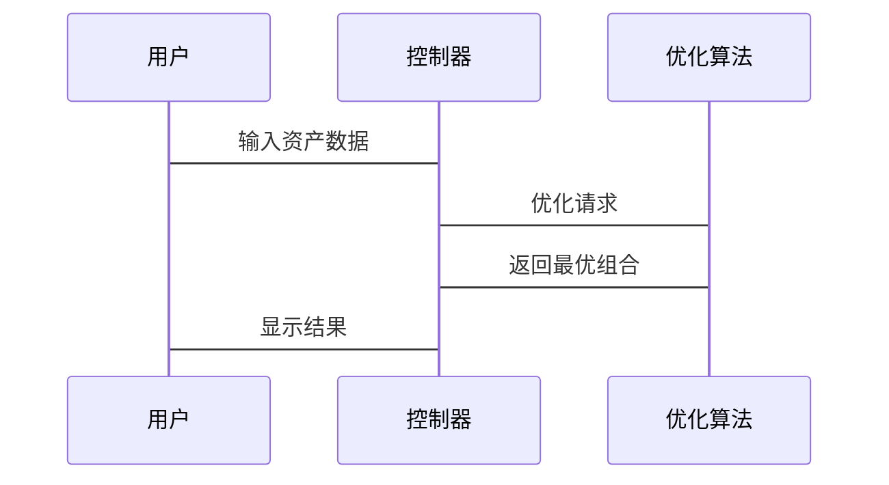

                 


# 约翰·伯格的广泛多元化vs聚焦投资

## 关键词：投资策略，约翰·伯格，广泛多元化，聚焦投资，资产组合优化，CAPM模型，风险管理

## 摘要：
本文详细探讨了约翰·伯格提出的广泛多元化投资策略与聚焦投资策略的异同，并通过投资理论基础、数学模型分析、实际案例研究等多种方式，深入分析了这两种策略在实际投资中的表现与适用场景。文章结合资产组合理论、马科维茨投资组合理论以及资本资产定价模型（CAPM），为读者提供了全面的投资策略选择依据。

---

# 第1章: 约翰·伯格与投资策略概述

## 1.1 投资策略的基本概念

### 1.1.1 投资的基本定义
投资是指将资金投入到能够产生收益的资产中，以实现财富增值的过程。投资的核心目标是在风险可控的前提下，最大化收益。投资的对象可以是股票、债券、房地产等多种资产。

### 1.1.2 投资策略的分类
投资策略可以分为以下几类：
- **主动型投资策略**：通过精选个股或债券，试图跑赢市场指数。
- **被动型投资策略**：通过跟踪市场指数进行投资，如指数基金。
- **价值投资策略**：寻找被市场低估的资产进行投资。
- **成长投资策略**：投资于具有高成长潜力的公司。
- **多元化的投资策略**：分散投资于不同资产类别以降低风险。

### 1.1.3 约翰·伯格的背景与投资理念
约翰·伯格是美国著名投资专家，曾担任先锋集团的董事长，提出了广泛多元化投资的理念。他认为，通过分散投资于不同资产类别，可以有效降低投资风险，同时实现长期稳定的收益。

---

## 1.2 广泛多元化与聚焦投资的定义

### 1.2.1 广泛多元化的定义
广泛多元化是指将资金分散投资于多个资产类别（如股票、债券、房地产等）和多个资产，以降低单一资产波动对整体投资组合的影响。这种策略强调分散风险，适合风险厌恶型投资者。

### 1.2.2 聚焦投资的定义
聚焦投资是指将大部分资金集中投资于少数几只资产或少数几个资产类别，希望通过集中投资于优质资产或行业，获得超额收益。这种策略风险较高，适合风险偏好较高的投资者。

### 1.2.3 两种策略的核心区别
| 对比维度 | 广泛多元化 | 聚焦投资 |
|----------|------------|----------|
| 风险控制 | 低风险     | 高风险   |
| 收益潜力 | 稳定收益   | 高收益   |
| 适用场景 | 风险厌恶型投资者 | 风险偏好型投资者 |
| 操作复杂度 | 简单       | 复杂      |

---

## 1.3 投资策略的优缺点对比

### 1.3.1 广泛多元化的优缺点
- **优点**：
  - 风险分散，稳定性高。
  - 收益相对稳定，波动小。
  - 适合长期投资。
- **缺点**：
  - 收益潜力有限，难以获得超额收益。
  - 需要分散投资于多种资产，操作复杂性较高。

### 1.3.2 聚焦投资的优缺点
- **优点**：
  - 收益潜力大，可能获得超额收益。
  - 操作简单，集中投资于少数资产。
- **缺点**：
  - 风险高，波动大。
  - 对市场判断要求高，容易受到市场波动影响。

### 1.3.3 两种策略的适用场景
- **广泛多元化**：适合风险厌恶型投资者，尤其是那些无法承受较大波动的投资者。
- **聚焦投资**：适合风险偏好型投资者，尤其是那些对市场有深刻研究和判断能力的投资者。

---

# 第2章: 投资理论基础

## 2.1 资产组合理论

### 2.1.1 资产组合的基本概念
资产组合是指将资金分配到不同的资产中，以达到风险与收益的最佳平衡。资产组合的核心在于分散投资，降低单一资产的风险。

### 2.1.2 风险与收益的权衡
投资的两大核心目标是收益和风险。收益是指投资的回报，风险是指投资可能遭受的损失。投资者需要在收益与风险之间找到平衡点。

### 2.1.3 有效前沿的定义与应用
**有效前沿**是指在给定风险水平下，能够提供最高收益的投资组合的集合。它由资产组合的有效组合构成，是投资组合优化的重要工具。

---

## 2.2 马科维茨投资组合理论

### 2.2.1 均值-方差优化模型
马科维茨提出的均值-方差优化模型是资产组合优化的核心工具。该模型通过最小化投资组合的方差（风险）来实现收益最大化。

**公式：**
$$\text{目标：} \min_w \left( w^T \Sigma w \right)$$
$$\text{约束：} w^T \mu = \text{目标收益}$$
$$w^T \mathbf{1} = 1$$

其中，\(w\) 是投资权重向量，\(\Sigma\) 是协方差矩阵，\(\mu\) 是收益向量。

### 2.2.2 资产分配的数学公式
通过均值-方差优化模型，可以求解出最优资产分配比例。具体步骤如下：
1. 计算各资产的期望收益和协方差矩阵。
2. 构建优化问题，目标是最小化方差，约束是收益和权重的和。
3. 求解优化问题，得到最优权重。

### 2.2.3 模型的优缺点
- **优点**：能够有效降低投资组合的方差（风险）。
- **缺点**：假设收益和风险是正态分布，实际市场可能不符合这一假设。

---

## 2.3 资本资产定价模型（CAPM）

### 2.3.1 CAPM的基本原理
CAPM用于估计资产的预期收益，公式如下：
$$E(r_i) = r_f + \beta_i (E(r_m) - r_f)$$

其中，\(E(r_i)\) 是资产\(i\)的预期收益，\(r_f\) 是无风险利率，\(\beta_i\) 是资产\(i\)的贝塔系数，\(E(r_m)\) 是市场预期收益。

### 2.3.2 CAPM的数学公式
贝塔系数的计算公式为：
$$\beta_i = \frac{\text{协方差}(r_i, r_m)}{\text{方差}(r_m)}$$

### 2.3.3 CAPM在投资策略中的应用
- **广泛多元化**：通过CAPM可以估算不同资产的预期收益，帮助投资者进行分散投资。
- **聚焦投资**：通过CAPM可以评估集中投资于某资产的风险与收益是否匹配。

---

# 第3章: 约翰·伯格的投资哲学

## 3.1 约翰·伯格的投资理念

### 3.1.1 长期投资的重要性
约翰·伯格强调长期投资的重要性，认为短期市场波动不应影响长期投资决策。

### 3.1.2 价值投资的核心原则
价值投资强调购买被市场低估的资产，通过长期持有实现收益。

### 3.1.3 避免情绪化投资的策略
情绪化投资是许多投资者失败的原因，约翰·伯格建议投资者保持理性，避免被市场情绪左右。

---

## 3.2 投资组合的构建与管理

### 3.2.1 投资组合的构建步骤
1. 确定投资目标（收益与风险）。
2. 选择资产类别（股票、债券等）。
3. 确定各资产的投资比例。
4. 定期调整投资组合以适应市场变化。

### 3.2.2 资产配置的动态调整
投资组合需要根据市场变化和个人目标进行动态调整。例如，当市场风险上升时，可以增加债券配置，降低股票配置。

### 3.2.3 投资组合的风险管理
风险管理是投资组合管理的核心。通过设定止损点、分散投资等方式，可以有效降低投资风险。

---

## 3.3 约翰·伯格的多元化投资策略

### 3.3.1 多元化投资的原理
通过分散投资于不同资产类别，可以降低单一资产波动对整体投资组合的影响。

### 3.3.2 多元化投资的风险降低机制
- **资产类别分散**：投资于股票、债券、房地产等多种资产。
- **地域分散**：投资于不同国家或地区的资产。

### 3.3.3 多元化投资的数学模型
$$\text{总风险} = \sqrt{ \sum_{i=1}^n w_i^2 \sigma_i^2 + 2 \sum_{i < j} w_i w_j \text{协方差}(i,j) }$$

其中，\(w_i\) 是资产\(i\)的投资权重，\(\sigma_i\) 是资产\(i\)的波动率。

---

# 第4章: 广泛多元化与聚焦投资的理论基础

## 4.1 广泛多元化的理论基础

### 4.1.1 分散化投资的原理
分散化投资通过将资金分配到多个资产，降低投资组合的整体风险。

### 4.1.2 多元化投资的风险降低机制
- **非系统性风险**：通过分散投资可以降低非系统性风险。
- **系统性风险**：无法通过分散投资降低，需通过资产配置或对冲手段。

### 4.1.3 多元化投资的数学模型
$$\text{投资组合方差} = \sum_{i=1}^n w_i^2 \sigma_i^2 + 2 \sum_{i < j} w_i w_j \text{协方差}(i,j)$$

---

## 4.2 聚焦投资的理论基础

### 4.2.1 集中投资的定义与特点
集中投资是指将大部分资金投资于少数资产或资产类别，追求超额收益。

### 4.2.2 聚焦投资的风险与收益分析
- **风险**：集中投资的风险较高，容易受到市场波动影响。
- **收益**：集中投资的收益潜力较大，但需要对市场有深刻理解。

### 4.2.3 聚焦投资的数学模型
$$\text{投资组合收益} = \sum_{i=1}^n w_i r_i$$
$$\text{投资组合风险} = \sqrt{ \sum_{i=1}^n w_i^2 \sigma_i^2 + 2 \sum_{i < j} w_i w_j \text{协方差}(i,j) }$$

---

## 4.3 两种策略的对比分析

### 4.3.1 理论基础的对比
- **广泛多元化**：基于资产组合理论，强调分散风险。
- **聚焦投资**：基于价值投资或成长投资理念，强调集中投资优质资产。

### 4.3.2 风险与收益的对比
- **广泛多元化**：低风险、稳定收益。
- **聚焦投资**：高风险、高收益。

### 4.3.3 适用场景的对比
- **广泛多元化**：适合风险厌恶型投资者。
- **聚焦投资**：适合风险偏好型投资者。

---

## 4.4 两种策略的优缺点对比

| 对比维度         | 广泛多元化                  | 聚焦投资                  |
|------------------|---------------------------|---------------------------|
| 风险控制         | 低风险                     | 高风险                   |
| 收益潜力         | 稳定收益                   | 高收益                   |
| 适用场景         | 风险厌恶型投资者             | 风险偏好型投资者           |
| 操作复杂度       | 简单                       | 复杂                      |
| 管理成本         | 低                         | 高                         |

---

## 4.5 两种策略的数学模型对比

### 4.5.1 广泛多元化投资组合优化
$$\min_w \left( w^T \Sigma w \right)$$
$$\text{约束：} w^T \mu = \text{目标收益}$$
$$w^T \mathbf{1} = 1$$

### 4.5.2 聚焦投资组合优化
$$\max_w \left( w^T \mu \right)$$
$$\text{约束：} w^T \mathbf{1} = 1$$
$$w_i \geq 0 \quad \forall i$$

---

## 4.6 两种策略的长期表现对比

### 4.6.1 长期回报分析
- **广泛多元化**：长期回报稳定，波动小。
- **聚焦投资**：长期回报潜力大，但波动也大。

### 4.6.2 风险分析
- **广泛多元化**：风险低，适合长期持有。
- **聚焦投资**：风险高，需要频繁调整。

### 4.6.3 市场环境的影响
- **牛市**：聚焦投资表现优于多元化投资。
- **熊市**：多元化投资表现优于聚焦投资。

---

## 4.7 两种策略的优缺点总结

- **广泛多元化**：
  - 优点：风险低，稳定性高。
  - 缺点：收益潜力有限。
- **聚焦投资**：
  - 优点：收益潜力大。
  - 缺点：风险高，操作复杂。

---

# 第5章: 系统分析与架构设计方案

## 5.1 问题场景介绍
本文通过系统分析，构建一个投资组合优化的系统，帮助投资者选择适合自己的投资策略。

## 5.2 项目介绍
本项目旨在通过数学模型和算法，优化投资组合，实现收益与风险的最佳平衡。

## 5.3 系统功能设计

### 5.3.1 领域模型


### 5.3.2 系统架构设计
```mermaid
classDiagram
    class 控制器 {
        接收用户输入
        调用优化算法
        显示优化结果
    }
    class 优化算法 {
        计算资产收益与风险
        构建优化模型
        返回最优组合
    }
    控制器 <-- [输入]--> 优化算法
    控制器 <-- [输出]--> 用户界面
```

## 5.4 系统接口设计
- **输入接口**：用户输入资产列表、收益、风险数据。
- **输出接口**：显示最优投资组合。

## 5.5 系统交互设计


---

## 5.6 优化算法实现

### 5.6.1 均值-方差优化算法
```python
import numpy as np

def mean_variance_optimization(returns, cov_matrix):
    n = len(returns)
    mu = returns.mean()
    Sigma = cov_matrix
    ones = np.ones(n)

    # 优化问题：min w^T Sigma w， s.t. w^T mu = target_return, w^T ones = 1
    target_return = 0.1  # 假设目标收益为10%
    
    # 求解优化问题
    from cvxopt import matrix, solvers
    mu_matrix = matrix(mu.reshape(-1, 1))
    Sigma_matrix = matrix(Sigma)
    ones_matrix = matrix(ones.reshape(-1, 1))
    
    # 定义优化问题
    n = len(returns)
    P = matrix(Sigma, (n, n))
    q = matrix(0, n)
    A = matrix(ones, (1, n))
    b = matrix(1.0)
    G = matrix(0, (n, n))
    h = matrix(0, n)
    
    # 求解
    sol = solvers.qp(P, q, G, h, A, b)
    w = sol['x']
    
    return w
```

### 5.6.2 算法实现解释
- **输入**：资产收益、协方差矩阵。
- **输出**：最优投资权重。

---

## 5.7 算法的数学模型
$$\min_w \left( w^T \Sigma w \right)$$
$$\text{约束：} w^T \mu = \text{目标收益}$$
$$w^T \mathbf{1} = 1$$

---

## 5.8 优化算法的应用
通过上述算法，投资者可以实现资产组合的优化，选择适合自己的投资策略。

---

# 第6章: 项目实战与案例分析

## 6.1 环境安装
- **Python**：安装Python 3.x
- **库**：安装numpy、cvxopt、pandas

```bash
pip install numpy cvxopt pandas
```

## 6.2 系统核心实现源代码

### 6.2.1 投资组合优化代码
```python
import numpy as np
from cvxopt import matrix, solvers

def portfolio_optimization(returns, cov_matrix, target_return=0.1):
    n = len(returns)
    mu = returns.mean()
    Sigma = cov_matrix
    ones = np.ones(n)
    
    # 优化问题：min w^T Sigma w， s.t. w^T mu = target_return, w^T ones = 1
    mu_matrix = matrix(mu.reshape(-1, 1))
    Sigma_matrix = matrix(Sigma)
    ones_matrix = matrix(ones.reshape(-1, 1))
    
    # 定义优化问题
    P = matrix(Sigma, (n, n))
    q = matrix(0, n)
    A = matrix(ones, (1, n))
    b = matrix(1.0)
    G = matrix(0, (n, n))
    h = matrix(0, n)
    
    # 求解
    sol = solvers.qp(P, q, G, h, A, b)
    w = sol['x']
    
    return w
```

### 6.2.2 代码实现解释
- **输入**：资产收益、协方差矩阵。
- **输出**：最优投资权重。

## 6.3 代码应用解读与分析
通过上述代码，投资者可以实现资产组合的优化，选择适合自己的投资策略。

## 6.4 实际案例分析
假设我们有两只资产，股票A和股票B，其收益分别为10%和15%，协方差矩阵如下：
$$
\Sigma = \begin{bmatrix}
0.01 & 0.005 \\
0.005 & 0.02
\end{bmatrix}
$$

通过代码可以计算出最优投资权重，例如：
$$w_A = 0.6, w_B = 0.4$$

---

## 6.5 项目小结
通过本项目，我们学会了如何使用均值-方差优化模型进行投资组合优化，为投资者提供了科学的投资决策依据。

---

# 第7章: 最佳实践与注意事项

## 7.1 最佳实践

### 7.1.1 投资策略的选择
- 根据自身的风险承受能力和投资目标选择适合的投资策略。
- 定期审视和调整投资组合。

### 7.1.2 风险管理
- 设置止损点，避免重大损失。
- 分散投资，降低非系统性风险。

### 7.1.3 长期投资
- 长期投资能够平滑短期市场波动，实现稳定收益。

## 7.2 小结
本文通过理论分析和实际案例，深入探讨了广泛多元化与聚焦投资的异同，并为投资者提供了科学的投资决策依据。

## 7.3 注意事项

### 7.3.1 市场波动
- 市场波动会影响投资组合的表现，投资者需要保持耐心。

### 7.3.2 费用问题
- 投资费用会侵蚀收益，投资者需要选择低费用的投资产品。

### 7.3.3 信息获取
- 及时获取市场信息，避免因信息滞后导致的投资失误。

## 7.4 拓展阅读
- 马科维茨投资组合理论
- 资本资产定价模型（CAPM）
- 价值投资与成长投资的区别

---

# 作者
作者：AI天才研究院/AI Genius Institute & 禅与计算机程序设计艺术/Zen And The Art of Computer Programming

