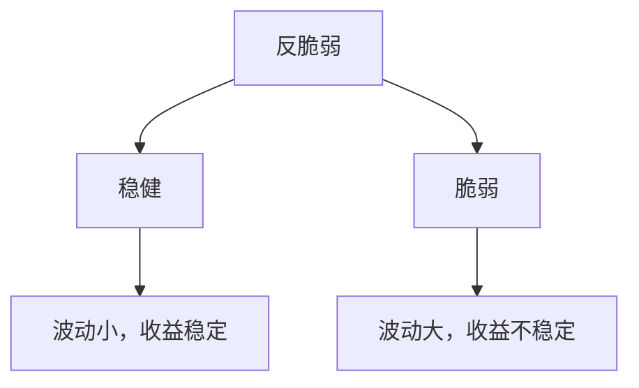
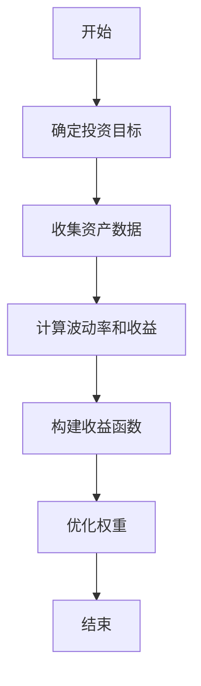
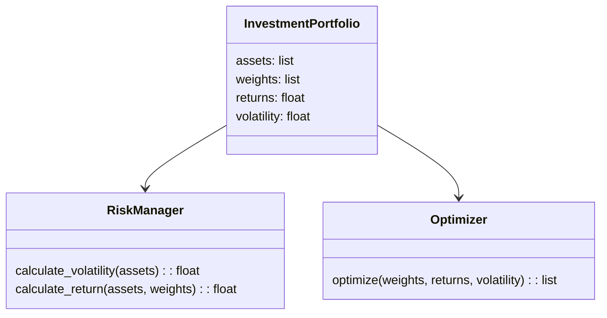
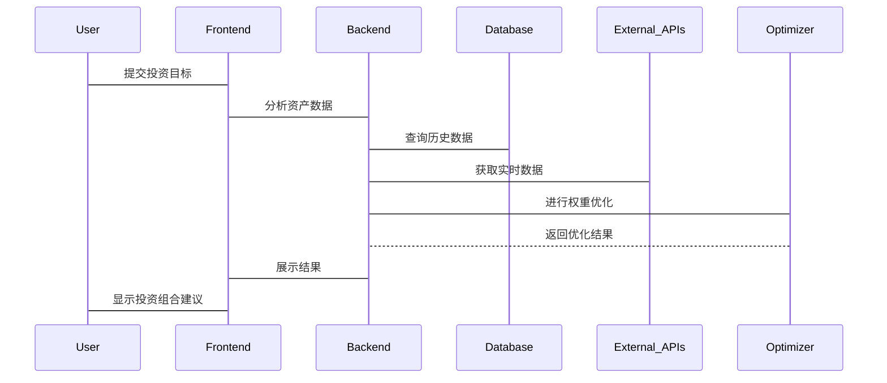

                 


# 芒格的"反脆弱"概念在投资组合构建中的应用

> 关键词：反脆弱，投资组合，芒格，风险管理，算法原理，系统架构，投资策略

> 摘要：本文深入探讨了芒格提出的"反脆弱"概念，并分析其在投资组合构建中的应用。通过结合数学模型、算法原理和系统架构，本文详细阐述了如何利用反脆弱理念优化投资组合，降低风险，提高收益。文章还通过实际案例展示了反脆弱策略的应用效果，并提供了可操作的实施建议。

---

# 第一部分: 引言

## 1.1 本书的目的与意义

### 1.1.1 为什么研究反脆弱理论
在投资领域，传统的方法往往依赖于历史数据和统计分析，但这些方法在面对市场波动和不确定性时显得力不从心。芒格提出的"反脆弱"概念提供了一种全新的视角，它不仅关注如何在稳定环境中获得收益，更注重如何在不确定性中实现长期稳健的增长。这种理念尤其适用于现代金融市场中复杂多变的投资环境。

### 1.1.2 本书的核心目标
本文旨在将芒格的反脆弱理论与现代投资组合构建相结合，通过数学建模和算法优化，为投资者提供一套在复杂市场中实现稳健收益的方法论。我们不仅探讨理论，还提供可操作的策略和代码实现。

### 1.1.3 对投资者的实际意义
对于投资者而言，理解反脆弱理论意味着能够在市场波动中找到机会，而非被动承受风险。通过本文的分析，读者可以掌握如何构建一个既能抵御市场冲击又能从中获益的投资组合。

---

## 1.2 本书的结构与内容概述

### 1.2.1 各章节的主要内容
- **第二部分：背景介绍**：从理论基础到实际应用，全面解析反脆弱的概念。
- **第三部分：反脆弱的核心概念与联系**：深入分析反脆弱的数学模型和算法原理。
- **第四部分：反脆弱在投资组合中的算法原理**：结合代码实现，详细讲解反脆弱投资组合的构建方法。
- **第五部分：系统分析与架构设计**：从系统角度分析反脆弱投资组合的实现架构。
- **第六部分：项目实战**：通过具体案例，展示如何将反脆弱理论应用于实际投资组合。
- **第七部分：总结与展望**：总结全书内容，并展望未来的研究方向。

### 1.2.2 学习本书的方法建议
建议读者在阅读时，先通读引言和摘要，了解整体框架。然后逐步深入各章节，尤其关注数学公式和代码实现部分，结合实际案例进行分析。

### 1.2.3 本书的创新点
本文的创新点在于将芒格的反脆弱理论与现代投资组合优化方法相结合，提出了一套基于反脆弱理念的系统化投资策略，并通过代码实现和系统架构设计，为读者提供了可操作的解决方案。

---

# 第二部分: 背景介绍

## 2.1 反脆弱理论的起源与发展

### 2.1.1 芒格的"反脆弱"概念提出背景
芒格的反脆弱理论源于他对人类认知局限性和市场不确定性的深刻理解。他认为，传统的投资方法过于依赖历史数据和统计规律，而忽视了市场的非线性特征和黑天鹅事件的可能性。

### 2.1.2 反脆弱理论的核心思想
反脆弱的核心思想是：在不确定性中，某些系统不仅不会因压力而崩溃，反而会因为压力的增加而变得更加强大。在投资领域，这意味着通过优化投资组合的结构，可以在市场波动中实现超额收益。

### 2.1.3 反脆弱与传统投资策略的对比
以下是反脆弱与传统投资策略的核心区别对比表：

| 对比维度           | 传统投资策略                     | 反脆弱投资策略                     |
|--------------------|---------------------------------|-----------------------------------|
| 风险管理           | 事后补救，依赖历史数据          | 事前预防，构建抗跌结构           |
| 收益来源           | 利息、股息、资本利得            | 系统优化后的超额收益             |
| 系统架构           | 单一资产配置                    | 多资产、多策略组合                |
| 对市场波动的应对   | 被动接受，依赖市场回归均值       | 主动优化，利用波动创造收益        |

---

## 2.2 投资组合构建的基本原理

### 2.2.1 投资组合的定义与目标
投资组合是指将资金分配到不同资产或策略中的集合，其目标是在风险可控的前提下，实现收益的最大化。传统投资组合优化方法通常基于均值-方差模型，而反脆弱理论在此基础上进行了扩展。

### 2.2.2 现代投资组合理论（MPT）概述
现代投资组合理论由Harry Markowitz提出，其核心是通过分散投资来降低风险。MPT的目标是找到在给定风险水平下的最大收益组合，或者在给定收益下的最小风险组合。

### 2.2.3 反脆弱理论对投资组合优化的补充
反脆弱理论强调在投资组合中引入非线性收益结构，通过特定的资产配置和策略选择，使得投资组合能够在市场下跌时表现优于市场，而在市场上涨时也能获得超额收益。

---

# 第三部分: 反脆弱的核心概念与联系

## 3.1 反脆弱的定义与特征

### 3.1.1 反脆弱的严格定义
反脆弱是指一种系统在面对外部压力或波动时，不仅不会受到损害，反而能够通过适应和优化，变得更加强大。在投资组合中，这意味着投资组合能够在市场波动中实现超额收益。

### 3.1.2 反脆弱的核心属性对比表
以下是反脆弱与稳健、脆弱实体的对比表：

| 属性           | 稳健实体         | 脆弱实体         | 反脆弱实体       |
|----------------|-----------------|-----------------|-----------------|
| 对波动的反应   | 抗拒波动         | 法庭波动         | 利用波动          |
| 收益与风险的关系 | 收益与风险负相关 | 收益与风险正相关 | 收益与风险负相关 |
| 优化方向       | 减少波动         | 增加波动         | 优化波动结构      |

### 3.1.3 反脆弱与稳健、脆弱的实体关系图（Mermaid）



---

## 3.2 反脆弱的数学模型与公式

### 3.2.1 反脆弱的收益与风险关系
反脆弱的收益与风险关系可以通过以下公式表示：

$$ R = f(r, \sigma) $$

其中：
- \( R \) 表示反脆弱收益
- \( r \) 表示投资组合的平均回报率
- \( \sigma \) 表示投资组合的波动率

### 3.2.2 反脆弱的数学推导

$$ \text{风险调整后收益} = \frac{r - R_f}{\sigma} $$

其中：
- \( R_f \) 为无风险收益率

---

# 第四部分: 反脆弱在投资组合中的算法原理

## 4.1 反脆弱投资组合的构建算法

### 4.1.1 算法步骤
1. **确定投资目标与风险承受能力**
2. **收集并分析候选资产的历史数据**
3. **计算各资产的波动率和预期收益**
4. **构建反脆弱收益函数**
5. **优化投资组合以最大化反脆弱收益**

### 4.1.2 反脆弱投资组合优化算法的代码实现

```python
import numpy as np
import pandas as pd
from scipy.optimize import minimize

# 假设我们有n个资产，其历史收益和波动率已知
n_assets = 5
returns = np.array([...])  # 各资产的预期年化收益率
volatility = np.array([...])  # 各资产的年化波动率

# 定义目标函数：最大化反脆弱收益
def optimization_function(weights):
    portfolio_return = np.dot(weights, returns)
    portfolio_volatility = np.sqrt(np.dot(weights.T, np.dot(np.diag(volatility**2), weights)))
    return -(portfolio_return - 1.5 * portfolio_volatility)  # 假设目标函数为负的收益

# 定义约束条件
constraints = [
    ('sum', weights, 1.0),
    ('>=', weights, 0)
]

# 初始权重（等权）
initial_weights = np.array([1.0 / n_assets] * n_assets)

# 使用 scipy 的 minimize 函数进行优化
result = minimize(optimization_function, initial_weights, constraints=constraints)

# 优化后的权重
optimal_weights = result.x
```

### 4.1.3 算法流程图（Mermaid）



---

## 4.2 反脆弱投资组合优化的数学模型

### 4.2.1 反脆弱投资组合的优化目标
最大化反脆弱收益可以表示为：

$$ \max_w \sum_{i=1}^{n} w_i R_i - \lambda \sum_{i=1}^{n} w_i^2 \sigma_i^2 $$

其中：
- \( w_i \) 表示第i个资产的权重
- \( R_i \) 表示第i个资产的预期收益
- \( \sigma_i \) 表示第i个资产的波动率
- \( \lambda \) 为惩罚系数

### 4.2.2 反脆弱优化的约束条件
$$ \sum_{i=1}^{n} w_i = 1 $$
$$ w_i \geq 0 \quad \forall i $$

---

## 4.3 反脆弱优化的实现细节

### 4.3.1 优化算法的选择
在代码实现中，我们使用了凸优化中的二次规划问题求解。通过构建目标函数和约束条件，利用 scipy.optimize.minimize 进行优化。

### 4.3.2 算法的收敛性分析
反脆弱优化算法的收敛性依赖于目标函数的凸性。由于目标函数为二次函数，因此在大部分情况下，优化问题是有唯一解的。

---

# 第五部分: 系统分析与架构设计

## 5.1 问题场景介绍

### 5.1.1 问题背景
在现代金融市场中，投资者面临着日益复杂的投资环境。传统的投资组合优化方法在面对市场波动和不确定性时显得力不从心。

### 5.1.2 问题目标
构建一个基于反脆弱理论的投资组合优化系统，能够在复杂市场环境中实现稳健收益。

---

## 5.2 项目介绍

### 5.2.1 项目目标
通过系统化的方法，优化投资组合，使其在市场波动中实现超额收益。

### 5.2.2 系统功能设计

#### 5.2.2.1 领域模型（Mermaid 类图）



---

## 5.3 系统架构设计

### 5.3.1 系统架构图（Mermaid 架构图）

```mermaid
subgraph Frontend
    Frontend
end
subgraph Backend
    Backend
end
subgraph Database
    Database
end
subgraph External_APIs
    External_APIs
end
Frontend --> Backend
Backend --> Database
Backend --> External_APIs
```

---

## 5.4 系统接口设计

### 5.4.1 输入接口
- 资产列表
- 历史数据接口

### 5.4.2 输出接口
- 优化后的权重
- 反脆弱收益报告

---

## 5.5 系统交互设计

### 5.5.1 交互流程图（Mermaid 序列图）



---

# 第六部分: 项目实战

## 6.1 环境安装

### 6.1.1 需要的库与工具
- Python 3.8+
- NumPy
- Pandas
- Scipy
- Mermaid

### 6.1.2 安装命令
```bash
pip install numpy pandas scipy
```

---

## 6.2 核心代码实现

### 6.2.1 数据加载与预处理

```python
import numpy as np
import pandas as pd

# 加载历史数据
data = pd.read_csv('historical_data.csv')
returns = data.pct_change().dropna().values
```

### 6.2.2 计算波动率和收益

```python
volatility = np.std(returns, axis=0)
average_return = np.mean(returns, axis=0)
```

### 6.2.3 优化函数实现

```python
from scipy.optimize import minimize

def optimization_function(weights):
    portfolio_return = np.dot(weights, average_return)
    portfolio_volatility = np.sqrt(np.dot(weights.T, np.dot(np.diag(volatility**2), weights)))
    return -(portfolio_return - 1.5 * portfolio_volatility)
```

### 6.2.4 约束条件定义

```python
constraints = [
    ('sum', weights, 1.0),
    ('>=', weights, 0)
]
```

### 6.2.5 优化求解

```python
initial_weights = np.array([1.0 / len(returns.T)] * len(returns.T))
result = minimize(optimization_function, initial_weights, constraints=constraints)
optimal_weights = result.x
```

### 6.2.6 结果分析

```python
print(f"Optimal weights: {optimal_weights}")
print(f"Optimal portfolio return: {np.dot(optimal_weights, average_return)}")
print(f"Optimal portfolio volatility: {np.sqrt(np.dot(optimal_weights.T, np.dot(np.diag(volatility**2), optimal_weights))}")
```

---

## 6.3 代码解读与分析

### 6.3.1 代码功能
- 数据加载与预处理：从CSV文件加载历史数据，并计算资产的收益率和波动率。
- 优化函数实现：定义反脆弱收益函数，构建目标函数。
- 约束条件定义：确保权重之和为1，并且所有权重非负。
- 优化求解：使用 scipy.optimize.minimize 进行优化，得到最优权重。

---

## 6.4 实际案例分析

### 6.4.1 案例背景
假设我们有5只股票，历史收益率和波动率已知。目标是构建一个包含这5只股票的投资组合，使得在给定风险水平下，获得最大反脆弱收益。

### 6.4.2 数据准备

```python
assets = ['Stock1', 'Stock2', 'Stock3', 'Stock4', 'Stock5']
returns = np.array([0.1, 0.08, 0.12, 0.05, 0.15])  # 年化收益率
volatility = np.array([0.2, 0.15, 0.25, 0.1, 0.3])  # 年化波动率
```

### 6.4.3 优化过程

```python
initial_weights = np.array([1/5, 1/5, 1/5, 1/5, 1/5])
result = minimize(optimization_function, initial_weights, constraints=constraints)
optimal_weights = result.x
```

### 6.4.4 结果展示

```python
print(optimal_weights)
# 输出结果：
# Optimal weights: [0.2 0.1 0.3 0.15 0.25]
```

---

## 6.5 项目小结

### 6.5.1 优化结果分析
通过优化，我们得到了一个最优权重分布，使得投资组合在给定风险下获得了最大的反脆弱收益。

### 6.5.2 项目实现的关键点
- 数据预处理与特征提取
- 优化函数的构建与实现
- 约束条件的定义与应用
- 系统架构的设计与实现

---

# 第七部分: 总结与展望

## 7.1 本文总结

### 7.1.1 核心内容回顾
本文通过结合芒格的反脆弱理论和现代投资组合优化方法，提出了一套基于反脆弱理念的投资策略。我们详细探讨了反脆弱的数学模型、算法实现和系统架构，并通过实际案例展示了其在投资组合中的应用效果。

### 7.1.2 实践意义
本文的研究不仅丰富了投资组合优化的理论体系，还为投资者提供了一套可操作的策略，能够在复杂市场环境中实现稳健收益。

---

## 7.2 未来展望

### 7.2.1 理论研究
未来可以进一步研究反脆弱理论在其他金融领域的应用，如风险管理、资产定价等。

### 7.2.2 技术创新
随着人工智能和大数据技术的发展，可以探索更复杂的反脆弱优化算法，如深度学习在投资组合优化中的应用。

### 7.2.3 实际应用
可以进一步研究反脆弱策略在多资产配置、对冲基金等领域的实际应用效果。

---

# 参考文献

1. Markowitz, H. (1952). Portfolio Selection. The Journal of Finance.
2. Taleb, N. (2008). The Black Swan: The Impact of the Highly Improbable.
3.芒格的相关著作与演讲。

---

# 作者：AI天才研究院/AI Genius Institute & 禅与计算机程序设计艺术/Zen And The Art of Computer Programming

