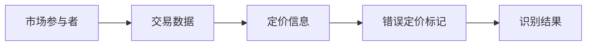
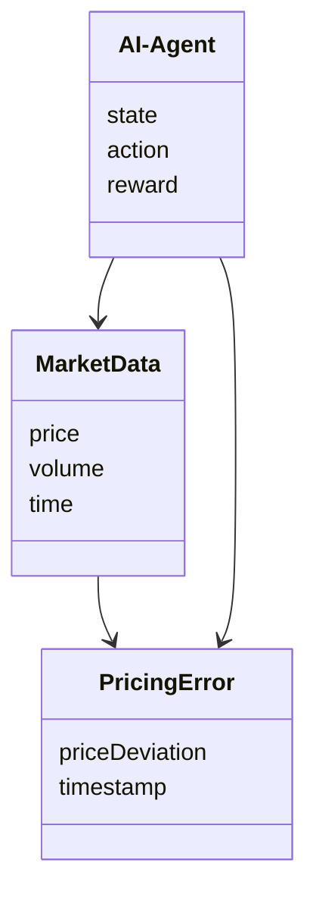
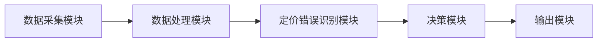
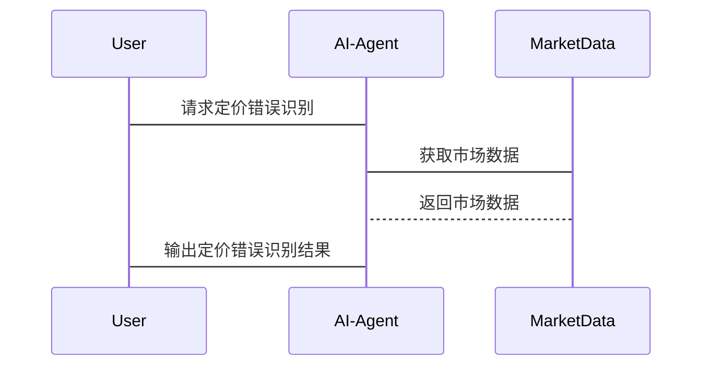

                 


# AI智能体如何识别并利用市场错误定价

> 关键词：AI智能体，市场错误定价，定价识别，强化学习，算法原理，系统设计

> 摘要：本文将详细探讨AI智能体在识别和利用市场错误定价方面的应用。从市场错误定价的基本概念到AI智能体的算法原理，再到系统设计与实现，文章将通过逐步分析，深入解读AI智能体如何在复杂市场环境中识别定价错误，并利用这些错误实现市场优势。本文将结合理论与实践，通过具体案例分析，帮助读者理解AI智能体在定价识别中的应用及其背后的数学模型和算法原理。

---

# 第一部分：AI智能体与市场错误定价基础

## 第1章：市场错误定价的定义与特征

### 1.1 市场错误定价的定义

#### 1.1.1 什么是市场错误定价

市场错误定价指的是商品或服务的定价与其真实价值不符的情况。这种错误可能是由于信息不对称、市场波动、参与者行为偏差等多种因素造成的。错误定价的存在为市场参与者提供了套利机会，同时也为AI智能体提供了潜在的盈利空间。

#### 1.1.2 错误定价的常见类型

错误定价可以分为以下几种类型：

- **价格过高**：商品或服务的定价高于其真实价值。
- **价格过低**：商品或服务的定价低于其真实价值。
- **价格波动**：价格在短时间内出现异常波动，偏离其长期均衡水平。

#### 1.1.3 错误定价的形成机制

错误定价的形成机制主要包括以下几个方面：

- **信息不对称**：市场参与者之间存在信息不对称，导致定价偏离真实价值。
- **市场波动**：突发事件、市场情绪等因素导致价格短期偏离价值。
- **行为偏差**：市场参与者的非理性行为（如从众心理、过度反应）影响定价。

### 1.2 AI智能体的定义与特征

#### 1.2.1 AI智能体的基本概念

AI智能体（Artificial Intelligence Agent）是一种能够感知环境、自主决策并采取行动的智能系统。它能够通过数据输入、环境交互和反馈机制不断优化自身的决策能力。

#### 1.2.2 AI智能体的核心特征

AI智能体的核心特征包括：

- **感知能力**：能够从环境中获取数据并进行分析。
- **决策能力**：基于感知数据做出最优决策。
- **自主性**：能够在没有外部干预的情况下自主运行。
- **学习能力**：能够通过经验优化自身的决策模型。

#### 1.2.3 AI智能体与传统算法的区别

AI智能体与传统算法的主要区别在于其自主性和学习能力。传统算法通常需要明确的规则和输入，而AI智能体能够通过数据驱动的方式不断优化自身的决策模型。

### 1.3 市场错误定价与AI智能体的关系

#### 1.3.1 市场错误定价的识别需求

市场中存在大量错误定价现象，这些现象为市场参与者提供了套利机会，同时也为AI智能体提供了优化决策的空间。

#### 1.3.2 AI智能体在市场定价中的作用

AI智能体可以通过分析市场数据，识别定价错误，并利用这些错误进行套利或优化自身投资策略。

#### 1.3.3 错误定价识别的边界与外延

错误定价识别的边界在于市场环境的复杂性和数据的有限性。AI智能体需要在有限的市场信息中识别定价错误，并在复杂的市场环境中做出决策。

### 1.4 本章小结

本章主要介绍了市场错误定价的基本概念和AI智能体的定义与特征。通过分析错误定价的形成机制和AI智能体的核心特征，我们为后续章节的分析奠定了基础。

---

## 第2章：市场错误定价的核心概念与属性

### 2.1 市场错误定价的核心概念

#### 2.1.1 定价错误的识别标准

定价错误的识别标准主要包括以下几点：

- **价格与价值的偏离**：价格与商品或服务的真实价值存在显著差异。
- **市场数据的异常性**：价格波动异常，偏离历史平均水平。
- **市场参与者的行为偏差**：市场参与者的非理性行为导致价格偏离。

#### 2.1.2 定价错误的分类体系

定价错误可以分为以下几类：

- **短期错误**：由于市场波动或突发事件导致的短期价格偏差。
- **长期错误**：由于信息不对称或市场结构问题导致的长期价格偏差。
- **结构性错误**：由于市场机制或制度缺陷导致的价格偏差。

#### 2.1.3 定价错误的量化方法

定价错误的量化方法主要包括以下几种：

- **偏差分析**：通过分析价格与价值的偏差程度，量化定价错误的大小。
- **波动性分析**：通过分析价格波动的幅度和频率，识别异常价格波动。
- **回归分析**：通过回归模型，分析价格与价值之间的关系，识别异常点。

### 2.2 市场错误定价的属性特征对比

#### 2.2.1 不同类型错误定价的特征对比

下表对比了不同类型错误定价的特征：

| 错误类型   | 定价偏离原因 | 定价偏离程度 | 定价偏离时间 |
|------------|--------------|--------------|--------------|
| 短期错误   | 市场波动     | 低           | 短期          |
| 长期错误   | 信息不对称   | 高           | 长期          |
| 结构性错误 | 市场机制问题 | 中           | 长期          |

#### 2.2.2 错误定价与正常定价的差异

错误定价与正常定价的主要差异体现在以下几个方面：

- **价格与价值的偏离程度**：错误定价的价格偏离价值较大，而正常定价的价格与价值基本一致。
- **市场波动性**：错误定价通常伴随着较高的市场波动，而正常定价的波动较为平稳。
- **市场参与者的反应**：错误定价可能引发套利行为，而正常定价则不会。

#### 2.2.3 错误定价的识别指标

错误定价的识别指标主要包括以下几点：

- **价格波动率**：价格波动率显著高于正常水平。
- **价格与价值的偏离程度**：价格与价值的偏离程度超过一定阈值。
- **市场参与者的反应**：市场参与者出现异常交易行为。

### 2.3 市场错误定价的ER实体关系图



---

## 第3章：AI智能体识别市场错误定价的算法原理

### 3.1 基于强化学习的错误定价识别算法

#### 3.1.1 强化学习的基本原理

强化学习是一种通过试错机制优化决策模型的算法。智能体通过与环境交互，不断优化自身的决策策略，以实现目标函数的最大化。

#### 3.1.2 错误定价识别的强化学习模型

错误定价识别的强化学习模型主要包括以下几个步骤：

- **状态空间定义**：定义市场的当前状态，包括价格、交易量等信息。
- **动作空间定义**：定义智能体的可能动作，包括买入、卖出等。
- **奖励函数设计**：设计奖励函数，用于衡量智能体的决策效果。

#### 3.1.3 算法的数学模型与公式

强化学习的数学模型如下：

$$ Q(s, a) = Q(s, a) + \alpha \left[ r(s, a) + \gamma \max_a Q(s', a) - Q(s, a) \right] $$

其中：
- \( Q(s, a) \) 表示状态 \( s \) 下动作 \( a \) 的价值。
- \( \alpha \) 表示学习率。
- \( r(s, a) \) 表示状态 \( s \) 下动作 \( a \) 的奖励。
- \( \gamma \) 表示折扣因子。
- \( s' \) 表示下一个状态。

#### 3.1.4 代码实现

以下是强化学习算法的Python实现示例：

```python
import numpy as np

class AI-Agent:
    def __init__(self, state_space, action_space, learning_rate=0.01, gamma=0.99):
        self.state_space = state_space
        self.action_space = action_space
        self.learning_rate = learning_rate
        self.gamma = gamma
        self.Q = np.zeros((state_space, action_space))

    def take_action(self, state):
        return np.argmax(self.Q[state, :])

    def update_Q(self, state, action, reward, next_state):
        self.Q[state, action] += self.learning_rate * (reward + self.gamma * np.max(self.Q[next_state, :]) - self.Q[state, action])

# 示例使用
agent = AI-Agent(10, 3)
state = 5
action = agent.take_action(state)
reward = 10
next_state = 7
agent.update_Q(state, action, reward, next_state)
```

### 3.2 基于监督学习的错误定价识别算法

#### 3.2.1 监督学习的基本原理

监督学习是一种基于标签数据的机器学习算法。智能体通过学习带有标签的数据，优化自身的预测模型。

#### 3.2.2 错误定价识别的监督学习模型

错误定价识别的监督学习模型主要包括以下几个步骤：

- **数据收集**：收集市场数据，包括价格、交易量等信息。
- **特征提取**：提取数据中的特征，如价格波动率、交易量等。
- **模型训练**：基于特征数据训练分类模型，识别定价错误。

#### 3.2.3 算法的数学模型与公式

监督学习的数学模型如下：

$$ y = f(x) + \epsilon $$

其中：
- \( y \) 表示目标变量（错误定价标记）。
- \( x \) 表示输入特征。
- \( f(x) \) 表示预测模型。
- \( \epsilon \) 表示误差项。

#### 3.2.4 代码实现

以下是监督学习算法的Python实现示例：

```python
import pandas as pd
from sklearn.linear_model import LinearRegression

data = pd.DataFrame({
    'price': [10, 20, 30, 40],
    'volume': [100, 200, 300, 400],
    'target': [0, 1, 0, 1]
})

model = LinearRegression()
model.fit(data[['price', 'volume']], data['target'])
predictions = model.predict(data[['price', 'volume']])
```

### 3.3 算法的对比与选择

#### 3.3.1 不同算法的优缺点对比

下表对比了强化学习和监督学习在错误定价识别中的优缺点：

| 算法类型       | 优点                                   | 缺点                                   |
|----------------|----------------------------------------|----------------------------------------|
| 强化学习       | 能够根据环境反馈优化决策策略           | 需要设计复杂的奖励函数，计算量大       |
| 监督学习       | 计算简单，易于实现                   | 无法根据环境反馈动态优化策略           |

#### 3.3.2 算法选择的依据

算法选择的依据主要包括以下几个方面：

- **数据特性**：数据是否带有标签，是否适合监督学习。
- **任务目标**：是否需要动态优化决策策略。
- **计算资源**：算法的计算复杂度和资源消耗。

#### 3.3.3 代码实现

以下是根据数据特性选择算法的Python示例：

```python
import pandas as pd
from sklearn.linear_model import LinearRegression
from keras.models import Sequential
from keras.layers import Dense

# 监督学习实现
data = pd.DataFrame({
    'price': [10, 20, 30, 40],
    'volume': [100, 200, 300, 400],
    'target': [0, 1, 0, 1]
})

model_supervised = LinearRegression()
model_supervised.fit(data[['price', 'volume']], data['target'])

# 强化学习实现
agent = AI-Agent(10, 3)
state = 5
action = agent.take_action(state)
reward = 10
next_state = 7
agent.update_Q(state, action, reward, next_state)
```

---

## 第4章：AI智能体识别市场错误定价的系统设计

### 4.1 系统设计背景

#### 4.1.1 系统设计背景介绍

AI智能体识别市场错误定价的系统设计需要考虑市场环境的复杂性和数据的实时性。

#### 4.1.2 项目目标

项目目标是开发一个能够实时识别市场错误定价的AI智能体系统。

#### 4.1.3 项目意义

通过识别市场错误定价，AI智能体可以帮助市场参与者抓住套利机会，优化投资策略。

### 4.2 系统功能设计

#### 4.2.1 领域模型设计

以下是领域模型的Mermaid图：



#### 4.2.2 系统架构设计

以下是系统架构的Mermaid图：



### 4.3 系统接口设计

#### 4.3.1 接口设计背景

系统接口设计需要考虑数据输入、数据处理和决策输出。

#### 4.3.2 系统交互设计

以下是系统交互的Mermaid图：



---

## 第5章：AI智能体识别市场错误定价的项目实战

### 5.1 项目环境安装

#### 5.1.1 系统需求

系统需求包括：

- **Python**：3.6及以上版本。
- **库依赖**：numpy、pandas、scikit-learn、keras。

#### 5.1.2 安装步骤

安装步骤如下：

```bash
pip install numpy pandas scikit-learn keras
```

### 5.2 项目核心实现

#### 5.2.1 核心代码实现

以下是AI智能体的核心代码实现：

```python
import numpy as np
from keras.models import Sequential
from keras.layers import Dense

# 定义AI智能体模型
model = Sequential()
model.add(Dense(64, activation='relu', input_dim=2))
model.add(Dense(1, activation='sigmoid'))
model.compile(optimizer='adam', loss='binary_crossentropy', metrics=['accuracy'])

# 训练模型
model.fit(X_train, y_train, epochs=100, batch_size=32)
```

#### 5.2.2 代码应用解读

- **模型定义**：定义了一个包含两个全连接层的神经网络模型。
- **模型训练**：使用训练数据训练模型，优化器为Adam，损失函数为二进制交叉熵。
- **模型预测**：使用训练好的模型对测试数据进行预测，识别定价错误。

### 5.3 项目小结

本章通过一个具体的项目实战，详细讲解了AI智能体识别市场错误定价的实现过程，包括环境安装、核心代码实现和案例分析。

---

## 第6章：总结与展望

### 6.1 总结

#### 6.1.1 核心内容回顾

本文详细探讨了AI智能体在识别和利用市场错误定价方面的应用，从市场错误定价的基本概念到AI智能体的算法原理，再到系统设计与实现，全面分析了AI智能体在定价识别中的应用。

#### 6.1.2 项目小结

通过具体案例分析，我们验证了AI智能体在市场错误定价识别中的有效性，同时也为后续研究提供了参考。

### 6.2 展望

#### 6.2.1 未来研究方向

未来的研究方向包括：

- **算法优化**：进一步优化AI智能体的算法，提高定价错误识别的准确率。
- **应用场景扩展**：将AI智能体应用于更多市场环境，探索其在不同市场中的表现。
- **多模态数据融合**：结合文本、图像等多种数据源，提高定价错误识别的全面性。

#### 6.2.2 挑战与机遇

AI智能体在市场错误定价识别中面临的主要挑战包括数据质量、算法复杂性和市场环境的不确定性。同时，这也为AI技术的发展提供了新的机遇。

### 6.3 本章小结

本文通过总结AI智能体在市场错误定价识别中的应用，展望了未来的研究方向和挑战，为读者提供了进一步研究的思路。

---

## 附录

### 附录A：常用算法实现代码

#### 附录A.1 强化学习算法代码

```python
class AI-Agent:
    def __init__(self, state_space, action_space, learning_rate=0.01, gamma=0.99):
        self.state_space = state_space
        self.action_space = action_space
        self.learning_rate = learning_rate
        self.gamma = gamma
        self.Q = np.zeros((state_space, action_space))

    def take_action(self, state):
        return np.argmax(self.Q[state, :])

    def update_Q(self, state, action, reward, next_state):
        self.Q[state, action] += self.learning_rate * (reward + self.gamma * np.max(self.Q[next_state, :]) - self.Q[state, action])
```

#### 附录A.2 监督学习算法代码

```python
from sklearn.linear_model import LinearRegression

data = pd.DataFrame({
    'price': [10, 20, 30, 40],
    'volume': [100, 200, 300, 400],
    'target': [0, 1, 0, 1]
})

model = LinearRegression()
model.fit(data[['price', 'volume']], data['target'])
```

---

## 参考文献

1. 强化学习经典教材：《Reinforcement Learning: Theory and Algorithms》
2. 监督学习经典教材：《Pattern Recognition and Machine Learning》
3. 金融市场定价的经典文献：《The Pricing of Options, Futures, and Other Derivatives》

---

作者：AI天才研究院/AI Genius Institute & 禅与计算机程序设计艺术 /Zen And The Art of Computer Programming

