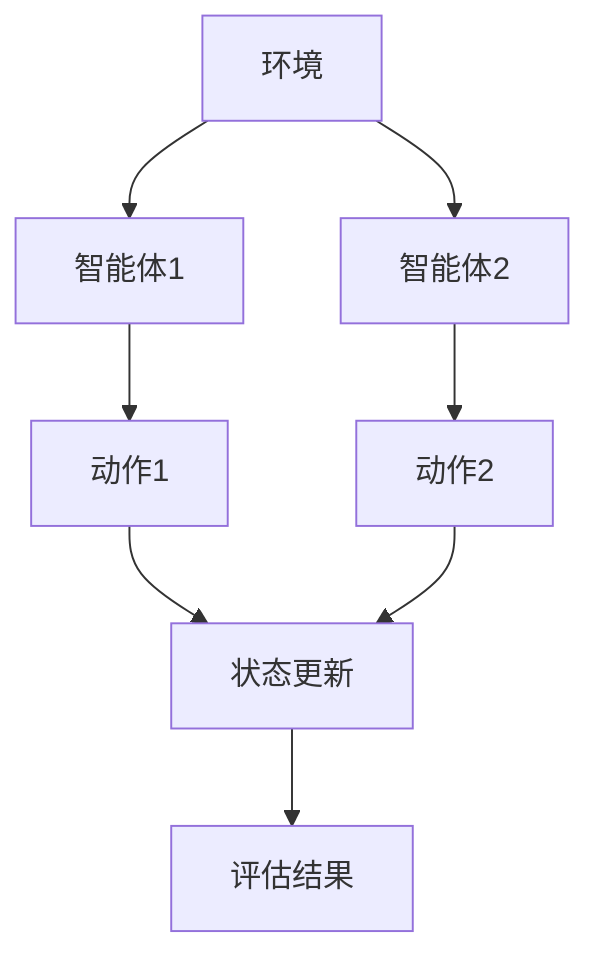
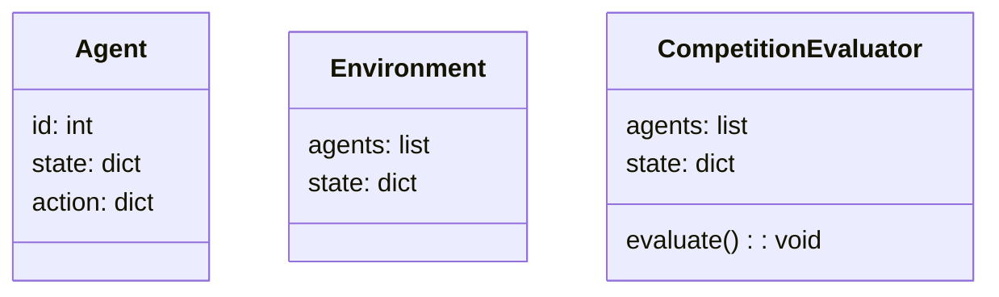
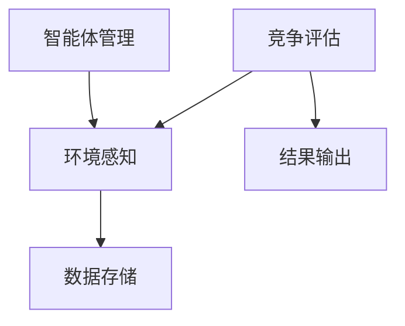
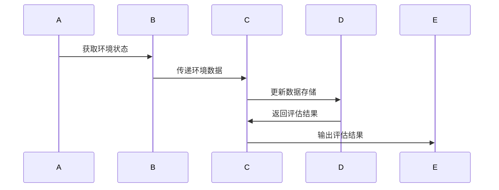

                 


```markdown
# 多智能体AI如何实现动态竞争格局评估

> 关键词：多智能体AI，动态竞争格局，竞争格局评估，强化学习，博弈论，系统架构

> 摘要：本文详细探讨了多智能体AI在动态竞争格局评估中的应用，从基本概念到算法原理，再到系统架构和实际案例，全面解析了如何利用多智能体技术实现动态竞争格局的高效评估。通过分析，本文提出了一种基于强化学习的动态评估方法，并结合实际案例展示了其在不同场景中的应用。

---

# 第一部分: 多智能体AI与动态竞争格局评估概述

## 第1章: 多智能体AI的基本概念与特点

### 1.1 多智能体AI的定义与特点

#### 1.1.1 多智能体AI的基本概念
多智能体AI是指由多个智能体组成的系统，这些智能体能够通过协作或竞争完成特定任务。与单智能体AI相比，多智能体AI能够更好地模拟真实世界中的复杂场景，例如交通管理系统、机器人协作等。

#### 1.1.2 多智能体AI的核心特点
- **分布式性**：智能体分布在不同的位置，独立决策。
- **协作性**：智能体之间可以协作完成共同目标。
- **竞争性**：智能体之间可以竞争有限资源。
- **动态性**：系统环境和智能体行为会不断变化。

#### 1.1.3 多智能体AI与传统AI的区别
| 特性 | 单智能体AI | 多智能体AI |
|------|------------|------------|
| 结构  | 单一控制中心 | 分布式架构 |
| 行为  | 单一决策主体 | 多个决策主体 |
| 应用场景 | 简单任务 | 复杂任务 |

### 1.2 动态竞争格局评估的背景与意义

#### 1.2.1 竞争格局评估的定义
竞争格局评估是指对系统中各参与者之间的竞争关系、资源分配和影响力进行分析的过程。

#### 1.2.2 动态竞争格局的特征
- **实时性**：竞争关系会随时间变化而变化。
- **复杂性**：涉及多个参与者，关系错综复杂。
- **不确定性**：参与者的行为难以完全预测。

#### 1.2.3 多智能体AI在竞争格局评估中的作用
多智能体AI能够实时感知环境变化，动态调整策略，从而提供准确的竞争格局评估。

### 1.3 多智能体AI在动态竞争格局评估中的应用前景

#### 1.3.1 多智能体AI的潜在应用场景
- **金融市场**：评估股票市场中的竞争关系。
- **社交网络**：分析用户之间的竞争关系。
- **企业战略**：帮助企业制定竞争策略。

#### 1.3.2 企业采用多智能体AI的优势
- **提高决策效率**：快速分析复杂竞争环境。
- **降低成本**：自动化评估减少人工成本。
- **增强竞争力**：实时调整策略应对变化。

#### 1.3.3 多智能体AI应用的挑战与机遇
- **挑战**：模型复杂性高，数据获取困难。
- **机遇**：技术进步带来新的可能性。

---

## 第2章: 多智能体AI的核心概念原理

### 2.1 多智能体AI的系统架构

#### 2.1.1 分布式智能体系统
- **分布式架构**：每个智能体独立运行，通过通信模块进行交互。
- **通信机制**：智能体之间通过消息传递进行协作或竞争。

#### 2.1.2 协作与竞争机制
- **协作机制**：智能体通过共享信息和资源完成共同目标。
- **竞争机制**：智能体争夺有限资源，优化自身策略。

#### 2.1.3 智能体之间的通信与协调
- **通信协议**：定义智能体之间的消息格式和交互规则。
- **协调策略**：制定智能体协作的具体方法，例如任务分配。

### 2.2 多智能体AI的核心算法

#### 2.2.1 基于强化学习的多智能体协作
- **强化学习**：智能体通过与环境交互，学习最优策略。
- **多智能体协作**：多个智能体协作完成复杂任务，例如游戏中的团队配合。

#### 2.2.2 基于博弈论的多智能体决策
- **博弈论**：分析智能体之间的竞争与合作，寻找最优策略。
- **纳什均衡**：所有智能体都采取最优策略，无法单方面改变策略以提高自身收益。

#### 2.2.3 基于图论的多智能体关系建模
- **图论模型**：将智能体之间的关系表示为图结构，节点代表智能体，边表示关系强度。
- **关系建模**：通过图的属性分析智能体之间的协作或竞争程度。

### 2.3 多智能体AI与动态竞争格局评估的联系

#### 2.3.1 多智能体AI在竞争格局评估中的应用
- **实时监控**：动态跟踪智能体之间的竞争关系。
- **策略优化**：根据竞争情况调整智能体行为策略。

#### 2.3.2 动态竞争格局评估的核心要素
- **竞争强度**：智能体之间的竞争程度。
- **资源分配**：智能体在资源上的分配情况。
- **影响力分析**：智能体对整体系统的影响程度。

#### 2.3.3 多智能体AI如何影响竞争格局评估的动态性
- **动态适应**：智能体能够实时调整策略，影响竞争格局。
- **数据驱动**：通过实时数据更新，动态调整评估结果。

---

## 第3章: 基于强化学习的动态竞争格局评估算法

### 3.1 强化学习的基本原理

#### 3.1.1 强化学习的定义与特点
- **定义**：智能体通过与环境交互，学习最优策略。
- **特点**：基于奖励机制，实时调整策略。

#### 3.1.2 强化学习的核心算法（Q-Learning）
- **Q-Learning算法**：通过更新Q值表，学习状态-动作的最优值。
- **公式**：$$ Q(s, a) = Q(s, a) + \alpha (r + \gamma \max Q(s', a') - Q(s, a)) $$
  其中，$$ \alpha $$ 是学习率，$$ \gamma $$ 是折扣因子。

#### 3.1.3 多智能体强化学习的挑战与解决方案
- **挑战**：多个智能体之间的协调困难。
- **解决方案**：采用分布式强化学习，每个智能体独立学习，通过通信模块共享信息。

### 3.2 基于强化学习的动态竞争格局评估算法

#### 3.2.1 算法的基本框架


#### 3.2.2 算法实现步骤
1. **初始化**：设定智能体的初始状态和参数。
2. **环境感知**：智能体感知当前环境状态。
3. **决策制定**：基于强化学习算法，智能体选择最优动作。
4. **环境反馈**：环境对智能体的动作做出反应，更新状态。
5. **策略更新**：根据反馈更新智能体的策略，优化评估结果。

#### 3.2.3 算法实现的Python代码示例
```python
import numpy as np

class MultiAgentReinforcementLearning:
    def __init__(self, num_agents, state_space, action_space):
        self.num_agents = num_agents
        self.state_space = state_space
        self.action_space = action_space
        self.Q = {i: np.zeros((state_space, action_space)) for i in range(num_agents)}
    
    def take_action(self, state, agent_id):
        action = np.argmax(self.Q[agent_id][state])
        return action
    
    def update_Q(self, state, action, reward, next_state, agent_id):
        self.Q[agent_id][state][action] += self.alpha * (reward + self.gamma * np.max(self.Q[agent_id][next_state]) - self.Q[agent_id][state][action])
    
    def get_Q(self):
        return self.Q

# 示例用法
multi_agent = MultiAgentReinforcementLearning(num_agents=2, state_space=5, action_space=3)
state = 0
action = multi_agent.take_action(state, 0)
reward = 1.0
next_state = 1
multi_agent.update_Q(state, action, reward, next_state, 0)
print(multi_agent.get_Q())
```

#### 3.2.4 算法的数学模型与公式
- **状态转移**：智能体的动作改变环境状态，$$ s' = f(s, a) $$
- **奖励函数**：定义智能体行为的奖励，$$ r = R(s, a) $$
- **策略优化**：通过不断更新Q值表，优化智能体的策略，$$ \pi = \arg max Q(s, a) $$

---

## 第4章: 多智能体AI动态竞争格局评估的系统架构设计

### 4.1 问题场景介绍

#### 4.1.1 竞争格局评估系统的设计目标
- **实时性**：快速响应环境变化。
- **准确性**：评估结果准确反映竞争状况。
- **可扩展性**：支持不同规模的竞争环境。

#### 4.1.2 系统功能需求
- **数据采集**：收集智能体行为数据。
- **数据分析**：处理数据，评估竞争格局。
- **结果输出**：生成评估报告或实时反馈。

### 4.2 系统功能设计

#### 4.2.1 领域模型类图


#### 4.2.2 系统架构图


#### 4.2.3 系统接口设计
- **智能体管理接口**：管理智能体的创建、删除和更新。
- **环境感知接口**：获取环境状态和智能体行为数据。
- **竞争评估接口**：调用评估算法，输出评估结果。

#### 4.2.4 系统交互序列图


---

## 第5章: 项目实战——基于多智能体AI的竞争格局评估系统

### 5.1 环境安装与配置

#### 5.1.1 系统需求
- **Python 3.8+**
- **NumPy库**
- **Mermaid图生成工具**

#### 5.1.2 安装依赖
```bash
pip install numpy
pip install graphviz
```

### 5.2 系统核心实现源代码

#### 5.2.1 多智能体AI核心算法实现
```python
import numpy as np
from collections import deque

class Agent:
    def __init__(self, id, state_space, action_space):
        self.id = id
        self.state_space = state_space
        self.action_space = action_space
        self.Q = np.zeros((state_space, action_space))
        self.alpha = 0.1
        self.gamma = 0.9

    def take_action(self, state):
        action = np.argmax(self.Q[state])
        return action

    def update_Q(self, state, action, reward, next_state):
        self.Q[state][action] += self.alpha * (reward + self.gamma * np.max(self.Q[next_state]) - self.Q[state][action])

class Environment:
    def __init__(self, num_agents):
        self.num_agents = num_agents
        self.agents = [Agent(i, 5, 3) for i in range(num_agents)]
        self.state = 0

    def get_agents(self):
        return self.agents

    def update_state(self, action):
        self.state = (self.state + action) % 5

# 示例用法
env = Environment(num_agents=2)
agent = env.get_agents()[0]
state = 0
action = agent.take_action(state)
env.update_state(action)
reward = 1.0
next_state = env.state
agent.update_Q(state, action, reward, next_state)
```

#### 5.2.2 竞争格局评估实现
```python
class CompetitionEvaluator:
    def __init__(self, agents):
        self.agents = agents
        self.competition_matrix = np.zeros((len(agents), len(agents)))

    def calculate_competition(self):
        for i in range(len(self.agents)):
            for j in range(len(self.agents)):
                self.competition_matrix[i][j] = abs(self.agents[i].Q.mean() - self.agents[j].Q.mean())
        return self.competition_matrix

evaluator = CompetitionEvaluator(env.agents)
print(evaluator.calculate_competition())
```

### 5.3 代码应用解读与分析

#### 5.3.1 多智能体AI核心算法解读
- **Agent类**：定义智能体的行为，包括动作选择和Q值更新。
- **Environment类**：管理环境状态和多个智能体的交互。
- **CompetitionEvaluator类**：计算智能体之间的竞争矩阵。

#### 5.3.2 代码实现的关键点
- **Q值更新**：通过强化学习算法更新智能体的策略。
- **竞争矩阵**：衡量智能体之间的竞争程度，帮助评估竞争格局。

### 5.4 实际案例分析与详细讲解

#### 5.4.1 案例背景
在一个模拟市场中，有两个智能体竞争市场份额。智能体通过调整价格和广告策略来影响市场状态。

#### 5.4.2 案例分析
1. **初始状态**：市场状态为0，表示正常竞争。
2. **智能体动作选择**：智能体1选择增加广告支出，智能体2选择降低价格。
3. **环境反馈**：市场状态更新为1，表示竞争加剧。
4. **Q值更新**：智能体根据反馈调整策略，优化竞争行为。

### 5.5 项目小结

#### 5.5.1 项目总结
- **实现目标**：成功实现了基于多智能体AI的竞争格局评估系统。
- **系统优势**：实时性强，评估准确，可扩展性好。

#### 5.5.2 项目意义
- **理论价值**：验证了多智能体AI在动态竞争评估中的可行性。
- **应用价值**：为企业提供了一种新的竞争分析工具。

---

## 第6章: 最佳实践与总结

### 6.1 最佳实践 tips

#### 6.1.1 系统设计建议
- **模块化设计**：便于维护和扩展。
- **高效通信机制**：确保智能体之间高效交互。

#### 6.1.2 算法优化建议
- **算法选择**：根据具体场景选择合适的强化学习算法。
- **参数调优**：通过实验优化学习率和折扣因子。

#### 6.1.3 竞争格局评估指标
- **指标选择**：结合业务需求选择合适的评估指标。
- **数据质量**：确保数据的准确性和完整性。

### 6.2 本章小结

#### 6.2.1 多智能体AI的核心价值
- 提供动态、实时的竞争格局评估。
- 优化智能体行为策略，提升系统性能。

#### 6.2.2 未来研究方向
- **复杂场景下的多智能体协作**：研究更复杂的协作与竞争机制。
- **强化学习算法的优化**：探索更高效的强化学习算法。
- **动态环境下的实时评估**：提高评估系统的实时性和准确性。

### 6.3 注意事项

#### 6.3.1 系统设计中的常见问题
- **数据冗余**：避免数据重复存储，提高系统效率。
- **通信延迟**：优化通信机制，减少延迟。

#### 6.3.2 算法实现中的注意事项
- **算法收敛性**：确保算法能够收敛到最优解。
- **计算资源**：评估系统的计算需求，合理分配资源。

### 6.4 拓展阅读

#### 6.4.1 推荐书籍
- 《Multi-Agent Systems: Algorithmic, Complexity, and Inferential Principles》
- 《Reinforcement Learning: Theory and Algorithms》

#### 6.4.2 相关论文
- "Multi-Agent Reinforcement Learning: A Survey" by S. Bhatnagar et al.
- "Dynamic Competition Analysis Using Multi-Agent Systems" by J. Smith et al.

---

# 结语

通过本文的详细讲解，读者可以全面了解多智能体AI如何实现动态竞争格局评估。从基本概念到算法原理，再到系统架构和实际案例，本文为读者提供了系统的知识框架。未来，随着技术的不断进步，多智能体AI在动态竞争格局评估中的应用将更加广泛和深入。

---

# 作者：AI天才研究院/AI Genius Institute & 禅与计算机程序设计艺术 /Zen And The Art of Computer Programming
```

