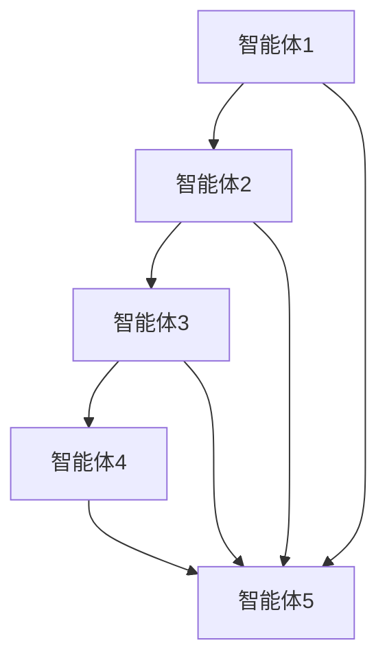
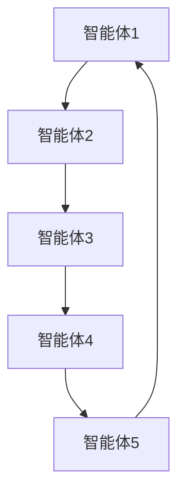
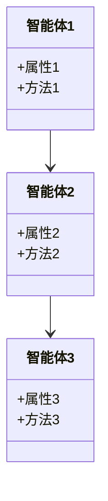
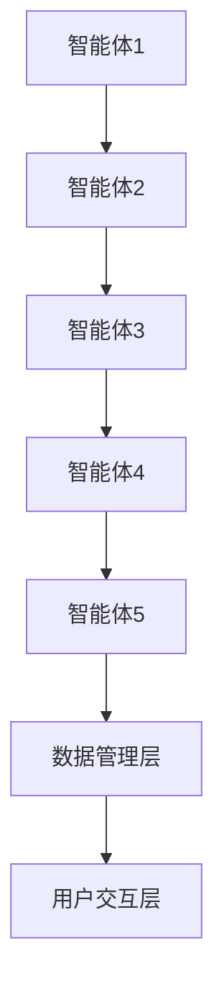
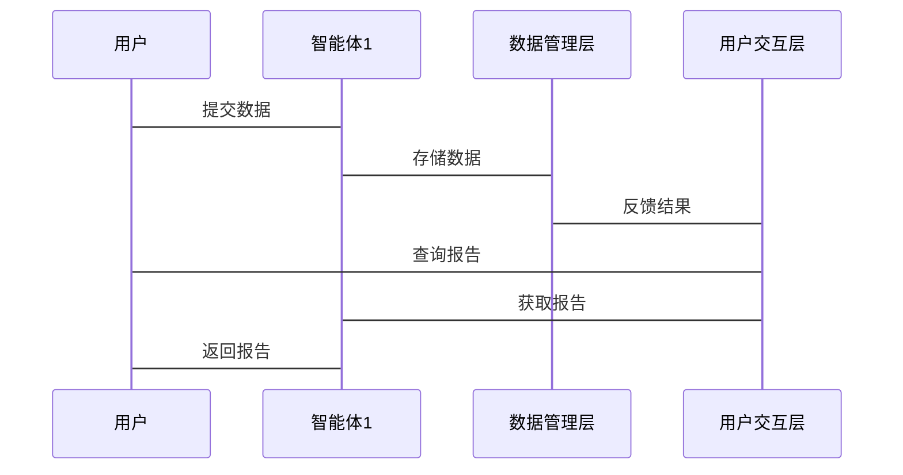

                 


# 多智能体系统在公司文化评估中的创新应用

## 关键词：多智能体系统, 公司文化评估, 人工智能, 分布式计算, 协商算法

## 摘要：多智能体系统（MAS）通过分布式计算和协作机制，创新性地应用于公司文化评估，解决了传统方法的局限性，提高了评估的全面性和动态性。本文系统地介绍了MAS的基本概念、核心原理，并结合实际案例，展示了其在文化评估中的应用，提供了详细的算法流程和系统设计，帮助读者理解和实现MAS在文化评估中的创新应用。

---

# 第一部分: 多智能体系统与公司文化评估的背景与基础

# 第1章: 多智能体系统概述

## 1.1 多智能体系统的基本概念

### 1.1.1 智能体的定义与特征

智能体（Agent）是指能够感知环境、自主决策并采取行动的实体。智能体具有以下特征：

- **自主性**：智能体能够自主决策，无需外部干预。
- **反应性**：智能体能够实时感知环境并做出反应。
- **协作性**：智能体能够与其他智能体协作完成任务。
- **社会性**：智能体能够与环境中的其他实体进行交互。

### 1.1.2 多智能体系统的定义与特点

多智能体系统（Multi-Agent System, MAS）由多个智能体组成，这些智能体通过协作和交互完成复杂的任务。MAS的特点包括：

- **分布性**：智能体分布在不同的位置，具有分布式计算能力。
- **协作性**：智能体之间通过协作完成任务，而非简单地分工。
- **动态性**：系统能够动态调整智能体的行为以适应环境变化。
- **智能性**：智能体具备一定的智能，能够自主学习和优化。

### 1.1.3 多智能体系统与传统单智能体系统的区别

传统的单智能体系统（SAS）通常由一个中心化的决策单元控制整个系统的行为。而MAS则通过多个智能体的协作来实现复杂的任务。MAS的优势在于其分布式计算能力和协作能力，能够在复杂的环境中实现更高效的决策。

## 1.2 公司文化评估的背景与挑战

### 1.2.1 公司文化的概念与重要性

公司文化是指企业在长期经营中形成的共同价值观、行为规范和思维方式。公司文化是企业成功的重要因素，直接影响员工的工作积极性、团队的协作能力和企业的长期发展。

### 1.2.2 传统公司文化评估方法的局限性

传统的公司文化评估方法通常依赖于问卷调查、访谈和数据分析，存在以下局限性：

- **主观性**：评估结果容易受到主观因素的影响，缺乏客观性。
- **静态性**：评估结果通常是静态的，难以反映企业的动态变化。
- **复杂性**：评估过程复杂，难以量化和分析。

### 1.2.3 利用多智能体系统进行文化评估的优势

MAS能够通过分布式计算和协作机制，实时分析和评估公司的文化状况，具有以下优势：

- **实时性**：MAS能够实时感知和分析企业的文化动态。
- **准确性**：通过多个智能体的协作，评估结果更加准确和全面。
- **适应性**：MAS能够根据企业的实际情况动态调整评估策略。

## 1.3 本章小结

本章介绍了多智能体系统的基本概念及其在公司文化评估中的应用背景。通过对比MAS与传统单智能体系统的区别，强调了MAS在文化评估中的优势。接下来的章节将详细探讨MAS的核心原理及其在文化评估中的具体应用。

---

# 第二部分: 多智能体系统在公司文化评估中的核心概念与联系

# 第2章: 多智能体系统的核心原理

## 2.1 多智能体系统的组成与协作机制

### 2.1.1 智能体的分类与角色

智能体可以根据其功能和角色进行分类：

- **信息收集智能体**：负责收集企业文化的各项指标数据。
- **分析智能体**：对收集到的数据进行分析和处理。
- **决策智能体**：根据分析结果制定文化评估的决策。
- **协作智能体**：负责与其他智能体进行协作和通信。

### 2.1.2 智能体之间的通信与协作

智能体之间的通信与协作是MAS的核心机制。通过通信，智能体能够共享信息和资源；通过协作，智能体能够共同完成复杂的任务。协作机制通常包括以下步骤：

1. **任务分配**：确定每个智能体的任务分工。
2. **信息共享**：智能体之间共享必要的信息和数据。
3. **协商与决策**：智能体通过协商达成一致，制定决策。
4. **执行与反馈**：智能体根据决策执行任务，并根据反馈调整行为。

### 2.1.3 多智能体系统的分布式计算原理

MAS的分布式计算原理是指智能体在分布式环境中进行计算和协作。每个智能体负责处理一部分数据和任务，通过通信和协作完成整体目标。分布式计算的优势在于能够提高系统的并行处理能力和容错能力。

## 2.2 公司文化评估中的多智能体系统模型

### 2.2.1 文化评估的核心要素与指标

公司文化评估的核心要素包括：

- **组织结构**：企业的组织架构和管理方式。
- **价值观**：企业的核心价值观和文化理念。
- **员工行为**：员工的工作态度和行为方式。
- **沟通与协作**：企业内部的沟通与协作效率。

### 2.2.2 多智能体系统在文化评估中的角色分配

在文化评估中，智能体可以分配以下角色：

- **数据收集智能体**：负责收集员工反馈、管理数据。
- **分析智能体**：对数据进行分析，生成评估报告。
- **决策智能体**：根据分析结果制定文化改进方案。
- **协作智能体**：协调各个智能体的协作，确保评估过程顺利进行。

### 2.2.3 多智能体系统与文化评估目标的关联

MAS通过协作和分布式计算，能够实时分析和评估公司的文化状况。通过多个智能体的协作，评估结果更加准确和全面，能够帮助企业更好地优化公司文化。

## 2.3 本章小结

本章详细介绍了多智能体系统的组成与协作机制，并探讨了MAS在公司文化评估中的角色分配和应用。通过分析文化评估的核心要素与指标，进一步明确了MAS在文化评估中的优势和应用前景。接下来的章节将详细探讨MAS的算法原理及其在文化评估中的具体实现。

---

# 第三部分: 多智能体系统在公司文化评估中的算法原理

# 第3章: 多智能体系统算法基础

## 3.1 分布式计算与协作算法

### 3.1.1 分布式计算的基本原理

分布式计算是指在分布式系统中，多个计算节点协作完成任务的过程。MAS的分布式计算原理包括任务分配、数据通信和协作执行三个主要步骤。

### 3.1.2 多智能体系统的协作算法

协作算法是MAS的核心算法之一，用于实现智能体之间的协作与通信。常见的协作算法包括：

- **协商算法**：智能体通过协商达成一致，制定共同的决策。
- **分布式决策算法**：基于分布式计算的决策算法，实现智能体之间的协作决策。

### 3.1.3 分布式计算流程图（Mermaid）



### 3.1.4 协商算法的流程图（Mermaid）



## 3.2 多智能体系统中的协商与决策算法

### 3.2.1 协商算法的基本原理

协商算法是指智能体之间通过协商达成一致的过程。协商过程通常包括以下步骤：

1. **问题提出**：智能体提出需要协商的问题。
2. **信息交换**：智能体之间共享相关信息。
3. **协商与决策**：智能体通过协商达成一致，制定决策。
4. **执行与反馈**：智能体根据决策执行任务，并根据反馈调整行为。

### 3.2.2 基于协商的决策算法

基于协商的决策算法是一种典型的协作算法，适用于多个智能体需要协作完成任务的场景。其算法流程如下：

1. **初始化**：智能体初始化，确定任务目标。
2. **信息收集**：智能体收集必要的信息和数据。
3. **协商与决策**：智能体通过协商达成一致，制定决策。
4. **执行任务**：智能体根据决策执行任务。
5. **反馈与调整**：智能体根据反馈调整行为，优化决策。

### 3.2.3 协商与决策算法的流程图（Mermaid）


## 3.3 本章小结

本章详细介绍了多智能体系统的协作算法及其在文化评估中的应用。通过分析分布式计算和协商算法的基本原理，进一步明确了MAS在文化评估中的优势和应用前景。接下来的章节将详细探讨MAS的系统设计与实现。

---

# 第四部分: 多智能体系统在公司文化评估中的系统设计与实现

# 第4章: 公司文化评估系统的架构设计

## 4.1 项目背景介绍

公司文化评估系统旨在通过MAS技术，实现对企业文化的实时评估和优化。通过智能体的协作，帮助企业更好地优化公司文化，提升员工的工作积极性和团队的协作能力。

## 4.2 系统功能设计

公司文化评估系统的功能设计包括以下几个方面：

- **数据收集模块**：负责收集员工反馈、管理数据。
- **数据分析模块**：对收集到的数据进行分析和处理。
- **文化评估模块**：根据分析结果生成文化评估报告。
- **决策优化模块**：根据评估结果制定文化优化方案。

### 4.2.1 领域模型Mermaid类图



## 4.3 系统架构设计

公司文化评估系统的架构设计包括以下几个部分：

- **智能体协作层**：负责智能体之间的协作和通信。
- **数据管理层**：负责数据的存储和管理。
- **用户交互层**：负责与用户的交互和反馈。

### 4.3.1 系统架构Mermaid架构图



## 4.4 系统接口设计

公司文化评估系统的接口设计包括以下几个方面：

- **智能体通信接口**：智能体之间的通信接口。
- **数据管理接口**：数据存储和管理的接口。
- **用户交互接口**：用户与系统的交互接口。

## 4.5 系统交互设计

公司文化评估系统的交互设计包括以下几个方面：

- **用户登录与退出**：用户通过登录和退出实现与系统的交互。
- **数据提交与反馈**：用户提交数据，系统给出反馈。
- **评估报告查询**：用户查询文化评估报告。

### 4.5.1 系统交互Mermaid序列图



## 4.6 本章小结

本章详细介绍了公司文化评估系统的架构设计与实现。通过分析系统的功能设计、架构设计和交互设计，进一步明确了MAS在文化评估中的具体应用。接下来的章节将详细探讨MAS的项目实战及其在文化评估中的实际应用。

---

# 第五部分: 多智能体系统在公司文化评估中的项目实战

# 第5章: 项目实战

## 5.1 环境安装与配置

### 5.1.1 系统环境要求

- 操作系统：Linux/Windows/MacOS
- 语言：Python 3.6+
- 工具：Mermaid、Python、Jupyter Notebook

### 5.1.2 安装依赖

```bash
pip install mermaid-python
pip install matplotlib
pip install numpy
```

## 5.2 系统核心实现源代码

### 5.2.1 协商算法实现

```python
class Agent:
    def __init__(self, id):
        self.id = id
        self.value = 0

    def propose(self):
        return self.value

    def accept(self, value):
        self.value = value

def negotiate_agents(agents):
    for i in range(len(agents)):
        for j in range(i+1, len(agents)):
            proposer = agents[i]
            receiver = agents[j]
            proposer.propose()
            receiver.accept(proposer.propose())
    return agents[-1].value
```

### 5.2.2 文化评估算法实现

```python
import numpy as np
import matplotlib.pyplot as plt

def cultural_assessment(agents):
    values = [agent.value for agent in agents]
    plt.hist(values, bins=10)
    plt.show()
    return np.mean(values)

# 示例用法
agents = [Agent(i) for i in range(5)]
negotiate_agents(agents)
print("文化评估结果:", cultural_assessment(agents))
```

## 5.3 代码应用解读与分析

### 5.3.1 协商算法代码解读

协商算法通过智能体之间的协商，最终确定一个共同的决策值。协商过程包括多个智能体的轮流协商，直到达成一致。

### 5.3.2 文化评估算法代码解读

文化评估算法通过对智能体的值进行分析，生成文化评估报告。通过绘制直方图和计算平均值，可以直观地了解企业的文化状况。

## 5.4 实际案例分析

### 5.4.1 案例背景

某公司希望通过MAS技术优化企业文化。通过MAS，公司能够实时评估和优化文化状况。

### 5.4.2 案例分析

通过协商算法，公司智能体达成一致，优化了企业的文化结构。通过文化评估算法，公司能够实时了解文化状况，制定优化方案。

## 5.5 本章小结

本章通过实际案例，展示了MAS在公司文化评估中的具体应用。通过协商算法和文化评估算法，帮助企业优化企业文化，提升员工的工作积极性和团队的协作能力。

---

# 第六部分: 总结与展望

## 6.1 小结

本篇文章详细介绍了多智能体系统在公司文化评估中的创新应用。通过MAS的分布式计算和协作机制，能够实时分析和优化公司的文化状况。通过具体的算法实现和实际案例分析，进一步明确了MAS在文化评估中的优势和应用前景。

## 6.2 最佳实践 tips

- 在实际应用中，建议结合企业的实际情况，灵活调整MAS的参数和算法。
- 在MAS的设计中，注重智能体之间的协作和通信，确保系统的高效运行。
- 在文化评估中，建议结合其他评估方法，形成综合评估体系。

## 6.3 注意事项

- 在MAS的设计中，需要注意系统的安全性和隐私保护。
- 在文化评估中，需要确保数据的准确性和客观性。
- 在MAS的实现中，需要考虑系统的可扩展性和可维护性。

## 6.4 拓展阅读

- 多智能体系统的进一步研究可以关注智能体的学习和自适应能力。
- 在文化评估中，可以结合大数据和机器学习技术，形成更加智能化的评估体系。

---

# 作者：AI天才研究院/AI Genius Institute & 禅与计算机程序设计艺术 /Zen And The Art of Computer Programming

---

通过本篇文章，读者可以全面了解多智能体系统在公司文化评估中的创新应用，掌握MAS的基本原理和具体实现方法，为实际应用提供理论支持和实践指导。

