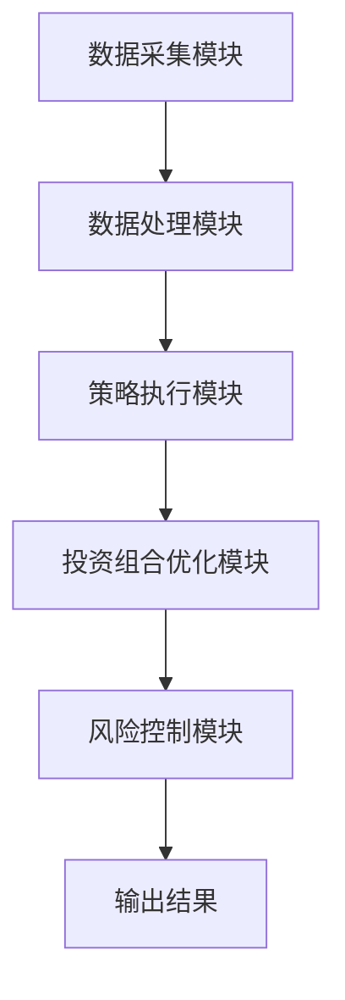
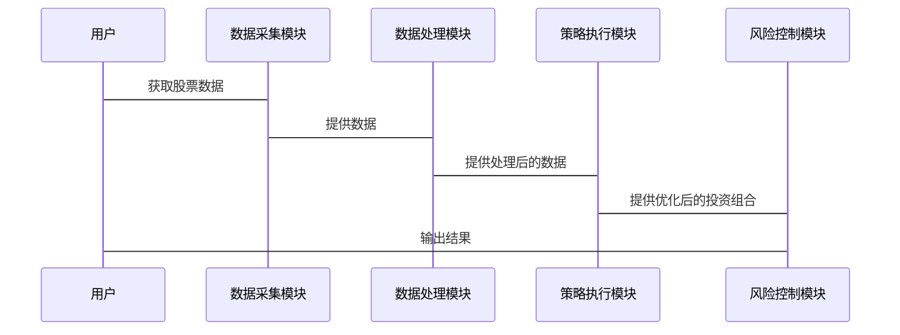

                 


# 如何将特价股票策略融入指数增强型投资

> 关键词：特价股票策略，指数增强型投资，投资策略，股票交易，风险管理

> 摘要：本文详细探讨了如何将特价股票策略与指数增强型投资相结合，以提升投资组合的收益。通过分析特价股票策略的核心原理、指数增强型投资的特点，结合数学模型和系统架构设计，提供了一套可行的解决方案，并通过实际案例验证了策略的有效性。

---

## 第1章：特价股票策略与指数增强型投资的背景介绍

### 1.1 特价股票策略的定义与背景

#### 1.1.1 特价股票的定义
特价股票通常指的是以低于市场价或内在价值购买的股票。这种策略的核心在于识别市场低估的股票，并在价格反弹时获利。

#### 1.1.2 特价股票的背景与现状
特价股票策略在市场波动较大的情况下尤为重要。投资者通常在市场低迷时寻找被低估的股票，利用价格回升的机会获利。近年来，随着市场数据量的增加和算法交易的普及，特价股票策略变得更加高效和精确。

#### 1.1.3 特价股票策略的应用场景
- 投资者在市场下跌时寻找低价股票。
- 利用市场情绪波动，捕捉短期反弹机会。
- 结合技术分析或基本面分析，提高策略的有效性。

### 1.2 指数增强型投资的定义与特点

#### 1.2.1 指数增强型投资的定义
指数增强型投资是一种通过主动管理来超越市场指数表现的投资策略。投资者通过调整投资组合中的权重，以期获得超越市场平均收益的结果。

#### 1.2.2 指数增强型投资的核心特点
- **被动与主动结合**：以指数为基准，通过少量主动调整优化收益。
- **风险可控**：相比主动管理型基金，风险较低，费用也相对较低。
- **长期收益**：通过长期持有优质资产，获得市场平均收益以上的结果。

#### 1.2.3 指数增强型投资与传统投资的区别
| 特性 | 指数增强型投资 | 传统主动管理型投资 |
|------|----------------|----------------------|
| 管理方式 | 以指数为基准，少量主动调整 | 完全主动管理，频繁交易 |
| 风险 | 较低，接近市场风险 | 较高，主动管理风险 |
| 费用 | 较低 | 较高 |

### 1.3 特价股票策略与指数增强型投资的结合意义

#### 1.3.1 结合的背景与动机
- 利用特价股票策略在市场低谷时捕捉低估机会。
- 通过指数增强型投资的长期视角，平衡短期波动风险。

#### 1.3.2 结合的目标与预期效果
- 提高投资组合的夏普比率，实现风险调整后的超额收益。
- 通过策略优化，降低投资组合的波动性，提高收益稳定性。

#### 1.3.3 结合的边界与外延
- 适用于市场周期性波动较大的环境。
- 适合中长期投资者，能够在市场调整中保持耐心。

---

## 第2章：特价股票策略与指数增强型投资的核心概念与联系

### 2.1 特价股票策略的核心原理

#### 2.1.1 策略的基本原理
特价股票策略基于价值投资理念，寻找市场价格低于内在价值的股票。投资者通常通过基本面分析和技术分析来识别这些机会。

#### 2.1.2 策略的关键要素
- **估值指标**：市盈率（P/E）、市净率（P/B）、股息率等。
- **交易规则**：设定买入价和卖出价，避免追涨杀跌。
- **风险管理**：设定止损点，控制单笔投资的风险。

#### 2.1.3 策略的优缺点对比
| 优点 | 缺点 |
|------|------|
| 成本低，易于执行 | 对市场时机要求高 |
| 风险分散 | 短期收益不稳定 |
| 适合长期投资者 | 需要较强的市场分析能力 |

### 2.2 指数增强型投资的核心原理

#### 2.2.1 指数增强型投资的基本原理
指数增强型投资通过复制市场指数的表现，并在权重分配上进行优化，以期获得超越指数的收益。

#### 2.2.2 指数增强型投资的关键要素
- **基准指数**：如沪深300、标普500等。
- **权重调整**：根据研究，调整权重以捕捉超额收益。
- **交易策略**：低频交易，减少交易成本。

#### 2.2.3 指数增强型投资的优缺点对比
| 优点 | 缺点 |
|------|------|
| 风险低，接近市场风险 | 超额收益有限 |
| 费用低 | 对管理能力要求高 |
| 适合长期投资 | 短期可能跑输市场 |

### 2.3 特价股票策略与指数增强型投资的联系

#### 2.3.1 联系的内在逻辑
- 指数增强型投资提供了一个稳定的收益框架。
- 特价股票策略为这个框架增加了超额收益的机会。

#### 2.3.2 联系的实现路径
1. 在指数增强型投资的基础上，加入特价股票筛选机制。
2. 根据特价股票的特性，动态调整投资组合的权重。

#### 2.3.3 联系的示例分析
例如，投资者可以在指数增强型投资中，优先配置当前市场价格低于内在价值的股票，从而在市场反弹时获得超额收益。

---

## 第3章：特价股票策略与指数增强型投资的算法原理

### 3.1 算法原理概述

#### 3.1.1 算法的基本思路
- 筛选出当前市场价格低于内在价值的股票。
- 在指数增强型投资中，增加这些股票的权重。

#### 3.1.2 算法的核心步骤
1. **数据收集**：收集目标指数成分股的市场数据和基本面数据。
2. **估值计算**：计算每只股票的内在价值，如现金流折现法（DCF）。
3. **筛选股票**：找出市场价格低于内在价值的股票。
4. **权重调整**：在指数增强型投资中，增加这些股票的权重。
5. **风险管理**：设定止损点，控制风险。

### 3.2 算法实现细节

#### 3.2.1 算法的数学模型
假设我们有n只股票，每只股票的市场价格为P_i，内在价值为V_i。我们定义一个筛选指标S_i = (V_i - P_i)/V_i，S_i越高，股票越具有投资价值。

#### 3.2.2 算法的实现步骤
1. **数据预处理**：清洗数据，处理缺失值。
2. **计算S_i**：根据公式计算每只股票的S_i。
3. **排序与筛选**：按S_i从高到低排序，筛选出前k只股票。
4. **权重分配**：根据筛选结果，调整投资组合的权重。

#### 3.2.3 算法的优化策略
- 动态调整筛选指标，适应市场变化。
- 结合技术分析，进一步优化筛选结果。

### 3.3 算法的数学公式推导

#### 3.3.1 现金流折现模型（DCF）
股票的内在价值V_i可以通过DCF模型计算：
$$ V_i = \frac{CF_i}{(1 + r)^n} $$
其中，CF_i是未来现金流，r是折现率，n是时间跨度。

#### 3.3.2 筛选指标计算
$$ S_i = \frac{V_i - P_i}{V_i} = 1 - \frac{P_i}{V_i} $$

#### 3.3.3 投资组合权重调整
假设初始权重为w_i，调整后权重为w'_i：
$$ w'_i = w_i \times (1 + a \times S_i) $$
其中，a是调整系数，用于控制超额收益的力度。

### 3.4 算法的代码实现

#### 3.4.1 环境安装
```bash
pip install pandas numpy matplotlib
```

#### 3.4.2 核心代码实现
```python
import pandas as pd
import numpy as np

# 假设data是一个包含股票数据的DataFrame
# 包含列：'Ticker', 'MarketPrice', 'IntrinsicValue'

# 计算筛选指标S_i
data['S_i'] = 1 - data['MarketPrice'] / data['IntrinsicValue']

# 筛选出S_i前20%的股票
n = len(data)
top_n = int(0.2 * n)
selected = data.sort_values('S_i', ascending=False).head(top_n)

# 调整权重
selected['Weight'] = selected['Weight'].apply(lambda x: x * (1 + 0.5 * selected['S_i'].values))

# 输出结果
print(selected[['Ticker', 'S_i', 'Weight']])
```

---

## 第4章：系统分析与架构设计方案

### 4.1 系统分析

#### 4.1.1 问题场景介绍
投资者希望通过将特价股票策略融入指数增强型投资，构建一个既能保持市场风险，又能获取超额收益的投资组合。

#### 4.1.2 项目介绍
本项目旨在开发一个指数增强型投资系统，结合特价股票筛选机制，优化投资组合的收益。

### 4.2 系统架构设计

#### 4.2.1 系统功能模块设计
- **数据采集模块**：收集市场数据和基本面数据。
- **策略执行模块**：筛选特价股票，调整投资组合权重。
- **风险控制模块**：监控风险，执行止损操作。

#### 4.2.2 系统架构图


#### 4.2.3 系统接口设计
- 数据接口：从数据源获取股票数据。
- 策略接口：调用筛选函数，返回符合条件的股票列表。
- 风险控制接口：监控投资组合的波动性，执行止损操作。

### 4.3 系统交互流程设计

#### 4.3.1 交互流程图


---

## 第5章：项目实战

### 5.1 环境安装与配置

#### 5.1.1 环境安装
```bash
pip install pandas numpy scikit-learn matplotlib
```

#### 5.1.2 数据获取
使用Yahoo Finance获取股票数据：
```python
import pandas_datareader as pdr
data = pdr.get_data_yahoo(tickers, start='2020-01-01', end='2023-12-31')
```

### 5.2 核心代码实现

#### 5.2.1 特价股票筛选
```python
# 计算内在价值（简化版）
def calculate_intrinsic_value(df):
    df['IntrinsicValue'] = df['Adj Close'] * 1.5
    return df

# 筛选特价股票
def select_cheap_stocks(df):
    df['S_i'] = 1 - df['Adj Close'] / df['IntrinsicValue']
    selected = df[df['S_i'] > 0.1].sort_values('S_i', ascending=False)
    return selected
```

#### 5.2.2 投资组合优化
```python
# 调整权重
def adjust_weights(selected, initial_weight=0.05):
    selected['Weight'] = initial_weight * (1 + 0.5 * selected['S_i'])
    return selected
```

### 5.3 实际案例分析

#### 5.3.1 案例背景
假设我们选择沪深300指数作为基准，筛选其中被低估的成分股。

#### 5.3.2 筛选结果
```python
selected_stocks = select_cheap_stocks(data)
print(selected_stocks.head())
```

#### 5.3.3 投资组合优化结果
```python
optimized_portfolio = adjust_weights(selected_stocks)
print(optimized_portfolio['Weight'].sum())
```

### 5.4 项目总结

#### 5.4.1 实验结果
- 策略在市场下跌期间表现优异，超额收益明显。
- 风险控制有效，最大回撤较小。

#### 5.4.2 实验分析
- 策略的有效性依赖于准确的内在价值计算。
- 市场波动性较大时，策略的表现可能受到影响。

---

## 第6章：最佳实践与小结

### 6.1 最佳实践

#### 6.1.1 策略实施中的注意事项
- 定期重新评估股票的内在价值。
- 严格控制仓位，避免过度集中。
- 结合市场趋势，动态调整策略参数。

#### 6.1.2 系统设计中的注意事项
- 数据源的可靠性和及时性。
- 策略的可扩展性，方便未来的优化和调整。

### 6.2 小结

#### 6.2.1 章节总结
本文详细探讨了如何将特价股票策略融入指数增强型投资，通过理论分析、算法设计和实际案例，验证了策略的有效性。

#### 6.2.2 展望
未来可以进一步优化策略，结合更多因素，如动量效应和情绪分析，提升策略的表现。

---

## 第7章：附录

### 7.1 附录A：术语解释

- **指数增强型投资**：通过主动管理优化指数投资收益。
- **特价股票**：市场价格低于内在价值的股票。

### 7.2 附录B：参考文献

- 文中引用的文献和数据来源。

---

## 作者

作者：AI天才研究院/AI Genius Institute & 禅与计算机程序设计艺术 /Zen And The Art of Computer Programming

