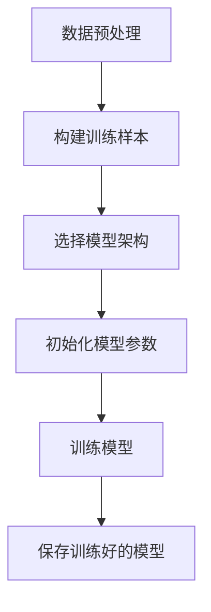
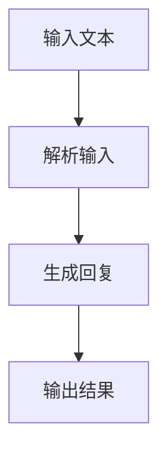
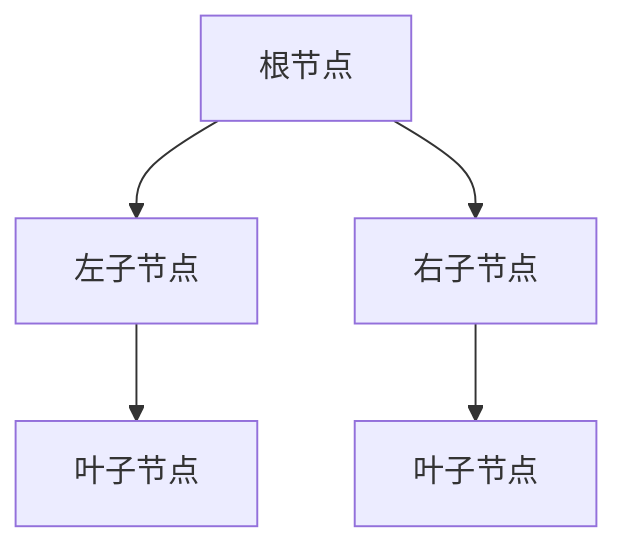
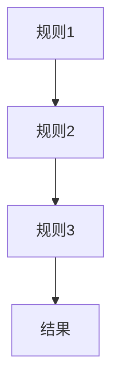
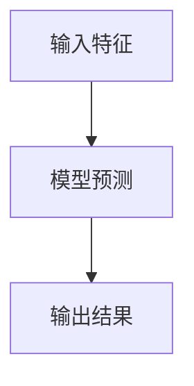
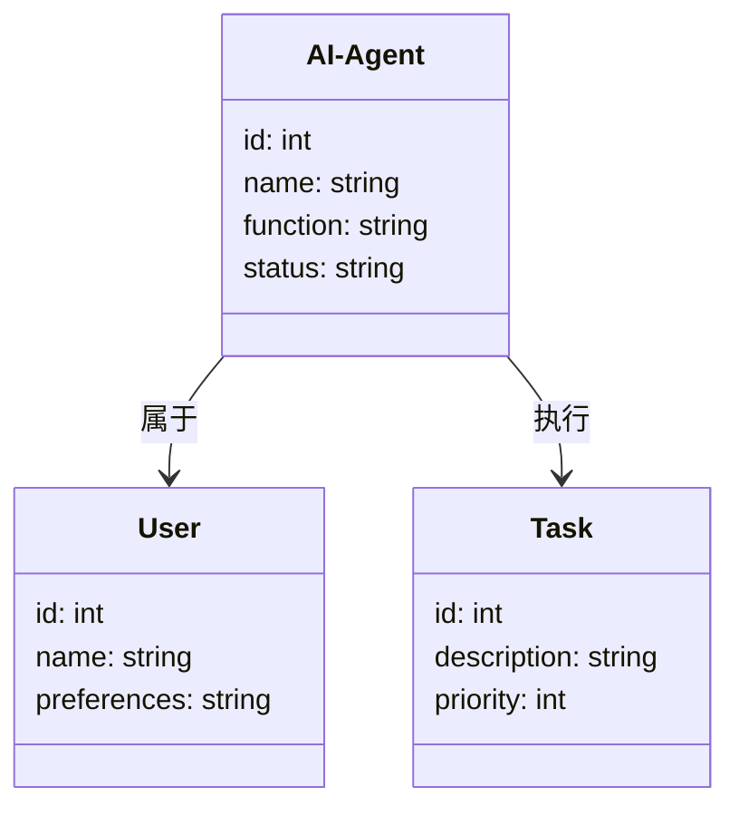
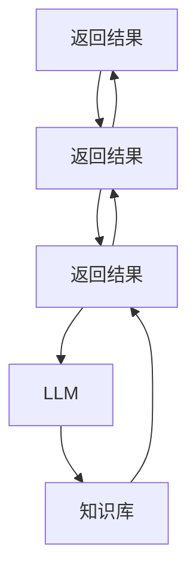
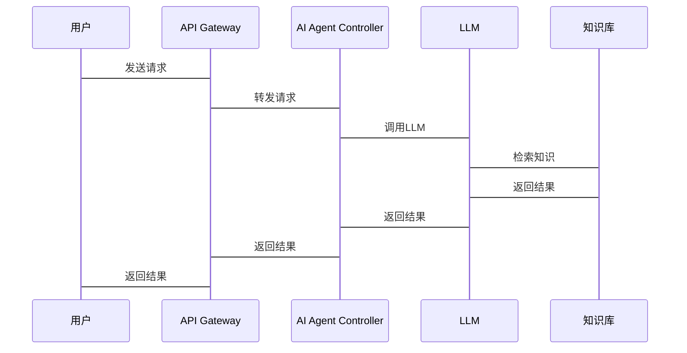

                 


# 智能个人助理AI Agent：LLM驱动的全方位生活助手

> 关键词：AI Agent, LLM, 个人助理, 智能助手, 大语言模型

> 摘要：本文将深入探讨智能个人助理AI Agent的核心概念、算法原理、系统架构、项目实战及未来展望。通过理论与实践相结合的方式，详细解析LLM驱动的AI Agent如何成为全方位的生活助手。本文将从AI Agent的基本概念、核心原理、系统设计、项目实现等多个维度进行阐述，帮助读者全面理解并掌握智能个人助理AI Agent的技术与应用。

---

## 第一部分: 智能个人助理AI Agent的背景与概念

### 第1章: AI Agent的基本概念与背景

#### 1.1 AI Agent的定义与类型
##### 1.1.1 什么是AI Agent
AI Agent（人工智能代理）是一种能够感知环境、自主决策并执行任务的智能系统。它通过传感器获取信息，利用算法处理信息，并通过执行器与环境交互。AI Agent的核心目标是帮助用户完成特定任务或提供智能服务。

##### 1.1.2 AI Agent的类型
AI Agent可以根据功能、智能水平和应用场景分为以下几类：
- **基于规则的AI Agent**：通过预定义的规则和条件进行决策。
- **基于知识的AI Agent**：利用知识库进行推理和决策。
- **基于学习的AI Agent**：通过机器学习模型（如LLM）进行自适应优化。
- **混合型AI Agent**：结合多种方法和技术的综合型AI Agent。

##### 1.1.3 AI Agent的核心特征
- **自主性**：能够自主决策和执行任务。
- **反应性**：能够实时感知环境并做出反应。
- **学习能力**：通过数据和经验不断优化自身。
- **可扩展性**：能够适应不同的应用场景和复杂度。

#### 1.2 LLM驱动的AI Agent
##### 1.2.1 大语言模型（LLM）的定义
大语言模型（Large Language Model, LLM）是一种基于深度学习的自然语言处理模型，能够理解和生成人类语言。LLM通过大量文本数据的训练，掌握了语言的语义、语法和上下文信息。

##### 1.2.2 LLM在AI Agent中的作用
- **自然语言理解（NLU）**：LLM能够理解用户的输入，识别意图和实体。
- **自然语言生成（NLG）**：LLM能够生成符合上下文的自然语言回复。
- **知识检索**：LLM能够根据上下文检索相关知识或信息。
- **对话管理**：LLM能够维护对话状态，确保对话的连贯性和一致性。

##### 1.2.3 LLM驱动的AI Agent的优势
- **强大的语言处理能力**：LLM能够理解和生成复杂的自然语言，使AI Agent具备更强大的对话能力。
- **可扩展性**：LLM可以通过微调或提示工程技术，快速适应不同的应用场景。
- **自适应性**：LLM能够通过持续学习和优化，不断提升AI Agent的智能水平。

#### 1.3 AI Agent的现状与未来趋势
##### 1.3.1 当前AI Agent的应用场景
- **智能助手**：如Siri、Alexa、Google Assistant等。
- **客服机器人**：用于在线客服、自动回复等。
- **教育辅助**：帮助学生学习、解答问题。
- **健康管理**：监测健康数据、提供健康建议。

##### 1.3.2 未来AI Agent的发展方向
- **多模态交互**：结合视觉、听觉等多种感官进行交互。
- **实时学习**：通过实时数据和反馈不断优化自身。
- **个性化服务**：根据用户的偏好和习惯提供定制化服务。
- **分布式协作**：多个AI Agent协同工作，提供更高效的解决方案。

##### 1.3.3 技术挑战与解决方案
- **数据隐私**：AI Agent需要处理用户的敏感数据，如何保护数据隐私是一个重要挑战。
- **实时性**：在高并发场景下，如何保证AI Agent的实时响应能力。
- **多语言支持**：如何让AI Agent支持多种语言和文化背景。

---

## 第二部分: AI Agent的核心概念与联系

### 第2章: AI Agent的核心概念与联系

#### 2.1 AI Agent的核心概念
##### 2.1.1 感知模块
感知模块是AI Agent获取信息的关键部分，包括以下几种类型：
- **自然语言处理（NLP）**：通过LLM理解用户的输入。
- **语音识别**：通过语音助手识别用户的语音指令。
- **视觉识别**：通过图像识别技术识别用户的视觉输入。

##### 2.1.2 决策模块
决策模块是AI Agent的核心部分，负责根据感知到的信息做出决策。决策模块通常包括以下步骤：
- **意图识别**：识别用户的意图和需求。
- **知识检索**：根据意图检索相关知识或信息。
- **推理与规划**：根据检索到的信息进行推理和规划，生成解决方案。

##### 2.1.3 执行模块
执行模块是AI Agent的执行部分，负责将决策模块生成的指令转化为具体的行动。例如：
- **发送消息**：通过邮件或短信发送通知。
- **调用API**：调用外部API完成特定任务。
- **控制设备**：通过物联网设备执行物理操作。

#### 2.2 核心概念的对比分析
##### 2.2.1 不同AI Agent模型的对比
以下是一个对比分析表格：

| 特性                | 基于规则的AI Agent | 基于知识的AI Agent | 基于学习的AI Agent | 混合型AI Agent |
|---------------------|-------------------|-------------------|-------------------|---------------|
| 决策方式            | 预定义规则        | 知识库推理        | 机器学习模型      | 综合使用多种方法 |
| 灵活性              | 较低              | 中等              | 较高              | 较高           |
| 学习能力            | 无                | 有                | 强                | 较强           |
| 适用场景            | 简单任务          | 中等复杂任务      | 复杂任务          | 多种场景       |

##### 2.2.2 LLM与其他AI技术的对比
以下是一个对比分析表格：

| 特性                | LLM驱动的AI Agent | 基于规则的AI Agent | 基于知识的AI Agent |
|---------------------|-------------------|-------------------|-------------------|
| 处理能力            | 强大的语言处理能力 | 较弱的处理能力     | 中等的处理能力     |
| 可扩展性            | 高                | 中                | 中                |
| 自适应性            | 高                | 低                | 中                |
| 实时性              | 高                | 中                | 中                |

#### 2.3 ER实体关系图
以下是AI Agent的核心实体关系图：

```mermaid
er
    entity(AI Agent) {
        id: int,
        name: string,
        function: string,
        status: string
    }
    entity(User) {
        id: int,
        name: string,
        preferences: string
    }
    entity(Task) {
        id: int,
        description: string,
        priority: int
    }
    relation(AI Agent, User, "属于")
    relation(AI Agent, Task, "执行")
```

---

## 第三部分: AI Agent的算法原理

### 第3章: AI Agent的算法原理

#### 3.1 LLM的训练与推理过程
##### 3.1.1 LLM的训练流程
以下是一个LLM的训练流程图：



##### 3.1.2 LLM的推理过程
以下是一个LLM的推理过程图：



##### 3.1.3 LLM的数学模型
以下是一个简单的LLM数学模型：

$$
P(y|x) = \frac{P(x,y)}{P(x)}
$$

其中，$P(y|x)$ 表示在输入 $x$ 的情况下，输出 $y$ 的概率。

#### 3.2 AI Agent的决策算法
##### 3.2.1 决策树算法
以下是一个简单的决策树算法示例：



##### 3.2.2 基于规则的决策算法
以下是一个基于规则的决策算法示例：



##### 3.2.3 基于学习的决策算法
以下是一个基于学习的决策算法示例：



#### 3.3 AI Agent的优化算法
##### 3.3.1 随机梯度下降（SGD）
以下是一个随机梯度下降的优化算法：

$$
\theta_{t+1} = \theta_t - \eta \cdot \nabla J(\theta_t)
$$

其中，$\theta$ 表示参数，$\eta$ 表示学习率，$\nabla J$ 表示损失函数的梯度。

##### 3.3.2 Adam优化器
以下是一个Adam优化器的优化算法：

$$
m_t = \beta_1 m_{t-1} + (1-\beta_1)g_t
$$

$$
n_t = \beta_2 n_{t-1} + (1-\beta_2)g_t^2
$$

$$
\theta_{t} = \theta_{t-1} - \eta \frac{m_t}{\sqrt{n_t+\epsilon}}
$$

其中，$m_t$ 表示动量，$n_t$ 表示方差，$\beta_1$ 和 $\beta_2$ 分别表示动量和方差的衰减率，$\epsilon$ 表示小量。

---

## 第四部分: AI Agent的系统分析与架构设计

### 第4章: AI Agent的系统分析与架构设计

#### 4.1 问题场景介绍
AI Agent的系统设计需要解决以下问题：
- 如何高效地处理用户的输入？
- 如何快速检索相关知识？
- 如何优化决策算法以提高响应速度？

#### 4.2 项目介绍
##### 4.2.1 项目目标
开发一个基于LLM的智能个人助理AI Agent，能够实现以下功能：
- 自然语言理解（NLU）
- 自然语言生成（NLG）
- 知识检索与推理
- 多轮对话管理

##### 4.2.2 项目范围
- 支持多种输入方式（文本、语音、视觉）
- 提供多语言支持
- 支持多种应用场景（生活助手、健康管理、教育辅助）

##### 4.2.3 项目约束
- 系统响应时间不超过1秒
- 系统需要支持高并发
- 系统需要具备良好的可扩展性

#### 4.3 系统功能设计
##### 4.3.1 领域模型
以下是领域模型的类图：



##### 4.3.2 系统架构设计
以下是系统架构设计的架构图：



##### 4.3.3 系统接口设计
以下是系统接口设计的序列图：



---

## 第五部分: AI Agent的项目实战

### 第5章: AI Agent的项目实战

#### 5.1 环境配置
##### 5.1.1 开发环境
- 操作系统：Linux/Windows/MacOS
- 开发工具：Python、Jupyter Notebook、VS Code
- 依赖管理工具：pip、virtualenv

##### 5.1.2 模型选择
- 使用开源的大语言模型：GPT-3、GPT-3.5、GPT-4
- 使用自定义模型：通过微调开源模型实现

##### 5.1.3 数据准备
- 收集和整理用户需求数据
- 构建训练样本和测试样本

#### 5.2 系统核心实现
##### 5.2.1 核心代码实现
以下是AI Agent的核心代码实现：

```python
class AI-Agent:
    def __init__(self, model, knowledge_base):
        self.model = model
        self.knowledge_base = knowledge_base

    def perceive(self, input):
        # 输入处理
        pass

    def decide(self, input):
        # 决策逻辑
        pass

    def execute(self, decision):
        # 执行操作
        pass
```

##### 5.2.2 代码应用解读与分析
以下是代码的详细解读：

```python
class AI-Agent:
    def __init__(self, model, knowledge_base):
        self.model = model
        self.knowledge_base = knowledge_base

    def perceive(self, input):
        # 输入处理
        return self.model.parse(input)

    def decide(self, input):
        # 决策逻辑
        return self.model.generate(input)

    def execute(self, decision):
        # 执行操作
        return self.knowledge_base.execute(decision)
```

##### 5.2.3 代码优化建议
- **模块化设计**：将感知、决策和执行模块分离，便于维护和扩展。
- **错误处理**：增加异常处理机制，确保系统稳定运行。
- **性能优化**：通过缓存机制优化知识检索和模型调用的性能。

#### 5.3 实际案例分析
##### 5.3.1 案例背景
假设我们开发一个智能日程管理助手，帮助用户管理日常事务。

##### 5.3.2 案例实现
以下是案例实现的代码：

```python
class Schedule-Agent(AI-Agent):
    def __init__(self, model, knowledge_base):
        super().__init__(model, knowledge_base)

    def perceive(self, input):
        # 解析用户的日程安排请求
        return super().perceive(input)

    def decide(self, input):
        # 根据用户的请求生成日程安排
        return super().decide(input)

    def execute(self, decision):
        # 执行日程安排操作
        return super().execute(decision)
```

##### 5.3.3 案例分析与优化
- **功能分析**：智能日程管理助手能够帮助用户管理日常事务，如会议安排、任务提醒等。
- **性能优化**：通过增加日程优先级排序功能，优化系统的响应速度。
- **用户体验优化**：通过增加语音交互功能，提升用户体验。

#### 5.4 项目总结
##### 5.4.1 项目成果
- 成功开发了一个基于LLM的智能个人助理AI Agent。
- 实现了自然语言理解、生成和知识检索功能。
- 提供了多语言支持和多种应用场景。

##### 5.4.2 项目经验与教训
- **经验**：模块化设计和代码复用能够显著提高开发效率。
- **教训**：在处理高并发场景时，需要注意系统的性能优化和稳定性。

---

## 第六部分: 总结与展望

### 第6章: 总结与展望

#### 6.1 总结
本文详细探讨了智能个人助理AI Agent的核心概念、算法原理、系统架构和项目实战。通过理论与实践相结合的方式，帮助读者全面理解并掌握智能个人助理AI Agent的技术与应用。

#### 6.2 未来展望
随着AI技术的不断发展，智能个人助理AI Agent将具备更强大的功能和更广泛的应用场景。未来的研究方向包括：
- **多模态交互**：结合视觉、听觉等多种感官进行交互。
- **实时学习**：通过实时数据和反馈不断优化自身。
- **个性化服务**：根据用户的偏好和习惯提供定制化服务。
- **分布式协作**：多个AI Agent协同工作，提供更高效的解决方案。

---

## 作者：AI天才研究院/AI Genius Institute & 禅与计算机程序设计艺术/Zen And The Art of Computer Programming

---

**本文版权归作者所有，转载请注明出处！**

