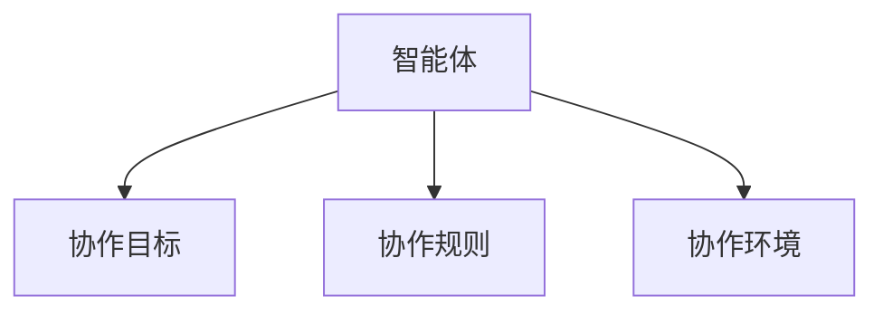

                 


# 智能体协作实现全面的竞争优势分析

> 关键词：智能体协作，竞争优势，多智能体系统，协作算法，系统架构，项目实战

> 摘要：本文将深入探讨智能体协作的核心概念、算法原理、系统架构以及实际应用，通过详细分析智能体协作的优势，为企业和社会提供实现全面竞争优势的理论和实践指导。

---

## 第一部分: 智能体协作的背景与基础

### 第1章: 智能体协作概述

#### 1.1 智能体的基本概念
- **1.1.1 什么是智能体**  
  智能体（Agent）是指能够感知环境、自主决策并采取行动的实体。智能体可以是软件程序、机器人或其他具备自主行为能力的系统。

- **1.1.2 智能体的类型**  
  - **简单反射型智能体**：基于当前输入做出反应，无内部状态。  
  - **基于模型的反应式智能体**：利用内部模型和环境信息进行决策。  
  - **目标驱动型智能体**：根据目标驱动行为。  
  - **效用驱动型智能体**：基于效用函数优化决策。  

- **1.1.3 智能体的核心特征**  
  - 自主性（Autonomy）：能够自主决策。  
  - 反应性（Reactivity）：能够感知环境并实时响应。  
  - 目标导向性（Goal-oriented）：具备明确的目标导向行为。  
  - 学习能力（Learnt ability）：能够通过经验改进性能。  

#### 1.2 智能体协作的定义与特点
- **1.2.1 协作的定义**  
  协作是指多个智能体为了共同目标而协同工作的过程。

- **1.2.2 智能体协作的核心特点**  
  - 分布式决策：各智能体独立决策，但目标一致。  
  - 通信与协调：通过通信机制实现信息共享和任务分配。  
  - 动态适应：能够根据环境变化调整协作策略。  

- **1.2.3 协作与竞争的对比**  
  - 协作强调合作，竞争强调对抗。  
  - 协作注重目标一致性，竞争注重资源分配。  

#### 1.3 智能体协作的重要性和应用领域
- **1.3.1 协作的重要性**  
  协作能够提高效率、优化资源利用并增强系统的鲁棒性。  

- **1.3.2 协作在不同领域的应用**  
  - 机器人协作：工业机器人、服务机器人。  
  - 分布式计算：多智能体分布式系统。  
  - 人工智能：多智能体对话系统。  

- **1.3.3 协作的优势与挑战**  
  - 优势：提升效率、增强系统能力。  
  - 挑战：通信延迟、任务分配复杂性。  

#### 1.4 本章小结
本章介绍了智能体的基本概念、协作的定义与特点，以及协作的重要性和应用领域，为后续章节奠定了基础。

---

## 第二部分: 智能体协作的核心机制

### 第2章: 智能体协作的核心概念与联系

#### 2.1 智能体协作的核心概念
- **2.1.1 协作目标**  
  协作目标是指多个智能体共同追求的目标，可以是全局最优或局部最优。  

- **2.1.2 协作过程**  
  包括任务分配、信息共享、决策协调等步骤。  

- **2.1.3 协作结果**  
  包括任务完成情况、系统性能指标等。  

#### 2.2 智能体协作的核心要素
- **2.2.1 协作主体**  
  智能体是协作的主体，可以是软件、机器人或其他智能系统。  

- **2.2.2 协作环境**  
  包括物理环境和数字环境，影响协作的实现方式。  

- **2.2.3 协作规则**  
  包括通信协议、任务分配规则等。  

#### 2.3 智能体协作的属性特征对比
- **2.3.1 各种协作方式的对比**  
  - 同步协作 vs 异步协作。  
  - 基于通信协作 vs 基于模型协作。  

- **2.3.2 协作效率的衡量标准**  
  包括完成时间、资源消耗等。  

- **2.3.3 协作效果的评估方法**  
  包括目标达成度、系统性能指标等。  

#### 2.4 智能体协作的ER实体关系图


#### 2.5 本章小结
本章详细探讨了智能体协作的核心概念与联系，通过ER实体关系图展示了协作的各个要素之间的关系。

### 第3章: 智能体协作的算法原理

#### 3.1 多智能体协作算法概述
- **3.1.1 多智能体协作算法的分类**  
  - 基于通信的协作算法。  
  - 基于协调的协作算法。  
  - 基于决策的协作算法。  

- **3.1.2 各种算法的优缺点**  
  - 通信算法：实时性强，但依赖网络条件。  
  - 协调算法：灵活性高，但计算复杂度高。  
  - 决策算法：效率高，但需要精确的模型支持。  

- **3.1.3 算法选择的依据**  
  包括任务类型、环境约束、资源条件等因素。  

#### 3.2 基于通信的协作算法
- **3.2.1 通信机制**  
  - 广播通信：所有智能体共享信息。  
  - 点对点通信：特定智能体之间共享信息。  

- **3.2.2 信息传递方式**  
  - 同步通信：实时传递。  
  - 异步通信：延时传递。  

- **3.2.3 通信协议设计**  
  - 数据格式：JSON、XML等。  
  - 传输协议：HTTP、WebSocket等。  

#### 3.3 基于协调的协作算法
- **3.3.1 协调机制**  
  - 谈判协调：智能体之间通过谈判分配任务。  
  - 中央协调：通过中央控制节点分配任务。  

- **3.3.2 协调过程**  
  - 信息共享：智能体共享状态信息。  
  - 任务分配：根据能力分配任务。  

- **3.3.3 协调效果的评估**  
  - 任务完成度：任务是否按时完成。  
  - 资源利用率：资源是否被合理分配。  

#### 3.4 基于决策的协作算法
- **3.4.1 决策模型**  
  - Q-Learning：基于强化学习的决策模型。  
  - 多智能体决策网络：基于深度学习的决策模型。  

- **3.4.2 决策过程**  
  - 状态感知：智能体感知环境状态。  
  - 动作选择：基于策略选择动作。  

- **3.4.3 决策优化方法**  
  - 马尔可夫决策过程（MDP）：优化决策策略。  
  - 近端策略优化（PPO）：优化协作决策。  

#### 3.5 智能体协作算法的数学模型
- **3.5.1 协作目标函数**  
  $$ f(x) = \sum_{i=1}^{n} x_i $$  

- **3.5.2 协作约束条件**  
  $$ g(x) \leq 0 $$  

- **3.5.3 协作效果评估公式**  
  $$ E = \frac{\sum_{i=1}^{n} w_i x_i}{\sum_{i=1}^{n} w_i} $$  

#### 3.6 本章小结
本章详细介绍了多智能体协作算法的分类、原理及数学模型，为后续章节的系统设计和项目实现奠定了基础。

---

## 第三部分: 智能体协作的优势分析

### 第4章: 智能体协作的竞争优势

#### 4.1 智能体协作的效率提升
- **4.1.1 多智能体协作的效率优势**  
  - 并行处理能力：多个智能体同时处理任务，提升效率。  
  - 分布式计算：充分利用资源，提高计算效率。  

- **4.1.2 协作效率的优化方法**  
  - 任务分配优化：根据智能体能力分配任务。  
  - 通信优化：减少通信延迟，提高协作效率。  

#### 4.2 智能体协作的资源优化
- **4.2.1 多智能体协作的资源优化优势**  
  - 资源共享：多个智能体共享资源，提高资源利用率。  
  - 负载均衡：动态分配任务，避免资源浪费。  

- **4.2.2 资源优化的实现方法**  
  - 负载均衡算法：基于任务特性的负载分配。  
  - 资源分配模型：基于数学模型的资源优化。  

#### 4.3 智能体协作的创新加速
- **4.3.1 协作创新的优势**  
  - 知识共享：多个智能体共享知识，加速创新。  
  - 群智效应：多个智能体协作产生新的知识和创新。  

- **4.3.2 创新加速的实现方法**  
  - 知识库构建：构建共享知识库。  
  - 创新算法：基于协作的创新算法。  

#### 4.4 智能体协作的实际案例分析
- **4.4.1 案例一：企业协作效率提升**  
  - 某企业通过多智能体协作优化供应链管理，提升效率30%。  
- **4.4.2 案例二：多智能体协作算法优化**  
  - 某公司通过优化协作算法，将任务完成时间缩短50%。  

#### 4.5 本章小结
本章通过分析智能体协作的效率提升、资源优化和创新加速，展示了智能体协作在实际应用中的竞争优势。

---

## 第四部分: 智能体协作的系统架构与设计

### 第5章: 智能体协作的系统架构设计

#### 5.1 系统架构概述
- **5.1.1 系统架构图**  
  ```mermaid
  graph TD
  A[智能体1] --> C[任务管理器]
  B[智能体2] --> C
  C --> D[执行器]
  ```

- **5.1.2 系统功能模块**  
  - 任务管理器：负责任务分配和协调。  
  - 智能体：负责执行具体任务。  
  - 执行器：负责执行智能体的决策。  

#### 5.2 系统架构设计
- **5.2.1 分布式架构**  
  - 每个智能体独立运行，通过通信模块协作。  
- **5.2.2 集中式架构**  
  - 通过中央控制节点协调各智能体。  

#### 5.3 系统接口设计
- **5.3.1 通信接口**  
  - 接口1：智能体与任务管理器的通信接口。  
  - 接口2：智能体之间的通信接口。  

- **5.3.2 任务分配接口**  
  - 接口3：任务管理器分配任务给智能体。  

#### 5.4 系统交互流程
- **5.4.1 交互序列图**  
  ```mermaid
  sequenceDiagram
  participant A as 智能体1
  participant B as 智能体2
  participant C as 任务管理器
  A -> C: 请求任务
  C -> A: 分配任务1
  B -> C: 请求任务
  C -> B: 分配任务2
  ```

#### 5.5 本章小结
本章详细介绍了智能体协作系统的架构设计、接口设计和交互流程，为后续的项目实现提供了理论支持。

---

## 第五部分: 智能体协作的项目实战

### 第6章: 智能体协作的项目实现

#### 6.1 环境安装与配置
- **6.1.1 环境要求**  
  - 操作系统：Linux/Windows/MacOS  
  - 依赖库：Python、NumPy、Matplotlib  
  - 开发工具：PyCharm、VSCode  

- **6.1.2 安装步骤**  
  ```bash
  pip install numpy matplotlib
  ```

#### 6.2 系统核心实现源代码
- **6.2.1 协作算法实现**  
  ```python
  import numpy as np

  def collaboration_algorithm(agent_states):
      # 简单的协作算法实现
      return np.mean(agent_states)

  def main():
      agent_states = [1, 2, 3, 4, 5]
      result = collaboration_algorithm(agent_states)
      print("协作结果:", result)

  if __name__ == "__main__":
      main()
  ```

- **6.2.2 通信模块实现**  
  ```python
  import json
  import socket

  def send_message(agent_id, message):
      # 发送消息到其他智能体
      with socket.socket(socket.AF_INET, socket.SOCK_STREAM) as s:
          s.connect(('localhost', 1234))
          s.sendall(json.dumps({'agent_id': agent_id, 'message': message}).encode())

  def receive_message():
      # 接收消息
      with socket.socket(socket.AF_INET, socket.SOCK_STREAM) as s:
          s.bind(('localhost', 1234))
          s.listen()
          conn, addr = s.accept()
          data = conn.recv(1024)
          return json.loads(data.decode())

  if __name__ == "__main__":
      send_message(1, "开始协作")
      print(receive_message())
  ```

#### 6.3 代码应用解读与分析
- **6.3.1 协作算法实现解读**  
  以上代码实现了一个简单的协作算法，计算智能体状态的平均值。  

- **6.3.2 通信模块实现解读**  
  使用TCP/IP协议实现智能体之间的通信，通过JSON格式传递消息。  

#### 6.4 实际案例分析
- **6.4.1 案例分析**  
  通过实现一个多智能体协作系统，优化任务分配和资源利用。  

- **6.4.2 案例小结**  
  通过实际案例，展示了智能体协作算法和系统实现的具体步骤。  

#### 6.5 本章小结
本章通过实际项目实战，详细讲解了智能体协作系统的环境配置、核心算法实现和通信模块实现，帮助读者掌握智能体协作技术的实际应用。

---

## 第六部分: 总结与展望

### 第7章: 总结与展望

#### 7.1 全书总结
- 本书系统地介绍了智能体协作的核心概念、算法原理、系统架构和实际应用，为读者提供了全面的知识体系。

#### 7.2 未来展望
- **7.2.1 技术发展趋势**  
  - 更加智能的协作算法。  
  - 更加高效的通信机制。  
- **7.2.2 应用领域拓展**  
  - 更多行业的应用，如医疗、教育、金融等。  

#### 7.3 最佳实践 tips
- **协作算法选择**：根据任务需求选择合适的协作算法。  
- **系统架构设计**：根据实际需求设计系统的架构。  
- **通信机制优化**：根据网络条件优化通信机制。  

#### 7.4 拓展阅读
- 推荐阅读相关领域的书籍和论文，深入研究智能体协作的最新技术。

#### 7.5 本章小结
本书总结了智能体协作的核心内容，并展望了未来的发展方向，为读者提供了进一步研究和实践的指导。

---

## 作者：AI天才研究院/AI Genius Institute & 禅与计算机程序设计艺术 /Zen And The Art of Computer Programming

---

**本文由AI天才研究院/AI Genius Institute创作，转载请注明出处。**

