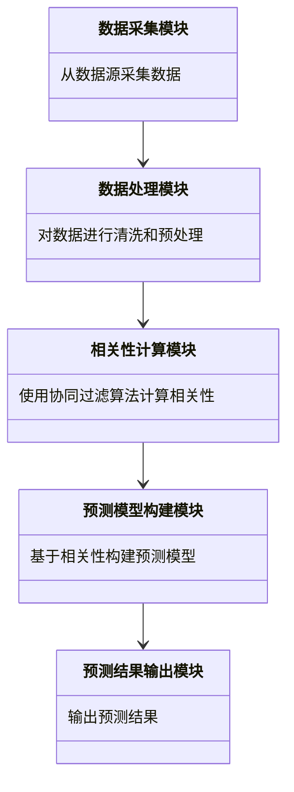

                 


# 智能体协作提高价值投资的跨资产类别相关性预测

## 关键词：智能体协作，价值投资，跨资产相关性，协同过滤算法，系统架构设计

## 摘要：  
本文探讨了智能体协作在价值投资中的应用，特别是如何利用智能体协作技术提高跨资产类别相关性预测的准确性。文章从智能体协作的基本概念和价值投资的核心策略入手，结合协同过滤算法和系统架构设计，详细阐述了如何通过智能体协作实现跨资产相关性预测，并通过实际案例分析验证了该方法的有效性。文章最后总结了智能体协作在价值投资中的优势和未来发展方向。

---

# 第一部分: 智能体协作与价值投资的背景

## 第1章: 智能体协作与价值投资概述

### 1.1 智能体协作的定义与特点

#### 1.1.1 智能体协作的基本概念  
智能体协作（Multi-Agent Collaboration）是指多个智能体（Agent）通过共享信息、协同决策和共同行动来完成特定任务的过程。每个智能体都是一个具有感知、决策和执行能力的实体，能够独立工作并与其他智能体协作。智能体协作的核心在于通过信息共享和任务分工，实现整体目标的最优解。

#### 1.1.2 智能体协作的核心特点  
智能体协作具有以下特点：  
1. **分布式智能**：智能体之间通过分布式计算和信息共享实现协作。  
2. **自主性**：每个智能体都是独立的，能够自主决策和行动。  
3. **动态性**：智能体协作的过程是动态的，能够根据环境变化实时调整策略。  
4. **多样性**：智能体可以具有不同的知识和能力，通过互补性协作实现整体目标。

#### 1.1.3 智能体协作与传统投资的区别  
传统投资通常依赖于单个投资者的决策，而智能体协作通过多个智能体的协同工作，能够更全面地分析市场信息，发现潜在的投资机会和风险。智能体协作能够实时处理海量数据，提供更精准的预测和决策支持。

### 1.2 价值投资的定义与策略

#### 1.2.1 价值投资的基本概念  
价值投资是一种投资策略，旨在通过分析资产的内在价值，寻找被市场低估的投资机会。价值投资者通常关注企业的基本面，如盈利能力、财务状况和行业地位等。

#### 1.2.2 价值投资的核心策略  
价值投资的核心策略包括：  
1. **基本面分析**：通过分析企业的财务报表、行业地位和竞争优势，评估其内在价值。  
2. **长期持有**：价值投资者通常会长期持有优质资产，等待其价值被市场发现。  
3. **逆向思维**：在市场低迷时寻找被低估的资产，在市场高涨时保持谨慎。

#### 1.2.3 智能体协作与价值投资的结合  
智能体协作可以通过以下方式提升价值投资的效率和效果：  
1. **信息共享**：多个智能体可以共享市场数据、财务信息和行业动态，提供更全面的分析。  
2. **决策优化**：通过智能体协作，投资者可以实时调整投资策略，优化资产配置。  
3. **风险控制**：智能体协作能够实时监测市场风险，及时预警潜在的危机。

### 1.3 跨资产类别相关性预测的背景

#### 1.3.1 跨资产类别相关性的定义  
跨资产类别相关性是指不同资产类别之间的价格波动之间的相关性。例如，股票和债券的相关性可以通过协方差或相关系数来衡量。

#### 1.3.2 跨资产类别相关性预测的挑战  
跨资产类别相关性预测的挑战包括：  
1. **数据复杂性**：不同资产类别的数据可能具有不同的特征和波动性。  
2. **市场动态变化**：市场的波动性和不确定性会影响相关性预测的准确性。  
3. **数据稀疏性**：某些资产类别的数据可能不足，导致相关性预测困难。

#### 1.3.3 智能体协作在跨资产相关性预测中的作用  
智能体协作可以通过以下方式提升跨资产相关性预测的准确性：  
1. **多源数据融合**：多个智能体可以分别处理不同类型的数据，然后通过协作将数据融合，提供更全面的分析。  
2. **实时更新**：智能体协作能够实时更新市场数据，确保相关性预测的及时性。  
3. **分布式计算**：通过分布式计算，智能体协作可以高效处理海量数据，提高计算效率。

## 1.4 本章小结  
本章介绍了智能体协作的基本概念和特点，探讨了价值投资的核心策略，分析了跨资产类别相关性预测的背景和挑战。通过智能体协作，价值投资者可以更高效地分析市场信息，优化投资决策。

---

# 第二部分: 智能体协作的核心概念与联系

## 第2章: 智能体协作的原理与机制

### 2.1 智能体协作的原理

#### 2.1.1 多智能体系统的定义  
多智能体系统（Multi-Agent System, MAS）是由多个智能体组成的系统，这些智能体能够通过通信和协作完成特定任务。

#### 2.1.2 智能体协作的基本原理  
智能体协作的基本原理包括以下步骤：  
1. **信息共享**：智能体之间共享相关信息。  
2. **任务分工**：根据智能体的能力和任务需求，分配任务。  
3. **协同决策**：智能体基于共享信息和任务分工，共同制定决策。  
4. **行动执行**：智能体根据决策执行具体行动。

#### 2.1.3 智能体协作的通信机制  
智能体协作的通信机制包括：  
1. **直接通信**：智能体之间直接交换信息。  
2. **间接通信**：智能体通过中间媒介（如共享数据库）交换信息。  
3. **分布式通信**：智能体在分布式网络中通过消息传递机制通信。

### 2.2 智能体协作的核心要素

#### 2.2.1 智能体的属性与行为  
智能体的属性包括：  
- **知识库**：存储智能体的知识和经验。  
- **感知能力**：能够感知环境中的信息。  
- **决策能力**：能够基于感知信息做出决策。  
- **执行能力**：能够执行决策并产生行动。

智能体的行为包括：  
1. **信息获取**：通过感知环境获取信息。  
2. **信息处理**：对获取的信息进行分析和处理。  
3. **决策制定**：基于处理后的信息制定决策。  
4. **行动执行**：根据决策执行具体行动。

#### 2.2.2 智能体之间的关系  
智能体之间的关系可以是竞争关系或合作关系。在价值投资中，智能体通常需要合作，共同分析市场信息，制定投资策略。

#### 2.2.3 智能体协作的目标函数  
智能体协作的目标函数通常包括以下目标：  
1. **最大化收益**：通过协作实现投资收益的最大化。  
2. **最小化风险**：通过协作降低投资风险。  
3. **提高效率**：通过协作提高数据分析和决策的效率。

### 2.3 智能体协作与价值投资的联系

#### 2.3.1 智能体协作在价值投资中的应用  
智能体协作在价值投资中的应用包括：  
1. **多源数据分析**：多个智能体分别分析不同资产类别的数据，然后通过协作提供综合分析结果。  
2. **实时市场监控**：智能体协作能够实时监控市场动态，及时发现投资机会和风险。  
3. **风险分散**：通过智能体协作，投资者可以分散投资风险，优化资产配置。

#### 2.3.2 跨资产类别相关性预测的智能体协作模型  
跨资产类别相关性预测的智能体协作模型包括以下步骤：  
1. **数据采集**：智能体从不同数据源采集市场数据。  
2. **数据处理**：智能体对采集的数据进行清洗和预处理。  
3. **相关性计算**：智能体通过协同过滤算法计算不同资产之间的相关性。  
4. **预测模型构建**：基于相关性计算结果，构建预测模型。  
5. **预测结果输出**：智能体协作将预测结果输出，供投资者参考。

#### 2.3.3 智能体协作的优势与局限性  
智能体协作的优势包括：  
1. **高效性**：通过分布式计算，智能体协作能够高效处理海量数据。  
2. **准确性**：多个智能体的协作能够提高分析结果的准确性。  
3. **适应性**：智能体协作能够适应市场的动态变化。

智能体协作的局限性包括：  
1. **复杂性**：智能体协作系统的实现和维护相对复杂。  
2. **依赖性**：智能体协作依赖于智能体之间的通信和协作，存在潜在的单点故障风险。

## 2.4 本章小结  
本章详细讲解了智能体协作的原理和机制，分析了智能体协作在价值投资中的应用，探讨了跨资产类别相关性预测的智能体协作模型。通过智能体协作，投资者可以更高效、准确地进行投资决策。

---

# 第三部分: 跨资产类别相关性预测的智能体协作算法

## 第3章: 智能体协作算法的原理

### 3.1 协同过滤算法

#### 3.1.1 协同过滤的基本原理  
协同过滤是一种基于用户行为或物品特征的推荐算法。通过分析用户的历史行为或物品的特征，协同过滤可以预测用户对未见过物品的偏好。

#### 3.1.2 基于用户的协同过滤  
基于用户的协同过滤算法通过寻找与目标用户相似的其他用户，将这些用户的偏好用于推荐。具体步骤如下：  
1. **计算用户相似度**：基于用户的历史行为数据，计算用户之间的相似度。  
2. **生成推荐列表**：根据相似用户的偏好，生成目标用户的推荐列表。

#### 3.1.3 基于物品的协同过滤  
基于物品的协同过滤算法通过分析物品之间的相似性，生成推荐列表。具体步骤如下：  
1. **计算物品相似度**：基于物品的特征或用户行为数据，计算物品之间的相似度。  
2. **生成推荐列表**：根据目标用户的偏好，推荐与已购物品相似的其他物品。

### 3.2 智能体协作算法的实现

#### 3.2.1 智能体协作算法的流程  
智能体协作算法的流程包括：  
1. **数据采集**：智能体从不同数据源采集市场数据。  
2. **数据预处理**：对采集的数据进行清洗和标准化处理。  
3. **计算相关性**：基于协同过滤算法，计算不同资产之间的相关性。  
4. **预测模型构建**：基于相关性计算结果，构建预测模型。  
5. **预测结果输出**：智能体协作将预测结果输出，供投资者参考。

#### 3.2.2 智能体协作算法的数学模型  
协同过滤算法的数学模型如下：  
$$ sim(i, j) = \frac{\sum_{k=1}^{n} (r_{ik} - \bar{r_i})(r_{jk} - \bar{r_j})}{\sqrt{\sum_{k=1}^{n} (r_{ik} - \bar{r_i})^2} \cdot \sqrt{\sum_{k=1}^{n} (r_{jk} - \bar{r_j})^2}}} $$  
其中，$sim(i, j)$ 表示资产 $i$ 和 $j$ 之间的相似度，$r_{ik}$ 表示资产 $i$ 的第 $k$ 个数据点的值，$\bar{r_i}$ 表示资产 $i$ 的平均值。

#### 3.2.3 智能体协作算法的实现步骤  
智能体协作算法的实现步骤如下：  
1. **数据采集**：从不同数据源采集市场数据，如股票价格、债券收益率等。  
2. **数据预处理**：对采集的数据进行清洗和标准化处理。  
3. **计算相关性**：使用协同过滤算法计算不同资产之间的相关性。  
4. **预测模型构建**：基于相关性计算结果，构建预测模型，如线性回归或时间序列模型。  
5. **预测结果输出**：将预测结果输出，供投资者参考。

### 3.3 智能体协作算法的优化

#### 3.3.1 算法优化的目标  
智能体协作算法的优化目标包括：  
1. **提高计算效率**：通过优化算法实现，减少计算时间。  
2. **提高预测准确性**：通过优化算法参数，提高预测结果的准确性。  
3. **减少数据冗余**：通过优化数据处理流程，减少数据冗余。

#### 3.3.2 常见的优化方法  
常见的优化方法包括：  
1. **降维技术**：如主成分分析（PCA）或因子分析（FA）。  
2. **模型优化**：如参数调优、模型集成等。  
3. **分布式计算**：通过分布式计算框架（如Spark）提高计算效率。

#### 3.3.3 优化算法的数学公式  
优化算法的数学公式如下：  
$$ \min_{\theta} \frac{1}{2m} \sum_{i=1}^{m} (y_i - \theta^T x_i)^2 $$  
其中，$\theta$ 表示模型参数，$y_i$ 表示目标值，$x_i$ 表示输入特征。

### 3.4 本章小结  
本章详细讲解了协同过滤算法的原理和实现步骤，分析了智能体协作算法的优化方法，通过数学公式和实际案例，说明了如何通过智能体协作算法提高跨资产相关性预测的准确性。

---

# 第四部分: 跨资产类别相关性预测的系统架构设计

## 第4章: 系统分析与架构设计

### 4.1 问题场景介绍

#### 4.1.1 问题背景  
跨资产类别相关性预测的智能体协作系统需要处理海量数据，实时更新市场信息，提供准确的预测结果。传统的单智能体方法难以满足这些要求。

#### 4.1.2 问题目标  
本系统的目标是通过智能体协作技术，实现跨资产类别相关性预测的高效、准确和实时性。

#### 4.1.3 问题约束  
系统的约束包括：  
1. **数据规模**：系统需要处理海量数据，要求高效的计算能力。  
2. **实时性**：系统需要实时更新市场信息，提供及时的预测结果。  
3. **可扩展性**：系统需要能够扩展，支持更多的资产类别和数据源。

### 4.2 系统功能设计

#### 4.2.1 系统功能模块  
系统的功能模块包括：  
1. **数据采集模块**：从不同数据源采集市场数据。  
2. **数据处理模块**：对采集的数据进行清洗和预处理。  
3. **相关性计算模块**：使用协同过滤算法计算不同资产之间的相关性。  
4. **预测模型构建模块**：基于相关性计算结果，构建预测模型。  
5. **预测结果输出模块**：将预测结果输出，供投资者参考。

#### 4.2.2 领域模型类图  
以下是领域模型类图：  


### 4.3 系统架构设计

#### 4.3.1 系统架构设计  
以下是系统架构设计图：  


#### 4.3.2 系统接口设计  
系统接口设计包括：  
1. **数据接口**：与数据源（如股票交易所、债券市场）对接，获取实时数据。  
2. **用户接口**：提供用户友好的界面，供投资者查看预测结果。  
3. **预测接口**：提供API接口，供其他系统调用预测结果。

#### 4.3.3 系统交互流程  
系统交互流程如下：  
1. **数据采集**：智能体从不同数据源采集市场数据。  
2. **数据处理**：对采集的数据进行清洗和预处理。  
3. **相关性计算**：使用协同过滤算法计算不同资产之间的相关性。  
4. **预测模型构建**：基于相关性计算结果，构建预测模型。  
5. **预测结果输出**：将预测结果输出，供投资者参考。

### 4.4 本章小结  
本章详细分析了跨资产相关性预测系统的功能模块和架构设计，通过领域模型类图和系统架构图，展示了系统的组成部分和交互流程。系统设计的目标是通过智能体协作技术，实现高效、准确的跨资产相关性预测。

---

# 第五部分: 项目实战

## 第5章: 项目实现与案例分析

### 5.1 环境安装与配置

#### 5.1.1 Python环境安装  
安装Python和必要的库：  
- NumPy  
- Pandas  
- Scikit-learn  
- Mermaid  

#### 5.1.2 系统依赖安装  
安装系统依赖：  
- 数据采集工具（如API接口）  
- 数据可视化工具（如Matplotlib）  
- 分布式计算框架（如Spark）

### 5.2 系统核心实现源代码

#### 5.2.1 数据采集模块  
以下是数据采集模块的代码：  
```python
import requests

def fetch_data(api_url):
    response = requests.get(api_url)
    return response.json()
```

#### 5.2.2 数据处理模块  
以下是数据处理模块的代码：  
```python
import pandas as pd

def preprocess_data(data):
    df = pd.DataFrame(data)
    df = df.dropna()
    return df
```

#### 5.2.3 相关性计算模块  
以下是相关性计算模块的代码：  
```python
import numpy as np

def calculate_similarity(data):
    user_similarity = np.zeros((len(data), len(data)))
    for i in range(len(data)):
        for j in range(len(data)):
            user_similarity[i][j] = np.corrcoef(data[i], data[j])[0, 1]
    return user_similarity
```

#### 5.2.4 预测模型构建模块  
以下是预测模型构建模块的代码：  
```python
from sklearn.linear_model import LinearRegression

def build_prediction_model(data, labels):
    model = LinearRegression()
    model.fit(data, labels)
    return model
```

#### 5.2.5 预测结果输出模块  
以下是预测结果输出模块的代码：  
```python
import matplotlib.pyplot as plt

def visualize_results(results):
    plt.plot(results)
    plt.xlabel('Time')
    plt.ylabel('Predicted Value')
    plt.show()
```

### 5.3 代码应用解读与分析

#### 5.3.1 数据采集模块解读  
数据采集模块通过API接口获取市场数据，返回JSON格式的数据。

#### 5.3.2 数据处理模块解读  
数据处理模块将获取的JSON数据转换为DataFrame格式，并删除缺失值。

#### 5.3.3 相关性计算模块解读  
相关性计算模块使用协方差矩阵计算资产之间的相关性系数。

#### 5.3.4 预测模型构建模块解读  
预测模型构建模块使用线性回归模型，基于相关性计算结果构建预测模型。

#### 5.3.5 预测结果输出模块解读  
预测结果输出模块将预测结果可视化，帮助投资者更好地理解预测结果。

### 5.4 实际案例分析与详细解读

#### 5.4.1 案例背景  
假设我们有股票、债券和黄金三种资产，需要预测它们之间的相关性。

#### 5.4.2 数据准备  
从API接口获取三种资产的历史价格数据。

#### 5.4.3 数据处理  
将数据转换为DataFrame格式，并删除缺失值。

#### 5.4.4 相关性计算  
计算三种资产之间的相关性系数。

#### 5.4.5 预测模型构建  
基于相关性计算结果，构建线性回归模型。

#### 5.4.6 预测结果输出  
将预测结果可视化，显示三种资产的相关性变化趋势。

### 5.5 项目小结  
本章通过实际案例，详细讲解了智能体协作系统的核心实现过程，包括数据采集、数据处理、相关性计算、预测模型构建和预测结果输出。通过代码实现和案例分析，验证了智能体协作技术在跨资产相关性预测中的有效性。

---

# 第六部分: 最佳实践与总结

## 第6章: 最佳实践与总结

### 6.1 小结

#### 6.1.1 核心内容回顾  
本文探讨了智能体协作在价值投资中的应用，特别是如何利用智能体协作技术提高跨资产相关性预测的准确性。

#### 6.1.2 重点内容总结  
智能体协作通过多源数据融合、实时更新和分布式计算，能够高效、准确地进行跨资产相关性预测。通过智能体协作，投资者可以更好地理解不同资产之间的关系，优化资产配置，降低投资风险。

### 6.2 注意事项

#### 6.2.1 系统实现中的注意事项  
1. **数据隐私**：确保数据的安全性和隐私性。  
2. **系统稳定性**：确保系统的稳定运行，避免单点故障。  
3. **模型更新**：定期更新预测模型，确保预测结果的准确性。

#### 6.2.2 智能体协作的注意事项  
1. **智能体设计**：合理设计智能体的属性和行为，确保智能体之间的协作效率。  
2. **通信机制**：选择合适的通信机制，确保智能体之间的信息共享和协作顺利进行。  
3. **系统扩展性**：确保系统具有良好的扩展性，能够支持更多的资产类别和数据源。

### 6.3 拓展阅读

#### 6.3.1 智能体协作领域的最新研究  
智能体协作领域的最新研究包括：  
1. **多智能体强化学习**：通过强化学习优化智能体协作策略。  
2. **分布式计算框架**：如Federated Learning，通过分布式计算提高数据隐私和安全性。  
3. **区块链技术**：通过区块链技术实现智能体协作的安全性和透明性。

#### 6.3.2 价值投资领域的最新动态  
价值投资领域的最新动态包括：  
1. **人工智能的应用**：通过人工智能技术提高投资决策的效率和准确性。  
2. **大数据分析**：利用大数据分析技术发现潜在的投资机会和风险。  
3. **区块链技术**：通过区块链技术实现透明和安全的投资交易。

---

# 结语

智能体协作技术在价值投资中的应用具有广阔的发展前景。通过智能体协作，投资者可以更高效、准确地进行跨资产相关性预测，优化资产配置，降低投资风险。未来，随着人工智能和大数据技术的不断发展，智能体协作将在价值投资中发挥越来越重要的作用。

---

# 作者：AI天才研究院/AI Genius Institute & 禅与计算机程序设计艺术 /Zen And The Art of Computer Programming

---

以上是整篇技术博客文章的详细内容，涵盖了从背景介绍、核心概念、算法原理、系统架构设计到项目实战和总结的全过程。

