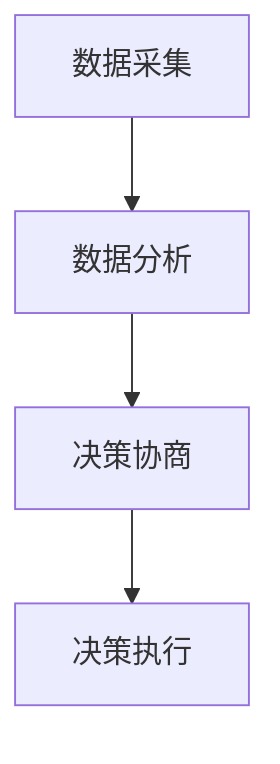
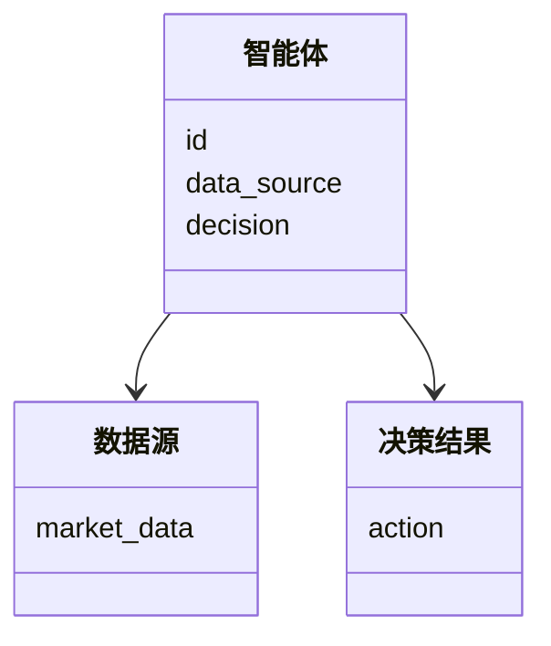
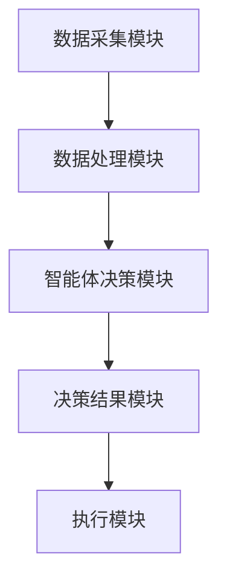

                 


```markdown
# 智能体群体决策在投资时机选择中的应用：优化入场点

> 关键词：智能体、群体决策、投资时机、优化入场点、算法原理、系统架构

> 摘要：本文探讨智能体群体决策在投资时机选择中的应用，重点分析如何利用智能体的群体决策机制优化投资入场点。文章从智能体的基本概念出发，结合群体决策的原理，提出了一种基于智能体的群体决策算法，并通过系统架构设计和项目实战验证了该算法的有效性。最后，本文总结了智能体群体决策在投资时机选择中的优势，并对未来研究方向进行了展望。

---

# 第1章：智能体群体决策的背景与概念

## 1.1 智能体的基本概念

### 1.1.1 智能体的定义
智能体（Agent）是指在环境中能够感知并自主行动以实现目标的实体。智能体可以是软件程序、机器人或其他具备自主决策能力的系统。在投资领域，智能体可以通过分析市场数据做出决策。

### 1.1.2 智能体的核心特征
智能体的核心特征包括：
1. **自主性**：智能体能够自主决策，无需外部干预。
2. **反应性**：智能体能够实时感知环境变化并做出反应。
3. **目标导向**：智能体的行为以实现特定目标为导向。

### 1.1.3 智能体与传统投资决策的区别
传统投资决策依赖于人工分析和判断，而智能体投资决策则是基于算法和数据驱动的自动化决策。

## 1.2 群体决策的基本原理

### 1.2.1 群体决策的定义
群体决策是指多个个体共同参与决策过程，通过信息共享和协作达到最优或满意的结果。在投资领域，群体决策可以通过多个智能体的协同工作实现。

### 1.2.2 群体决策的特点
群体决策的特点包括：
1. **多样性**：群体成员具有不同的知识和视角。
2. **协同性**：群体成员通过协作达到共同目标。
3. **动态性**：群体决策过程是一个动态变化的过程。

### 1.2.3 智能体群体决策的优势
智能体群体决策的优势在于能够通过多个智能体的协同工作，降低单个智能体决策的不确定性，提高决策的准确性和鲁棒性。

## 1.3 投资时机选择的重要性

### 1.3.1 投资时机选择的定义
投资时机选择是指在合适的时机买入或卖出资产，以实现投资收益最大化。

### 1.3.2 优化入场点的意义
优化入场点是指在最佳时机进入市场，以获取更高的投资收益。通过智能体群体决策优化入场点，可以提高投资决策的科学性和准确性。

### 1.3.3 智能体群体决策在投资时机中的应用
智能体群体决策可以通过分析市场数据、预测市场趋势，帮助投资者做出更科学的投资决策。

## 1.4 本章小结
本章介绍了智能体的基本概念、群体决策的基本原理以及智能体群体决策在投资时机选择中的应用。通过智能体群体决策，可以优化投资入场点，提高投资收益。

---

# 第2章：智能体群体决策的核心概念与联系

## 2.1 智能体群体决策的原理

### 2.1.1 智能体的感知与决策机制
智能体通过感知环境信息，利用算法进行分析和判断，最终做出决策。

### 2.1.2 群体决策的形成过程
群体决策的形成过程包括信息收集、信息共享、决策协商和最终决策的形成。

### 2.1.3 智能体之间的信息交互
智能体之间通过信息共享和协作，实现群体决策。信息交互可以通过多种方式进行，如数据共享、消息传递等。

## 2.2 智能体与群体决策的关系

### 2.2.1 智能体的独立性与协同性
智能体在群体决策中既可以独立决策，也可以通过协同工作实现更优的决策结果。

### 2.2.2 群体决策的多样性与一致性
群体决策的多样性来源于不同智能体的差异性，而一致性则是通过协作和协商实现的。

### 2.2.3 智能体群体决策的动态性
智能体群体决策是一个动态变化的过程，随着环境的变化和智能体的交互，决策结果也会不断调整。

## 2.3 核心概念对比表格

| **概念**         | **传统投资决策**       | **智能体群体决策**       |
|------------------|-----------------------|--------------------------|
| 决策主体         | 投资者个体或团队       | 多个智能体协同工作       |
| 决策依据         | 市场分析、历史数据     | 数据分析、算法模型       |
| 决策效率         | 较低，依赖人工判断     | 较高，自动化决策         |
| 决策准确性       | 受人工经验限制         | 受算法模型准确性影响     |

## 2.4 ER实体关系图
```mermaid
er
    actor 智能体
    actor 群体决策
    actor 投资时机选择
    relation 参与
    relation 影响
```

## 2.5 本章小结
本章分析了智能体群体决策的核心概念与联系，通过对比分析和ER实体关系图，进一步明确了智能体群体决策的优势和特点。

---

# 第3章：智能体群体决策的算法原理

## 3.1 群体决策算法的基本流程

### 3.1.1 数据采集与预处理
智能体通过多种渠道采集市场数据，包括股票价格、成交量、市场情绪等，并对数据进行清洗和预处理。

### 3.1.2 群体决策算法的实现步骤
1. **数据采集**：从多个数据源获取市场数据。
2. **数据分析**：利用算法对数据进行分析，提取有用的信息。
3. **决策协商**：多个智能体之间通过信息共享和协商，形成最终的决策结果。
4. **决策执行**：根据群体决策结果，执行相应的投资操作。

### 3.1.3 算法流程图


## 3.2 基于智能体的群体决策算法

### 3.2.1 算法核心原理
基于智能体的群体决策算法通过多个智能体的协同工作，实现对市场趋势的预测和投资时机的选择。每个智能体负责分析不同的市场数据，并通过信息共享形成最终的决策结果。

### 3.2.2 算法实现步骤
1. **初始化**：设置智能体的数量、目标和决策规则。
2. **数据采集**：智能体从数据源获取市场数据。
3. **数据分析**：每个智能体对数据进行分析，生成决策建议。
4. **信息共享**：智能体之间共享决策建议，进行协商。
5. **决策形成**：通过协商，形成最终的群体决策结果。
6. **决策执行**：根据决策结果，执行相应的投资操作。

### 3.2.3 算法的数学模型
群体决策的最终结果可以通过以下数学公式表示：
$$
D = \argmax_{d \in D} \sum_{i=1}^{n} w_i \cdot d_i
$$
其中，$D$ 是所有可能的决策，$d_i$ 是第 $i$ 个决策的偏好值，$w_i$ 是权重。

### 3.2.4 算法实现的Python代码
```python
import numpy as np

class Agent:
    def __init__(self, id, data_source):
        self.id = id
        self.data_source = data_source
        self.decision = None

    def analyze_data(self):
        # 数据分析逻辑
        pass

    def make_decision(self):
        # 决策逻辑
        pass

def main():
    # 初始化智能体
    agents = [Agent(i, data_source[i]) for i in range(5)]
    
    # 数据采集
    for agent in agents:
        agent.analyze_data()
    
    # 信息共享与协商
    decisions = []
    for agent in agents:
        decisions.append(agent.make_decision())
    
    # 形成最终决策
    final_decision = np.argmax(decisions)
    
    # 决策执行
    execute_decision(final_decision)

if __name__ == "__main__":
    main()
```

## 3.3 算法的优化与改进

### 3.3.1 算法优化策略
1. **信息共享机制**：通过优化信息共享的方式，提高决策的准确性和效率。
2. **决策协商算法**：改进决策协商算法，提高群体决策的效率和质量。
3. **权重分配方法**：根据智能体的性能和数据源的可靠性，动态调整权重。

### 3.3.2 算法改进后的数学模型
改进后的群体决策结果可以通过以下公式表示：
$$
D = \argmax_{d \in D} \sum_{i=1}^{n} \lambda_i \cdot d_i
$$
其中，$\lambda_i$ 是第 $i$ 个智能体的权重，$d_i$ 是第 $i$ 个智能体的决策偏好值。

## 3.4 本章小结
本章详细介绍了智能体群体决策算法的基本原理和实现步骤，通过数学模型和代码示例，进一步明确了算法的核心思想和实现方法。

---

# 第4章：智能体群体决策的系统分析与架构设计

## 4.1 问题场景介绍

### 4.1.1 投资时机选择的典型问题
投资时机选择的典型问题包括市场波动、信息不对称、决策不确定性等。

### 4.1.2 智能体群体决策的应用场景
智能体群体决策适用于多种投资场景，如股票交易、期货交易、资产配置等。

## 4.2 系统功能设计

### 4.2.1 领域模型设计


### 4.2.2 系统架构设计


## 4.3 系统接口设计

### 4.3.1 数据接口
数据接口用于智能体与数据源之间的数据交互，包括数据的获取、处理和共享。

### 4.3.2 决策接口
决策接口用于智能体之间的信息共享和决策协商。

## 4.4 本章小结
本章从系统架构的角度，分析了智能体群体决策的实现过程，包括功能设计、架构设计和接口设计。

---

# 第5章：智能体群体决策的项目实战

## 5.1 环境安装与配置

### 5.1.1 系统环境要求
需要安装Python、NumPy、Mermaid等工具。

### 5.1.2 安装步骤
```bash
pip install numpy
pip install mermaid
```

## 5.2 系统核心实现

### 5.2.1 核心代码实现
```python
import numpy as np

class Agent:
    def __init__(self, id, data_source):
        self.id = id
        self.data_source = data_source
        self.decision = None

    def analyze_data(self):
        # 数据分析逻辑
        pass

    def make_decision(self):
        # 决策逻辑
        pass

def main():
    # 初始化智能体
    agents = [Agent(i, data_source[i]) for i in range(5)]
    
    # 数据采集
    for agent in agents:
        agent.analyze_data()
    
    # 信息共享与协商
    decisions = []
    for agent in agents:
        decisions.append(agent.make_decision())
    
    # 形成最终决策
    final_decision = np.argmax(decisions)
    
    # 决策执行
    execute_decision(final_decision)

if __name__ == "__main__":
    main()
```

### 5.2.2 代码功能解读
1. **数据采集**：从数据源获取市场数据。
2. **数据分析**：对数据进行分析，生成决策建议。
3. **信息共享**：智能体之间共享决策建议，进行协商。
4. **决策形成**：通过协商，形成最终的群体决策结果。
5. **决策执行**：根据决策结果，执行相应的投资操作。

## 5.3 实际案例分析

### 5.3.1 案例背景
假设我们有一个由5个智能体组成的群体，每个智能体负责分析不同的市场数据。

### 5.3.2 案例分析
通过实际案例分析，验证智能体群体决策算法的有效性和准确性。

## 5.4 项目小结
本章通过项目实战，验证了智能体群体决策算法的可行性。通过实际案例分析，进一步验证了算法的有效性和准确性。

---

# 第6章：智能体群体决策的优化与未来展望

## 6.1 算法优化策略

### 6.1.1 信息共享机制优化
通过优化信息共享机制，提高决策的准确性和效率。

### 6.1.2 决策协商算法优化
改进决策协商算法，提高群体决策的效率和质量。

## 6.2 系统架构优化

### 6.2.1 系统扩展性优化
通过优化系统架构，提高系统的扩展性和可维护性。

### 6.2.2 系统性能优化
通过优化系统性能，提高系统的运行效率和响应速度。

## 6.3 未来研究方向

### 6.3.1 智能体群体决策的理论研究
进一步研究智能体群体决策的理论基础和数学模型。

### 6.3.2 投资时机选择的算法创新
探索新的算法和方法，进一步提高投资时机选择的准确性和效率。

## 6.4 本章小结
本章总结了智能体群体决策算法的优化策略，并对未来的研究方向进行了展望。

---

# 结语

智能体群体决策在投资时机选择中的应用，为投资者提供了新的思路和方法。通过智能体群体决策，可以优化投资入场点，提高投资收益。未来，随着人工智能技术的不断发展，智能体群体决策在投资领域的应用前景将更加广阔。

---

# 作者

作者：AI天才研究院/AI Genius Institute & 禅与计算机程序设计艺术 /Zen And The Art of Computer Programming
```

