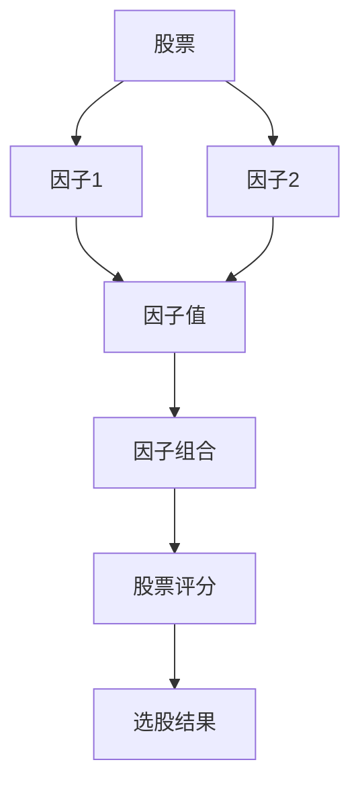
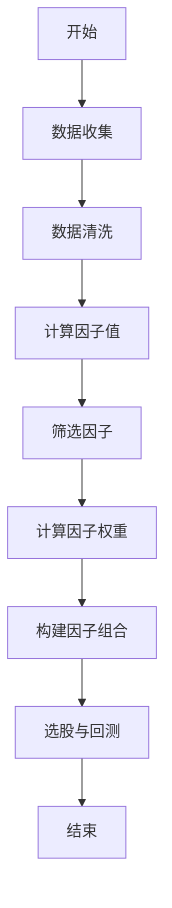
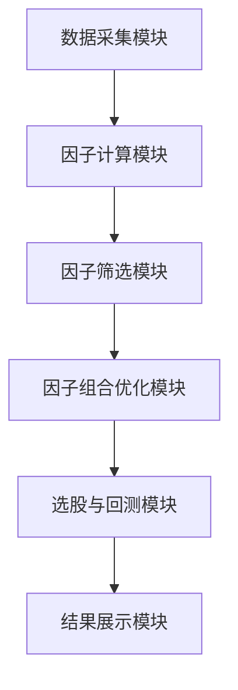
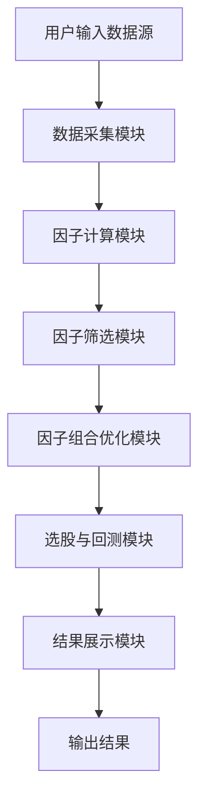

                 


# 肯尼斯·费雷尔的多因子选股模型

## 关键词：多因子选股模型、金融投资、量化分析、因子选择、数学建模、系统设计

## 摘要：  
《肯尼斯·费雷尔的多因子选股模型》是一本深入探讨多因子选股模型的构建与应用的技术博客文章。本文从多因子选股模型的背景出发，详细阐述了其核心概念、算法原理、数学模型、系统设计以及实际项目案例。通过系统化的分析与实战演示，帮助读者理解如何利用多因子模型进行选股优化，提升投资收益。文章最后还总结了多因子选股模型的优势与局限性，并展望了未来的研究方向。

---

# 第一部分: 多因子选股模型的背景与概念

## 第1章: 多因子选股模型的背景与概念

### 1.1 多因子选股模型的背景

#### 1.1.1 传统选股方法的局限性  
传统的选股方法主要依赖于基本面分析或技术分析，但这些方法往往主观性强、可操作性低，难以应对市场波动和复杂环境。例如，基本面分析需要大量人工筛选财务数据，而技术分析则依赖于对历史价格走势的判断，容易受到市场情绪影响。

#### 1.1.2 多因子选股模型的发展历史  
多因子选股模型起源于20世纪70年代，随着金融学的发展，逐步从单因子模型扩展到多因子模型。20世纪90年代，Fama-French三因子模型的提出标志着多因子选股模型的成熟。近年来，随着大数据和人工智能技术的普及，多因子模型得到了更广泛应用。

#### 1.1.3 多因子模型在现代投资中的应用价值  
多因子选股模型通过结合多个因子（如市值、价值、动量等），能够捕捉更多市场信息，提高选股的科学性和准确性。与传统方法相比，多因子模型更具系统性、可量化和可扩展性，适用于机构投资和量化投资。

### 1.2 多因子选股模型的核心概念

#### 1.2.1 什么是因子  
因子是指能够解释股票超额收益的某种特征或变量。例如，市值（Market Cap）、市盈率（P/E ratio）、动量（Momentum）等都是常见的因子。

#### 1.2.2 常见的因子类型  
- **规模因子（Size Factor）**：反映股票市值大小的影响。
- **价值因子（Value Factor）**：反映股票的低市盈率、低市净率等价值特征。
- **动量因子（Momentum Factor）**：反映股票价格的动量效应。
- **质量因子（Quality Factor）**：反映公司的盈利能力、ROE等财务指标。
- **流动性因子（Liquidity Factor）**：反映股票的交易量或流动性。

#### 1.2.3 多因子模型的定义与特点  
多因子模型是指将多个因子组合起来，构建一个综合指标来筛选股票的模型。其特点是：  
1. **多维度分析**：综合考虑多个因子，避免单一因子的局限性。  
2. **可量化**：通过数学公式量化因子的权重和影响。  
3. **动态优化**：根据市场变化调整因子权重和组合。

#### 1.2.4 多因子模型与单因子模型的区别  
单因子模型仅依赖一个因子进行选股，而多因子模型结合多个因子，能够更全面地捕捉市场信息。例如，仅使用市值因子可能无法区分不同市值公司的投资价值，而结合市值和价值因子可以更精准地筛选股票。

### 1.3 多因子选股模型的理论基础

#### 1.3.1 CAPM模型与多因子模型的关系  
CAPM（资本资产定价模型）是单因子模型的基础，它假设市场风险是唯一的风险来源。多因子模型是对CAPM的扩展，引入多个因子来解释股票收益。

#### 1.3.2 Fama-French三因子模型简介  
Fama-French三因子模型包括三个因子：市场因子、规模因子和价值因子。该模型认为，股票收益不仅由市场风险决定，还受到规模和价值因子的影响。

#### 1.3.3 其他常用多因子模型介绍  
- **五因子模型**：在三因子模型的基础上加入动量和质量因子。  
- **八因子模型**：进一步扩展因子数量，涵盖更多市场特征。  

### 1.4 多因子选股模型的应用场景

#### 1.4.1 机构投资中的应用  
机构投资者可以通过多因子模型筛选出具有潜力的股票组合，优化投资组合的风险收益比。

#### 1.4.2 量化投资中的应用  
量化交易者利用多因子模型进行高频交易，通过算法自动筛选股票，提高交易效率和收益。

#### 1.4.3 多因子模型的优缺点分析  
- **优点**：多维度分析、降低投资风险、提高收益稳定性。  
- **缺点**：因子选择复杂、计算量大、需要大量数据支持。

### 1.5 本章小结  
本章介绍了多因子选股模型的背景、核心概念、理论基础和应用场景。多因子模型通过综合考虑多个因子，能够更全面地分析股票的投资价值，为投资者提供科学的选股依据。

---

# 第二部分: 多因子选股模型的核心概念与理论

## 第2章: 多因子模型的核心概念与联系

### 2.1 多因子模型的因子选择

#### 2.1.1 常见因子的分类与特征  
- **规模因子**：衡量股票市值大小，小盘股通常具有更高的增长潜力。  
- **价值因子**：低市盈率、低市净率的股票可能被市场低估。  
- **动量因子**：近期价格上涨的股票可能继续上涨。  
- **质量因子**：高ROE、稳定的盈利能力的公司更值得投资。  

#### 2.1.2 因子之间的关系与相互作用  
不同因子之间可能存在相关性或独立性。例如，价值因子和规模因子可能相关，但动量因子和质量因子可能相对独立。

#### 2.1.3 如何选择合适的因子  
选择因子时需要考虑以下几点：  
1. **因子的可解释性**：选择能够解释超额收益的因子。  
2. **因子的独立性**：避免因子之间高度相关，以减少模型的多重共线性问题。  
3. **因子的可操作性**：选择易于计算和获取数据的因子。  

### 2.2 多因子模型的数学表达

#### 2.2.1 多因子模型的数学公式  
多因子模型可以用以下公式表示：  
$$ R_i = \alpha + \beta_1 F_1 + \beta_2 F_2 + \dots + \beta_n F_n + \epsilon $$  
其中，$R_i$ 是股票i的超额收益，$\alpha$ 是截距，$\beta_j$ 是因子$F_j$的载入系数，$\epsilon$ 是误差项。

#### 2.2.2 因子载入与权重的确定  
因子载入（$\beta_j$）表示因子对股票收益的贡献程度。可以通过回归分析或因子分析方法确定因子的权重。

#### 2.2.3 因子组合的优化方法  
因子组合优化的目标是找到最优的因子权重，使得组合收益最大，风险最小。常用的方法包括均值-方差优化和风险中性优化。

### 2.3 多因子模型的ER实体关系图



---

# 第三部分: 多因子选股模型的算法原理

## 第3章: 多因子选股模型的算法原理

### 3.1 多因子选股算法的步骤

#### 3.1.1 数据的收集与预处理  
- 数据来源：股票历史数据、财务数据、市场数据等。  
- 数据清洗：处理缺失值、异常值、重复值。  

#### 3.1.2 因子的计算与筛选  
- 计算因子值：根据公式计算每个因子的数值。  
- 筛选因子：通过相关性分析或信息量准则选择最优因子组合。  

#### 3.1.3 因子组合优化  
- 计算因子权重：使用回归或优化算法确定因子权重。  
- 构建因子组合：根据权重计算综合评分。  

#### 3.1.4 选股与回测  
- 根据评分排序股票，选择排名靠前的股票作为投资组合。  
- 对投资组合进行回测，验证收益与风险表现。  

### 3.2 多因子选股算法的数学模型

#### 3.2.1 因子回归模型  
$$ R_i = \beta_1 F_1 + \beta_2 F_2 + \dots + \beta_n F_n + \epsilon $$  

#### 3.2.2 因子组合优化模型  
目标函数：最大化组合收益，最小化组合风险。  
约束条件：权重之和为1，权重非负。  

### 3.3 多因子选股算法的流程图



### 3.4 多因子选股算法的Python代码实现

```python
import pandas as pd
import numpy as np
from sklearn.linear_model import LinearRegression

# 示例数据
data = pd.DataFrame({
    'Factor1': np.random.randn(100),
    'Factor2': np.random.randn(100),
    'Factor3': np.random.randn(100),
    'Return': np.random.randn(100)
})

# 计算因子权重
model = LinearRegression()
model.fit(data[['Factor1', 'Factor2', 'Factor3']], data['Return'])
weights = model.coef_

# 构建因子组合
data['Score'] = np.dot(data[['Factor1', 'Factor2', 'Factor3']].values, weights) + model.intercept_

# 选股
data_sorted = data.sort_values('Score', ascending=False)
selected_stocks = data_sorted.head(10)
```

### 3.5 数学公式与案例分析

#### 3.5.1 数学公式的详细推导  
以Fama-French三因子模型为例，股票收益可以表示为：  
$$ R_i = \alpha + \beta_1 R_m + \beta_2 SMB + \beta_3 HML + \epsilon $$  
其中，$R_m$ 是市场收益，SMB是小市值因子，HML是高价值因子。  

#### 3.5.2 案例分析  
假设我们有三只股票，其因子值如下：  

| 股票 | Factor1 | Factor2 |
|------|---------|---------|
| A    | 2       | 3       |
| B    | 1       | 4       |
| C    | 3       | 2       |

计算因子权重：假设权重为[0.5, 0.5]，则股票评分分别为：  
- A: $2 \times 0.5 + 3 \times 0.5 = 2.5$  
- B: $1 \times 0.5 + 4 \times 0.5 = 2.5$  
- C: $3 \times 0.5 + 2 \times 0.5 = 2.5$  

最终评分相同，可以根据其他因素进一步筛选。

---

# 第四部分: 多因子选股模型的系统设计

## 第4章: 多因子选股系统的系统设计

### 4.1 系统需求分析

#### 4.1.1 系统功能需求  
- 数据采集：从数据库或API获取股票数据。  
- 因子计算：根据公式计算各个因子的值。  
- 因子筛选：通过相关性分析筛选最优因子组合。  
- 因子组合优化：计算因子权重，构建最优组合。  
- 选股与回测：根据评分筛选股票，进行回测分析。  

#### 4.1.2 系统性能需求  
- 数据处理速度：能够处理大规模数据。  
- 计算效率：因子计算和优化过程需要高效执行。  

### 4.2 系统功能设计

#### 4.2.1 数据采集模块  
- 数据来源：数据库、API接口。  
- 数据清洗：处理缺失值、异常值。  

#### 4.2.2 因子计算模块  
- 计算因子值：根据公式计算每个因子的数值。  
- 可视化分析：绘制因子分布图。  

#### 4.2.3 因子筛选模块  
- 相关性分析：计算因子之间的相关性矩阵。  
- 信息量准则：使用AIC或BIC准则选择最优因子组合。  

#### 4.2.4 因子组合优化模块  
- 计算因子权重：使用回归或优化算法。  
- 构建因子组合：根据权重计算综合评分。  

#### 4.2.5 选股与回测模块  
- 选股逻辑：根据评分排序，选择排名靠前的股票。  
- 回测分析：计算投资组合的收益与风险指标（如夏普比率）。  

### 4.3 系统架构设计

#### 4.3.1 系统架构图  


#### 4.3.2 系统交互流程图  


---

# 第五部分: 多因子选股模型的项目实战

## 第5章: 多因子选股模型的项目实战

### 5.1 项目环境配置

#### 5.1.1 数据源  
- 股票历史数据：可以从Yahoo Finance或本地数据库获取。  
- 财务数据：可以从公司财报或API获取。  

#### 5.1.2 工具安装  
- Python：安装Anaconda或Miniconda。  
- 第三方库：安装pandas、numpy、scikit-learn、matplotlib等。  

### 5.2 系统核心实现

#### 5.2.1 数据采集与预处理  
```python
import pandas as pd
import requests

# 从Yahoo Finance获取数据
def get_data(ticker):
    url = f"https://query1.finance.yahoo.com/ws/v1/finance/quote/{ticker}"
    response = requests.get(url)
    data = response.json()
    return pd.DataFrame({
        'Close': [data['quoteResponse']['result'][0]['close']],
        'Volume': [data['quoteResponse']['result'][0]['volume']],
        'Market Cap': [data['quoteResponse']['result'][0]['marketCap']]
    })

# 示例：获取AAPL数据
data = get_data('AAPL')
```

#### 5.2.2 因子计算与筛选  
```python
import pandas as pd
from sklearn.linear_model import Lasso

# 示例数据
data = pd.DataFrame({
    'Factor1': np.random.randn(100),
    'Factor2': np.random.randn(100),
    'Factor3': np.random.randn(100),
    'Return': np.random.randn(100)
})

# 筛选因子
model = Lasso(alpha=0.1)
model.fit(data[['Factor1', 'Factor2', 'Factor3']], data['Return'])
selected_factors = data.columns[model.coef_ != 0]
```

#### 5.2.3 因子组合优化与选股  
```python
import pandas as pd
import numpy as np
from sklearn.linear_model import LinearRegression

# 示例数据
data = pd.DataFrame({
    'Factor1': np.random.randn(100),
    'Factor2': np.random.randn(100),
    'Factor3': np.random.randn(100),
    'Return': np.random.randn(100)
})

# 计算因子权重
model = LinearRegression()
model.fit(data[['Factor1', 'Factor2', 'Factor3']], data['Return'])
weights = model.coef_

# 构建因子组合
data['Score'] = np.dot(data[['Factor1', 'Factor2', 'Factor3']].values, weights) + model.intercept_

# 选股
data_sorted = data.sort_values('Score', ascending=False)
selected_stocks = data_sorted.head(10)
```

### 5.3 案例分析与结果解读

#### 5.3.1 案例分析  
假设我们有100只股票，通过多因子模型筛选出10只表现最好的股票，构建投资组合。  

#### 5.3.2 回测分析  
计算投资组合的收益率、波动率、夏普比率等指标，验证模型的有效性。  

#### 5.3.3 结果优化  
根据回测结果调整因子权重和组合策略，进一步优化投资收益。  

### 5.4 项目小结  
本章通过实际项目案例，详细展示了多因子选股模型的实现过程。从数据采集到因子计算，再到组合优化和选股，每一步都进行了详细说明，并通过Python代码实现。

---

# 第六部分: 总结与展望

## 第6章: 多因子选股模型的总结与展望

### 6.1 本章总结

#### 6.1.1 核心知识点回顾  
- 多因子选股模型的背景与概念。  
- 多因子模型的核心概念与联系。  
- 多因子模型的算法原理与系统设计。  
- 多因子模型的项目实战与案例分析。  

#### 6.1.2 最佳实践 Tips  
- 因子选择要结合市场环境和数据特性。  
- 因子权重需要动态调整，以适应市场变化。  
- 多因子模型需要大量数据支持，建议使用高频数据。  

### 6.2 未来研究方向

#### 6.2.1 因子选择的优化  
探索更有效的因子选择方法，如使用机器学习算法。  

#### 6.2.2 模型的动态调整  
研究如何根据市场变化动态调整因子权重。  

#### 6.2.3 多因子模型的扩展  
尝试引入更多因子，如情绪因子、新闻因子等，构建更复杂的多因子模型。  

### 6.3 注意事项

#### 6.3.1 数据质量的重要性  
数据的质量直接影响模型的效果，建议使用可靠的第三方数据源。  

#### 6.3.2 模型的局限性  
多因子模型虽然有效，但仍存在一些局限性，如因子之间的多重共线性问题，以及数据的可得性限制。  

### 6.4 拓展阅读

#### 6.4.1 推荐书籍  
- 《投资学》（作者：彼得·林奇）  
- 《量化投资：机构的投资策略与技巧》（作者：德鲁克）  

#### 6.4.2 推荐博客与资源  
- 博客：Towards Data Science  
- GitHub：quantitative-risk-and-reward  

### 6.5 本章小结  
多因子选股模型是一种科学的投资方法，通过综合考虑多个因子，能够提高选股的准确性和投资收益。未来的研究可以进一步优化因子选择和模型设计，以应对更复杂的市场环境。

---

# 作者：AI天才研究院/AI Genius Institute & 禅与计算机程序设计艺术/Zen And The Art of Computer Programming

