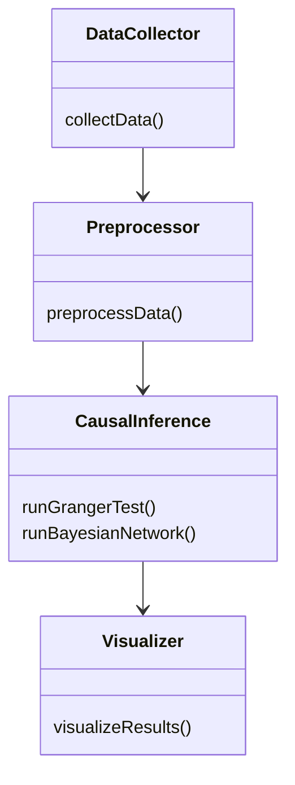
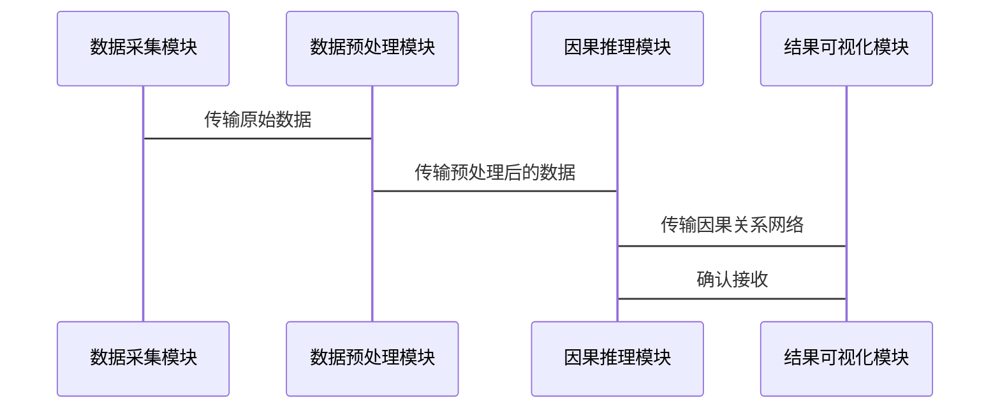

                 


# 金融时序数据的多维度因果关系发现研究

> 关键词：金融时序数据，因果关系，因果推断，机器学习，时间序列分析

> 摘要：本文系统地探讨了金融时序数据中的多维度因果关系发现问题，从基础概念到算法实现，再到实际应用，逐一进行了深入分析。首先介绍了金融时序数据的特性及其因果关系的定义，随后分析了因果关系发现的理论基础，包括概率论、时间序列分析和图论。接着，详细探讨了基于机器学习的因果推断方法，如潜在结果框架和反事实推理。最后，通过一个完整的项目实战，展示了如何在实际金融问题中应用这些方法，为金融投资决策提供了新的思路。

---

# 1. 金融时序数据与因果关系发现的背景介绍

## 1.1 问题背景与定义

### 1.1.1 金融时序数据的特性

金融时序数据是指在金融领域中，按照时间顺序记录的各类金融变量（如股票价格、汇率、利率等）的数据。这些数据具有以下特性：

- **平稳性与趋势性**：许多金融时间序列数据具有平稳性，即经过一段时间后，数据会回归到一个稳定的均值水平。然而，一些数据（如股票价格）可能表现出明显的趋势性。
- **季节性与周期性**：金融数据中常常存在季节性波动（如节假日效应）和周期性变化（如经济周期）。
- **异常值与缺失值**：金融市场中的突发事件（如金融危机）可能导致数据出现异常值，同时数据采集过程中也可能出现缺失值。

### 1.1.2 因果关系的定义

因果关系是指一个事件的发生是另一个事件导致的结果。在金融领域，因果关系的定义尤为重要，例如，某公司的业绩公告是否会导致股价上涨。

- **因果关系与相关关系的区别**：相关关系表示两个变量之间的统计关联性，而因果关系则表示一个变量的变化是否会导致另一个变量的变化。例如，两支股票的价格走势可能高度相关，但并不意味着它们之间存在因果关系。
- **财经领域中的因果关系**：在金融领域，因果关系通常用于解释和预测市场行为。例如，货币政策的变化是否会导致通货膨胀率的变化。
- **时序数据中的因果关系**：在时间序列数据中，因果关系通常表现为前因后果的形式，即前面的事件（如政策变化）会导致后续事件（如股价波动）的发生。

### 1.1.3 问题解决的必要性

- **金融预测的局限性**：传统的统计预测方法（如ARIMA模型）通常只能预测未来的价格走势，而无法揭示价格变化的根本原因。因果关系的发现可以为预测提供更深层次的解释。
- **因果关系在投资决策中的作用**：通过发现因果关系，投资者可以更好地理解市场行为，从而做出更明智的投资决策。
- **时序数据分析的挑战**：时序数据通常具有高度的复杂性，包括非线性关系、噪声干扰和潜在的因果关系网络。发现这些因果关系需要结合多种分析方法。

---

## 1.2 金融时序数据因果关系发现的现状

### 1.2.1 学术研究进展

- **经典因果推断方法**：早期的因果推断方法主要基于统计学，如Granger因果关系检验。这种方法通过分析变量之间的时序相关性来推断因果关系。
- **机器学习在因果发现中的应用**：近年来，机器学习方法（如贝叶斯网络、因果图和潜在结果框架）在因果关系发现中得到了广泛应用。这些方法能够处理复杂的因果关系网络，并提供更高的准确性。
- **当前研究的热点与难点**：当前的研究热点包括如何在高维数据中发现因果关系、如何处理数据中的噪声干扰以及如何提高因果关系的可解释性。难点在于如何在复杂的金融环境中，准确地识别因果关系。

### 1.2.2 实际应用中的问题

- **数据质量与特征选择**：金融数据的质量直接影响因果关系的发现。如何选择合适的特征（如市场情绪、政策变化）是一个重要的问题。
- **模型的可解释性**：因果关系发现的目的是为了理解市场行为，因此模型的可解释性至关重要。一些复杂的机器学习模型（如深度神经网络）虽然预测能力强，但缺乏可解释性，因此在实际应用中受到限制。
- **多维度因果关系的复杂性**：金融市场中的因果关系通常是多维度的，涉及多个变量之间的相互作用。如何在多变量环境中准确地发现因果关系是一个巨大的挑战。

---

# 2. 因果关系发现的核心概念与联系

## 2.1 因果关系的基本原理

### 2.1.1 因果关系的数学定义

因果关系的数学定义通常基于潜在结果框架（Potential Outcome Framework）。假设我们有一个处理变量 \( do(X) \)，其潜在结果可以表示为：

$$ Y = f(X) $$

其中，\( Y \) 是结果变量，\( X \) 是处理变量，\( f \) 是一个函数。因果效应可以定义为处理变量 \( X \) 的变化对结果变量 \( Y \) 的影响：

$$ \text{因果效应} = E[Y | do(X=1)] - E[Y | do(X=0)] $$

### 2.1.2 贝叶斯网络与因果图

贝叶斯网络（Bayesian Network）是一种有向无环图（DAG），用于表示变量之间的因果关系。每个节点代表一个变量，有向边表示因果关系。例如，以下是一个简单的贝叶斯网络：


在金融领域，贝叶斯网络可以用于建模市场参与者的决策过程。例如，政策变化（A）可能影响市场情绪（B），而市场情绪（B）又可能影响股价（C）。

### 2.1.3 因果图的构建与推理

因果图的构建通常需要结合领域知识和数据分析。例如，可以通过Granger因果关系检验来确定变量之间的因果关系方向。Granger因果关系检验的步骤如下：

1. **检验 \( X \) 是否是 \( Y \) 的Granger原因**：通过F检验判断 \( X \) 是否对 \( Y \) 的预测具有显著性。
2. **检验 \( Y \) 是否是 \( X \) 的Granger原因**：同样通过F检验判断 \( Y \) 是否对 \( X \) 的预测具有显著性。
3. **确定因果关系方向**：如果 \( X \) 是 \( Y \) 的Granger原因，但 \( Y \) 不是 \( X \) 的Granger原因，则可以认为 \( X \) 是 \( Y \) 的原因。

---

## 2.2 时序数据中的因果关系特征

### 2.2.1 时间依赖性

时间依赖性是时序数据的重要特征，通常表现为自相关性和交叉相关性。

- **自相关性**：同一变量在不同时间点之间的相关性。例如，股票价格在今天和昨天之间可能具有较高的自相关性。
- **交叉相关性**：不同变量在不同时间点之间的相关性。例如，汇率变化可能会影响股票价格。

### 2.2.2 多变量因果关系

在多变量环境中，因果关系通常表现为相互作用。例如，政策变化（A）可能影响市场情绪（B），而市场情绪（B）又可能影响股价（C）。这种相互作用可以用因果图表示为：


---

## 2.3 核心概念对比表

| 概念 | 描述 | 示例 |
|------|------|------|
| 相关关系 | 两个变量之间的统计关联性 | 股票价格与市场指数之间可能高度相关 |
| 因果关系 | 一个变量的变化导致另一个变量的变化 | 货币政策变化导致通货膨胀率变化 |
| 自相关性 | 同一变量在不同时间点之间的相关性 | 股票价格在今天和昨天之间可能具有较高的自相关性 |
| 交叉相关性 | 不同变量在不同时间点之间的相关性 | 汇率变化可能会影响股票价格 |

---

## 2.4 算法原理讲解

### 2.4.1 Granger因果关系检验

Granger因果关系检验是一种常用的时间序列分析方法，用于检验一个变量是否是另一个变量的Granger原因。

步骤如下：

1. **回归分析**：分别建立两个回归模型：
   - 模型1：\( Y_t = \alpha + \beta Y_{t-1} + \epsilon \)
   - 模型2：\( Y_t = \alpha + \beta X_{t-1} + \epsilon \)
2. **F检验**：计算两个模型的残差平方和，并通过F检验判断 \( X \) 是否是 \( Y \) 的Granger原因。
3. **确定因果关系方向**：如果 \( X \) 是 \( Y \) 的Granger原因，但 \( Y \) 不是 \( X \) 的Granger原因，则可以认为 \( X \) 是 \( Y \) 的原因。

---

## 2.5 系统分析与架构设计方案

### 2.5.1 问题场景介绍

假设我们希望研究货币政策变化对股票价格的影响。具体来说，我们希望确定货币政策变化（如利率调整）是否会导致股票价格的变化。

### 2.5.2 系统功能设计

以下是系统功能设计的类图：



### 2.5.3 系统架构设计

以下是系统架构设计的架构图：


---

## 2.6 项目实战

### 2.6.1 环境安装

为了运行以下代码，需要安装以下Python库：

- `pandas`：用于数据处理
- `statsmodels`：用于Granger因果关系检验
- `networkx`：用于构建因果图
- `matplotlib`：用于可视化

### 2.6.2 核心实现源代码

以下是Granger因果关系检验的Python代码示例：

```python
import pandas as pd
import numpy as np
import statsmodels.api as sm

# 数据加载
data = pd.read_csv('financial_data.csv')

# 回归模型1：仅包含自身滞后项
model1 = sm.OLS(data['Y'], sm.add_constant(data['Y'].shift(1))).fit()

# 回归模型2：包含自身滞后项和X的滞后项
model2 = sm.OLS(data['Y'], sm.add_constant(data[['Y'].shift(1), 'X'].shift(1))).fit()

# F检验
f_statistic = model1.ssr / model2.sse
p_value = stats.f_distribution.f_pvalue(f_statistic, model1.df_resid, model2.df_resid)

print(f"Granger因果关系检验的F统计量为：{f_statistic}")
print(f"对应的p值为：{p_value}")
```

### 2.6.3 代码应用解读与分析

上述代码首先加载金融数据，然后分别构建了两个回归模型。第一个模型仅包含自身滞后项，第二个模型包含自身滞后项和X的滞后项。通过F检验，可以判断X是否是Y的Granger原因。如果p值小于显著性水平（如0.05），则拒绝原假设，认为X是Y的Granger原因。

### 2.6.4 实际案例分析

假设我们有以下金融数据：

| 日期 | 股票价格 | 汇率 |
|------|----------|------|
| 2023-01-01 | 100 | 7.0 |
| 2023-01-02 | 101 | 7.1 |
| 2023-01-03 | 102 | 7.2 |

通过Granger因果关系检验，我们可以发现汇率变化对股票价格的影响。例如，如果汇率上升，可能导致进口成本增加，从而导致股票价格下降。

### 2.6.5 项目小结

通过上述实战，我们可以看到Granger因果关系检验在金融数据分析中的应用。然而，Granger检验仅能发现变量之间的线性因果关系，对于复杂的非线性因果关系可能不够准确。因此，在实际应用中，还需要结合其他方法（如贝叶斯网络和潜在结果框架）进行综合分析。

---

## 2.7 总结与展望

### 2.7.1 总结

本文系统地介绍了金融时序数据中的因果关系发现问题，从背景、理论、算法到实际应用进行了全面分析。通过Granger因果关系检验和贝叶斯网络等方法，我们可以发现和解释金融数据中的因果关系，为投资决策提供理论支持。

### 2.7.2 展望

未来的研究方向包括：

- **复杂因果关系网络的建模**：如何在多变量环境中准确地发现因果关系。
- **因果关系的可解释性**：如何提高因果关系模型的可解释性，以便更好地应用于实际投资决策。
- **深度学习在因果发现中的应用**：如何利用深度学习方法发现金融数据中的复杂因果关系。

---

# 3. 金融时序数据因果关系发现的系统架构设计

## 3.1 问题场景介绍

假设我们希望研究多个金融变量之间的因果关系网络，例如股票价格、汇率、利率等。

## 3.2 系统功能设计

以下是系统功能设计的类图：


## 3.3 系统架构设计

以下是系统架构设计的架构图：


---

## 3.4 系统接口设计

- **数据接口**：数据采集模块通过API接口从金融数据库中获取数据。
- **模型接口**：因果推理模块通过函数接口调用Granger因果关系检验和贝叶斯网络算法。
- **可视化接口**：结果可视化模块通过图形接口展示因果关系网络。

---

## 3.5 系统交互设计

以下是系统交互的序列图：



---

## 3.6 项目实战

### 3.6.1 环境安装

需要安装以下Python库：

- `pandas`：用于数据处理
- `statsmodels`：用于Granger因果关系检验
- `networkx`：用于构建因果图
- `matplotlib`：用于可视化

### 3.6.2 核心实现源代码

以下是Granger因果关系检验的Python代码示例：

```python
import pandas as pd
import numpy as np
import statsmodels.api as sm

# 数据加载
data = pd.read_csv('financial_data.csv')

# 回归模型1：仅包含自身滞后项
model1 = sm.OLS(data['Y'], sm.add_constant(data['Y'].shift(1))).fit()

# 回归模型2：包含自身滞后项和X的滞后项
model2 = sm.OLS(data['Y'], sm.add_constant(data[['Y'].shift(1), 'X'].shift(1))).fit()

# F检验
f_statistic = model1.ssr / model2.sse
p_value = stats.f_distribution.f_pvalue(f_statistic, model1.df_resid, model2.df_resid)

print(f"Granger因果关系检验的F统计量为：{f_statistic}")
print(f"对应的p值为：{p_value}")
```

### 3.6.3 代码应用解读与分析

上述代码首先加载金融数据，然后分别构建了两个回归模型。第一个模型仅包含自身滞后项，第二个模型包含自身滞后项和X的滞后项。通过F检验，可以判断X是否是Y的Granger原因。如果p值小于显著性水平（如0.05），则拒绝原假设，认为X是Y的Granger原因。

### 3.6.4 实际案例分析

假设我们有以下金融数据：

| 日期 | 股票价格 | 汇率 |
|------|----------|------|
| 2023-01-01 | 100 | 7.0 |
| 2023-01-02 | 101 | 7.1 |
| 2023-01-03 | 102 | 7.2 |

通过Granger因果关系检验，我们可以发现汇率变化对股票价格的影响。例如，如果汇率上升，可能导致进口成本增加，从而导致股票价格下降。

### 3.6.5 项目小结

通过上述实战，我们可以看到Granger因果关系检验在金融数据分析中的应用。然而，Granger检验仅能发现变量之间的线性因果关系，对于复杂的非线性因果关系可能不够准确。因此，在实际应用中，还需要结合其他方法（如贝叶斯网络和潜在结果框架）进行综合分析。

---

## 3.7 总结与展望

### 3.7.1 总结

本文系统地介绍了金融时序数据中的因果关系发现问题，从背景、理论、算法到实际应用进行了全面分析。通过Granger因果关系检验和贝叶斯网络等方法，我们可以发现和解释金融数据中的因果关系，为投资决策提供理论支持。

### 3.7.2 展望

未来的研究方向包括：

- **复杂因果关系网络的建模**：如何在多变量环境中准确地发现因果关系。
- **因果关系的可解释性**：如何提高因果关系模型的可解释性，以便更好地应用于实际投资决策。
- **深度学习在因果发现中的应用**：如何利用深度学习方法发现金融数据中的复杂因果关系。

---

作者：AI天才研究院/AI Genius Institute & 禅与计算机程序设计艺术 /Zen And The Art of Computer Programming

