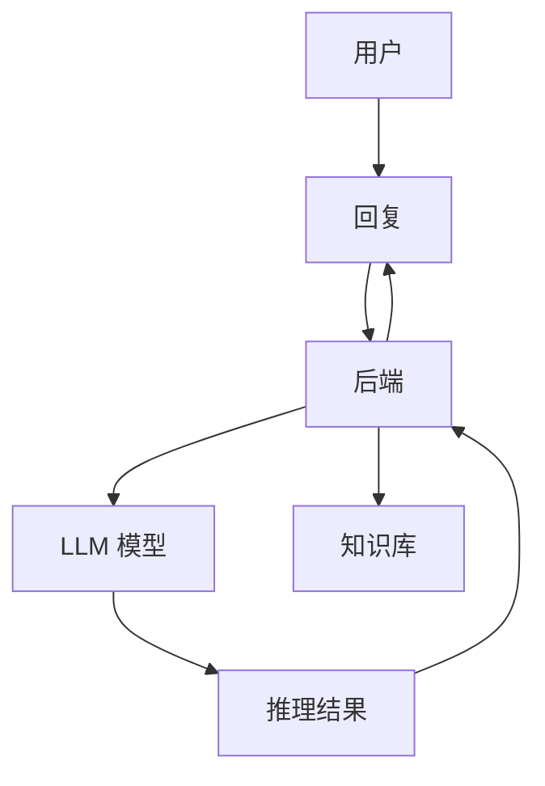

                 


# AI Agent 架构设计：基于 LLM 的智能助手系统构建

> 关键词：AI Agent, LLM, 智能助手, 大语言模型, 系统架构, 对话系统

> 摘要：本文详细探讨了基于大语言模型（LLM）的AI Agent架构设计，从核心概念、算法原理到系统实现，全面解析智能助手系统的构建过程。文章结合理论与实践，通过具体案例分析和代码实现，帮助读者深入理解AI Agent的设计与实现。

---

# 第1章: AI Agent 概述

## 1.1 AI Agent 的定义与核心概念

### 1.1.1 什么是 AI Agent
AI Agent（人工智能代理）是指能够感知环境、自主决策并执行任务的智能实体。它可以是一个软件程序，也可以是一个物理设备，通过与用户或环境交互来完成特定目标。

**AI Agent 的核心特征：**
1. **自主性**：能够在没有外部干预的情况下独立运行。
2. **反应性**：能够实时感知环境并做出反应。
3. **目标导向**：具有明确的目标，所有行为都围绕目标展开。
4. **学习能力**：通过数据和经验不断优化自身性能。

### 1.1.2 AI Agent 的分类与应用场景

| 分类标准      | 类型                          | 应用场景示例                     |
|---------------|-------------------------------|---------------------------------|
| 能力层次      | 基础型 Agent（基于规则）    | 简单任务自动化，如日历管理       |
|               | 智能型 Agent（基于模型）     | 复杂任务处理，如智能客服         |
|               | 超智能型 Agent（AGI）        | 普及型通用人工智能（未实现）     |
| 交互方式      | 基于文本的 Agent            | 智能助手（如 ChatGPT）           |
|               | 基于语音的 Agent            | 智能音箱（如 Amazon Echo）      |
|               | 多模态 Agent（文本+语音+视觉）| 智能机器人（如 Tesla Bot）       |

### 1.1.3 AI Agent 的目标与用户需求

AI Agent 的目标是通过智能化技术为用户提供高效、便捷的服务。用户需求主要集中在以下几个方面：
1. **高效性**：快速响应并解决问题。
2. **准确性**：提供可靠的信息或解决方案。
3. **易用性**：用户友好的交互界面。
4. **个性化**：根据用户习惯提供定制化服务。

---

## 1.2 大语言模型（LLM）的崛起

### 1.2.1 什么是大语言模型
大语言模型（LLM, Large Language Model）是指经过海量文本数据训练的深度学习模型，能够理解和生成人类语言。其核心是基于Transformer架构的序列模型。

### 1.2.2 LLM 的特点与优势

| 特性         | 描述                       |
|--------------|----------------------------|
| 大规模参数    | 拥有 billions 级别的参数量   |
| 预训练        | 基于通用数据集进行无监督训练 |
| 微调能力      | 可通过小样本数据快速适应新任务 |
| 多任务能力    | 单一模型可同时处理多种任务（如文本生成、问答、翻译） |

### 1.2.3 LLM 在 AI Agent 中的作用

LLM 为 AI Agent 提供了强大的自然语言处理能力，使其能够：
1. 理解用户的输入（如文本、语音）。
2. 生成自然的回复。
3. 处理复杂的上下文关系。

---

## 1.3 基于 LLM 的智能助手系统

### 1.3.1 智能助手系统的定义与目标
智能助手系统是一种基于 LLM 的 AI Agent，旨在通过自然语言交互帮助用户完成任务。其目标是提供高效、智能、个性化的服务。

### 1.3.2 智能助手系统的核心功能

| 功能模块         | 描述                       |
|------------------|----------------------------|
| 用户身份识别      | 基于用户特征进行身份验证   |
| 自然语言理解      | 解析用户意图               |
| 知识库查询        | 从知识库中获取相关信息     |
| 对话生成          | 根据上下文生成自然回复     |
| 任务执行          | 执行用户请求的任务（如设置提醒、查询信息） |

---

## 1.4 本章小结

本章介绍了 AI Agent 的基本概念、分类与应用场景，并重点探讨了大语言模型（LLM）在 AI Agent 中的核心作用。通过分析智能助手系统的定义与功能，读者可以理解 LLM 如何为 AI Agent 提供强大的语言处理能力。

---

# 第2章: 大语言模型（LLM）基础

## 2.1 LLM 的基本原理

### 2.1.1 Transformer 架构

**Transformer 的核心组件：**
1. **编码器**：将输入序列转换为高维向量。
2. **解码器**：根据编码器输出生成目标序列。

**Transformer 的优势：**
- 并行计算能力强。
- 能够处理长序列数据。

### 2.1.2 LLM 的训练过程

**训练流程：**
1. 数据预处理：清洗、分词、格式化。
2. 模型初始化：随机初始化参数。
3. 前向传播：输入数据，计算输出概率分布。
4. 损失计算：使用交叉熵损失函数。
5. 反向传播：更新模型参数。
6. 迭代优化：重复上述步骤直到收敛。

**训练目标函数：**
$$
\mathcal{L} = -\sum_{i=1}^{n} \log p(y_i|x_{<i})
$$

---

## 2.2 常见的 LLM 模型

### 2.2.1 GPT 系列模型

| 模型版本 | 参数量（亿） | 主要特点                     |
|----------|--------------|----------------------------|
| GPT-2    | 1.5B         | 支持多任务学习             |
| GPT-3    | 17B          | 提供更强大的生成能力         |
| GPT-4    | 128B         | 支持多模态输入和输出         |

### 2.2.2 BERT 系列模型

| 模型版本 | 参数量（亿） | 主要特点                     |
|----------|--------------|----------------------------|
| BERT     | 1.1B         | 基于Transformer的编码器架构   |
| BERT-Large| 3.3B         | 提高模型性能                 |

---

## 2.3 LLM 的优化与应用

### 2.3.1 模型压缩与优化

**模型压缩技术：**
- **剪枝**：移除冗余参数。
- **量化**：降低参数精度（如 FP16 → INT8）。
- **知识蒸馏**：将大模型的知识迁移到小模型。

### 2.3.2 LLM 的应用场景

| 应用领域      | 典型场景                     |
|---------------|------------------------------|
| 文本生成      | 内容创作、代码生成           |
| 问答系统      | 智能客服、知识问答           |
| 机器翻译      | 实时翻译、文档翻译           |
| 聊天机器人      | 智能助手、社交机器人         |

---

## 2.4 本章小结

本章深入介绍了 LLM 的基本原理、常见模型及其优化方法。通过理解 LLM 的训练过程和应用场景，读者可以更好地掌握其在 AI Agent 中的核心作用。

---

# 第3章: AI Agent 的智能模型设计

## 3.1 基于 LLM 的推理机制

### 3.1.1 基于上下文的推理

**上下文推理流程：**
1. 输入：用户问题。
2. 分析：结合历史对话上下文。
3. 推理：生成相关回答。

**示例：**
用户输入：今天天气怎么样？
历史记录：用户来自北京。

**推理过程：**
1. 分析用户位置：北京。
2. 查询实时天气数据。
3. 生成回答：北京今天天气晴朗，温度在 5℃ 至 15℃ 之间。

---

## 3.2 知识表示与知识库设计

### 3.2.1 知识库的构建

**知识库类型：**
1. **结构化知识库**：如数据库、知识图谱。
2. **非结构化知识库**：如文本文件、网页内容。

### 3.2.2 知识表示方法

**常用知识表示方法：**
1. **符号表示**：使用符号和规则表示知识。
2. **向量表示**：使用嵌入向量表示知识。

---

## 3.3 多模态交互设计

### 3.3.1 文本与语音交互

**语音交互的优势：**
- 更自然的用户体验。
- 适用于不方便输入文本的场景。

### 3.3.2 视觉与交互设计

**视觉交互示例：**
1. 图表展示：数据可视化。
2. 图像识别：识别图片内容。

---

## 3.4 本章小结

本章重点探讨了基于 LLM 的推理机制、知识表示与多模态交互设计。通过这些设计，AI Agent 能够更智能地处理复杂任务，提升用户体验。

---

# 第4章: 基于 LLM 的对话系统设计

## 4.1 对话生成机制

### 4.1.1 基于上下文的对话生成

**对话生成流程：**
1. 用户输入：查询或请求。
2. 解析意图：识别用户需求。
3. 生成回复：基于上下文生成回复。

### 4.1.2 对话状态管理

**对话状态表示方法：**
1. **显式状态表示**：记录当前对话的状态信息。
2. **隐式状态表示**：通过上下文推断状态。

---

## 4.2 对话系统的优化

### 4.2.1 对话策略优化

**对话策略：**
1. 基于规则的策略：简单任务优先。
2. 基于模型的策略：复杂任务使用强化学习优化。

### 4.2.2 对话系统的可解释性

**提升可解释性的方法：**
1. 提供中间步骤解释。
2. 使用可解释性模型。

---

## 4.3 本章小结

本章详细讲解了基于 LLM 的对话生成机制与优化方法，帮助读者理解如何设计高效的对话系统。

---

# 第5章: AI Agent 系统架构设计

## 5.1 系统功能模块划分

### 5.1.1 核心功能模块

| 功能模块         | 描述                       |
|------------------|----------------------------|
| 用户身份验证      | 验证用户身份               |
| 自然语言理解      | 解析用户输入               |
| 知识库查询        | 获取相关信息               |
| 对话生成          | 生成回复                   |
| 任务执行          | 执行用户请求的任务         |

---

## 5.2 系统架构设计

### 5.2.1 分层架构设计

**分层架构图：**



### 5.2.2 接口设计

| 接口名称       | 描述                     |
|----------------|--------------------------|
| POST /api/prompt | 提交用户输入             |
| GET /api/status | 获取对话状态             |
| PUT /api/task | 设置任务优先级           |

---

## 5.3 本章小结

本章通过分层架构和接口设计，详细讲解了 AI Agent 系统的实现方案，帮助读者理解系统的整体结构。

---

# 第6章: 项目实战：基于 LLM 的智能助手系统实现

## 6.1 环境搭建与工具安装

### 6.1.1 开发环境

| 工具名称       | 功能描述                     |
|----------------|-----------------------------|
| Python 3.8+    | 编程语言                     |
| Hugging Face   | 模型下载与使用               |
| PyTorch        | 深度学习框架                 |

### 6.1.2 安装依赖

```bash
pip install torch transformers
```

---

## 6.2 系统核心代码实现

### 6.2.1 LLM 模型加载

```python
from transformers import AutoTokenizer, AutoModelForCausalLM

model_name = "gpt2"
tokenizer = AutoTokenizer.from_pretrained(model_name)
model = AutoModelForCausalLM.from_pretrained(model_name)
```

### 6.2.2 对话生成函数

```python
def generate_response(prompt, model, tokenizer):
    inputs = tokenizer.encode(prompt, return_tensors="pt")
    outputs = model.generate(inputs, max_length=100, do_sample=True)
    response = tokenizer.decode(outputs[0], skip_special_tokens=True)
    return response
```

---

## 6.3 案例分析与实现

### 6.3.1 案例场景

**用户输入：** "今天北京天气怎么样？"

**系统实现：**
1. 解析用户意图：查询天气。
2. 获取天气数据。
3. 生成回复：北京今天晴朗，温度在 5℃ 至 15℃ 之间。

---

## 6.4 本章小结

通过本章的项目实战，读者可以掌握基于 LLM 的智能助手系统的核心实现步骤，包括环境搭建、模型加载和对话生成。

---

# 第7章: 最佳实践与未来展望

## 7.1 最佳实践 tips

1. **模型选择**：根据任务需求选择合适的 LLM 模型。
2. **数据处理**：确保数据质量，避免偏差。
3. **性能优化**：通过模型压缩和优化提升性能。

## 7.2 未来展望

随着 AI 技术的不断发展，AI Agent 的能力将更加智能化和个性化。未来的研究方向包括：
1. 多模态交互的优化。
2. 智能决策系统的提升。
3. 更强的可解释性。

---

# 作者信息

作者：AI天才研究院/AI Genius Institute & 禅与计算机程序设计艺术 /Zen And The Art of Computer Programming

