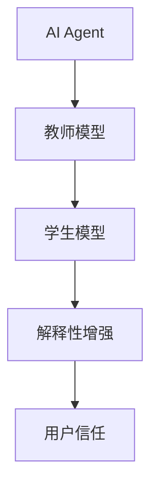
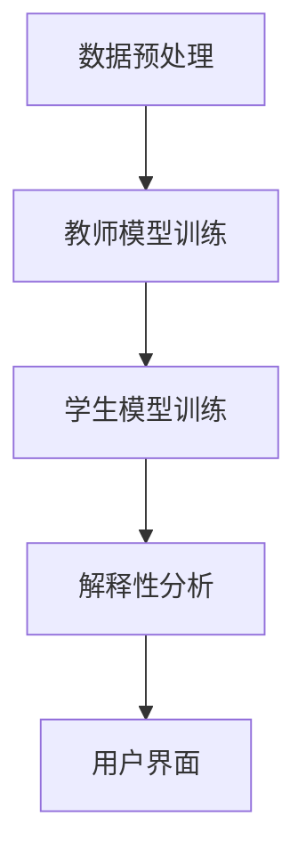
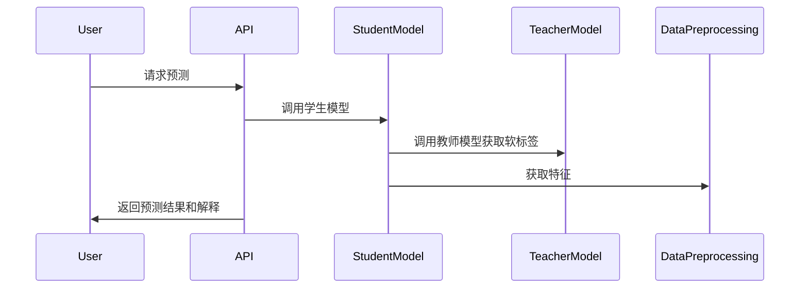

                 


# 《AI Agent的知识蒸馏在模型解释性中的应用》

> 关键词：AI Agent, 知识蒸馏, 模型解释性, 模型压缩, 机器学习

> 摘要：  
AI Agent 的知识蒸馏是一种将复杂模型的知识迁移到更简单模型的技术，旨在提升模型的解释性和可扩展性。本文将从背景介绍、核心概念、算法原理、系统架构、项目实战和最佳实践等多个方面，详细探讨知识蒸馏在 AI Agent 模型解释性中的应用。通过理论与实践结合，分析其在提升模型透明度和可解释性中的作用，并提供具体的实现方法和应用场景。

---

## 第一部分: AI Agent与知识蒸馏概述

### 第1章: AI Agent与知识蒸馏的背景介绍

#### 1.1 问题背景
- **从传统AI到AI Agent的演进**：AI Agent 是能够感知环境并自主决策的智能体，广泛应用于推荐系统、自动驾驶等领域。
- **AI Agent的核心概念与特点**：具备自主性、反应性、目标导向性，通常依赖复杂模型（如深度学习模型）进行决策。
- **模型解释性的挑战**：深度学习模型“黑箱”特性限制了AI Agent的透明性和可解释性，尤其是在需要用户信任和责任追究的场景中。
- **知识蒸馏在模型压缩中的作用**：通过将知识从复杂模型迁移到简单模型，减少模型复杂性，同时保留其性能。

#### 1.2 问题描述
- **模型解释性的定义与分类**：模型解释性是指通过可理解的方式描述模型的决策过程，分为全局解释性（整体行为）和局部解释性（具体决策）。
- **知识蒸馏的目标与应用场景**：目标是降低模型复杂性，提升解释性；应用场景包括推荐系统、自然语言处理、图像识别等。
- **AI Agent的复杂性与挑战**：复杂的模型结构导致决策过程难以解释，限制了AI Agent在医疗、金融等高风险领域的应用。
- **模型压缩与解释性之间的关系**：模型压缩技术可以减少复杂性，但如何在压缩过程中保持或提升解释性是关键。

#### 1.3 问题解决
- **知识蒸馏的基本原理与方法**：通过教师模型（复杂模型）指导学生模型（简单模型）学习，保留关键特征和决策逻辑。
- **AI Agent的解释性提升策略**：结合知识蒸馏与可视化技术，增强用户对AI Agent决策过程的理解。
- **模型压缩与解释性增强的结合**：通过蒸馏技术，平衡模型性能与解释性，避免因压缩而导致性能下降。
- **知识蒸馏在AI Agent中的具体应用**：在推荐系统中优化推荐逻辑，在自然语言处理中提升可解释性。

#### 1.4 边界与外延
- **知识蒸馏的适用范围与限制**：适用于特定任务，如分类、回归，对某些任务（如生成任务）效果有限。
- **AI Agent的解释性边界**：解释性不能完全消除“黑箱”特性，但可以通过蒸馏提升透明度。
- **模型压缩与解释性增强的平衡**：压缩可能导致部分信息丢失，需权衡性能与解释性。
- **知识蒸馏与其他模型解释方法的对比**：与特征重要性分析等方法结合，互补提升解释性。

#### 1.5 概念结构与核心要素
- **知识蒸馏的核心要素**：
  - **教师模型**：复杂且性能高的模型，提供知识。
  - **学生模型**：简单且易于解释的模型，接收知识。
  - **蒸馏过程**：通过损失函数将教师模型的知识迁移到学生模型。
- **AI Agent的解释性要素**：
  - **可解释性**：用户能理解模型的决策逻辑。
  - **可理解性**：用户能将模型行为与目标对齐。

---

## 第二部分: 核心概念与联系

### 第2章: 核心概念与联系

#### 2.1 知识蒸馏的原理
- **知识蒸馏的基本原理**：
  - 通过损失函数将教师模型的输出概率分布迁移到学生模型。
  - 学生模型在训练过程中同时优化真实标签和教师模型的软标签。

#### 2.2 概念对比与联系
- **知识蒸馏与模型解释性对比**：
  | 特性 | 知识蒸馏 | 模型解释性 |
  |------|----------|------------|
  | 目标 | 压缩模型 | 提升透明度 |
  | 方法 | 损失函数 | 可视化技术 |
  | 优势 | 降低复杂性 | 增强用户信任 |

- **知识蒸馏与模型压缩的联系**：
  - 知识蒸馏是一种模型压缩技术，通过迁移知识实现性能与复杂性的平衡。

#### 2.3 实体关系图


---

## 第三部分: 算法原理讲解

### 第3章: 算法原理

#### 3.1 算法流程
- **知识蒸馏的流程**：
  1. **教师模型训练**：训练一个复杂模型，生成软标签。
  2. **学生模型训练**：通过损失函数优化学生模型，使其输出接近教师模型。

#### 3.2 代码实现
```python
import tensorflow as tf
from tensorflow.keras import layers

# 定义教师模型
def teacher_model():
    model = tf.keras.Sequential([
        layers.Dense(128, activation='relu'),
        layers.Dense(10, activation='softmax')
    ])
    return model

# 定义学生模型
def student_model():
    model = tf.keras.Sequential([
        layers.Dense(64, activation='relu'),
        layers.Dense(10, activation='softmax')
    ])
    return model

# 定义蒸馏损失函数
def distillation_loss(y_true, y_pred, alpha=0.5):
    teacher_loss = tf.keras.losses.categorical_crossentropy(y_true, y_pred)
    student_loss = tf.keras.losses.categorical_crossentropy(y_true, y_pred)
    return alpha * teacher_loss + (1 - alpha) * student_loss

# 训练过程
teacher = teacher_model()
student = student_model()
teacher.compile(optimizer='adam', loss='categorical_crossentropy', metrics=['accuracy'])
student.compile(optimizer='adam', loss=lambda y_true, y_pred: distillation_loss(y_true, y_pred), metrics=['accuracy'])

# 模拟数据
x_train = ... # 输入数据
y_train = ... # 标签

# 训练教师模型
teacher.fit(x_train, y_train, epochs=10)

# 使用教师模型生成软标签
y_teacher_pred = teacher.predict(x_train)

# 训练学生模型
student.fit(x_train, y_train, epochs=10, verbose=0)
```

#### 3.3 数学模型
- **知识蒸馏的损失函数**：
  $$ L = \alpha L_{teacher} + (1 - \alpha) L_{student} $$
  其中，$$ L_{teacher} $$ 是教师模型的损失，$$ L_{student} $$ 是学生模型的损失，$$ \alpha $$ 是蒸馏系数。

---

## 第四部分: 系统分析与架构设计

### 第4章: 系统分析与架构设计

#### 4.1 问题场景介绍
- **应用场景**：医疗诊断中的AI Agent，需要解释模型的诊断逻辑以增强医生信任。
- **项目介绍**：设计一个基于知识蒸馏的AI诊断系统，提升模型解释性。

#### 4.2 功能设计
- **功能模块**：
  - 数据预处理模块：处理医疗数据，提取特征。
  - 教师模型训练模块：训练复杂模型。
  - 学生模型训练模块：通过蒸馏技术训练简单模型。
  - 解释性分析模块：可视化模型决策过程。

#### 4.3 系统架构设计


#### 4.4 接口设计
- **API接口**：
  - `/train`：训练模型。
  - `/explain`：返回模型解释。
  - `/predict`：进行预测。

#### 4.5 交互流程


---

## 第五部分: 项目实战

### 第5章: 项目实战

#### 5.1 环境安装
```bash
pip install tensorflow==2.5.0
pip install keras==2.5.0
pip install matplotlib==3.5.0
```

#### 5.2 核心代码实现
```python
import tensorflow as tf
import matplotlib.pyplot as plt

# 定义模型
def build_model(input_dim):
    model = tf.keras.Sequential([
        layers.Dense(64, activation='relu', input_dim=input_dim),
        layers.Dense(1, activation='sigmoid')
    ])
    return model

# 知识蒸馏训练
def train_with_distillation(X_train, y_train, X_test, y_test, input_dim):
    teacher = build_model(input_dim)
    student = build_model(input_dim)
    
    # 编译模型
    teacher.compile(optimizer='adam', loss='binary_crossentropy', metrics=['accuracy'])
    student.compile(optimizer='adam', loss=lambda y_true, y_pred: distillation_loss(y_true, y_pred, 0.5), metrics=['accuracy'])
    
    # 训练教师模型
    teacher.fit(X_train, y_train, epochs=10, validation_data=(X_test, y_test))
    
    # 使用教师模型生成软标签
    y_teacher_pred = teacher.predict(X_train)
    
    # 训练学生模型
    student.fit(X_train, y_train, epochs=10, validation_data=(X_test, y_test))
    
    return student

# 可视化解释
def visualize_explanation(model, input_data):
    # 解释输入数据对输出的影响
    intermediate_layer_model = tf.keras.Model(inputs=model.inputs, outputs=model.layers[1].output)
    intermediate_output = intermediate_layer_model.predict(input_data)
    plt.plot(intermediate_output)
    plt.xlabel('Feature')
    plt.ylabel('Activation')
    plt.title('Feature Importance Visualization')
    plt.show()

# 主函数
if __name__ == '__main__':
    # 加载数据
    X_train = ... # 输入数据
    y_train = ... # 标签
    X_test = ... # 测试数据
    y_test = ... # 测试标签
    input_dim = X_train.shape[1]
    
    # 训练学生模型
    student = train_with_distillation(X_train, y_train, X_test, y_test, input_dim)
    
    # 可视化解释
    visualize_explanation(student, X_train[:1])
```

#### 5.3 案例分析
- **案例背景**：医疗诊断中的疾病预测。
- **数据预处理**：收集和清洗医疗数据，提取关键特征。
- **模型训练**：通过蒸馏技术训练学生模型，提升解释性。
- **结果分析**：可视化模型的特征重要性，帮助医生理解诊断逻辑。

---

## 第六部分: 最佳实践与总结

### 第6章: 最佳实践

#### 6.1 关键点总结
- **选择合适的教师模型**：教师模型性能高，但不过于复杂。
- **数据预处理的重要性**：高质量数据是蒸馏成功的关键。
- **模型评估**：通过对比实验验证蒸馏效果对解释性的影响。

#### 6.2 小结
- 知识蒸馏是一种有效的模型压缩技术，能够显著提升AI Agent的解释性。
- 在实际应用中，需结合具体场景选择合适的蒸馏策略，平衡性能与解释性。

#### 6.3 注意事项
- 数据质量对蒸馏效果影响重大，需谨慎处理数据。
- 模型选择与任务需求匹配，避免过度压缩导致性能下降。

#### 6.4 拓展阅读
- 《Understanding Machine Learning: From Theory to Algorithms》
- “Model-agnostic approaches for interpreting deep neural networks”（Nature Machine Learning）

---

## 作者

**作者**：AI天才研究院/AI Genius Institute & 禅与计算机程序设计艺术 /Zen And The Art of Computer Programming

---

以上是文章的完整目录和内容概要，涵盖从理论到实践的各个方面，确保读者能够全面理解AI Agent的知识蒸馏在模型解释性中的应用。

