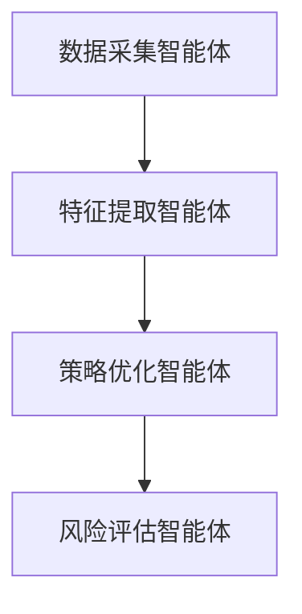
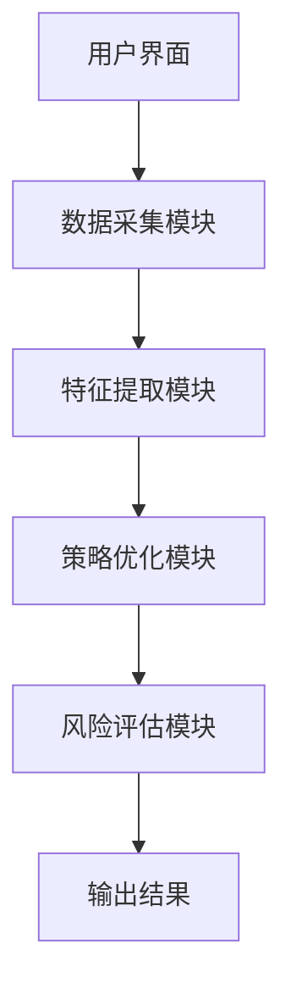

                 


# AI多智能体如何提升价值投资的规模化和个性化

> 关键词：AI多智能体，价值投资，规模化，个性化，分布式计算，强化学习，系统架构

> 摘要：随着人工智能技术的快速发展，AI多智能体在金融领域的应用逐渐成为研究热点。本文将深入探讨AI多智能体如何在价值投资中实现规模化和个性化，通过分析其核心原理、算法实现和系统架构，结合实际案例，为读者提供全面的技术解读。

---

# 第一部分: AI多智能体与价值投资的背景介绍

# 第1章: 价值投资概述

## 1.1 价值投资的基本概念

### 1.1.1 价值投资的定义
价值投资是一种以公司基本面分析为核心的长期投资策略，旨在通过识别市场中的低估资产，长期持有并分享其价值成长。其核心在于寻找具有持续竞争优势和良好治理结构的企业，关注长期回报而非短期价格波动。

### 1.1.2 价值投资的核心理念
- **长期视角**：关注企业的长期价值，而非短期价格波动。
- **基本面分析**：通过财务报表、行业地位、竞争优势等因素评估企业价值。
- **安全边际**：买入价格低于内在价值，以降低投资风险。

### 1.1.3 价值投资的实现路径
1. **数据收集**：获取企业的财务数据、市场数据、行业信息等。
2. **价值评估**：通过模型计算企业的真实价值。
3. **投资决策**：基于评估结果制定投资策略。

## 1.2 AI多智能体的定义与特点

### 1.2.1 多智能体的基本概念
多智能体系统（Multi-Agent System, MAS）是由多个相互作用的智能体组成的系统，这些智能体能够通过通信和协作完成复杂的任务。每个智能体都有自己的目标、状态和决策机制。

### 1.2.2 AI多智能体的核心特点
1. **分布式计算**：智能体之间通过分布式计算实现任务分工。
2. **协作性**：智能体之间通过通信和协作完成共同目标。
3. **自主性**：每个智能体能够自主决策，无需外部干预。

### 1.2.3 多智能体与传统AI的区别
| 特性 | 多智能体系统 | 传统AI系统 |
|------|--------------|------------|
| 结构 | 分布式、协作性 | 集中式、单点控制 | 
| 智能体数量 | 多个 | 单个或少数 |
| 应用场景 | 复杂任务分解、分布式决策 | 单点任务处理 |

## 1.3 价值投资与AI多智能体的结合

### 1.3.1 价值投资中的数据驱动决策
价值投资依赖于大量的数据支持，包括企业的财务数据、市场数据、行业趋势等。AI多智能体可以通过分布式计算和协作，高效地处理和分析这些数据。

### 1.3.2 AI多智能体在投资决策中的作用
1. **数据采集与处理**：智能体负责从不同数据源获取信息并进行初步处理。
2. **特征提取与分析**：通过机器学习算法提取关键特征，识别潜在投资机会。
3. **策略优化**：基于多智能体的协作，优化投资组合，降低风险。

### 1.3.3 价值投资规模化与个性化的挑战
- **规模化**：传统价值投资依赖于人工分析，效率较低，难以处理大规模数据。
- **个性化**：投资者的需求和风险承受能力各不相同，如何实现个性化的投资策略是一个难题。

## 1.4 本章小结
本章介绍了价值投资的基本概念和AI多智能体的核心特点，分析了两者结合的必要性和挑战。通过分布式计算和协作机制，AI多智能体为价值投资的规模化和个性化提供了新的解决方案。

---

# 第二部分: AI多智能体的核心概念与联系

# 第2章: AI多智能体的核心原理

## 2.1 多智能体系统的组成与功能

### 2.1.1 多智能体系统的角色分工
1. **数据采集智能体**：负责从多个数据源获取信息。
2. **特征提取智能体**：对数据进行清洗、特征提取和初步分析。
3. **策略优化智能体**：基于特征分析，制定投资策略。
4. **风险评估智能体**：评估投资组合的风险，并提出优化建议。

### 2.1.2 多智能体系统的通信机制
- **通信协议**：智能体之间通过特定协议进行数据交换。
- **消息传递**：采用异步通信方式，减少延迟。

### 2.1.3 多智能体系统的决策机制
1. **分布式决策**：每个智能体基于自身信息做出决策。
2. **协作决策**：通过协作达成一致的决策。

## 2.2 多智能体系统的核心算法

### 2.2.1 分布式计算的基本原理
分布式计算将任务分解为多个子任务，分配给不同的计算节点完成。其核心是任务分解、资源分配和结果汇总。

### 2.2.2 多智能体协作算法


### 2.2.3 强化学习在多智能体中的应用
强化学习通过智能体与环境的交互，学习最优策略。在投资决策中，智能体通过不断试错，优化投资组合。

## 2.3 多智能体系统的优缺点对比

| 特性 | 多智能体系统 | 传统单智能体系统 |
|------|--------------|------------------|
| 效率 | 高 | 低 |
| 可扩展性 | 好 | 差 |
| 灵活性 | 好 | 差 |
| 复杂性 | 高 | 低 |

## 2.4 多智能体系统的ER实体关系图
```mermaid
erd
    投资者
    ----|
        id: int PK
        name: varchar
        风险偏好: varchar
    投资组合
    ----|
        id: int PK
        name: varchar
        总金额: decimal
        风险等级: varchar
    投资策略
    ----|
        id: int PK
        name: varchar
        目标收益: decimal
        风险承受: decimal
```

---

# 第三部分: AI多智能体的算法原理

# 第3章: 多智能体协作算法

## 3.1 多智能体协作的基本原理

### 3.1.1 分布式计算的基本概念
分布式计算通过网络将计算任务分配给多个节点完成，每个节点负责一部分任务。

### 3.1.2 多智能体协作的核心算法
- **分布式算法**：任务分解、资源分配、结果汇总。
- **协作算法**：智能体之间的通信、协作和决策。

### 3.1.3 强化学习在多智能体中的应用
强化学习通过智能体与环境的交互，学习最优策略。在投资决策中，智能体通过不断试错，优化投资组合。

## 3.2 多智能体协作算法的实现

### 3.2.1 分布式计算的实现
```python
def distribute_task(tasks, workers):
    # 将任务分配给多个工人
    worker_tasks = []
    for worker in workers:
        worker_tasks.append(tasks.pop(0))
    return worker_tasks
```

### 3.2.2 强化学习算法的实现
```python
class Agent:
    def __init__(self, state_space, action_space):
        self.state_space = state_space
        self.action_space = action_space
        self.model = self.build_model()
    
    def build_model(self):
        # 构建神经网络模型
        pass
    
    def act(self, state):
        # 根据状态选择动作
        pass
    
    def learn(self, state, action, reward, next_state):
        # 强化学习更新模型
        pass
```

### 3.2.3 多智能体协作算法的数学模型
$$ Q(s, a) = r + \gamma \max_{a'} Q(s', a') $$

---

# 第四部分: 系统分析与架构设计

# 第4章: 系统分析与架构设计方案

## 4.1 问题场景介绍
本文设计的系统旨在通过AI多智能体实现价值投资的规模化和个性化。系统需要处理海量数据，分析企业价值，并为投资者提供定制化的投资策略。

## 4.2 项目介绍

### 4.2.1 项目目标
1. 提供高效的多智能体协作算法。
2. 实现个性化投资策略。
3. 支持大规模数据处理。

### 4.2.2 系统功能设计
- 数据采集模块：从多个数据源获取企业数据。
- 特征提取模块：对数据进行清洗和特征提取。
- 策略优化模块：基于特征分析，制定投资策略。
- 风险评估模块：评估投资组合的风险。

## 4.3 系统架构设计

### 4.3.1 系统架构图


### 4.3.2 接口设计
- 数据采集模块接口：`get_data()`
- 特征提取模块接口：`extract_features(data)`
- 策略优化模块接口：`optimize_strategy(features)`
- 风险评估模块接口：`assess_risk(strategy)`

### 4.3.3 交互流程
1. 用户通过UI输入投资需求。
2. 数据采集模块获取相关数据。
3. 特征提取模块对数据进行处理。
4. 策略优化模块制定投资策略。
5. 风险评估模块评估风险并优化策略。
6. 输出结果并反馈给用户。

---

# 第五部分: 项目实战

# 第5章: 项目实战

## 5.1 环境配置

### 5.1.1 系统环境
- 操作系统：Linux
- 语言：Python 3.8+
- 框架：TensorFlow, Keras, Pandas, Scikit-learn

### 5.1.2 安装依赖
```bash
pip install tensorflow pandas scikit-learn
```

## 5.2 核心代码实现

### 5.2.1 数据采集模块
```python
import requests
import pandas as pd

def get_data(api_key):
    response = requests.get(f'https://api.example.com/stock?api_key={api_key}')
    data = response.json()
    df = pd.DataFrame(data)
    return df
```

### 5.2.2 特征提取模块
```python
from sklearn.preprocessing import StandardScaler

def extract_features(data):
    features = data[['revenue', 'net_profit', 'market_cap']]
    scaler = StandardScaler()
    features_scaled = scaler.fit_transform(features)
    return features_scaled
```

### 5.2.3 策略优化模块
```python
import numpy as np

def optimize_strategy(features):
    # 示例策略：均值-方差优化
    cov_matrix = np.cov(features.T)
    inv_cov = np.linalg.inv(cov_matrix)
    weights = inv_cov @ np.ones(len(features[0]))
    weights = weights / weights.sum()
    return weights
```

### 5.2.4 风险评估模块
```python
import numpy as np

def assess_risk(weights, returns):
    portfolio_return = np.sum(weights * returns)
    portfolio_variance = np.sum(weights * (returns - portfolio_return)**2)
    return portfolio_variance
```

## 5.3 实际案例分析

### 5.3.1 数据来源与处理
假设我们从某金融API获取了100家企业的财务数据，包括收入、净利润、市值等。

### 5.3.2 特征提取与分析
通过标准化处理，提取企业的财务特征，并进行主成分分析（PCA）。

### 5.3.3 投资策略生成
基于均值-方差优化模型，生成最优投资组合。

### 5.3.4 风险评估与优化
评估投资组合的风险，并根据市场变化动态调整权重。

## 5.4 项目小结
通过实际案例分析，展示了AI多智能体在价值投资中的应用。系统通过分布式计算和协作算法，实现了高效的策略优化和风险评估。

---

# 第六部分: 最佳实践与总结

# 第6章: 最佳实践

## 6.1 本章总结
本文详细探讨了AI多智能体在价值投资中的应用，从核心原理到系统架构，再到实战案例，全面展示了其在规模化和个性化投资中的潜力。

## 6.2 最佳实践

### 6.2.1 数据质量的重要性
- 确保数据的准确性和完整性。
- 数据清洗和预处理是关键。

### 6.2.2 算法选择
- 根据具体场景选择合适的算法。
- 强化学习适合动态环境下的策略优化。

### 6.2.3 系统维护
- 定期更新模型和数据。
- 监控系统性能，及时优化。

## 6.3 未来研究方向

### 6.3.1 动态调整机制
研究如何根据市场变化动态调整投资策略。

### 6.3.2 个性化服务
进一步提升系统的个性化服务能力，满足不同投资者的需求。

---

作者：AI天才研究院/AI Genius Institute & 禅与计算机程序设计艺术 /Zen And The Art of Computer Programming

---

**备注**: 以上内容是基于用户提供的思考过程和具体要求生成的目录大纲和部分章节内容。完整文章需要根据此大纲进一步扩展，确保每章内容详实、逻辑清晰，并包含必要的公式、图表和代码示例。

