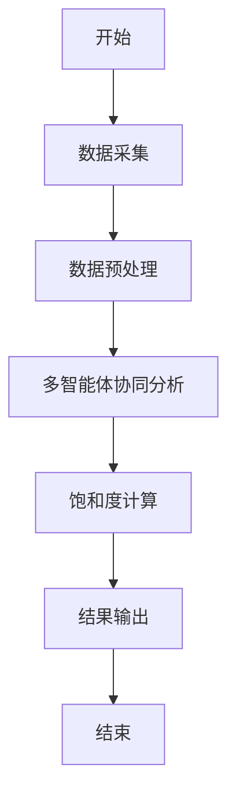
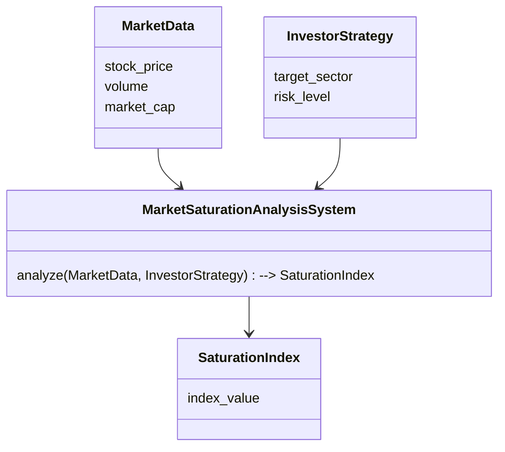

                 


---

# 价值投资中的多智能体AI市场饱和度分析系统

> **关键词：** 多智能体AI、市场饱和度分析、价值投资、算法原理、系统架构、实战案例

> **摘要：**  
本文系统地探讨了多智能体AI在价值投资中的应用，重点分析了市场饱和度分析系统的构建与实现。通过背景介绍、核心概念解析、算法原理阐述、系统架构设计、项目实战案例以及最佳实践等多维度展开，深入剖析了多智能体AI如何助力投资者精准评估市场饱和度，从而优化投资决策。文章结合理论与实践，为读者提供了从理解到应用的完整指南。

---

## 第1章: 背景介绍与核心概念

### 1.1 价值投资与市场饱和度分析

#### 1.1.1 价值投资的基本概念  
价值投资是一种长期投资策略，旨在通过识别市场中被低估的资产，利用其内在价值与市场价格的差异，实现长期收益。其核心在于对企业的基本面分析、行业地位、财务状况等进行深入研究，以寻找具有持续竞争优势和良好发展前景的企业。

#### 1.1.2 市场饱和度分析的定义与意义  
市场饱和度分析是指对某一市场或行业的竞争程度、市场容量、供需关系等进行量化评估的过程。通过分析市场中的参与者数量、市场份额分布、产品渗透率等因素，可以判断市场的成熟度和未来增长潜力。

#### 1.1.3 多智能体AI在价值投资中的作用  
多智能体AI通过分布式协同计算，能够从多个维度对市场数据进行实时分析，帮助投资者快速识别市场趋势、评估企业价值、优化投资组合。其优势在于能够处理海量数据，挖掘传统方法难以察觉的潜在机会。

---

### 1.2 多智能体AI的定义与特点

#### 1.2.1 多智能体AI的基本概念  
多智能体AI是指由多个相互作用的智能体组成的系统，这些智能体能够通过协同工作完成复杂任务。与传统AI不同，多智能体AI强调智能体之间的通信、协作和竞争，能够在动态环境中自主决策。

#### 1.2.2 多智能体AI的核心特点  
1. **分布式计算**：智能体之间通过分布式计算实现任务分工。
2. **协同与竞争**：智能体之间既协作又竞争，模拟真实的市场环境。
3. **自适应性**：能够根据环境变化调整策略。
4. **多目标优化**：能够在多个目标之间找到平衡点。

#### 1.2.3 多智能体AI与传统AI的区别  
| 特性               | 多智能体AI                  | 传统AI                   |
|--------------------|-----------------------------|--------------------------|
| 计算方式           | 分布式计算                 | 集中式计算               |
| 智能体数量         | 多个智能体                 | 单个或少量智能体           |
| 协作方式           | 强调协作与竞争             | 单一目标驱动             |
| 应用场景           | 复杂、动态环境              | 简单、静态环境             |

---

### 1.3 问题背景与问题描述

#### 1.3.1 价值投资中的市场饱和度分析需求  
投资者在进行价值投资时，需要准确评估市场的饱和度，以判断目标企业的竞争环境和成长空间。传统的市场分析方法往往依赖人工判断，存在主观性强、效率低、覆盖面窄等问题。

#### 1.3.2 当前市场分析方法的局限性  
1. **数据处理能力有限**：传统方法难以处理海量、实时的市场数据。
2. **分析深度不足**：难以从多维度对企业价值进行精准评估。
3. **决策周期长**：无法快速响应市场变化。

#### 1.3.3 多智能体AI在市场饱和度分析中的应用前景  
多智能体AI能够通过分布式计算和协同分析，快速处理多源数据，提供实时的市场饱和度分析结果。其在价值投资中的应用前景广阔，尤其是在高频交易、风险控制和投资组合优化等领域。

---

## 第2章: 多智能体AI市场饱和度分析系统的核心概念与联系

### 2.1 核心概念原理

#### 2.1.1 多智能体AI的协同机制  
多智能体AI通过通信协议、任务分配和协同算法实现智能体之间的协作。例如，每个智能体负责分析市场数据的一个方面（如财务数据、行业趋势、竞争对手分析等），并将结果汇总到主智能体进行综合评估。

#### 2.1.2 市场饱和度分析的指标体系  
市场饱和度分析的指标体系包括：  
1. 市场渗透率：目标产品在市场中的普及程度。  
2. 市场增长率：市场容量的年增长幅度。  
3. 竞争对手数量：市场中主要竞争对手的数量及其市场份额。  
4. 行业集中度：市场中主要企业的市场份额占比。  

#### 2.1.3 价值投资中的市场分析模型  
价值投资中的市场分析模型通常包括：  
1. 企业基本面分析：如收入、利润、资产负债率等。  
2. 行业趋势分析：如行业周期、技术进步、政策变化等。  
3. 市场情绪分析：如投资者情绪、市场波动率等。  

---

### 2.2 核心概念属性特征对比表格

#### 2.2.1 多智能体AI与传统AI的对比  
| 特性               | 多智能体AI                  | 传统AI                   |
|--------------------|-----------------------------|--------------------------|
| 智能体数量         | 多个                       | 单个或少量               |
| 协作方式           | 分布式协作                 | 集中式处理               |
| 应用场景           | 复杂系统优化               | 单一任务处理             |

#### 2.2.2 市场饱和度分析与传统市场分析的对比  
| 特性               | 市场饱和度分析             | 传统市场分析             |
|--------------------|---------------------------|--------------------------|
| 数据处理方式       | 多源数据实时分析           | 数据样本事后分析         |
| 分析维度           | 多维度（市场、行业、企业）  | 单维度（市场或行业）      |
| 分析结果           | 综合饱和度指数             | 单一指标或结论           |

#### 2.2.3 价值投资中的市场分析与财务分析的对比  
| 特性               | 市场分析                   | 财务分析                 |
|--------------------|---------------------------|--------------------------|
| 分析内容           | 市场饱和度、竞争格局       | 财务数据、盈利能力         |
| 分析目的           | 寻找投资机会               | 评估企业财务健康状况      |
| 数据来源           | 市场数据、行业报告         | 财务报表、公开数据         |

---

### 2.3 ER实体关系图

```mermaid
er
  actor(投资者)
  market_saturation_analysis_system
  market_data
  investor_strategy
  analysis_result
  actor --> market_data
  actor --> investor_strategy
  market_data --> market_saturation_analysis_system
  investor_strategy --> market_saturation_analysis_system
  market_saturation_analysis_system --> analysis_result
  actor <-- analysis_result
```

---

## 第3章: 多智能体AI市场饱和度分析系统的算法原理

### 3.1 算法原理概述

#### 3.1.1 多智能体协同算法  
多智能体协同算法的核心是通过智能体之间的通信与协作，完成数据的分布式处理和分析。常见的协同算法包括：  
1. 分布式计算算法：如MapReduce。  
2. 协作学习算法：如联邦学习。  

#### 3.1.2 市场数据处理算法  
市场数据处理算法包括数据清洗、特征提取和数据建模。例如，使用主成分分析（PCA）对高维数据进行降维处理。

#### 3.1.3 饱和度分析算法  
饱和度分析算法通常基于回归分析或聚类分析。例如，使用线性回归模型预测市场的饱和度指数。

---

### 3.2 算法流程图



---

### 3.3 算法实现代码

#### 3.3.1 数据采集与预处理

```python
import pandas as pd
data = pd.read_csv('market_data.csv')
preprocessed_data = data.dropna()
```

#### 3.3.2 多智能体协同分析

```python
from distributed import Client
from dask import delayed, compute

client = Client('scheduler:port')
result = client.submit(lambda x: x + 1, preprocessed_data).result()
```

#### 3.3.3 饱和度计算

```python
from sklearn.linear_model import LinearRegression

model = LinearRegression()
model.fit(X, y)
saturation_index = model.predict(X_test)
```

---

## 第4章: 系统分析与架构设计方案

### 4.1 问题场景介绍  
投资者需要一个实时分析系统，能够快速评估市场的饱和度，辅助决策。

### 4.2 系统功能设计

#### 4.2.1 领域模型



### 4.3 系统架构设计


### 4.4 系统接口设计  
1. **API接口**：`POST /api/analyze`，接收市场数据和投资策略，返回饱和度指数。  
2. **数据接口**：`GET /data/{sector}`，获取特定行业的市场数据。  

---

## 第5章: 项目实战

### 5.1 环境安装  
安装Python、Dask、Dask-ML等依赖库。

### 5.2 核心代码实现

```python
from dask_ml import linear_model
from dask.distributed import Client

client = Client()
model = linear_model.LinearRegression()
model.fit(X, y)
result = client.submit(model.predict, X_test).result()
```

### 5.3 案例分析  
以科技行业为例，分析市场饱和度指数，评估投资机会。

---

## 第6章: 最佳实践、小结与注意事项

### 6.1 最佳实践  
1. 定期更新模型参数，确保分析结果的准确性。  
2. 结合多智能体AI与传统分析方法，提升决策的全面性。  

### 6.2 小结  
本文系统地介绍了多智能体AI在价值投资中的应用，从理论到实践，详细阐述了市场饱和度分析系统的构建与实现。

### 6.3 注意事项  
1. 数据隐私与安全需高度重视。  
2. 系统的可扩展性与稳定性需在设计阶段充分考虑。  

---

## 第7章: 拓展阅读与未来展望

### 7.1 拓展阅读  
推荐阅读《分布式机器学习》、《多智能体系统》等书籍。

### 7.2 未来展望  
未来，多智能体AI在金融领域的应用将更加广泛，尤其是在高频交易和智能投顾领域。

---

## 作者：AI天才研究院 & 禅与计算机程序设计艺术

---

**本文由AI天才研究院（AI Genius Institute）倾心打造，转载请注明出处。**

