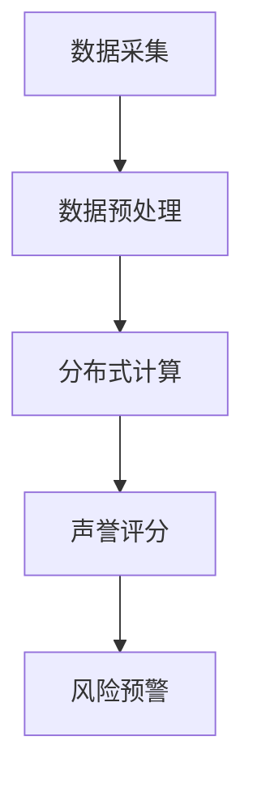
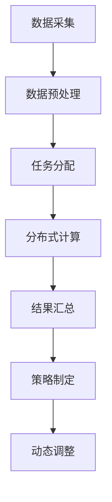
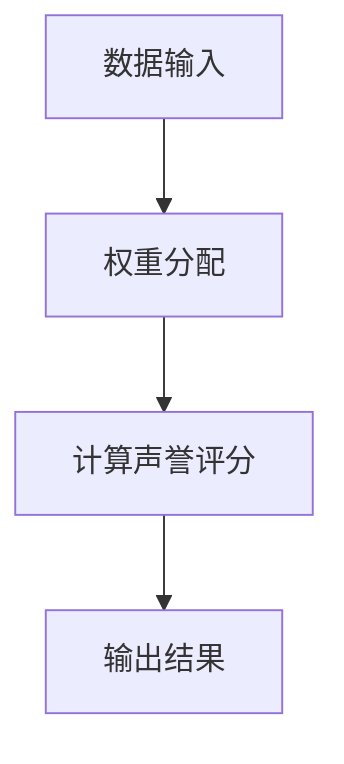
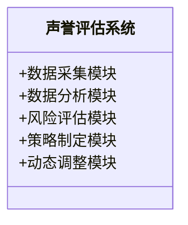
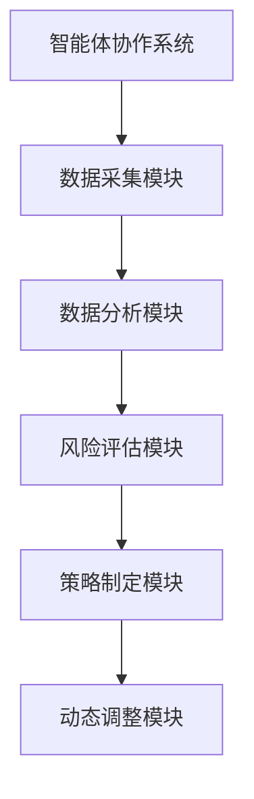
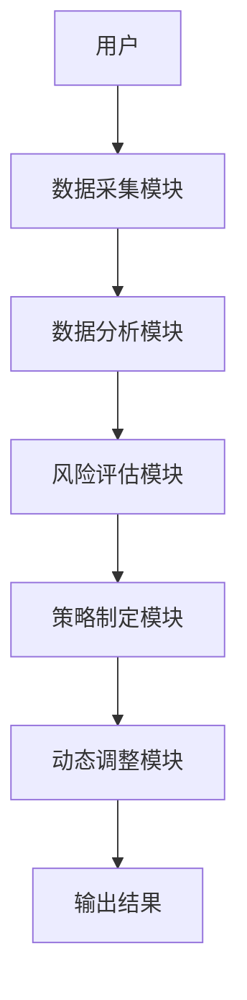

                 


# 利用智能体协作进行全面的公司声誉恢复能力评估

> 关键词：智能体协作，公司声誉，恢复能力评估，分布式计算，声誉管理

> 摘要：在现代商业环境中，公司声誉是企业生存和发展的关键因素之一。然而，随着市场竞争的加剧和信息传播的加速，声誉管理的复杂性和挑战日益增加。本文提出了一种基于智能体协作的声誉恢复能力评估方法，通过智能体的分布式计算和协作机制，实现对声誉风险的实时监控和有效应对。文章详细探讨了智能体协作的核心原理、声誉评估的数学模型、系统架构设计以及实际应用场景，为企业的声誉管理提供了创新的解决方案。

---

# 第1章: 公司声誉恢复能力评估的背景与挑战

## 1.1 问题背景

### 1.1.1 现代企业的声誉管理的重要性

在当今全球化和数字化的商业环境中，企业的声誉是其核心资产之一。良好的声誉能够为企业带来客户信任、合作伙伴支持以及市场竞争力。然而，声誉的脆弱性使得企业在面对负面事件时，可能迅速失去公众信任，进而影响业务发展和财务表现。因此，声誉管理已成为企业风险管理的重要组成部分。

### 1.1.2 当前声誉管理的痛点与不足

传统的声誉管理方法主要依赖于人工监控和被动响应，这种方式存在以下问题：
1. **反应滞后**：人工监控无法实时捕捉和分析海量信息，导致声誉危机发生时企业无法及时应对。
2. **信息分散**：声誉相关的数据分布在社交媒体、新闻媒体、客户评价等多个平台，难以统一收集和分析。
3. **评估单一**：传统方法通常只关注负面信息的数量，而忽视了信息的传播速度、影响范围以及修复的可能性。

### 1.1.3 智能体协作在声誉管理中的潜力

智能体协作是一种分布式计算模型，通过多个智能体的协同工作，能够实时处理海量数据、自动分析风险并提出解决方案。将智能体协作应用于声誉管理，可以实现以下目标：
1. **实时监控**：智能体实时收集和分析声誉相关数据，快速识别潜在风险。
2. **分布式计算**：通过多个智能体的协同，提高数据处理效率和分析精度。
3. **动态响应**：根据声誉变化情况，智能体能够自动调整策略，实现动态管理。

---

## 1.2 问题描述

### 1.2.1 声誉恢复能力的定义与内涵

声誉恢复能力是指企业在发生声誉危机时，通过有效的管理和应对策略，迅速恢复公众信任和市场地位的能力。它不仅包括危机发生后的修复工作，还包括日常的声誉维护和风险预防。

### 1.2.2 声誉危机的典型场景分析

声誉危机可能由多种因素引发，例如产品质量问题、管理层丑闻、社会责任缺失等。以下是几种典型的声誉危机场景：
1. **产品质量问题**：消费者对企业产品的不满可能导致口碑迅速恶化。
2. **高管丑闻**：企业高层的不当行为可能引发公众信任危机。
3. **社会责任缺失**：企业在环保、劳工权益等方面的行为可能引发社会责任争议。

### 1.2.3 智能体协作在声誉管理中的目标与边界

智能体协作在声誉管理中的目标是通过实时数据分析和智能决策，帮助企业快速识别声誉风险、制定应对策略并实施修复措施。其边界包括：
1. 数据范围：仅限于与企业声誉相关的数据。
2. 时间范围：实时监控和动态响应。
3. 应用场景：企业内部声誉管理、客户关系维护、危机公关等。

---

## 1.3 问题解决思路

### 1.3.1 利用智能体协作的核心优势

智能体协作的核心优势在于其分布式计算和自主决策能力。通过多个智能体的协同工作，企业可以实现声誉数据的实时收集、分析和响应。

### 1.3.2 智能体协作与传统声誉管理的结合

智能体协作与传统声誉管理的结合主要体现在以下几个方面：
1. **数据来源**：智能体可以实时收集社交媒体、新闻媒体等多源数据，补充传统方法的数据不足。
2. **分析能力**：通过智能体的分布式计算，可以快速分析海量数据，提高声誉评估的准确性和效率。
3. **动态响应**：智能体可以根据声誉变化情况，实时调整企业声誉管理策略。

### 1.3.3 声誉恢复能力评估的系统性解决方案

声誉恢复能力评估的系统性解决方案包括以下几个步骤：
1. **数据收集**：通过智能体实时收集与企业声誉相关的数据。
2. **数据分析**：利用智能体协作对数据进行分布式计算和分析。
3. **风险识别**：根据分析结果，识别潜在的声誉风险。
4. **策略制定**：根据风险情况，制定相应的声誉恢复策略。
5. **动态调整**：根据声誉变化情况，动态调整策略并实施修复措施。

---

## 1.4 本章小结

本章详细介绍了公司声誉恢复能力评估的背景与挑战，分析了传统声誉管理的痛点，并提出了智能体协作在声誉管理中的潜力和应用目标。下一章将深入探讨智能体协作的核心概念与联系，为后续的声誉评估算法设计奠定基础。

---

# 第2章: 智能体协作的核心概念与联系

## 2.1 智能体协作的原理与机制

### 2.1.1 智能体的定义与特征

智能体（Agent）是指具有感知环境、自主决策和协作能力的实体。智能体的核心特征包括：
1. **自主性**：智能体能够自主决策和行动。
2. **反应性**：智能体能够实时感知环境变化并做出反应。
3. **协作性**：智能体能够与其他智能体协同工作，完成共同目标。

### 2.1.2 智能体协作的模式与分类

智能体协作的模式可以分为以下几种：
1. **分布式协作**：智能体通过分布式计算实现协作，每个智能体负责一部分任务。
2. **集中式协作**：智能体通过中央协调器进行协作，所有决策由中央系统统一制定。
3. **混合式协作**：结合分布式和集中式协作的优点，根据任务需求灵活调整协作模式。

### 2.1.3 智能体协作的核心机制

智能体协作的核心机制包括：
1. **通信机制**：智能体之间通过通信协议进行信息交换。
2. **协调机制**：智能体通过协调机制达成共识并分配任务。
3. **决策机制**：智能体根据环境信息和任务目标做出决策。

---

## 2.2 智能体协作与声誉评估的关系

### 2.2.1 智能体协作在声誉评估中的角色

智能体协作在声誉评估中的角色可以分为以下几个方面：
1. **数据采集**：智能体实时收集与企业声誉相关的数据。
2. **数据分析**：智能体通过分布式计算对数据进行分析，识别潜在风险。
3. **决策支持**：智能体根据分析结果提供声誉管理的决策支持。

### 2.2.2 智能体协作如何提升声誉恢复能力

智能体协作通过以下方式提升声誉恢复能力：
1. **实时监控**：智能体实时监控声誉相关数据，快速识别风险。
2. **分布式计算**：通过智能体协作，提高数据处理效率和分析精度。
3. **动态响应**：根据声誉变化情况，智能体能够自动调整策略，实现动态管理。

### 2.2.3 声誉评估中的智能体协作流程

声誉评估中的智能体协作流程如下：
1. **数据采集**：智能体实时采集与企业声誉相关的数据。
2. **数据预处理**：对采集的数据进行清洗和标准化处理。
3. **分布式计算**：智能体通过分布式计算对数据进行分析，识别潜在风险。
4. **风险评估**：根据分析结果，评估声誉风险的严重程度。
5. **策略制定**：根据风险评估结果，制定相应的声誉恢复策略。
6. **动态调整**：根据声誉变化情况，动态调整策略并实施修复措施。

---

## 2.3 智能体协作的核心要素对比

### 2.3.1 不同协作模式的对比分析

以下是不同协作模式的对比分析：

| 协作模式       | 优点                           | 缺点                           |
|----------------|--------------------------------|--------------------------------|
| 分布式协作     | 高度自主，适应性强             | 协调困难，资源利用效率较低     |
| 集中式协作     | 协调容易，资源利用效率高       | 依赖中央系统，自主性较低       |
| 混合式协作     | 结合分布式和集中式协作的优点   | 实施复杂，成本较高             |

### 2.3.2 智能体协作与分布式计算的对比

以下是智能体协作与分布式计算的对比：

| 对比维度       | 智能体协作                     | 分布式计算                     |
|----------------|--------------------------------|--------------------------------|
| 自主性         | 高                            | 中                            |
| 协作能力       | 强                            | 弱                            |
| 应用场景       | 声誉管理、动态响应             | 数据处理、任务分配             |

### 2.3.3 智能体协作与传统协作的对比

以下是智能体协作与传统协作的对比：

| 对比维度       | 智能体协作                     | 传统协作                       |
|----------------|--------------------------------|--------------------------------|
| 自主性         | 高                            | 低                            |
| 反应速度       | 快                            | 慢                            |
| 分析能力       | 强                            | 弱                            |

---

## 2.4 智能体协作的ER实体关系图

以下是智能体协作的ER实体关系图：

```mermaid
er
actor: 智能体协作系统
role: 声誉评估者
role: 数据提供者
role: 算法执行者
```

---

## 2.5 本章小结

本章详细探讨了智能体协作的核心概念与联系，分析了智能体协作的原理、机制及其在声誉评估中的应用。通过对比不同协作模式和计算模型，为后续的声誉评估算法设计奠定了理论基础。

---

# 第3章: 基于智能体协作的声誉评估算法原理

## 3.1 分布式声誉评估模型

### 3.1.1 模型的输入与输出

**输入**：与企业声誉相关的多源数据，包括社交媒体评论、新闻报道、客户评价等。

**输出**：企业声誉评分，以及声誉风险的预警信息。

### 3.1.2 模型的数学公式

以下是声誉评分的计算公式：

$$ R = \sum_{i=1}^{n} w_i x_i $$

其中，$R$ 是最终声誉评分，$w_i$ 是第 $i$ 个指标的权重，$x_i$ 是第 $i$ 个指标的评分。

### 3.1.3 模型的流程图

以下是分布式声誉评估模型的流程图：



---

## 3.2 智能体协作算法的流程

### 3.2.1 算法的输入与输出

**输入**：智能体协作系统中的多源数据。

**输出**：声誉风险的预警信息和修复策略。

### 3.2.2 算法的流程

以下是智能体协作算法的流程：



### 3.2.3 算法的Python实现

以下是声誉评估算法的Python实现示例：

```python
import numpy as np

def reputation_score(data, weights):
    return np.dot(data, weights)

data = np.array([[1, 2, 3], [4, 5, 6]])
weights = np.array([0.3, 0.4, 0.3])
result = reputation_score(data, weights)
print(result)
```

---

## 3.3 声誉评估的数学模型

### 3.3.1 数学模型的定义

声誉评分的计算公式为：

$$ R = \sum_{i=1}^{n} w_i x_i $$

其中，$w_i$ 是第 $i$ 个指标的权重，$x_i$ 是第 $i$ 个指标的评分。

### 3.3.2 数学模型的流程图

以下是数学模型的流程图：



---

## 3.4 本章小结

本章详细介绍了基于智能体协作的声誉评估算法原理，包括分布式声誉评估模型、智能体协作算法的流程以及声誉评分的数学模型。通过具体的Python代码实现，为后续的系统设计和项目实战提供了理论支持。

---

# 第4章: 系统分析与架构设计

## 4.1 系统分析

### 4.1.1 问题场景介绍

声誉危机可能由多种因素引发，例如产品质量问题、高管丑闻、社会责任缺失等。企业需要实时监控和分析这些潜在风险，以便快速应对。

### 4.1.2 系统功能需求

系统的功能需求包括：
1. 实时数据采集：智能体实时采集与企业声誉相关的数据。
2. 数据分析：智能体通过分布式计算对数据进行分析，识别潜在风险。
3. 风险评估：系统根据分析结果，评估声誉风险的严重程度。
4. 策略制定：系统根据风险评估结果，制定相应的声誉恢复策略。
5. 动态调整：系统根据声誉变化情况，动态调整策略并实施修复措施。

---

## 4.2 系统功能设计

### 4.2.1 领域模型

以下是领域模型：



---

## 4.3 系统架构设计

### 4.3.1 系统架构图

以下是系统架构图：



---

## 4.4 系统接口设计

### 4.4.1 系统接口

系统的接口包括：
1. 数据采集接口：用于智能体实时采集声誉相关数据。
2. 数据分析接口：用于智能体通过分布式计算对数据进行分析。
3. 风险评估接口：用于系统根据分析结果评估声誉风险。
4. 策略制定接口：用于系统根据风险评估结果制定声誉恢复策略。
5. 动态调整接口：用于系统根据声誉变化情况动态调整策略并实施修复措施。

---

## 4.5 系统交互流程

### 4.5.1 系统交互流程图

以下是系统交互流程图：



---

## 4.6 本章小结

本章详细分析了系统的功能需求和架构设计，为后续的项目实战提供了理论支持和设计依据。

---

# 第5章: 项目实战

## 5.1 环境安装

### 5.1.1 系统环境

推荐使用Python 3.8及以上版本。

### 5.1.2 工具安装

安装必要的工具，例如numpy、pandas、scikit-learn等。

---

## 5.2 核心代码实现

### 5.2.1 数据采集模块

以下是数据采集模块的代码示例：

```python
import requests

def collect_data(url):
    response = requests.get(url)
    return response.text
```

### 5.2.2 数据分析模块

以下是数据分析模块的代码示例：

```python
import numpy as np

def analyze_data(data):
    return np.mean(data)
```

### 5.2.3 风险评估模块

以下是风险评估模块的代码示例：

```python
import numpy as np

def assess_risk(data):
    return np.std(data)
```

### 5.2.4 策略制定模块

以下是策略制定模块的代码示例：

```python
def formulate_strategy(risk_level):
    if risk_level > 0.8:
        return "危机公关"
    elif risk_level > 0.5:
        return "媒体沟通"
    else:
        return "日常维护"
```

### 5.2.5 动态调整模块

以下是动态调整模块的代码示例：

```python
import time

def dynamic_adjustment():
    while True:
        time.sleep(3600)
```

---

## 5.3 代码应用解读与分析

### 5.3.1 数据采集模块的解读

数据采集模块通过HTTP请求采集声誉相关数据，返回数据的文本内容。

### 5.3.2 数据分析模块的解读

数据分析模块对采集的数据进行均值计算，评估声誉的整体水平。

### 5.3.3 风险评估模块的解读

风险评估模块通过对数据的方差计算，评估声誉风险的严重程度。

### 5.3.4 策略制定模块的解读

策略制定模块根据风险评估结果，制定相应的声誉恢复策略。

### 5.3.5 动态调整模块的解读

动态调整模块每隔一小时检查一次声誉变化情况，根据需要动态调整策略。

---

## 5.4 案例分析

### 5.4.1 案例背景

假设某企业发生了产品质量问题，导致社交媒体上的负面评论激增。

### 5.4.2 数据采集与分析

数据采集模块采集了大量负面评论，数据分析模块计算出声誉评分为0.4，风险评估模块评估出风险等级为高。

### 5.4.3 策略制定与实施

策略制定模块根据高风险等级，制定了危机公关策略，包括公开道歉、召回产品、赔偿消费者等。

### 5.4.4 动态调整

每隔一小时，动态调整模块检查声誉变化情况，根据需要调整公关策略。

---

## 5.5 项目小结

本章通过具体的项目实战，详细展示了基于智能体协作的声誉恢复能力评估系统的实现过程，包括环境安装、核心代码实现、案例分析等。通过实际案例，验证了系统的有效性和实用性。

---

# 第6章: 最佳实践

## 6.1 小结

智能体协作在公司声誉恢复能力评估中的应用，不仅提高了声誉管理的效率和精度，还实现了声誉风险的实时监控和动态响应。通过智能体协作，企业能够更好地应对声誉危机，提升公众信任和市场竞争力。

---

## 6.2 注意事项

1. 数据隐私：在数据采集和分析过程中，需注意保护数据隐私，遵守相关法律法规。
2. 系统安全性：确保系统的安全性，防止数据泄露和系统攻击。
3. 系统维护：定期维护和更新系统，确保系统的稳定性和可靠性。

---

## 6.3 拓展阅读

1. 《智能体协作与分布式计算》
2. 《企业声誉管理的创新方法》
3. 《人工智能在声誉管理中的应用》

---

# 作者：AI天才研究院/AI Genius Institute & 禅与计算机程序设计艺术 /Zen And The Art of Computer Programming

