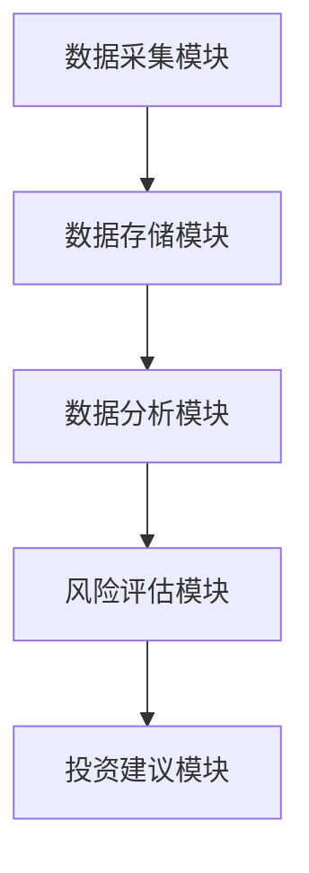
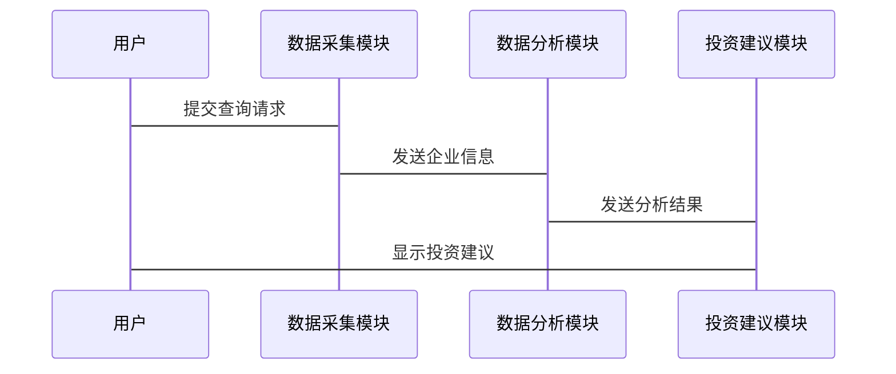

                 


# 基于多智能体的自动化尽职调查系统在价值投资中的应用

> 关键词：多智能体系统、价值投资、自动化尽职调查、金融数据分析、协同学习、分布式计算

> 摘要：随着金融市场的日益复杂化和信息量的指数级增长，传统的单智能体系统已无法满足现代金融领域中高效、精准的尽职调查需求。基于多智能体的自动化尽职调查系统通过分布式计算和协作学习，能够实现对海量数据的实时分析和智能决策。本文将深入探讨多智能体系统的核心概念、算法原理及其在价值投资中的实际应用，结合具体的数学模型和系统架构设计，展示如何利用多智能体技术提升金融数据分析的效率和准确性。通过实际案例分析，本文将进一步验证基于多智能体的自动化尽职调查系统在价值投资中的优势和潜力。

---

## 第1章: 多智能体系统与价值投资概述

### 1.1 多智能体系统的基本概念

#### 1.1.1 多智能体系统的定义
多智能体系统（Multi-Agent System, MAS）是由多个智能体（Agent）组成的分布式系统，这些智能体能够通过通信和协作完成复杂任务。

#### 1.1.2 多智能体系统的特征
- **分布性**：智能体独立运行，通过通信协同完成任务。
- **协作性**：智能体之间通过信息共享和协作实现目标。
- **自主性**：每个智能体都能自主决策，无需中央控制。
- **反应性**：智能体能够实时感知环境并做出反应。

#### 1.1.3 多智能体系统与传统单智能体系统的区别
| 特性         | 单智能体系统                     | 多智能体系统                     |
|--------------|---------------------------------|---------------------------------|
| 结构         | 单点控制                        | 分布式结构                      |
| 信息处理     | 中央化                          | 分布式                          |
| 可扩展性     | 有限                            | 强大                            |
| 故障容错性   | 单点故障可能导致整体瘫痪         | 分布式架构具备高容错性          |

### 1.2 价值投资的基本原理

#### 1.2.1 价值投资的定义
价值投资是一种投资策略，通过分析企业的基本面（如财务状况、行业地位、盈利能力等）来判断其内在价值，寻找被市场低估的投资标的。

#### 1.2.2 价值投资的核心理念
- **长期投资**：关注企业的长期价值，而非短期价格波动。
- **安全边际**：以低于内在价值的价格买入，降低投资风险。
- **深度分析**：通过详尽的调查和分析，识别具有竞争优势的企业。

#### 1.2.3 价值投资的关键步骤
1. **行业分析**：选择具有增长潜力的行业。
2. **企业基本面分析**：包括财务报表分析、管理层能力评估等。
3. **估值分析**：计算企业的内在价值，确定是否低估。
4. **风险评估**：识别可能影响企业价值的各类风险因素。

### 1.3 自动化尽职调查系统的核心概念

#### 1.3.1 尽职调查的定义与作用
尽职调查是投资前对目标企业进行全面调查的过程，旨在发现潜在风险并评估其价值。

#### 1.3.2 自动化尽职调查系统的定义
自动化尽职调查系统是一种利用人工智能技术，自动收集、分析和评估企业信息的系统。

#### 1.3.3 多智能体在自动化尽职调查中的应用
多智能体系统通过分布式的任务分配和协同工作，能够高效完成信息收集、数据分析和风险评估等任务。

### 1.4 本章小结
本章介绍了多智能体系统的基本概念、价值投资的核心理念以及自动化尽职调查系统的作用，为后续章节的展开奠定了基础。

---

## 第2章: 多智能体系统在金融领域的应用背景

### 2.1 金融领域的复杂性与挑战

#### 2.1.1 金融市场的复杂性
金融市场具有高度不确定性和波动性，传统的人工尽职调查效率低下且难以覆盖海量数据。

#### 2.1.2 传统尽职调查的局限性
- **效率低**：人工调查耗时长，难以应对海量数据。
- **信息不全**：难以覆盖全球范围内的相关信息。
- **主观性**：依赖调查人员的经验和判断，存在主观偏差。

#### 2.1.3 价值投资中的信息不对称问题
信息不对称会导致投资者难以准确评估企业价值，影响投资决策的准确性。

### 2.2 多智能体系统的优势

#### 2.2.1 分布式计算的优势
- **并行处理**：多智能体可以同时处理不同来源的数据，提高计算效率。
- **任务分配**：根据智能体的能力动态分配任务，优化资源利用率。

#### 2.2.2 多智能体协同工作的优势
- **信息共享**：智能体之间可以实时共享信息，避免信息孤岛。
- **协同决策**：通过协作学习，智能体能够共同优化决策过程。

#### 2.2.3 多智能体系统的可扩展性
多智能体系统可以根据需求灵活扩展，适应金融市场的动态变化。

### 2.3 自动化尽职调查系统的必要性

#### 2.3.1 提高效率的需求
自动化系统能够快速处理大量数据，显著提高尽职调查的效率。

#### 2.3.2 降低风险的需求
通过智能分析，系统能够提前识别潜在风险，降低投资失败的可能性。

#### 2.3.3 实时数据分析的需求
金融市场变化迅速，实时数据分析能力是价值投资的重要保障。

### 2.4 本章小结
本章分析了金融领域面临的复杂性与挑战，以及多智能体系统在解决这些问题中的优势，进一步强调了自动化尽职调查系统的必要性。

---

## 第3章: 多智能体系统的核心概念与联系

### 3.1 多智能体系统的结构与组成

#### 3.1.1 实体层
- **智能体**：执行具体任务的单元，具有自主性和反应性。
- **环境**：智能体所处的外部环境，包括数据源、市场信息等。

#### 3.1.2 行为层
- **任务分配**：智能体根据当前任务和能力分配具体工作。
- **协作决策**：智能体之间通过通信和协作制定共同策略。

#### 3.1.3 通信层
- **信息传递**：智能体之间通过通信协议共享信息。
- **数据整合**：将分散的数据整合成有意义的分析结果。

### 3.2 多智能体系统的通信机制

#### 3.2.1 通信协议
- **定义**：智能体之间信息交换的规则和格式。
- **实现方式**：通过API或消息队列实现信息传递。

#### 3.2.2 信息交换格式
- **JSON**：常用的数据交换格式，支持结构化数据。
- **XML**：可扩展标记语言，适合复杂数据结构。

#### 3.2.3 通信安全
- **加密技术**：确保信息传输的安全性。
- **身份验证**：确认通信双方的身份。

### 3.3 多智能体系统的决策模型

#### 3.3.1 分布式决策
- **定义**：每个智能体独立做出决策，然后通过通信达成一致。
- **实现方式**：基于局部信息做出决策，再通过协同学习优化整体决策。

#### 3.3.2 协作决策
- **定义**：智能体通过协作共同制定决策。
- **实现方式**：通过信息共享和协商，达成一致的决策方案。

#### 3.3.3 自适应决策
- **定义**：智能体能够根据环境变化动态调整决策。
- **实现方式**：基于反馈机制不断优化决策策略。

### 3.4 本章小结
本章详细讲解了多智能体系统的结构、通信机制和决策模型，分析了它们之间的联系和相互作用。

---

## 第4章: 多智能体系统的算法原理

### 4.1 分布式计算算法

#### 4.1.1 分布式计算的基本原理
- **任务分配**：将整体任务分解成子任务，分配给不同的智能体。
- **并行处理**：多个智能体同时处理子任务，提高计算效率。
- **结果整合**：将各智能体的计算结果整合成最终结果。

#### 4.1.2 分布式计算的实现方式
- **分阶段处理**：将任务分成多个阶段，每个阶段由不同的智能体负责。
- **负载均衡**：根据智能体的负载情况动态分配任务。

#### 4.1.3 分布式计算的优缺点
- **优点**：提高计算效率，增强系统的可扩展性。
- **缺点**：需要复杂的通信机制，增加系统复杂性。

### 4.2 协作学习算法

#### 4.2.1 协作学习的基本原理
- **知识共享**：智能体之间共享知识和经验，共同优化学习模型。
- **协同优化**：通过协作学习，提高整体的学习效果。

#### 4.2.2 协作学习的实现方式
- **分布式学习**：智能体在不同数据集上分别学习，然后共享模型参数。
- **联合学习**：智能体共同参与模型训练，实时更新模型参数。

#### 4.2.3 协作学习的优缺点
- **优点**：通过知识共享提高学习效果，增强系统的鲁棒性。
- **缺点**：需要高效的通信机制，增加计算开销。

### 4.3 多智能体协同算法

#### 4.3.1 多智能体协同的基本原理
- **任务分配**：根据智能体的能力分配任务。
- **协同执行**：智能体协同完成任务，实时共享信息。
- **结果反馈**：根据任务执行结果优化协同策略。

#### 4.3.2 多智能体协同的实现方式
- **基于规则的协同**：根据预定义的规则进行协同。
- **基于模型的协同**：通过建模环境和任务，动态调整协同策略。

#### 4.3.3 多智能体协同的优缺点
- **优点**：提高任务执行效率，增强系统的适应性。
- **缺点**：需要复杂的协同机制，增加系统设计难度。

### 4.4 本章小结
本章详细介绍了多智能体系统的分布式计算算法、协作学习算法和协同算法，分析了它们的实现方式和优缺点。

---

## 第5章: 多智能体系统的数学模型与公式

### 5.1 多智能体系统的通信模型

#### 5.1.1 通信模型的定义
通信模型描述了智能体之间信息传递的规则和流程。

#### 5.1.2 通信模型的数学表达
通信模型可以用图论中的图结构表示，节点代表智能体，边代表通信关系。

$$
\text{通信图} = G = (V, E)
$$

其中，$V$ 是智能体集合，$E$ 是通信边的集合。

#### 5.1.3 通信模型的优化
通过优化通信协议和数据格式，降低通信延迟和数据冗余。

### 5.2 多智能体系统的决策模型

#### 5.2.1 决策模型的定义
决策模型描述了智能体在特定环境下的决策规则和策略。

#### 5.2.2 决策模型的数学表达
决策模型可以用马尔可夫决策过程（Markov Decision Process, MDP）表示。

$$
MDP = \langle S, A, P, R, \gamma \rangle
$$

其中，$S$ 是状态空间，$A$ 是动作空间，$P$ 是状态转移概率，$R$ 是奖励函数，$\gamma$ 是折扣因子。

#### 5.2.3 决策模型的优化
通过强化学习优化决策模型，提高决策的准确性和效率。

### 5.3 多智能体系统的协同模型

#### 5.3.1 协同模型的定义
协同模型描述了多个智能体如何协作完成共同任务的规则和流程。

#### 5.3.2 协同模型的数学表达
协同模型可以用博弈论中的纳什均衡（Nash Equilibrium）表示。

$$
\text{纳什均衡} = \{a_i^*\}_{i=1}^n
$$

其中，$a_i^*$ 是第 $i$ 个智能体的最优策略，满足：

$$
a_i^* = \arg\max_{a_i} \sum_{j=1}^n R(a_i, a_j)
$$

#### 5.3.3 协同模型的优化
通过动态调整协同策略，提高系统的整体性能和效率。

### 5.4 本章小结
本章通过数学模型和公式，详细分析了多智能体系统的通信模型、决策模型和协同模型，为后续的系统设计提供了理论基础。

---

## 第6章: 基于多智能体的自动化尽职调查系统设计

### 6.1 问题场景介绍

#### 6.1.1 价值投资中的数据需求
- **财务数据**：包括收入、利润、资产负债等。
- **行业数据**：包括行业趋势、竞争状况等。
- **市场数据**：包括股价、成交量等实时数据。

#### 6.1.2 传统尽职调查的痛点
- **效率低下**：人工调查耗时长，难以覆盖海量数据。
- **信息不全**：难以获取全球范围内的相关信息。
- **成本高昂**：人工调查需要大量时间和资源。

#### 6.1.3 自动化尽职调查的优势
- **高效性**：快速处理海量数据，提高调查效率。
- **准确性**：通过智能分析减少人为误差，提高调查结果的准确性。
- **实时性**：实时获取和分析市场数据，支持快速决策。

### 6.2 系统功能设计

#### 6.2.1 数据采集模块
- **功能**：从多种数据源（如数据库、API、新闻网站等）获取企业相关信息。
- **实现**：使用爬虫技术采集数据，支持多种数据格式（如JSON、XML等）。

#### 6.2.2 数据分析模块
- **功能**：对采集到的数据进行清洗、整理和分析，生成企业估值报告。
- **实现**：使用机器学习算法（如聚类、分类等）进行数据分析。

#### 6.2.3 风险评估模块
- **功能**：识别和评估企业可能面临的风险因素，生成风险报告。
- **实现**：通过自然语言处理技术分析新闻和市场评论，识别潜在风险。

#### 6.2.4 投资建议模块
- **功能**：根据分析结果生成投资建议，指导投资者进行价值投资。
- **实现**：结合企业的内在价值和市场趋势，生成具体的买入、持有或卖出建议。

### 6.3 系统架构设计

#### 6.3.1 系统架构图


#### 6.3.2 系统组件说明
- **数据采集模块**：负责从多种数据源获取企业相关信息。
- **数据存储模块**：对采集到的数据进行存储和管理。
- **数据分析模块**：对数据进行清洗、整理和分析，生成企业估值报告。
- **风险评估模块**：识别和评估企业可能面临的风险因素，生成风险报告。
- **投资建议模块**：根据分析结果生成投资建议，指导投资者进行价值投资。

### 6.4 系统接口设计

#### 6.4.1 数据接口
- **输入接口**：从外部数据源获取企业信息。
- **输出接口**：将分析结果输出给投资建议模块。

#### 6.4.2 用户接口
- **输入接口**：用户输入查询的企业信息。
- **输出接口**：显示投资建议和相关报告。

### 6.5 系统交互设计

#### 6.5.1 交互流程图


### 6.6 本章小结
本章详细描述了基于多智能体的自动化尽职调查系统的功能设计、架构设计和交互设计，为系统的实现提供了清晰的指导。

---

## 第7章: 项目实战——基于多智能体的自动化尽职调查系统实现

### 7.1 环境配置

#### 7.1.1 开发环境
- **操作系统**：Linux/Windows/MacOS
- **编程语言**：Python
- **框架**：Django/Flask
- **工具**：Jupyter Notebook, Git

#### 7.1.2 数据源配置
- **数据源1**：企业财务数据API
- **数据源2**：新闻网站API
- **数据源3**：市场数据API

### 7.2 核心代码实现

#### 7.2.1 数据采集模块
```python
import requests
import json

def fetch_data(api_url):
    response = requests.get(api_url)
    if response.status_code == 200:
        return json.loads(response.text)
    else:
        return None
```

#### 7.2.2 数据分析模块
```python
from sklearn.cluster import KMeans

def analyze_data(data):
    # 数据清洗和预处理
    processed_data = data清洗代码
    # 模型训练
    model = KMeans(n_clusters=3)
    model.fit(processed_data)
    return model.labels_
```

#### 7.2.3 风险评估模块
```python
from nltk.sentiment import SentimentIntensityAnalyzer

def assess_risk(text):
    analyzer = SentimentIntensityAnalyzer()
    sentiment = analyzer.polarity_scores(text)
    if sentiment['compound'] < -0.2:
        return '高风险'
    elif sentiment['compound'] < 0:
        return '中风险'
    else:
        return '低风险'
```

#### 7.2.4 投资建议模块
```python
def generate_recommendation(value, risk):
    if value > 1.2:
        return '买入'
    elif value > 1:
        return '持有'
    else:
        return '卖出'
```

### 7.3 代码应用解读与分析

#### 7.3.1 数据采集模块
- **功能**：通过API获取企业相关信息。
- **实现细节**：使用requests库发送HTTP请求，处理返回的JSON数据。

#### 7.3.2 数据分析模块
- **功能**：对采集到的数据进行清洗和分析，生成企业估值报告。
- **实现细节**：使用K-means算法进行聚类分析，识别企业的财务状况。

#### 7.3.3 风险评估模块
- **功能**：通过自然语言处理技术分析文本，评估企业的风险水平。
- **实现细节**：使用SentimentIntensityAnalyzer评估文本的情感倾向。

#### 7.3.4 投资建议模块
- **功能**：根据企业的内在价值和风险评估结果，生成投资建议。
- **实现细节**：基于企业的估值和风险等级，动态调整投资策略。

### 7.4 实际案例分析

#### 7.4.1 案例背景
某科技公司最近发布了新产品，市场反响良好，但财务数据表现一般。

#### 7.4.2 数据采集
通过API获取该公司的财务数据、新闻报道和市场数据。

#### 7.4.3 数据分析
使用K-means算法分析财务数据，发现公司盈利能力正在逐步改善。

#### 7.4.4 风险评估
通过情感分析评估新闻报道，发现市场对该公司的新产品有较高的期望，风险等级为中风险。

#### 7.4.5 投资建议
基于分析结果，投资建议模块生成“买入”建议。

### 7.5 项目小结
本章通过实际案例，详细展示了基于多智能体的自动化尽职调查系统的实现过程，验证了系统的可行性和有效性。

---

## 第8章: 总结与展望

### 8.1 本章总结
本文深入探讨了基于多智能体的自动化尽职调查系统在价值投资中的应用，详细分析了多智能体系统的核心概念、算法原理和系统设计，并通过实际案例验证了系统的实用性和高效性。

### 8.2 未来展望
随着人工智能技术的不断发展，多智能体系统在金融领域的应用前景广阔。未来，可以通过以下方式进一步优化系统：
1. **增强智能体的自主性**：提高智能体的自主决策能力，减少对中央控制的依赖。
2. **提升系统的实时性**：优化通信机制，提高系统的实时数据处理能力。
3. **拓展应用场景**：将多智能体系统应用于更多金融场景，如风险管理、投资组合优化等。

### 8.3 最佳实践 Tips
- **数据质量**：确保数据的准确性和完整性，避免因数据问题影响分析结果。
- **模型优化**：定期更新和优化模型，适应市场变化和新的数据需求。
- **系统维护**：及时修复系统漏洞，确保系统的安全性和稳定性。

### 8.4 本章小结
本章总结了全文的主要内容，并展望了未来的发展方向，为读者提供了进一步学习和研究的方向。

---

## 作者：AI天才研究院/AI Genius Institute & 禅与计算机程序设计艺术 /Zen And The Art of Computer Programming

