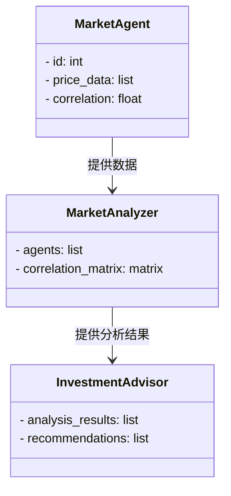
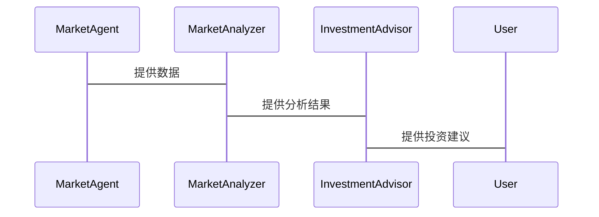

                 


# 多智能体系统在跨市场相关性分析中的应用

---

## 关键词：
多智能体系统, 跨市場相關性分析, 金融市场, 人工智能, 协作学习

---

## 摘要：
本文探讨了多智能体系统在跨市场相关性分析中的应用，分析了多智能体系统的概念、特征及其在金融市场中的优势，详细阐述了跨市场相关性分析的定义、指标体系和应用场景。通过结合多智能体协同学习算法和数学模型，本文提出了多智能体系统在跨市场相关性分析中的实现方法，并通过实际案例展示了其在金融风险预警、投资组合优化等领域的应用价值。文章还讨论了系统设计、项目实现和最佳实践，为读者提供了全面的理论与实践指导。

---

## 第1章: 多智能体系统概述

### 1.1 多智能体系统的基本概念

#### 1.1.1 多智能体系统的定义
多智能体系统（Multi-Agent System, MAS）是由多个智能体（Agent）组成的分布式系统，这些智能体通过协作和竞争完成特定任务。智能体是具有感知、推理、规划和行动能力的实体，能够自主决策并与其他智能体或环境进行交互。

#### 1.1.2 多智能体系统的特征
多智能体系统具有以下特征：
- **分布性**：多个智能体协同工作，无中心控制节点。
- **自主性**：智能体能够自主决策和行动。
- **协作性**：智能体之间通过通信和协调完成共同目标。
- **反应性**：智能体能够实时感知环境并做出反应。
- **社会性**：智能体之间存在复杂的交互和协作关系。

#### 1.1.3 多智能体系统的分类
多智能体系统可以分为以下几类：
- **基于任务的多智能体系统**：智能体协作完成特定任务。
- **基于市场的多智能体系统**：智能体通过市场机制进行资源分配和交易。
- **基于模型的多智能体系统**：基于特定模型模拟复杂系统行为。

---

### 1.2 跨市場相關性分析的基本概念

#### 1.2.1 跨市場相關性分析的定义
跨市场相关性分析是指研究不同市场之间的资产价格波动、风险传染和投资机会之间的相互关系。通过分析不同市场之间的相关性，投资者可以更好地理解市场风险，优化投资组合，并制定有效的风险管理策略。

#### 1.2.2 跨市場相關性分析的重要性
跨市场相关性分析在金融市场中具有重要意义：
- **风险分散**：通过分析不同市场的相关性，投资者可以分散投资风险。
- **投资机会发现**：识别不同市场之间的相关性可以帮助发现投资机会。
- **风险管理**：在市场波动加剧的情况下，跨市场相关性分析可以帮助识别系统性风险。

#### 1.2.3 跨市場相關性分析的应用场景
跨市场相关性分析广泛应用于以下场景：
- **全球投资组合管理**：优化投资组合的风险和收益。
- **风险预警**：识别潜在的系统性风险。
- **资产配置**：根据市场相关性调整资产配置策略。

---

### 1.3 多智能体系统与跨市場相關性分析的联系

#### 1.3.1 多智能体系统在金融分析中的优势
多智能体系统在金融分析中具有以下优势：
- **分布式计算**：多个智能体可以同时处理大量数据，提高计算效率。
- **自主决策**：智能体能够自主分析市场数据并做出投资决策。
- **协作能力**：智能体之间可以协作完成复杂的金融分析任务。

#### 1.3.2 跨市場相關性分析中的多智能体系统应用
在跨市场相关性分析中，多智能体系统可以应用于以下方面：
- **实时数据分析**：智能体实时监控不同市场的数据，分析资产价格波动。
- **相关性计算**：通过多智能体协同计算，确定不同市场之间的相关性。
- **风险预警**：智能体通过协作分析，识别潜在的系统性风险。

#### 1.3.3 多智能体系统与跨市場相關性分析的结合
多智能体系统与跨市场相关性分析的结合可以通过以下方式实现：
- **智能体协同学习**：智能体通过协同学习算法，共同优化相关性分析模型。
- **分布式计算**：利用多智能体系统的分布式计算能力，提高相关性分析的效率。
- **动态适应**：智能体能够动态适应市场变化，实时更新相关性分析结果。

---

### 1.4 本章小结
本章介绍了多智能体系统的基本概念和跨市场相关性分析的定义、重要性及其应用场景。同时，分析了多智能体系统在跨市场相关性分析中的优势及其应用潜力，为后续章节的深入分析奠定了基础。

---

## 第2章: 多智能体系统的核心概念与联系

### 2.1 多智能体系统的核心概念

#### 2.1.1 多智能体系统的组成要素
多智能体系统由以下组成要素构成：
- **智能体**：具有自主决策能力的实体。
- **通信机制**：智能体之间的通信方式，如消息传递。
- **协作协议**：智能体之间的协作规则和协议。
- **环境**：智能体所处的外部环境，如金融市场。

#### 2.1.2 多智能体系统的通信机制
多智能体系统的通信机制包括以下几种：
- **直接通信**：智能体之间直接交换信息。
- **间接通信**：通过中间媒介进行信息传递。
- **发布-订阅模型**：智能体发布信息，其他智能体订阅信息。

#### 2.1.3 多智能体系统的协作行为
多智能体系统的协作行为包括：
- **任务分配**：智能体根据自身能力和任务需求分配任务。
- **协调与同步**：智能体之间通过协调和同步完成共同目标。
- **冲突解决**：智能体之间通过协商解决冲突，确保协作顺利进行。

---

### 2.2 跨市場相關性分析的核心概念

#### 2.2.1 跨市場相關性分析的数学模型
跨市场相关性分析的数学模型通常包括以下部分：
- **变量定义**：定义相关性分析中的变量，如资产价格、收益率等。
- **相关性计算**：使用协方差、相关系数等方法计算资产之间的相关性。
- **模型优化**：通过优化算法选择最优的相关性分析模型。

#### 2.2.2 跨市場相關性分析的指标体系
跨市场相关性分析的指标体系包括：
- **相关系数**：衡量两个资产价格之间的相关性。
- **协方差**：衡量两个资产价格变动的同步性。
- **波动率**：衡量资产价格的波动程度。

#### 2.2.3 跨市場相關性分析的算法选择
跨市场相关性分析常用的算法包括：
- **Pearson相关系数**：计算资产之间的线性相关性。
- **Spearman相关系数**：计算资产之间的秩相关性。
- **主成分分析（PCA）**：用于降维和提取主要相关性成分。

---

### 2.3 多智能体系统与跨市場相關性分析的联系

#### 2.3.1 多智能体系统在跨市场相关性分析中的角色
多智能体系统在跨市场相关性分析中扮演以下角色：
- **数据采集**：智能体实时采集不同市场的数据。
- **数据分析**：智能体对数据进行分析，计算相关性指标。
- **结果反馈**：智能体将分析结果反馈给投资者或系统。

#### 2.3.2 多智能体系统与跨市場相關性分析的协同机制
多智能体系统与跨市场相关性分析的协同机制包括：
- **协同计算**：多个智能体协同计算相关性指标，提高计算效率。
- **动态适应**：智能体根据市场变化动态调整相关性分析模型。
- **信息共享**：智能体之间共享信息，提高相关性分析的准确性。

#### 2.3.3 多智能体系统与跨市場相關性分析的结合案例
以下是一个多智能体系统与跨市场相关性分析结合的案例：
- **案例背景**：某投资机构希望通过分析多个市场的相关性，优化投资组合。
- **实施步骤**：
  1. 智能体采集不同市场的资产价格数据。
  2. 智能体计算资产之间的相关系数。
  3. 智能体通过协同学习优化相关性分析模型。
  4. 分析结果用于投资组合优化和风险预警。

---

### 2.4 本章小结
本章详细阐述了多智能体系统的核心概念及其在跨市场相关性分析中的角色和协同机制，分析了多智能体系统与跨市场相关性分析的结合案例，为后续章节的算法和系统设计提供了理论基础。

---

## 第3章: 多智能体系统在跨市场相关性分析中的算法原理

### 3.1 多智能体协同学习算法

#### 3.1.1 多智能体协同学习的定义
多智能体协同学习是指多个智能体通过协作和共享信息共同学习和优化模型的过程。与单智能体学习不同，多智能体协同学习能够利用多个智能体的计算能力和信息资源，提高学习效率和模型性能。

#### 3.1.2 多智能体协同学习的算法流程
多智能体协同学习的算法流程如下：
1. 初始化：设置智能体的初始状态和参数。
2. 信息共享：智能体之间共享数据和模型参数。
3. 协同学习：智能体基于共享信息共同优化模型。
4. 评估与反馈：评估学习效果，根据反馈调整学习策略。

#### 3.1.3 多智能体协同学习的数学模型
多智能体协同学习的数学模型可以表示为：
$$
\theta_i^{(k+1)} = \theta_i^{(k)} + \alpha \sum_{j \neq i} (\theta_j^{(k)} - \theta_i^{(k)})
$$
其中，$\theta_i$ 表示智能体 $i$ 的参数，$\alpha$ 是学习率，$k$ 是迭代次数。

---

### 3.2 跨市場相關性分析算法

#### 3.2.1 跨市場相關性分析的常用算法
跨市场相关性分析常用的算法包括：
- **Pearson相关系数**：计算线性相关性。
- **Spearman相关系数**：计算秩相关性。
- **主成分分析（PCA）**：降维和提取主要相关成分。

#### 3.2.2 跨市場相關性分析的算法选择
在选择相关性分析算法时，需要考虑以下因素：
- **数据类型**：线性相关性还是非线性相关性。
- **数据分布**：是否符合正态分布。
- **计算效率**：算法的复杂度和计算时间。

#### 3.2.3 跨市場相關性分析的算法实现
以下是一个计算Pearson相关系数的Python代码示例：

```python
import numpy as np

def pearson_correlation(x, y):
    # 计算均值
    mean_x = np.mean(x)
    mean_y = np.mean(y)
    
    # 计算标准差
    std_x = np.std(x)
    std_y = np.std(y)
    
    # 计算协方差
    covariance = np.mean((x - mean_x) * (y - mean_y))
    
    # 计算相关系数
    correlation = covariance / (std_x * std_y)
    return correlation

# 示例数据
x = np.array([1, 2, 3, 4, 5])
y = np.array([2, 4, 6, 8, 10])

# 计算相关系数
correlation = pearson_correlation(x, y)
print("Pearson相关系数:", correlation)
```

---

### 3.3 多智能体系统与跨市場相關性分析的结合

#### 3.3.1 多智能体系统在跨市场相关性分析中的算法应用
多智能体系统可以应用于跨市场相关性分析的以下方面：
- **数据采集与预处理**：智能体采集和预处理多市场数据。
- **相关性计算**：智能体协同计算资产之间的相关系数。
- **模型优化**：智能体通过协同学习优化相关性分析模型。

#### 3.3.2 多智能体系统与跨市場相關性分析的协同优化
多智能体系统与跨市场相关性分析的协同优化包括：
- **分布式计算**：利用多智能体系统的分布式计算能力，提高相关性分析的效率。
- **动态调整**：根据市场变化动态调整相关性分析模型。
- **信息共享**：智能体之间共享信息，提高相关性分析的准确性。

#### 3.3.3 多智能体系统与跨市場相關性分析的案例分析
以下是一个多智能体系统与跨市场相关性分析结合的案例：
- **案例背景**：某金融机构希望通过分析多个市场的相关性，优化投资组合。
- **实施步骤**：
  1. 智能体采集不同市场的资产价格数据。
  2. 智能体计算资产之间的Pearson相关系数。
  3. 智能体通过协同学习优化相关性分析模型。
  4. 分析结果用于投资组合优化和风险预警。

---

### 3.4 本章小结
本章详细介绍了多智能体协同学习算法和跨市场相关性分析的常用算法，并分析了多智能体系统与跨市场相关性分析的结合应用，为后续章节的系统设计和项目实现提供了理论支持。

---

## 第4章: 多智能体系统与跨市场相关性分析的数学模型

### 4.1 多智能体系统的数学模型

#### 4.1.1 多智能体系统的状态表示
多智能体系统的状态可以用以下方式表示：
$$
s_i = (x_i, y_i, z_i)
$$
其中，$s_i$ 表示智能体 $i$ 的状态，$x_i$、$y_i$、$z_i$ 分别表示智能体的位置、速度和方向。

#### 4.1.2 多智能体系统的动作表示
多智能体系统的动作可以用以下方式表示：
$$
a_i = (u_i, v_i, w_i)
$$
其中，$a_i$ 表示智能体 $i$ 的动作，$u_i$、$v_i$、$w_i$ 分别表示智能体的移动速度、方向和加速度。

#### 4.1.3 多智能体系统的奖励机制
多智能体系统的奖励机制可以表示为：
$$
r_i = \sum_{j=1}^{n} \beta_j \cdot a_{ij}
$$
其中，$r_i$ 表示智能体 $i$ 的奖励，$\beta_j$ 是动作 $a_{ij}$ 的权重。

---

### 4.2 跨市場相關性分析的数学模型

#### 4.2.1 跨市場相關性分析的变量定义
跨市场相关性分析的变量包括：
- **资产价格**：$P_i$ 表示资产 $i$ 的价格。
- **收益率**：$R_i$ 表示资产 $i$ 的收益率。
- **相关系数**：$\rho_{ij}$ 表示资产 $i$ 和 $j$ 之间的相关系数。

#### 4.2.2 跨市場相關性分析的方程推导
Pearson相关系数的公式推导如下：
$$
\rho_{ij} = \frac{\text{Cov}(P_i, P_j)}{\sigma_{P_i} \sigma_{P_j}}
$$
其中，$\text{Cov}(P_i, P_j)$ 表示资产 $i$ 和 $j$ 的协方差，$\sigma_{P_i}$ 和 $\sigma_{P_j}$ 分别表示资产 $i$ 和 $j$ 的标准差。

#### 4.2.3 跨市場相關性分析的优化目标
跨市场相关性分析的优化目标可以表示为：
$$
\min_{\theta} \sum_{i=1}^{n} (y_i - \hat{y}_i)^2
$$
其中，$\theta$ 是模型参数，$y_i$ 是实际值，$\hat{y}_i$ 是预测值。

---

### 4.3 多智能体系统与跨市場相關性分析的联合模型

#### 4.3.1 多智能体系统与跨市場相關性分析的联合建模
多智能体系统与跨市场相关性分析的联合建模可以表示为：
$$
\text{联合模型} = \text{多智能体系统} + \text{跨市場相關性分析模型}
$$
其中，多智能体系统负责数据采集和计算，跨市场相关性分析模型负责分析和优化。

#### 4.3.2 多智能体系统与跨市場相關性分析的模型优化
多智能体系统与跨市场相关性分析的模型优化可以通过以下方式实现：
- **分布式优化**：利用多智能体系统的分布式计算能力，优化相关性分析模型。
- **协同学习**：智能体之间通过协同学习，共同优化相关性分析模型。
- **动态调整**：根据市场变化动态调整模型参数，提高分析准确性。

#### 4.3.3 多智能体系统与跨市場相關性分析的案例分析
以下是一个多智能体系统与跨市场相关性分析联合建模的案例：
- **案例背景**：某投资机构希望通过分析多个市场的相关性，优化投资组合。
- **实施步骤**：
  1. 智能体采集不同市场的资产价格数据。
  2. 智能体计算资产之间的相关系数。
  3. 智能体通过协同学习优化相关性分析模型。
  4. 分析结果用于投资组合优化和风险预警。

---

### 4.4 本章小结
本章详细介绍了多智能体系统和跨市场相关性分析的数学模型，并分析了多智能体系统与跨市场相关性分析的联合建模和优化方法，为后续章节的系统设计和项目实现提供了数学基础。

---

## 第5章: 系统分析与架构设计

### 5.1 问题场景介绍

#### 5.1.1 问题背景
在金融市场中，投资者需要分析不同市场之间的相关性，以优化投资组合和风险管理。然而，传统的方法往往依赖于单智能体系统，计算效率低且难以应对复杂多变的市场环境。

#### 5.1.2 问题描述
本系统需要设计一个多智能体系统，用于实时采集和分析多个市场的资产价格数据，计算资产之间的相关性，并提供投资建议。

#### 5.1.3 问题解决
通过设计一个多智能体系统，利用智能体之间的协作和协同学习能力，提高相关性分析的效率和准确性。

---

### 5.2 系统功能设计

#### 5.2.1 领域模型类图
以下是系统的领域模型类图：



---

### 5.3 系统架构设计

#### 5.3.1 系统架构图
以下是系统的架构图：

```mermaid
archiectureDiagram
    MarketAgent [角色：数据采集]
    MarketAnalyzer [角色：数据处理]
    InvestmentAdvisor [角色：结果应用]
    MarketAgent --> MarketAnalyzer
    MarketAnalyzer --> InvestmentAdvisor
```

---

### 5.4 系统接口设计

#### 5.4.1 系统接口描述
系统接口包括以下几部分：
- **数据接口**：智能体之间的数据交换接口。
- **分析接口**：智能体之间的分析结果共享接口。
- **用户接口**：用户与系统的交互界面。

#### 5.4.2 系统交互流程图
以下是系统的交互流程图：



---

### 5.5 本章小结
本章通过问题场景分析、系统功能设计和系统架构设计，详细描述了多智能体系统在跨市场相关性分析中的实现方案，为后续章节的项目实现提供了设计依据。

---

## 第6章: 项目实战

### 6.1 环境安装

#### 6.1.1 系统环境
- 操作系统：Linux/Windows/MacOS
- Python版本：3.6及以上
- 依赖库：numpy, pandas, matplotlib

#### 6.1.2 安装依赖
使用以下命令安装依赖：
```bash
pip install numpy pandas matplotlib
```

---

### 6.2 系统核心实现

#### 6.2.1 多智能体协同学习算法实现
以下是一个多智能体协同学习算法的实现代码：

```python
import numpy as np

def multi_agent_learning(agents, data):
    for agent in agents:
        agent.update(data)
        agent.learn()
    return agents

# 示例智能体类
class Agent:
    def __init__(self, id):
        self.id = id
        self.theta = np.random.randn(1)
    
    def update(self, data):
        self.data = data
    
    def learn(self):
        # 简单的协同学习算法
        if len(agents) > 1:
            avg_theta = np.mean([a.theta for a in agents], axis=0)
            self.theta = 0.5 * self.theta + 0.5 * avg_theta
```

#### 6.2.2 跨市場相關性分析实现
以下是一个跨市场相关性分析的实现代码：

```python
import pandas as pd

def calculate_correlation(dataframe):
    # 计算相关系数矩阵
    correlation_matrix = dataframe.corr()
    return correlation_matrix

# 示例数据
data = {
    'Market1': [1, 2, 3, 4, 5],
    'Market2': [2, 3, 4, 5, 6],
    'Market3': [3, 4, 5, 6, 7]
}
df = pd.DataFrame(data)
correlation_matrix = calculate_correlation(df)
print(correlation_matrix)
```

---

### 6.3 项目小结
本章通过环境安装和系统核心实现，详细展示了多智能体系统在跨市场相关性分析中的具体实现方法，为读者提供了实践指导。

---

## 第7章: 最佳实践

### 7.1 小结
多智能体系统在跨市场相关性分析中具有广阔的应用前景。通过多智能体系统的协同学习和分布式计算能力，可以提高相关性分析的效率和准确性。

### 7.2 注意事项
在实际应用中，需要注意以下几点：
- **数据质量**：确保数据的准确性和完整性。
- **算法选择**：根据具体需求选择合适的算法。
- **系统维护**：定期维护和更新系统，确保其稳定性和高效性。

### 7.3 拓展阅读
以下是拓展阅读的推荐书籍和论文：
- 《Multi-Agent Systems: Algorithmic Foundations》
- 《Network Theory and Financial Market Analysis》
- 《Distributed Machine Learning in Financial Markets》

---

## 作者：AI天才研究院/AI Genius Institute & 禅与计算机程序设计艺术 /Zen And The Art of Computer Programming

---

**注**：由于篇幅限制，以上内容为部分章节的概述，完整文章将包含更详细的内容和图表。

