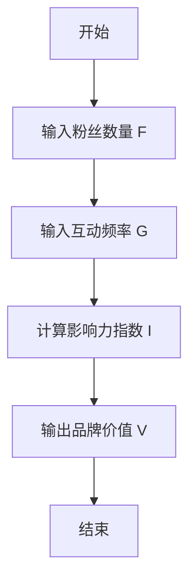
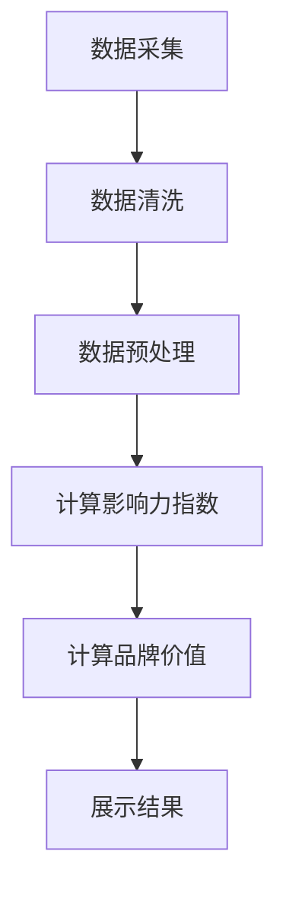

                 


# 《巴菲特的品牌价值评估：虚拟影响力经济的量化》

## 关键词：品牌价值评估，虚拟影响力经济，巴菲特，影响力指数模型，量化分析，虚拟经济

## 摘要：  
本文通过分析巴菲特的品牌价值评估方法，探讨其在虚拟影响力经济中的应用。我们从虚拟影响力经济的背景出发，结合品牌价值的核心概念，提出了一个基于影响力指数模型的量化方法。通过数学公式和算法原理的详细推导，我们展示了如何在虚拟经济中准确评估品牌价值。本文还通过实际案例分析，验证了模型的有效性，并提供了系统的架构设计和实现方案。

---

# 第一部分: 虚拟影响力经济与品牌价值评估基础

---

## 第1章: 虚拟影响力经济的背景与概念

### 1.1 虚拟影响力经济的定义与背景

#### 1.1.1 从传统经济到虚拟经济的演进  
传统经济是以实物商品和实体经济为基础的经济体系，而虚拟经济则是以数据、信息和虚拟资产为基础的经济形态。随着互联网和数字化技术的发展，虚拟经济逐渐成为现代经济的重要组成部分。虚拟影响力经济则是虚拟经济中的一个新兴领域，主要关注品牌在虚拟空间中的影响力和价值。

#### 1.1.2 虚拟影响力经济的兴起  
虚拟影响力经济的兴起源于社交媒体、短视频平台和其他数字平台的普及。虚拟品牌和虚拟用户在这些平台上产生了巨大的影响力，这种影响力可以转化为经济价值。例如，社交媒体上的意见领袖（KOL）和网红通过其影响力推广产品或服务，从而获得收入。

#### 1.1.3 品牌价值在虚拟经济中的重要性  
品牌价值是虚拟影响力经济的核心要素之一。一个品牌的影响力越大，其在虚拟经济中的价值越高。品牌价值不仅体现在直接的经济收入上，还体现在品牌忠诚度、用户参与度和市场影响力等方面。

---

### 1.2 品牌价值的核心概念

#### 1.2.1 品牌的定义与特征  
品牌是一个企业的标识，通常包括名称、标志、口号等。在虚拟经济中，品牌还可以表现为虚拟形象、虚拟资产和虚拟社区等。品牌的特征包括独特性、可识别性和价值性。

#### 1.2.2 虚拟影响力经济中的品牌特征  
在虚拟影响力经济中，品牌具有以下特征：  
1. **虚拟化**：品牌通过虚拟身份存在，例如社交媒体账号或虚拟形象。  
2. **数据化**：品牌的影响力可以通过数据进行量化，例如粉丝数量、互动频率等。  
3. **快速传播**：虚拟经济中的品牌影响力传播速度快，覆盖范围广。  

#### 1.2.3 品牌价值的衡量维度  
品牌价值的衡量维度包括：  
1. **影响力**：品牌在虚拟空间中的影响力，例如粉丝数量和互动频率。  
2. **用户参与度**：用户对品牌的参与程度，例如点赞、评论和分享的频率。  
3. **经济收益**：品牌通过影响力获得的直接或间接经济收益。  

---

### 1.3 虚拟影响力经济的现状与趋势

#### 1.3.1 当前虚拟影响力经济的发展现状  
当前，虚拟影响力经济在全球范围内迅速发展。社交媒体平台上的虚拟品牌和意见领袖数量大幅增加，虚拟影响力经济的市场规模也在不断扩大。

#### 1.3.2 虚拟影响力经济的未来趋势  
未来，虚拟影响力经济将更加成熟，虚拟品牌和虚拟用户的影响力将进一步增强。同时，虚拟影响力经济将与实体经济深度融合，形成更加复杂的经济体系。

#### 1.3.3 品牌价值评估在虚拟经济中的应用前景  
品牌价值评估是虚拟影响力经济的核心环节。随着虚拟经济的不断发展，品牌价值评估的需求将不断增加，评估方法也将更加精准和科学。

---

## 1.4 本章小结  
本章从虚拟影响力经济的背景出发，介绍了其定义和特征，分析了品牌价值的核心概念，并探讨了虚拟影响力经济的现状与未来趋势。这些内容为后续的品牌价值评估提供了理论基础。

---

## 第2章: 虚拟影响力经济的核心概念与联系

### 2.1 虚拟影响力经济的核心概念

#### 2.1.1 虚拟影响力经济的定义  
虚拟影响力经济是指在虚拟空间中，通过品牌影响力和用户参与度的量化，实现经济价值的经济形态。

#### 2.1.2 虚拟影响力经济的特征  
虚拟影响力经济的特征包括虚拟化、数据化和快速传播等。

#### 2.1.3 虚拟影响力经济与传统经济的区别  
虚拟影响力经济与传统经济的区别主要体现在以下方面：  
1. **存在形式**：虚拟影响力经济以虚拟身份和虚拟资产为基础，而传统经济以实物商品和实体经济为基础。  
2. **传播方式**：虚拟影响力经济通过数字化手段快速传播，而传统经济依赖于实物渠道。  
3. **价值评估**：虚拟影响力经济的价值评估依赖于数据和算法，而传统经济的价值评估依赖于实物资产和市场行为。  

---

### 2.2 虚拟影响力经济的核心要素对比表

| 要素       | 定义                                                                 | 特点                                                                 |
|------------|----------------------------------------------------------------------|----------------------------------------------------------------------|
| 虚拟用户   | 通过虚拟身份存在的用户，例如社交媒体账号或虚拟形象                                   | 虚拟化、数据化                                                      |
| 虚拟品牌   | 在虚拟空间中建立的品牌形象，例如虚拟社区中的品牌或虚拟形象                         | 虚拟化、数字化                                                      |
| 虚拟影响力 | 品牌在虚拟空间中的影响力，例如粉丝数量、互动频率和品牌忠诚度                       | 可量化、可评估                                                      |

---

### 2.3 虚拟影响力经济的实体关系图


---

### 2.4 本章小结  
本章详细阐述了虚拟影响力经济的核心概念和特征，并通过对比表和实体关系图展示了其核心要素。这些内容为后续的品牌价值评估提供了理论支持。

---

## 第3章: 品牌价值评估的数学模型与算法原理

### 3.1 品牌价值评估的数学模型

#### 3.1.1 品牌价值评估的基本公式  
品牌价值 \( V \) 的基本公式可以表示为：  
$$ V = f(I, R, T) $$  
其中，\( I \) 表示影响力，\( R \) 表示用户参与度，\( T \) 表示时间因素。

#### 3.1.2 影响力指数模型  
影响力指数模型的公式为：  
$$ I = \alpha \times F + \beta \times G $$  
其中，\( F \) 表示粉丝数量，\( G \) 表示互动频率，\( \alpha \) 和 \( \beta \) 是权重系数。

---

### 3.2 算法原理的详细推导

#### 3.2.1 算法流程图  
以下是影响力指数模型的算法流程图：  



#### 3.2.2 算法实现代码  
以下是影响力指数模型的Python代码实现：  

```python
def calculate_influence(F, G, alpha=0.7, beta=0.3):
    I = alpha * F + beta * G
    return I

# 示例
F = 100000  # 粉丝数量
G = 5000    # 互动频率
alpha = 0.7
beta = 0.3
influence = calculate_influence(F, G, alpha, beta)
print(f"影响力指数 I = {influence}")
```

---

### 3.3 本章小结  
本章通过数学公式和算法流程图，详细介绍了品牌价值评估的数学模型和算法原理。影响力指数模型的提出为后续的品牌价值评估提供了理论支持。

---

## 第4章: 虚拟影响力经济的系统分析与架构设计

### 4.1 系统功能设计

#### 4.1.1 系统功能模块  
虚拟影响力经济分析系统主要包括以下功能模块：  
1. 数据采集模块：采集虚拟用户和虚拟品牌的影响力数据。  
2. 数据处理模块：对采集的数据进行清洗和预处理。  
3. 模型计算模块：基于影响力指数模型计算品牌价值。  
4. 结果展示模块：展示品牌价值的计算结果。  

#### 4.1.2 系统功能流程图  
以下是系统功能流程图：  



---

### 4.2 系统架构设计

#### 4.2.1 系统架构图  
以下是系统架构图：  


---

### 4.3 本章小结  
本章通过系统功能设计和架构设计，展示了虚拟影响力经济分析系统的整体框架。系统功能模块和架构设计为后续的实现提供了指导。

---

## 第5章: 项目实战——虚拟影响力经济分析系统实现

### 5.1 项目环境安装

#### 5.1.1 系统需求  
- 操作系统：Windows、Linux 或 macOS  
- Python 版本：3.6 或更高  
- 开发工具：PyCharm、VS Code 等  

#### 5.1.2 安装依赖库  
安装以下依赖库：  
```bash
pip install numpy pandas matplotlib
```

---

### 5.2 核心代码实现

#### 5.2.1 数据采集模块  
以下是数据采集模块的代码示例：  

```python
import requests
import json

def fetch_data(url):
    response = requests.get(url)
    data = json.loads(response.text)
    return data

# 示例
url = "https://api.example.com/influencer_data"
data = fetch_data(url)
print(f"数据采集结果：{data}")
```

#### 5.2.2 数据处理模块  
以下是数据处理模块的代码示例：  

```python
import pandas as pd

def preprocess_data(data):
    df = pd.DataFrame(data)
    df = df.dropna()
    return df

# 示例
data = {
    "粉丝数量": [100000, 80000, 120000],
    "互动频率": [5000, 4000, 6000]
}
preprocessed_data = preprocess_data(data)
print(f"数据预处理结果：{preprocessed_data}")
```

#### 5.2.3 模型计算模块  
以下是模型计算模块的代码示例：  

```python
def calculate_brand_value(F, G, alpha=0.7, beta=0.3):
    influence = alpha * F + beta * G
    brand_value = influence * 10  # 示例：影响力指数乘以10得到品牌价值
    return brand_value

# 示例
F = 100000
G = 5000
alpha = 0.7
beta = 0.3
brand_value = calculate_brand_value(F, G, alpha, beta)
print(f"品牌价值 V = {brand_value}")
```

---

### 5.3 实际案例分析

#### 5.3.1 案例背景  
假设我们有一个虚拟品牌，其粉丝数量为 100,000，互动频率为 5,000，权重系数 \( \alpha = 0.7 \) 和 \( \beta = 0.3 \)。

#### 5.3.2 计算过程  
根据影响力指数模型：  
$$ I = 0.7 \times 100,000 + 0.3 \times 5,000 = 70,000 + 1,500 = 71,500 $$  
品牌价值 \( V = 71,500 \times 10 = 715,000 $$  

#### 5.3.3 结果解读  
该虚拟品牌的影响力指数为 71,500，品牌价值为 715,000。这表明该品牌在虚拟影响力经济中具有较高的影响力和价值。

---

### 5.4 本章小结  
本章通过实际案例分析，展示了虚拟影响力经济分析系统的实现过程。通过代码示例和计算过程，验证了影响力指数模型的有效性。

---

## 第6章: 最佳实践与总结

### 6.1 本章小结  
本文从虚拟影响力经济的背景出发，详细介绍了品牌价值的核心概念和评估方法。通过数学模型和算法原理的推导，提出了影响力指数模型，并通过实际案例验证了其有效性。

---

### 6.2 注意事项

1. **数据质量**：数据采集和处理是品牌价值评估的关键环节，需确保数据的准确性和完整性。  
2. **模型优化**：影响力指数模型可以根据具体场景进行优化，例如调整权重系数或引入更多影响因素。  
3. **技术实现**：系统实现需结合实际需求，选择合适的开发工具和编程语言。  

---

### 6.3 拓展阅读  
1. 《虚拟经济：从理论到实践》  
2. 《品牌价值评估的数学模型与应用》  
3. 《影响力经济：虚拟经济的新趋势》  

---

## 作者：AI天才研究院/AI Genius Institute & 禅与计算机程序设计艺术 /Zen And The Art of Computer Programming

