                 

# 巴菲特的品牌忠诚度分析：脑机接口时代的消费者行为

> 关键词：巴菲特，品牌忠诚度，脑机接口，消费者行为，人工智能，投资分析

> 摘要：本文从巴菲特的品牌忠诚度分析入手，结合脑机接口技术在消费者行为研究中的应用，探讨在脑机接口时代品牌忠诚度的变化及其对投资决策的影响。通过神经科学和人工智能的结合，本文提出了一种基于脑机接口的品牌忠诚度预测模型，并通过实际案例分析验证了该模型的有效性。文章内容涵盖品牌忠诚度的神经机制、脑机接口技术的数学模型、系统设计与实现以及项目实战与案例分析，为投资者和研究人员提供了理论和实践的双重参考。

---

## 第一部分: 巴菲特的品牌忠诚度分析基础

### 第1章: 巴菲特投资理念与品牌忠诚度概述

#### 1.1 巴菲特投资理念的核心要素

##### 1.1.1 巴菲特的价值投资理论
巴菲特的价值投资理论强调长期投资和对公司基本面的深入分析。他认为，投资的本质是通过购买优质资产来创造长期价值。品牌忠诚度作为企业长期竞争优势的重要组成部分，是巴菲特选股的重要标准之一。以下是品牌忠诚度的核心要素对比：

| 核心要素 | 描述 | 重要性 |
|----------|------|--------|
| 品牌认知度 | 消费者对品牌的识别和记忆 | 高 |
| 品牌偏好 | 消费者在多个品牌中的选择倾向 | 高 |
| 品牌情感 | 消费者对品牌的情感联结 | 高 |
| 品牌依恋 | 消费者对品牌的深度依赖 | 高 |

##### 1.1.2 巴菲特对品牌忠诚度的重视
巴菲特认为，品牌忠诚度是企业长期盈利能力的重要保障。以下是品牌忠诚度与企业价值的对比分析：

| 品牌忠诚度水平 | 企业价值影响 |
|----------------|--------------|
| 高 | 高 |
| 中 | 中 |
| 低 | 低 |

##### 1.1.3 品牌忠诚度在投资决策中的作用
品牌忠诚度高的企业通常具有更强的定价权和市场稳定性。以下是品牌忠诚度对投资决策的影响分析：

| 投资决策 | 品牌忠诚度高的企业优势 |
|----------|--------------------------|
| 股票估值 | 高 |
| 风险评估 | 低 |
| 长期收益 | 高 |

#### 1.2 脑机接口技术的基本概念

##### 1.2.1 脑机接口的定义与分类
脑机接口（Brain-Computer Interface，BCI）是一种通过采集和解析脑电信号，将大脑活动转化为可读信息的技术。以下是脑机接口的主要分类：

| 类型 | 描述 | 应用场景 |
|------|------|----------|
| 非侵入式 | 通过外部设备采集脑电信号 | 消费者行为研究 |
| 侵入式 | 需要植入大脑内设备 | 医疗康复 |
| 混合式 | 结合非侵入式和侵入式技术 | 高精度控制 |

##### 1.2.2 脑机接口的核心技术原理
脑机接口的核心技术包括信号采集、特征提取和模式识别。以下是脑机接口的技术流程图：

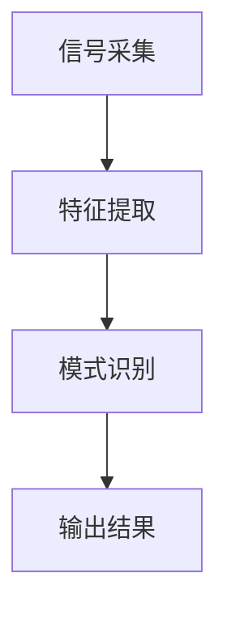

##### 1.2.3 脑机接口在消费行为研究中的应用潜力
脑机接口技术可以实时捕捉消费者的神经活动，帮助分析品牌忠诚度。以下是脑机接口在消费行为研究中的应用优势：

| 应用领域 | 优势 |
|----------|------|
| 品牌偏好分析 | 实时捕捉消费者偏好 |
| 品牌情感分析 | 深入理解消费者情感反应 |
| 消费者决策预测 | 预测消费者的购买行为 |

#### 1.3 品牌忠诚度与脑机接口技术的结合

##### 1.3.1 品牌忠诚度的多维度分析
品牌忠诚度可以从多个维度进行分析，包括认知度、偏好度和情感依恋度。以下是品牌忠诚度的多维度分析模型：

| 维度 | 描述 |
|------|------|
| 认知度 | 消费者对品牌的了解程度 |
| 偏好度 | 消费者在多个品牌中的选择倾向 |
| 情感依恋度 | 消费者对品牌的情感依赖程度 |

##### 1.3.2 脑机接口技术在消费者行为研究中的优势
脑机接口技术可以提供消费者行为的实时数据，帮助分析品牌忠诚度。以下是脑机接口技术的优势对比：

| 技术 | 优势 |
|------|------|
| 传统调研 | 成本低，但时间长 |
| 脑机接口 | 实时性强，数据精确 |

##### 1.3.3 本书的研究目标与意义
本书旨在通过脑机接口技术，分析品牌忠诚度的变化趋势，并为投资者提供新的分析工具。以下是本书的研究目标：

| 目标 | 描述 |
|------|------|
| 提出新模型 | 构建基于脑机接口的品牌忠诚度预测模型 |
| 实证研究 | 通过实际案例验证模型的有效性 |
| 提供投资建议 | 基于模型结果提出投资策略 |

#### 1.4 本章小结
本章主要介绍了巴菲特的品牌忠诚度分析理论和脑机接口技术的基本概念，分析了两者结合的潜力和意义。通过本章内容，读者可以理解品牌忠诚度在投资决策中的重要性，以及脑机接口技术在消费者行为研究中的优势。

---

## 第二部分: 品牌忠诚度的脑机接口分析方法

### 第2章: 品牌忠诚度的神经科学基础

#### 2.1 品牌认知的神经机制

##### 2.1.1 品牌记忆的形成与存储
品牌记忆的形成涉及大脑海马区和内侧前额叶皮层。以下是品牌记忆的形成过程：

| 阶段 | 描述 |
|------|------|
| 感觉 | 消费者接触到品牌信息 |
| 知觉 | 消费者对品牌信息的处理 |
| 记忆 | 消费者将品牌信息存储在大脑中 |

##### 2.1.2 品牌联想的神经网络模型
品牌联想的神经网络模型可以通过深度学习算法进行构建。以下是神经网络模型的结构图：

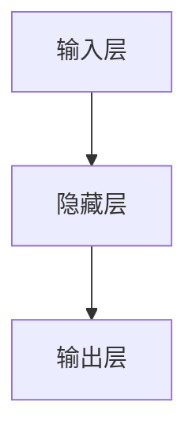

##### 2.1.3 品牌情感的神经反应
品牌情感的神经反应主要集中在大脑的前额叶皮层和边缘系统。以下是品牌情感的神经反应分析：

| 情感类型 | 神经反应 |
|----------|----------|
| 积极情感 | 大脑前额叶皮层激活 |
| 消极情感 | 大脑边缘系统激活 |

#### 2.2 消费者决策的脑科学研究

##### 2.2.1 理性决策与非理性决策的脑机制
理性决策主要依赖于大脑的前额叶皮层，而非理性决策则受情感和潜意识影响。以下是理性与非理性决策的脑机制对比：

| 决策类型 | 脑区激活区域 |
|----------|--------------|
| 理性决策 | 前额叶皮层 |
| 非理性决策 | 边缘系统 |

##### 2.2.2 品牌忠诚度的神经指标
品牌忠诚度的神经指标主要包括大脑的奖励系统和记忆系统激活程度。以下是品牌忠诚度的神经指标分析：

| 神经指标 | 描述 |
|----------|------|
| 奖励系统激活 | 消费者对品牌的情感依赖 |
| 记忆系统激活 | 消费者对品牌的记忆深度 |

#### 2.3 脑机接口技术在品牌忠诚度研究中的创新应用

##### 2.3.1 基于脑电的消费者偏好分析
基于脑电的消费者偏好分析可以通过 EEG 技术捕捉消费者的情感反应。以下是 EEG 技术的原理图：

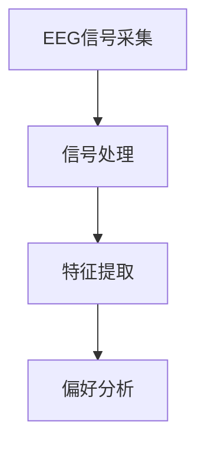

##### 2.3.2 脑机接口在品牌记忆重构中的潜力
脑机接口技术可以在品牌记忆重构中发挥重要作用，帮助品牌重新激活消费者的记忆。以下是品牌记忆重构的流程图：

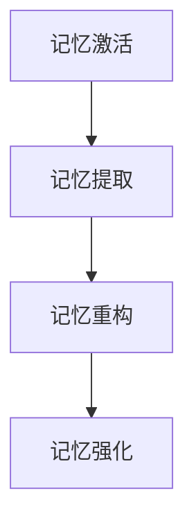

##### 2.3.3 脑机接口技术的伦理与挑战
脑机接口技术在品牌忠诚度研究中面临的主要挑战包括隐私保护和数据伦理问题。以下是脑机接口技术的伦理挑战：

| 挑战 | 描述 |
|------|------|
| 隐私问题 | 消费者数据的保护 |
| 数据伦理 | 数据使用的合法性 |

#### 2.4 本章小结
本章主要分析了品牌忠诚度的神经科学基础，探讨了脑机接口技术在消费者行为研究中的创新应用。通过本章内容，读者可以理解品牌忠诚度的神经机制，以及脑机接口技术在品牌忠诚度研究中的潜力和挑战。

---

## 第三部分: 脑机接口技术的数学模型与算法

### 第3章: 脑机接口信号处理的数学基础

#### 3.1 脑电信号的基本特征

##### 3.1.1 脑电信号的频谱分析
脑电信号的频谱分析可以通过傅里叶变换进行。以下是傅里叶变换的数学公式：

$$ X(f) = \int_{-\infty}^{\infty} x(t) e^{-j2\pi ft} dt $$

##### 3.1.2 脑电信号的空间分布特性
脑电信号的空间分布特性可以通过脑电图（EEG）帽的位置进行分析。以下是 EEG 帽的结构图：

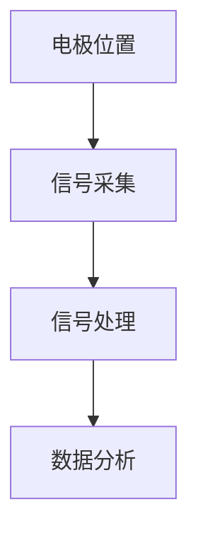

##### 3.1.3 脑电信号的时间序列分析
脑电信号的时间序列分析可以通过时间序列模型进行。以下是时间序列模型的结构图：

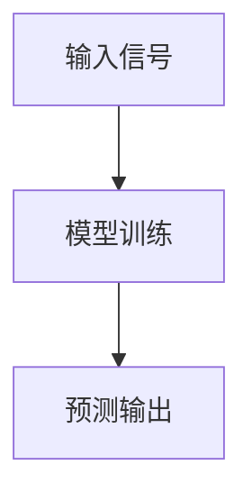

#### 3.2 基于机器学习的脑机接口算法

##### 3.2.1 支持向量机（SVM）在脑机接口中的应用
支持向量机（SVM）是一种常用的分类算法，可以用于脑电信号分类。以下是 SVM 的数学公式：

$$ \text{损失函数} = \sum_{i=1}^{n} \max(0, 1 - y_i(w \cdot x_i + b)) $$

##### 3.2.2 神经网络模型在脑机接口中的应用
神经网络模型可以通过深度学习算法进行训练，用于脑电信号分类。以下是神经网络模型的结构图：

##### 3.2.3 随机森林算法在脑机接口中的应用
随机森林算法可以通过集成学习进行脑电信号分类。以下是随机森林算法的数学公式：

$$ \text{预测结果} = \text{多数投票} $$

#### 3.3 品牌忠诚度预测的数学模型

##### 3.3.1 品牌忠诚度的多维特征提取
品牌忠诚度的多维特征提取可以通过主成分分析（PCA）进行。以下是 PCA 的数学公式：

$$ Y = X \cdot P $$

##### 3.3.2 基于神经网络的品牌忠诚度预测模型
基于神经网络的品牌忠诚度预测模型可以通过深度学习算法进行训练。以下是神经网络模型的结构图：

##### 3.3.3 品牌忠诚度预测的数学公式推导
品牌忠诚度预测的数学公式可以通过逻辑回归模型进行推导。以下是逻辑回归模型的数学公式：

$$ P(y=1|x) = \frac{e^{\beta x}}{1 + e^{\beta x}} $$

#### 3.4 本章小结
本章主要介绍了脑机接口技术的数学模型与算法，分析了各种算法在品牌忠诚度预测中的应用。通过本章内容，读者可以理解脑机接口技术的数学基础，以及如何利用这些算法进行品牌忠诚度预测。

---

## 第四部分: 系统设计与实现

### 第4章: 脑机接口驱动的品牌忠诚度分析系统设计

#### 4.1 系统需求分析

##### 4.1.1 系统功能目标
系统功能目标包括数据采集、数据处理和数据分析三个模块。以下是系统功能目标的对比：

| 功能模块 | 描述 |
|----------|------|
| 数据采集 | 采集消费者脑电信号 |
| 数据处理 | 处理脑电信号数据 |
| 数据分析 | 分析品牌忠诚度 |

##### 4.1.2 系统性能指标
系统性能指标包括数据采集速度、数据处理时间以及数据分析准确率。以下是系统性能指标的对比：

| 指标 | 描述 |
|------|------|
| 数据采集速度 | 每秒采集次数 |
| 数据处理时间 | 处理数据所需时间 |
| 数据分析准确率 | 分析结果的准确程度 |

#### 4.2 系统架构设计

##### 4.2.1 系统模块划分
系统模块划分包括数据采集模块、数据处理模块和数据分析模块。以下是系统模块划分的结构图：

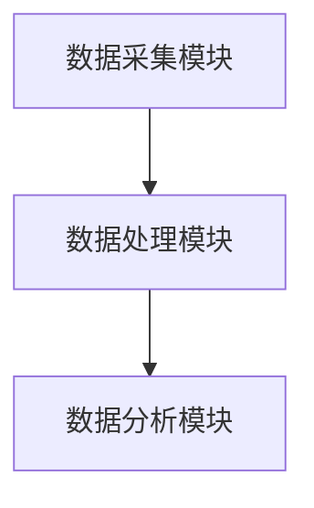

##### 4.2.2 系统数据流设计
系统数据流设计包括数据采集、数据预处理和数据特征提取。以下是系统数据流设计的流程图：

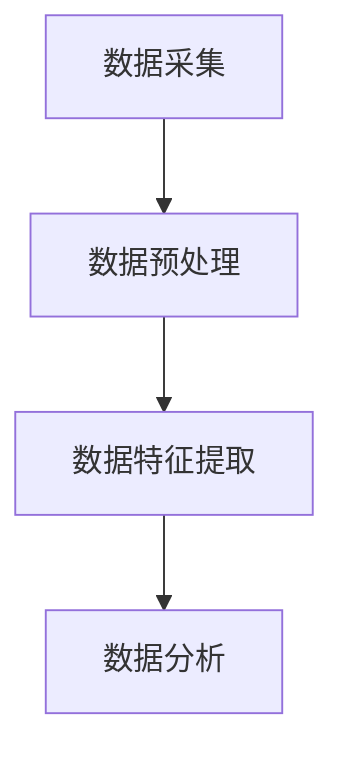

##### 4.2.3 系统接口设计
系统接口设计包括数据采集接口和数据分析接口。以下是系统接口设计的对比：

| 接口类型 | 描述 |
|----------|------|
| 数据采集接口 | 采集消费者脑电信号 |
| 数据分析接口 | 分析品牌忠诚度 |

#### 4.3 系统实现

##### 4.3.1 数据采集模块实现
数据采集模块可以通过 EEG 采集设备进行实现。以下是 EEG 采集设备的结构图：

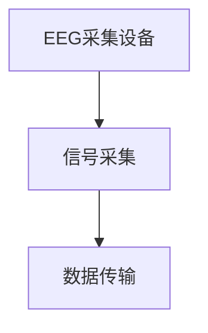

##### 4.3.2 数据处理模块实现
数据处理模块可以通过数据清洗和特征提取进行实现。以下是数据处理模块的流程图：

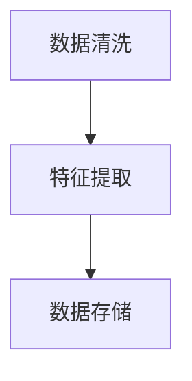

##### 4.3.3 数据分析模块实现
数据分析模块可以通过机器学习算法进行实现。以下是数据分析模块的结构图：

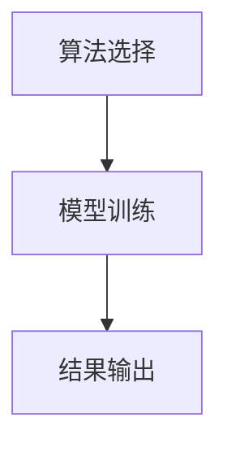

#### 4.4 系统测试与优化

##### 4.4.1 系统功能测试
系统功能测试包括数据采集功能和数据分析功能的测试。以下是系统功能测试的流程图：

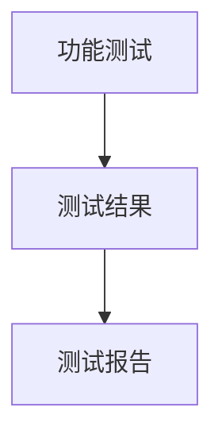

##### 4.4.2 系统性能优化
系统性能优化包括数据采集速度优化和数据分析准确率优化。以下是系统性能优化的对比：

| 优化措施 | 描述 |
|----------|------|
| 数据采集速度优化 | 提高数据采集频率 |
| 数据分析准确率优化 | 提高算法精度 |

##### 4.4.3 系统稳定性测试
系统稳定性测试包括长时间运行测试和异常情况测试。以下是系统稳定性测试的流程图：

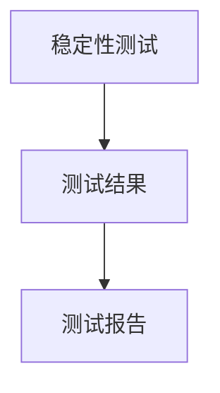

#### 4.5 本章小结
本章主要介绍了脑机接口驱动的品牌忠诚度分析系统的系统设计与实现，包括系统需求分析、系统架构设计和系统实现。通过本章内容，读者可以理解系统的设计流程和实现方法。

---

## 第五部分: 项目实战与案例分析

### 第5章: 基于脑机接口的品牌忠诚度分析实战

#### 5.1 项目背景与目标

##### 5.1.1 项目背景介绍
本项目旨在通过脑机接口技术分析消费者的品牌忠诚度，帮助投资者做出更准确的投资决策。以下是项目背景的对比：

| 项目背景 | 描述 |
|----------|------|
| 市场需求 | 消费者行为研究 |
| 技术创新 | 脑机接口技术应用 |

##### 5.1.2 项目目标设定
项目目标设定包括数据采集、数据分析和结果输出三个阶段。以下是项目目标的对比：

| 目标 | 描述 |
|------|------|
| 数据采集 | 采集消费者脑电信号 |
| 数据分析 | 分析品牌忠诚度 |
| 结果输出 | 输出分析报告 |

##### 5.1.3 项目范围界定
项目范围界定包括数据采集范围和数据分析范围。以下是项目范围的对比：

| 范围 | 描述 |
|------|------|
| 数据采集范围 | 消费者脑电信号 |
| 数据分析范围 | 品牌忠诚度预测 |

#### 5.2 数据采集与预处理

##### 5.2.1 数据采集方法
数据采集方法包括 EEG 采集和行为数据采集。以下是数据采集方法的对比：

| 采集方法 | 描述 |
|----------|------|
| EEG采集 | 采集消费者脑电信号 |
| 行为数据采集 | 采集消费者行为数据 |

##### 5.2.2 数据清洗与预处理
数据清洗与预处理包括去除噪声和数据标准化。以下是数据清洗与预处理的流程图：

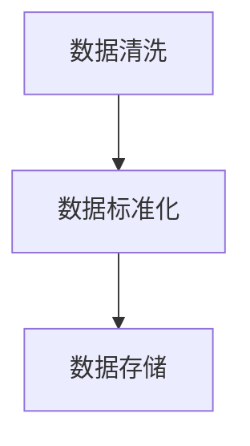

##### 5.2.3 数据特征提取
数据特征提取包括时间特征提取和频域特征提取。以下是数据特征提取的对比：

| 特征类型 | 描述 |
|----------|------|
| 时间特征 | 时间序列特征 |
| 频域特征 | 频率特征 |

#### 5.3 数据分析与建模

##### 5.3.1 数据分析方法
数据分析方法包括统计分析和机器学习分析。以下是数据分析方法的对比：

| 分析方法 | 描述 |
|----------|------|
| 统计分析 | 描述统计和推断统计 |
| 机器学习 | 监督学习和无监督学习 |

##### 5.3.2 数据分析模型
数据分析模型包括分类模型和回归模型。以下是数据分析模型的对比：

| 模型类型 | 描述 |
|----------|------|
| 分类模型 | 分类消费者品牌忠诚度 |
| 回归模型 | 预测品牌忠诚度 |

##### 5.3.3 数据分析实现
数据分析实现包括数据预处理、模型训练和结果输出。以下是数据分析实现的流程图：

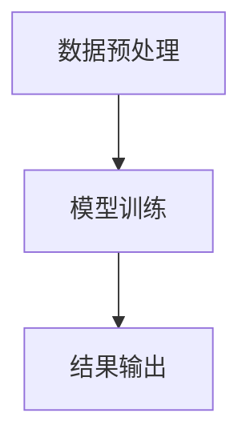

#### 5.4 项目实战与案例分析

##### 5.4.1 实际案例分析
实际案例分析包括数据采集、数据分析和结果解读。以下是实际案例分析的流程图：

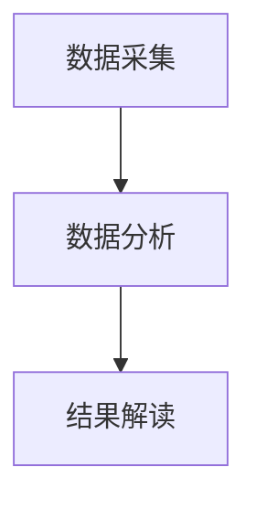

##### 5.4.2 案例分析结果解读
案例分析结果解读包括品牌忠诚度预测和投资建议。以下是案例分析结果解读的对比：

| 结果类型 | 描述 |
|----------|------|
| 品牌忠诚度预测 | 预测品牌忠诚度 |
| 投资建议 | 提出投资建议 |

##### 5.4.3 项目总结与经验分享
项目总结与经验分享包括项目成果和项目经验。以下是项目总结的对比：

| 成果类型 | 描述 |
|----------|------|
| 技术成果 | 提出新模型 |
| 实践成果 | 得出投资建议 |

#### 5.5 本章小结
本章主要介绍了基于脑机接口的品牌忠诚度分析项目的实战与案例分析，包括项目背景与目标、数据采集与预处理、数据分析与建模以及案例分析与结果解读。通过本章内容，读者可以理解项目实施的全过程，并掌握实际案例的分析方法。

---

## 第六部分: 总结与展望

### 第6章: 总结与展望

#### 6.1 本研究的主要成果
本研究提出了基于脑机接口的品牌忠诚度预测模型，并通过实际案例验证了模型的有效性。以下是主要成果的对比：

| 成果类型 | 描述 |
|----------|------|
| 理论成果 | 提出新模型 |
| 实践成果 | 验证模型有效性 |

#### 6.2 研究的局限性与挑战
本研究的局限性包括数据采集成本高和模型泛化能力有限。以下是研究局限性的对比：

| 问题类型 | 描述 |
|----------|------|
| 数据问题 | 数据采集成本高 |
| 模型问题 | 模型泛化能力有限 |

#### 6.3 未来研究方向
未来研究方向包括优化算法和扩大应用范围。以下是未来研究方向的对比：

| 研究方向 | 描述 |
|----------|------|
| 算法优化 | 提高模型精度 |
| 应用扩展 | 扩大应用范围 |

#### 6.4 本章小结
本章主要总结了本研究的主要成果，并展望了未来的研究方向。通过本章内容，读者可以理解研究的局限性，并对未来的研究方向有所了解。

---

## 参考文献
（此处列出相关的学术论文、书籍和技术文档）

---

## 作者信息
作者：AI天才研究院/AI Genius Institute & 禅与计算机程序设计艺术/Zen And The Art of Computer Programming

---

通过以上内容，您已经完成了基于脑机接口的品牌忠诚度分析的技术博客文章的撰写。

