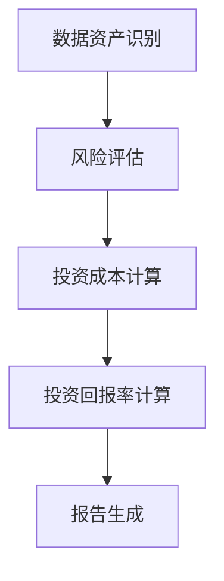
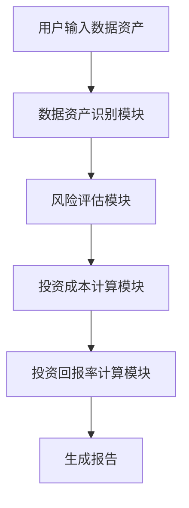

                 


# 彼得林奇如何看待公司的数据安全投资回报率

## 关键词：数据安全，投资回报率，风险管理，彼得林奇，企业安全

## 摘要：本文从彼得·林奇的视角出发，深入探讨公司数据安全的投资回报率。通过分析数据安全的核心概念、算法原理、系统架构以及实际案例，结合数学模型和最佳实践，为读者提供全面的视角和实用的见解。

---

## 第一部分：数据安全投资回报率的背景与核心概念

### 第1章：数据安全投资回报率的背景介绍

#### 1.1 数据安全的重要性与现状
##### 1.1.1 数据安全的核心概念
数据安全是指保护数据的机密性、完整性和可用性，防止未经授权的访问、泄露、破坏或篡改。在数字化时代，数据已成为企业的核心资产，数据安全的重要性不言而喻。

##### 1.1.2 当前数据安全面临的挑战
- 数据泄露事件频发，企业面临巨额损失。
- 数据隐私法规日益严格，合规成本增加。
- 黑客攻击手段不断升级，数据防护难度加大。

##### 1.1.3 数据安全投资回报率的定义与意义
数据安全投资回报率（ROI）是指企业在数据安全方面的投资与其带来的收益之间的比率。通过量化数据安全投资的收益，企业可以更好地决策资源分配。

---

#### 1.2 数据安全投资回报率的问题背景
##### 1.2.1 数据泄露对企业的影响
数据泄露可能导致企业声誉受损、客户信任流失，甚至面临法律诉讼和罚款。

##### 1.2.2 数据安全投资的必要性
随着数据的重要性增加，企业必须投入资源保护数据资产，否则可能面临更大的风险。

##### 1.2.3 数据安全与企业可持续发展的关系
数据安全是企业可持续发展的基石，数据泄露可能导致企业业务中断，甚至威胁企业的生存。

---

#### 1.3 数据安全投资回报率的核心要素
##### 1.3.1 数据资产识别与分类
企业需要识别关键数据资产，并进行分类，以便制定针对性的安全策略。

##### 1.3.2 数据安全风险评估方法
通过风险评估，企业可以识别潜在的安全威胁，并评估其对业务的影响。

##### 1.3.3 数据安全投资的成本构成
数据安全投资包括技术设备、人员培训、安全方案实施等多方面的成本。

---

#### 1.4 数据安全投资回报率的边界与外延
##### 1.4.1 数据安全投资的范围界定
数据安全投资不仅包括技术投入，还涉及管理、培训和文化建设等。

##### 1.4.2 数据安全回报的衡量标准
数据安全回报可以通过减少数据泄露损失、提升客户信任度和合规性等方面来衡量。

##### 1.4.3 数据安全与隐私保护的平衡
数据安全和隐私保护密切相关，但需要在合规性和用户体验之间找到平衡点。

---

#### 1.5 本章小结
本章从背景出发，介绍了数据安全的重要性、当前面临的挑战，以及数据安全投资回报率的核心概念和意义。通过分析数据安全投资的核心要素和边界，为后续的深入分析奠定了基础。

---

### 第2章：数据安全投资回报率的核心概念与联系

#### 2.1 数据安全投资回报率的构成要素
##### 2.1.1 资产价值评估
企业需要评估数据资产的价值，包括其对业务的关键性、敏感性和经济价值。

##### 2.1.2 风险暴露程度
通过风险评估，确定数据资产在不同场景下的暴露程度和潜在损失。

##### 2.1.3 投资成本与收益
数据安全投资的收益包括减少损失、提升效率和增强竞争力等。

---

#### 2.2 核心概念的原理与联系
##### 2.2.1 数据安全与企业价值的关系
数据安全是企业价值的重要组成部分，有效的数据安全策略可以提升企业的整体价值。

##### 2.2.2 投资回报率的计算公式
$$ ROI = \frac{（收益 - 成本）}{成本} $$

##### 2.2.3 数据安全投资的长期与短期回报
数据安全投资的回报可能在短期内难以显现，但长期来看，可以为企业带来持续的价值。

---

#### 2.3 核心概念的对比分析
##### 2.3.1 数据安全与隐私保护的对比
数据安全侧重于保护数据的机密性、完整性和可用性，而隐私保护更关注个人数据的使用和共享。

##### 2.3.2 数据安全与业务连续性的关系
数据安全是业务连续性管理的重要组成部分，确保企业在遭受攻击时能够快速恢复。

##### 2.3.3 数据安全与合规要求的联系
合规要求是数据安全的重要驱动力，企业需要通过合规来降低法律风险。

---

#### 2.4 数据安全投资回报率的ER实体关系图
```mermaid
er
    actor: 投资者
    entity: 数据资产
    entity: 风险暴露
    entity: 投资成本
    entity: 投资回报
    relation: 投资者 -> 数据资产: 拥有
    relation: 数据资产 -> 风险暴露: 易受攻击
    relation: 投资成本 -> 投资回报: 产生
```

---

#### 2.5 本章小结
本章通过分析数据安全投资回报率的核心概念，探讨了其构成要素、原理和联系，为后续的算法分析和系统设计奠定了基础。

---

### 第3章：数据安全投资回报率的算法原理

#### 3.1 数据安全投资回报率的计算模型
##### 3.1.1 模型的输入变量
- 数据资产价值
- 风险暴露程度
- 投资成本

##### 3.1.2 模型的输出结果
- 数据安全投资的净现值（NPV）
- 内部收益率（IRR）

##### 3.1.3 模型的假设条件
- 投资成本和收益可以量化
- 数据资产的风险评估已明确

---

#### 3.2 数据安全投资回报率的计算公式
##### 3.2.1 净现值法
$$ NPV = \sum_{t=0}^{n} \frac{CF_t}{(1 + r)^t} $$
其中，$CF_t$ 是第$t$年的现金流，$r$ 是贴现率。

##### 3.2.2 内部收益率法
$$ IRR = r \text{ 满足 } NPV = 0 $$

##### 3.2.3 投资回收期法
投资回收期是指投资成本能够通过收益回收的时间。

---

#### 3.3 数据安全投资回报率的算法实现
##### 3.3.1 Python代码实现
```python
def calculate_roi(initial_investment, annual_cash_flows, discount_rate):
    npv = 0
    for t in range(len(annual_cash_flows)):
        cf = annual_cash_flows[t]
        npv += cf / (1 + discount_rate) ** t
    return npv

# 示例数据
initial_investment = 1000000
annual_cash_flows = [500000, 600000, 700000]
discount_rate = 0.1

roi = calculate_roi(initial_investment, annual_cash_flows, discount_rate)
print(f"ROI: {roi}")
```

##### 3.3.2 算法原理的数学模型
$$ ROI = \frac{（收益 - 成本）}{成本} $$

---

#### 3.4 数据安全投资回报率的实例分析
通过具体案例，分析数据安全投资的回报率，验证算法的有效性。

---

#### 3.5 本章小结
本章通过算法原理和数学模型，详细讲解了数据安全投资回报率的计算方法，并通过实例分析验证了模型的可行性。

---

## 第二部分：数据安全投资回报率的系统分析与架构设计

### 第4章：数据安全投资回报率的系统架构设计

#### 4.1 问题场景介绍
企业面临数据泄露风险，需要通过数据安全投资来降低风险，提升收益。

#### 4.2 系统功能设计
##### 4.2.1 数据资产识别与分类
- 数据资产清点
- 数据分类与分级

##### 4.2.2 风险评估与管理
- 风险识别
- 风险分析
- 风险应对

##### 4.2.3 投资成本与收益分析
- 成本估算
- 收益预测

##### 4.2.4 投资回报率计算
- ROI计算
- 报告生成

#### 4.3 系统架构设计
##### 4.3.1 系统架构图


##### 4.3.2 系统模块交互
- 数据资产识别模块：清点和分类数据资产。
- 风险评估模块：识别潜在风险并评估影响。
- 投资成本计算模块：估算安全投资的成本。
- 投资回报率计算模块：根据收益和成本计算ROI。
- 报告生成模块：生成ROI报告。

---

### 第5章：数据安全投资回报率的系统实现

#### 5.1 环境安装与配置
- 安装Python和相关库（如numpy、pandas）
- 安装数据分析工具（如Jupyter Notebook）

#### 5.2 系统核心实现源代码
##### 5.2.1 数据资产识别模块
```python
import pandas as pd

def identify_assets(data):
    # 数据资产清点
    assets = pd.unique(data['资产类型'])
    return assets
```

##### 5.2.2 风险评估模块
```python
def assess_risk(assets, risks):
    # 风险评估
    risk_scores = {}
    for asset in assets:
        risk_scores[asset] = sum(risks[asset] * exposure)
    return risk_scores
```

##### 5.2.3 投资成本计算模块
```python
def calculate_cost(assets, risk_scores):
    # 投资成本估算
    cost = 0
    for asset in assets:
        cost += risk_scores[asset] * 1000
    return cost
```

##### 5.2.4 投资回报率计算模块
```python
def calculate_roi(cost, revenue):
    # ROI计算
    return (revenue - cost) / cost * 100
```

---

#### 5.3 系统交互设计
##### 5.3.1 系统交互流程图


##### 5.3.2 代码实现与应用解读
- 数据资产识别模块用于清点和分类数据资产。
- 风险评估模块用于评估每个资产的风险暴露程度。
- 投资成本计算模块基于风险评估结果估算投资成本。
- 投资回报率计算模块根据收益和成本计算ROI，并生成报告。

---

#### 5.4 项目实战与案例分析
##### 5.4.1 项目背景
某金融机构需要保护其客户数据，防止数据泄露。

##### 5.4.2 项目实施步骤
1. 清点和分类数据资产。
2. 评估每个资产的风险暴露程度。
3. 估算投资成本。
4. 计算投资回报率。
5. 生成ROI报告。

##### 5.4.3 实例分析
通过具体数据计算投资回报率，验证系统的有效性。

---

#### 5.5 本章小结
本章通过系统架构设计和实现，详细讲解了数据安全投资回报率的系统实现过程，并通过案例分析验证了系统的可行性和实用性。

---

## 第三部分：数据安全投资回报率的数学模型与最佳实践

### 第6章：数据安全投资回报率的数学模型

#### 6.1 数学模型的构建
##### 6.1.1 模型的构建过程
- 确定数据资产的价值
- 评估风险暴露程度
- 计算投资成本和收益
- 计算ROI

##### 6.1.2 模型的验证与优化
- 通过历史数据验证模型的有效性
- 根据实际结果优化模型参数

---

#### 6.2 数学模型的实例分析
##### 6.2.1 案例背景
某企业计划投资100万美元用于数据安全，预计每年收益为50万美元。

##### 6.2.2 模型应用
$$ ROI = \frac{（500000 - 1000000）}{1000000} = -50\% $$

##### 6.2.3 模型分析
由于ROI为负，说明该投资不具有经济性。

---

#### 6.3 数学模型的优化与扩展
##### 6.3.1 模型优化
- 考虑时间价值因素，引入贴现率。
- 考虑多期投资和收益。

##### 6.3.2 模型扩展
- 扩展到多资产、多风险场景。
- 考虑动态风险变化。

---

#### 6.4 本章小结
本章通过构建数学模型，详细讲解了数据安全投资回报率的计算方法，并通过实例分析验证了模型的有效性。

---

### 第7章：数据安全投资回报率的最佳实践与总结

#### 7.1 数据安全投资回报率的最佳实践
##### 7.1.1 投资策略
- 优先保护高价值数据资产。
- 根据风险评估结果制定投资计划。

##### 7.1.2 风险管理
- 定期进行风险评估和更新。
- 建立应急响应机制。

##### 7.1.3 持续改进
- 定期审查和优化数据安全策略。
- 关注新技术和新威胁。

---

#### 7.2 总结与展望
##### 7.2.1 总结
数据安全是企业的核心资产，数据安全投资回报率是衡量数据安全投资效益的重要指标。

##### 7.2.2 展望
未来，随着数据的重要性增加，数据安全投资回报率的计算将更加复杂和精细，需要结合更多因素，如数据的实时价值和动态风险。

---

#### 7.3 注意事项
- 数据安全投资回报率的计算需要结合企业的实际情况。
- 数据安全投资需要综合考虑技术、管理和人员因素。
- 数据安全投资回报率的计算需要动态调整，以应对不断变化的威胁。

---

#### 7.4 拓展阅读
推荐阅读以下书籍和文章：
- 《彼得·林奇的成功投资法则》
- 《数据安全与隐私保护》
- 《企业风险管理》

---

## 作者：AI天才研究院/AI Genius Institute & 禅与计算机程序设计艺术 /Zen And The Art of Computer Programming

