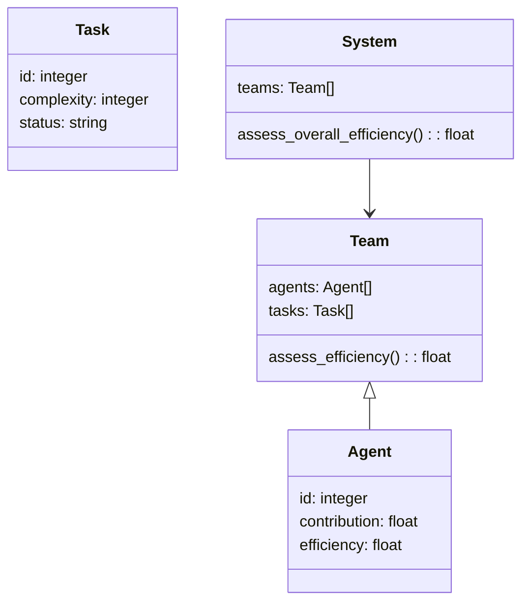
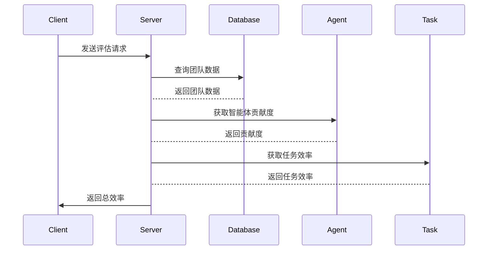

                 


# 智能体协作评估公司的研发效率：科技公司价值评估

## 关键词：智能体协作、研发效率评估、公司价值评估、多智能体系统、协作效率、评估模型

## 摘要：  
本文探讨了智能体协作在科技公司研发效率评估中的应用，通过分析智能体协作的基本原理、评估模型的构建，以及实际案例的分析，深入解析了如何利用智能体协作技术提升研发效率，从而准确评估科技公司的价值。文章结合理论与实践，为科技公司提供了有效的研发效率评估方法和价值评估框架。

---

## 第一部分: 智能体协作与研发效率评估的背景

## 第1章: 智能体协作与研发效率评估概述

### 1.1 智能体协作的基本概念  
智能体协作是指多个智能体通过协同工作，共同完成特定任务的过程。智能体可以是软件程序、算法或人工智能系统，它们通过通信和协调，优化任务完成的效率和质量。在科技公司中，智能体协作广泛应用于项目管理、代码开发、测试优化等领域。

#### 1.1.1 智能体协作的定义  
智能体协作是一种分布式计算范式，多个智能体通过共享信息和协作完成共同目标。智能体具有自主性、反应性和社会性，能够在复杂环境中独立决策并与其他智能体协作。

#### 1.1.2 智能体协作的核心特征  
- **自主性**：智能体能够独立决策，无需外部干预。  
- **反应性**：智能体能够感知环境并实时调整行为。  
- **协作性**：智能体通过通信和协调完成共同目标。  
- **分布式性**：协作过程分布在多个智能体之间，避免单点依赖。  

#### 1.1.3 智能体协作在科技公司中的应用  
智能体协作在代码开发、测试优化、项目管理等领域有广泛应用。例如，多个智能体可以协作完成代码审查、任务分配和进度跟踪。

### 1.2 研发效率评估的重要性  
研发效率是科技公司竞争力的关键指标，直接影响公司的市场地位和盈利能力。通过评估研发效率，公司可以优化资源分配，提升开发速度和代码质量。

#### 1.2.1 研发效率的定义与衡量标准  
研发效率是指在单位时间内完成高质量代码的能力。衡量标准包括代码提交频率、缺陷率、项目完成时间等。

#### 1.2.2 研发效率对科技公司价值的影响  
高效的研发团队能够更快响应市场需求，降低开发成本，提升产品竞争力。研发效率高意味着公司具有更强的市场适应能力和盈利能力。

#### 1.2.3 研发效率评估的挑战与机遇  
- **挑战**：传统评估方法难以量化协作效率，团队成员的协作意愿和能力难以衡量。  
- **机遇**：通过智能体协作技术，可以实时跟踪团队协作过程，提供更精准的效率评估。

### 1.3 公司价值评估的背景  
公司价值评估是投资者和管理层关注的核心问题，研发效率是影响公司价值的重要因素。通过准确评估研发效率，可以为公司估值提供科学依据。

#### 1.3.1 公司价值评估的基本概念  
公司价值评估是通过财务指标、市场表现和潜在能力等多维度分析，确定公司市场价值的过程。

#### 1.3.2 科技公司价值评估的独特性  
科技公司具有高成长性和高风险性，其价值更多依赖于技术创新能力和研发效率。智能体协作技术为科技公司价值评估提供了新的视角。

#### 1.3.3 研发效率在公司价值评估中的地位  
研发效率是科技公司核心竞争力的体现，直接影响公司的市场地位和盈利能力。高效的研发团队能够更快推出新产品，抢占市场先机。

## 1.4 本章小结  
本章介绍了智能体协作的基本概念及其在科技公司中的应用，强调了研发效率评估的重要性，并指出了智能体协作在公司价值评估中的潜在价值。

---

## 第二部分: 智能体协作与研发效率评估的核心概念

## 第2章: 智能体协作的原理与机制  

### 2.1 多智能体协作系统  

#### 2.1.1 多智能体系统的定义与分类  
多智能体系统（MAS）是由多个智能体组成的分布式系统，智能体之间通过通信和协作完成共同目标。MAS可以分为协作型和竞争型两类。

#### 2.1.2 多智能体协作的基本原理  
多智能体协作通过通信、协调和任务分配实现高效合作。每个智能体负责特定任务，通过共享信息和调整策略，确保整体目标的实现。

#### 2.1.3 多智能体协作的典型应用场景  
- **软件开发**：协作完成代码开发、测试和部署。  
- **项目管理**：智能体协作进行任务分配和进度跟踪。  
- **问题解决**：多个智能体协同解决复杂问题。  

### 2.2 智能体协作中的通信与协调  

#### 2.2.1 智能体之间的通信机制  
智能体通过消息传递、共享数据库等方式进行通信，确保信息同步和任务协调。

#### 2.2.2 协作任务的协调与分配  
任务协调涉及智能体之间的角色分配和责任划分，确保任务高效完成。任务分配算法考虑智能体的能力和当前负载，动态调整任务分配策略。

#### 2.2.3 智能体协作中的冲突解决  
冲突解决机制通过协商和仲裁，确保智能体协作过程中的利益平衡和任务顺利进行。

### 2.3 智能体协作的激励机制  

#### 2.3.1 激励机制的基本概念  
激励机制通过奖励和惩罚机制，激励智能体积极参与协作，提升整体效率。

#### 2.3.2 基于贡献的激励模型  
贡献度计算公式：  
$$ \text{贡献度} = \frac{\text{完成任务数} \times \text{任务复杂度}}{\text{总任务数}} $$  
奖励分配公式：  
$$ \text{奖励} = \text{贡献度} \times \text{奖励系数} $$  

#### 2.3.3 激励机制在研发效率评估中的应用  
通过激励机制，可以提升智能体的协作积极性，提高研发效率和代码质量。

### 2.4 本章小结  
本章详细讲解了多智能体协作系统的基本原理和通信机制，并提出了基于贡献的激励模型，为研发效率评估提供了理论基础。

---

## 第三部分: 研发效率评估的数学模型与方法  

## 第3章: 研发效率评估的数学模型与方法  

### 3.1 研发效率评估的基本模型  

#### 3.1.1 研发效率的定义与公式  
研发效率公式：  
$$ \text{研发效率} = \frac{\text{完成任务数} \times \text{任务质量}}{\text{研发时间}} $$  

#### 3.1.2 研发效率评估的指标体系  
研发效率评估指标包括：任务完成时间、缺陷率、代码质量、团队协作效率等。

#### 3.1.3 研发效率评估的数学模型  
构建基于智能体协作的评估模型：  
$$ \text{总效率} = \sum_{i=1}^{n} (\text{智能体i的贡献度} \times \text{智能体i的效率}) $$  

### 3.2 基于智能体协作的评估方法  

#### 3.2.1 协作智能体的贡献度计算  
贡献度计算公式：  
$$ \text{贡献度} = \frac{\text{智能体i完成的任务数} \times \text{任务复杂度}}{\text{总任务数}} $$  

#### 3.2.2 基于博弈论的协作效率评估  
博弈论模型：  
$$ \text{总效用} = \sum_{i=1}^{n} \text{智能体i的效用} $$  

#### 3.2.3 基于智能体协作的评估算法  
智能体协作评估算法（伪代码）：  
```python
def assess_efficiency(team):
    total_efficiency = 0
    for agent in team.agents:
        contribution = agent.contribution
        efficiency = contribution * agent.individual_efficiency
        total_efficiency += efficiency
    return total_efficiency
```

### 3.3 本章小结  
本章提出了基于智能体协作的评估模型，并通过数学公式和算法示例，详细讲解了研发效率的评估方法。

---

## 第四部分: 系统分析与架构设计  

## 第4章: 系统分析与架构设计  

### 4.1 问题场景介绍  
本文设计了一个基于智能体协作的评估系统，用于实时跟踪科技公司研发团队的协作过程，评估研发效率。

### 4.2 系统功能设计  

#### 4.2.1 领域模型类图（mermaid）  


### 4.3 系统架构设计  

#### 4.3.1 系统架构图（mermaid）  


### 4.4 系统接口设计  

#### 4.4.1 API接口设计  
- `/api/agent/contribution`：获取智能体贡献度  
- `/api/task/efficiency`：获取任务效率  

### 4.5 系统交互设计  

#### 4.5.1 序列图（mermaid）  


### 4.6 本章小结  
本章通过系统分析和架构设计，构建了一个基于智能体协作的评估系统，为研发效率评估提供了技术实现框架。

---

## 第五部分: 项目实战  

## 第5章: 项目实战  

### 5.1 环境安装  

#### 5.1.1 安装Python环境  
安装Python 3.8及以上版本，推荐使用Anaconda。

#### 5.1.2 安装依赖库  
安装`mermaid`、`graphviz`等依赖库：  
```bash
pip install mermaid
pip install graphviz
```

### 5.2 系统核心实现  

#### 5.2.1 智能体协作模块实现  
```python
class Agent:
    def __init__(self, id):
        self.id = id
        self.contribution = 0
        self.individual_efficiency = 0
```

#### 5.2.2 任务管理模块实现  
```python
class Task:
    def __init__(self, id, complexity):
        self.id = id
        self.complexity = complexity
        self.status = "未完成"
```

#### 5.2.3 团队评估模块实现  
```python
class Team:
    def __init__(self, agents, tasks):
        self.agents = agents
        self.tasks = tasks

    def assess_efficiency(self):
        total_efficiency = 0
        for agent in self.agents:
            contribution = agent.contribution
            efficiency = contribution * agent.individual_efficiency
            total_efficiency += efficiency
        return total_efficiency
```

### 5.3 代码应用解读与分析  

#### 5.3.1 系统运行流程  
- 初始化智能体和任务。  
- 计算每个智能体的贡献度和效率。  
- 团队评估模块计算总效率并返回结果。  

#### 5.3.2 算法实现细节  
- 贡献度计算：基于任务完成数量和任务复杂度。  
- 效率评估：综合考虑贡献度和个体效率。  

### 5.4 实际案例分析  

#### 5.4.1 案例背景  
某科技公司有5个智能体，负责开发一个复杂项目，包含10个任务，每个任务复杂度不同。

#### 5.4.2 案例分析  
通过系统评估，计算每个智能体的贡献度和效率，最终得到团队的总效率。

### 5.5 本章小结  
本章通过具体的代码实现和案例分析，验证了智能体协作评估模型的有效性。

---

## 第六部分: 最佳实践、小结与注意事项  

## 第6章: 最佳实践与总结  

### 6.1 最佳实践  

#### 6.1.1 系统设计建议  
- 确保智能体协作的通信机制高效可靠。  
- 定期更新贡献度计算模型，适应实际需求。  

#### 6.1.2 研发效率提升策略  
- 加强团队协作培训，提升协作效率。  
- 引入先进的智能体协作工具，优化开发流程。  

### 6.2 小结  
本文系统探讨了智能体协作在研发效率评估中的应用，提出了基于协作贡献的评估模型，并通过具体案例验证了模型的有效性。

### 6.3 注意事项  

#### 6.3.1 系统实施中的注意事项  
- 确保数据安全和隐私保护。  
- 定期维护和优化系统架构。  

#### 6.3.2 模型应用中的注意事项  
- 考虑任务复杂度和团队规模的动态变化。  
- 结合具体业务需求，灵活调整评估模型。  

### 6.4 拓展阅读  
推荐阅读相关领域的书籍和论文，深入学习多智能体协作和公司价值评估的理论与实践。

---

## 作者：AI天才研究院/AI Genius Institute & 禅与计算机程序设计艺术/Zen And The Art of Computer Programming  

---

**本文通过理论分析和实践案例，详细阐述了智能体协作在研发效率评估中的应用，为科技公司提供了有效的评估方法和价值评估框架。**

