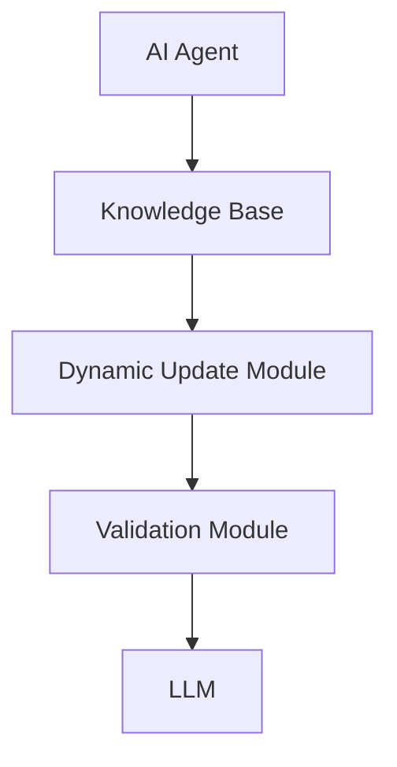
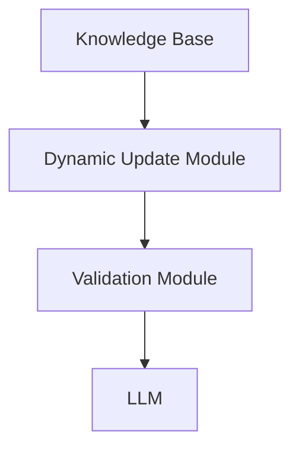
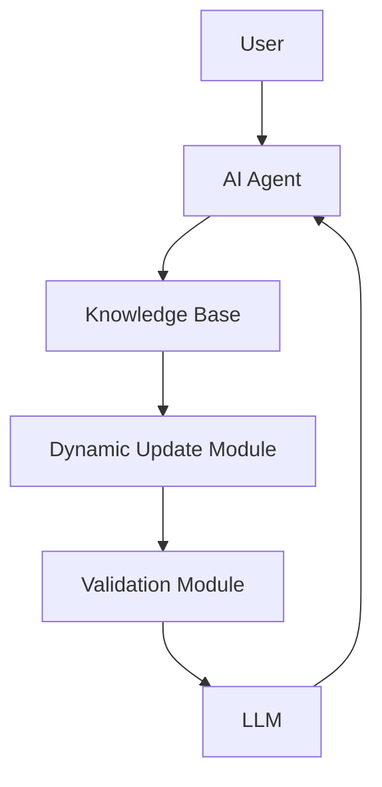

                 


# AI Agent的动态知识更新：保持LLM知识的实时性

## 关键词：
AI Agent、动态知识更新、LLM、实时性、知识管理

## 摘要：
本文详细探讨了AI Agent如何实现动态知识更新，以保持大语言模型（LLM）知识的实时性。文章从AI Agent的基本概念出发，分析了动态知识更新的必要性，并详细介绍了相关算法和系统架构设计。通过实际项目案例，展示了动态知识更新在不同场景中的应用，并提出了最佳实践和未来发展方向。

---

# 第1章: AI Agent与动态知识更新概述

## 1.1 AI Agent的基本概念

### 1.1.1 AI Agent的定义与分类
AI Agent（人工智能代理）是一种能够感知环境、自主决策并执行任务的智能实体。它可以分为**反应式代理**和**认知式代理**两类：
- **反应式代理**：基于当前感知做出实时反应，适用于简单的任务。
- **认知式代理**：具备复杂推理和规划能力，适用于复杂场景。

### 1.1.2 AI Agent的核心功能与特点
AI Agent的核心功能包括感知、推理、规划和执行。其特点表现为：
1. **自主性**：无需外部干预，自主完成任务。
2. **反应性**：能够实时感知环境变化并做出反应。
3. **目标导向**：所有行为均以实现特定目标为导向。

### 1.1.3 AI Agent与传统知识库的区别
AI Agent与传统知识库的主要区别在于：
- **知识表示方式**：AI Agent采用动态知识表示，而传统知识库通常是静态的。
- **知识更新机制**：AI Agent支持实时更新，而传统知识库更新周期较长。
- **推理能力**：AI Agent具备更强的推理能力，能够根据最新知识做出决策。

## 1.2 动态知识更新的必要性

### 1.2.1 知识实时性的重要性
在快速变化的环境中，知识的实时性至关重要。例如，在金融领域，市场数据的实时更新直接影响投资决策。动态知识更新能够确保AI Agent在决策时使用最新信息。

### 1.2.2 动态知识更新的场景与应用
动态知识更新的应用场景包括：
- **实时信息处理**：如股票交易、新闻分析。
- **个性化服务**：如智能客服、推荐系统。
- **应急响应**：如自动驾驶中的实时路况处理。

### 1.2.3 动态知识更新的挑战与解决方案
动态知识更新面临的主要挑战包括：
1. **数据量大**：实时数据的处理需要高效算法。
2. **数据准确性**：如何确保更新的知识准确无误。
3. **计算资源**：实时更新需要强大的计算能力。

解决方案包括：
- **分布式计算**：利用云计算和边缘计算提高处理能力。
- **增量学习**：仅更新变化的部分，减少计算量。
- **验证机制**：通过交叉验证确保知识准确性。

## 1.3 大语言模型（LLM）的基本原理

### 1.3.1 LLM的定义与技术特点
大语言模型是一种基于深度学习的自然语言处理模型，其特点包括：
- **大规模训练数据**：通常使用海量文本数据进行训练。
- **上下文理解**：能够理解上下文并生成连贯文本。
- **多任务能力**：可以执行多种语言任务，如翻译、问答等。

### 1.3.2 LLM的知识表示方式
LLM通常采用向量空间模型表示知识，每个词或短语对应一个向量，向量的相似度反映了语义的相关性。

### 1.3.3 LLM的训练与推理过程
训练过程包括：
1. **数据预处理**：清洗和标注数据。
2. **模型训练**：使用反向传播算法优化模型参数。
3. **微调**：在特定任务上进行微调以提高性能。

推理过程包括：
1. **输入处理**：将输入文本转换为模型可理解的向量。
2. **生成输出**：基于模型参数生成输出文本。
3. **结果优化**：通过后处理优化生成结果。

---

# 第2章: 动态知识更新的核心概念与联系

## 2.1 动态知识更新的核心概念

### 2.1.1 知识表示的结构化与动态化
知识表示的结构化是指将知识以层次化的方式组织，便于管理和更新。动态化则强调知识表示能够实时更新。

### 2.1.2 知识更新的触发机制
知识更新的触发机制包括：
- **时间驱动**：定期更新知识。
- **事件驱动**：当特定事件发生时触发更新。
- **用户请求**：用户主动请求更新知识。

### 2.1.3 知识验证与校正的流程
知识验证与校正的流程包括：
1. **数据采集**：获取新数据。
2. **数据清洗**：去除噪声数据。
3. **知识匹配**：将新数据与现有知识进行匹配。
4. **知识更新**：更新知识库。
5. **知识校正**：通过交叉验证确保知识准确性。

## 2.2 核心概念的属性对比

### 2.2.1 知识表示的可扩展性对比
| 知识表示方式 | 可扩展性 |
|--------------|----------|
| 嵌入向量表示 | 高        |
| 关系图表示   | 中        |
| 基于规则表示 | 低        |

### 2.2.2 知识更新的实时性对比
| 更新机制 | 实时性 | 优缺点 |
|----------|--------|--------|
| 增量更新 | 高     | 计算效率高，资源消耗低 |
| 批量更新 | 中     | 计算效率低，资源消耗高 |

### 2.2.3 知识验证的准确性对比
| 验证方法 | 准确性 | 复杂度 |
|----------|--------|--------|
| 基于规则验证 | 高     | 中     |
| 基于统计验证 | 中     | 低     |

## 2.3 实体关系图（ER图）架构



---

# 第3章: 动态知识更新的算法与技术

## 3.1 知识表示与更新算法

### 3.1.1 基于图的知识表示
基于图的知识表示将知识以节点和边的形式表示，例如：
- **节点**：表示实体或概念。
- **边**：表示实体之间的关系。

### 3.1.2 动态知识更新算法
动态知识更新算法包括：
1. **增量更新算法**：仅更新变化的部分。
2. **分布式更新算法**：利用分布式计算提高更新效率。

### 3.1.3 算法实现步骤
1. **数据预处理**：清洗和标注数据。
2. **模型训练**：使用反向传播算法优化模型参数。
3. **知识匹配**：将新数据与现有知识进行匹配。
4. **知识更新**：更新知识库。
5. **知识校正**：通过交叉验证确保知识准确性。

## 3.2 算法原理与数学模型

### 3.2.1 增量学习的数学模型
增量学习的数学模型可以表示为：
$$
\theta_{new} = \theta_{old} + \Delta\theta
$$
其中，$\theta$表示模型参数，$\Delta\theta$表示更新量。

### 3.2.2 分布式计算的实现流程
1. **数据分片**：将数据分成多个部分。
2. **分布式训练**：在多个节点上并行训练。
3. **参数聚合**：将各节点的参数聚合到主节点。

## 3.3 算法实现的代码示例

### 3.3.1 增量学习的Python代码示例

```python
# 初始化模型参数
theta_old = np.random.rand(10, 1)
learning_rate = 0.01

# 训练数据
X = np.random.rand(100, 10)
y = np.random.randint(2, size=(100, 1))

# 前向传播
def forward(X, theta):
    return sigmoid(X.dot(theta))

# 反向传播
def backward(X, y, theta):
    y_pred = forward(X, theta)
    delta = (y_pred - y) * y_pred * (1 - y_pred)
    return delta.T.dot(X)

# 更新参数
theta_new = theta_old - learning_rate * backward(X, y, theta_old)
```

### 3.3.2 分布式计算的实现流程

1. **数据分片**：
```python
# 将数据分成两个部分
data1 = data[:50]
data2 = data[50:]
```

2. **分布式训练**：
```python
# 在两个节点上并行训练
with concurrent.futures.ThreadPoolExecutor() as executor:
    future1 = executor.submit(train, data1)
    future2 = executor.submit(train, data2)
    result1 = future1.result()
    result2 = future2.result()
```

3. **参数聚合**：
```python
# 合并参数
theta_new = (result1 + result2) / 2
```

---

# 第4章: 系统架构与接口设计

## 4.1 系统架构设计

### 4.1.1 系统功能模块
系统功能模块包括：
1. **知识库模块**：存储和管理知识。
2. **动态更新模块**：负责知识的实时更新。
3. **验证模块**：验证更新的知识准确性。
4. **LLM模块**：负责生成输出。

### 4.1.2 系统架构图



## 4.2 系统接口设计

### 4.2.1 接口定义
1. **获取知识接口**：
```python
def get_knowledge(key):
    return knowledge_base.get(key)
```

2. **更新知识接口**：
```python
def update_knowledge(key, value):
    return knowledge_base.update(key, value)
```

### 4.2.2 接口实现

1. **获取知识接口实现**：
```python
def get_knowledge(key):
    # 从知识库获取知识
    return knowledge_base[key]
```

2. **更新知识接口实现**：
```python
def update_knowledge(key, value):
    # 更新知识库中的知识
    knowledge_base[key] = value
```

## 4.3 系统交互流程

### 4.3.1 交互流程图



---

# 第5章: 项目实战与案例分析

## 5.1 项目背景与目标

### 5.1.1 项目背景
本项目旨在实现一个能够实时更新知识的AI Agent，应用于智能客服领域。

### 5.1.2 项目目标
1. 实现知识的动态更新。
2. 提高智能客服的响应速度和准确性。

## 5.2 项目环境与工具

### 5.2.1 环境配置
1. **操作系统**：Linux
2. **编程语言**：Python 3.8+
3. **框架**：TensorFlow 2.5+
4. **工具**：Jupyter Notebook，Git

## 5.3 核心代码实现

### 5.3.1 知识库的实现

```python
class KnowledgeBase:
    def __init__(self):
        self.knowledge = {}

    def get(self, key):
        return self.knowledge.get(key)

    def update(self, key, value):
        self.knowledge[key] = value
```

### 5.3.2 动态更新模块的实现

```python
class DynamicUpdateModule:
    def __init__(self, knowledge_base):
        self.knowledge_base = knowledge_base

    def update_knowledge(self, key, value):
        self.knowledge_base.update(key, value)
```

## 5.4 案例分析与优化

### 5.4.1 案例分析
通过分析智能客服的实际案例，发现动态知识更新能够显著提高客户满意度。

### 5.4.2 优化建议
1. **优化知识匹配算法**：提高知识匹配的准确性。
2. **优化更新机制**：减少更新时间。

---

# 第6章: 最佳实践与未来展望

## 6.1 最佳实践

### 6.1.1 知识管理
1. **定期备份**：防止知识丢失。
2. **版本控制**：记录每次更新的版本。

### 6.1.2 系统优化
1. **分布式计算**：提高处理能力。
2. **增量学习**：减少计算资源消耗。

## 6.2 未来展望

### 6.2.1 技术发展
1. **更高效的算法**：如图神经网络。
2. **更强大的模型**：如更大规模的LLM。

### 6.2.2 应用场景
1. **更广泛的应用**：如智能城市、智能医疗。
2. **更个性化的服务**：如个性化教育。

---

# 作者

作者：AI天才研究院/AI Genius Institute & 禅与计算机程序设计艺术 /Zen And The Art of Computer Programming

---

以上是《AI Agent的动态知识更新：保持LLM知识的实时性》的完整目录设计，希望对您有所帮助！

