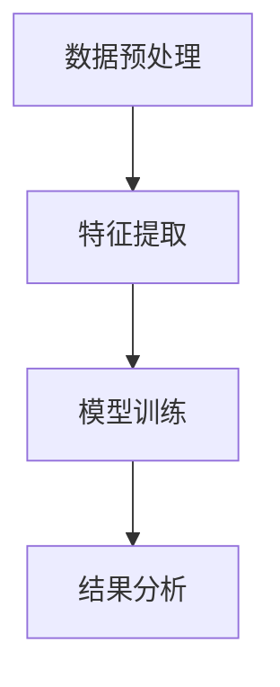
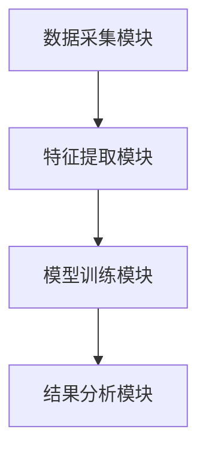
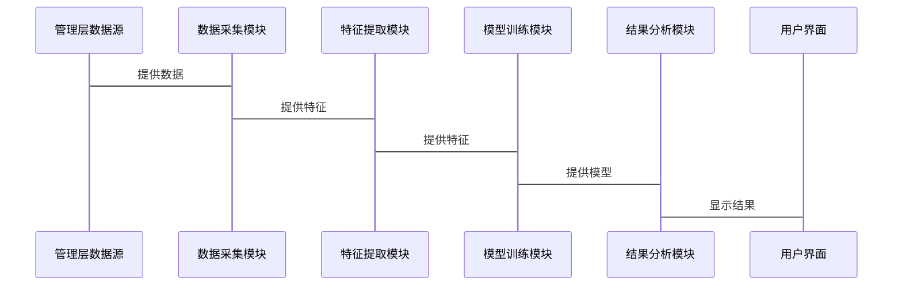

                 


# AI智能体在评估管理层诚信度中的作用

## 关键词：AI智能体、管理层诚信度、评估方法、算法原理、系统架构、项目实战

## 摘要：本文探讨了AI智能体在评估管理层诚信度中的应用，分析了其核心概念、算法原理、系统架构，并通过项目实战展示了实际应用效果。通过多维度的分析和案例研究，本文提出了AI智能体在企业管理中的重要性，并展望了其未来的发展方向。

---

# 第一部分: 问题背景与核心概念

## 第1章: 问题背景与核心概念

### 1.1 管理层诚信度评估的重要性

#### 1.1.1 企业治理中的诚信问题
企业的管理层诚信度直接关系到企业的生存与发展。诚信的管理层能够保证企业战略的正确实施，维护股东和利益相关者的利益。然而，现实中管理层的诚信问题频发，如财务造假、内幕交易等，严重损害了企业的声誉和经济利益。

#### 1.1.2 管理层诚信对企业发展的影响
管理层的诚信度不仅影响企业的内部管理，还会影响企业的外部形象和市场信任度。诚信的管理层能够赢得员工和客户的信任，从而增强企业的竞争力。相反，诚信缺失的管理层会导致企业声誉受损，影响企业的长期发展。

#### 1.1.3 现有评估方法的局限性
传统的管理层诚信度评估方法主要依赖于主观判断和经验分析，存在以下问题：
- **数据不足**：传统的评估方法通常依赖少量的定性数据，缺乏客观性和科学性。
- **效率低下**：手工评估耗时长，难以应对大规模的企业管理需求。
- **主观性强**：评估结果容易受到评估者主观因素的影响，缺乏客观依据。

### 1.2 AI智能体的核心概念

#### 1.2.1 AI智能体的定义与特点
AI智能体是一种能够感知环境、做出决策并采取行动的智能系统。其特点包括：
- **自主性**：能够在没有外部干预的情况下自主运行。
- **反应性**：能够根据环境变化实时调整行为。
- **学习能力**：能够通过数据学习和优化自身算法。

#### 1.2.2 智能体在管理中的应用
AI智能体在企业管理中的应用广泛，包括：
- **决策支持**：通过分析数据提供决策建议。
- **风险管理**：识别潜在风险并制定应对策略。
- **自动化管理**：实现企业日常管理的自动化。

#### 1.2.3 诚信度评估的AI智能体框架
AI智能体在评估管理层诚信度中的应用框架包括以下几个方面：
1. **数据采集**：收集与管理层行为相关的数据，如财务数据、行为记录等。
2. **特征提取**：从数据中提取与诚信度相关的特征，如异常交易、财务造假等。
3. **模型训练**：利用机器学习算法训练诚信度评估模型。
4. **结果分析**：根据模型输出结果，对管理层的诚信度进行评估。

### 1.3 问题描述与解决思路

#### 1.3.1 管理层诚信度评估的挑战
- **数据复杂性**：管理层的行为数据复杂且多维度，难以直接用于评估。
- **动态性**：管理层的诚信行为可能随时间发生变化，需要动态评估。
- **数据隐私**：涉及管理层的敏感数据，需要确保数据隐私和安全。

#### 1.3.2 AI智能体在评估中的优势
- **高效性**：AI智能体能够快速处理大量数据，提高评估效率。
- **准确性**：通过机器学习算法，AI智能体能够提高评估的准确性。
- **实时性**：AI智能体能够实时监控管理层行为，实现动态评估。

#### 1.3.3 解决方案的总体思路
1. **数据采集与预处理**：收集与管理层行为相关的数据，并进行清洗和标准化处理。
2. **特征提取与选择**：从数据中提取与诚信度相关的特征，并进行特征选择。
3. **模型训练与优化**：利用机器学习算法训练诚信度评估模型，并进行模型优化。
4. **结果分析与应用**：根据模型输出结果，对管理层的诚信度进行评估，并提出相应的管理建议。

### 1.4 核心概念与边界

#### 1.4.1 核心概念的属性对比
| 概念 | 属性 |
|------|------|
| AI智能体 | 数据处理能力、学习能力、自适应能力 |
| 诚信度评估 | 综合性、动态性、客观性 |

#### 1.4.2 概念结构与核心要素
AI智能体在诚信度评估中的概念结构包括以下几个核心要素：
1. **数据源**：包括财务数据、行为记录、市场数据等。
2. **特征提取**：从数据中提取与诚信度相关的特征。
3. **模型训练**：利用机器学习算法训练诚信度评估模型。
4. **结果分析**：根据模型输出结果，对管理层的诚信度进行评估。

#### 1.4.3 边界与外延分析
- **边界**：AI智能体仅用于评估管理层的诚信度，不涉及其他管理职能。
- **外延**：AI智能体的应用范围可以扩展到其他领域的诚信度评估，如金融、医疗等。

### 1.5 本章小结
本章介绍了管理层诚信度评估的重要性，提出了AI智能体在评估中的作用，并详细描述了问题的挑战和解决思路。通过对核心概念的分析，为后续章节的深入研究奠定了基础。

---

# 第二部分: AI智能体评估管理层诚信度的核心原理

## 第2章: 核心概念与联系

### 2.1 AI智能体与诚信度评估的关系

#### 2.1.1 AI智能体在评估中的作用
AI智能体在诚信度评估中主要承担以下几个角色：
1. **数据处理**：AI智能体能够高效处理大量数据，提取有用的特征。
2. **模型训练**：AI智能体能够训练和优化诚信度评估模型。
3. **实时监控**：AI智能体能够实时监控管理层的行为，实现动态评估。

#### 2.1.2 诚信度评估的多维度分析
诚信度评估需要从多个维度进行分析，包括：
1. **财务表现**：如财务数据的真实性、准确性等。
2. **行为表现**：如管理层的行为记录、决策风格等。
3. **社会声誉**：如企业声誉、公众评价等。

#### 2.1.3 AI智能体的多任务处理能力
AI智能体能够同时处理多个任务，如数据采集、特征提取、模型训练等，从而提高评估的效率和准确性。

### 2.2 核心概念的ER实体关系图

```mermaid
er
    actor: 管理层
    attribute: 诚信度指标
    action: 评估行为
    relation: 属于
    actor --> relation
    attribute --> relation
    action --> relation
```

### 2.3 核心概念的属性对比表
| 概念 | 属性 |
|------|------|
| AI智能体 | 数据处理能力、学习能力、自适应能力 |
| 诚信度评估 | 综合性、动态性、客观性 |

### 2.4 本章小结
本章分析了AI智能体在诚信度评估中的作用，提出了多维度分析的方法，并通过ER实体关系图和属性对比表进一步明确了核心概念之间的关系。

---

# 第三部分: 评估算法与数学模型

## 第3章: 评估算法原理

### 3.1 算法概述

#### 3.1.1 数据预处理
数据预处理是AI智能体评估管理层诚信度的第一步，主要包括：
1. **数据清洗**：去除无效数据和异常值。
2. **数据标准化**：将数据转换为统一的格式，便于后续处理。

#### 3.1.2 特征提取
特征提取是从数据中提取与诚信度相关的特征，如：
1. **财务特征**：如收入增长率、净利润率等。
2. **行为特征**：如决策频率、决策时间等。
3. **社会特征**：如企业声誉、媒体报道等。

#### 3.1.3 模型训练
模型训练是通过机器学习算法对提取的特征进行训练，生成诚信度评估模型。常用的算法包括：
- **逻辑回归**：用于分类问题。
- **支持向量机（SVM）**：用于分类和回归问题。
- **随机森林**：用于分类和回归问题。

#### 3.1.4 结果分析
结果分析是对模型输出的结果进行评估和解释，包括：
1. **评估指标**：如准确率、召回率、F1分数等。
2. **结果解释**：对模型输出的诚信度评分进行解释，提出相应的管理建议。

### 3.2 算法流程图



### 3.3 算法实现代码

```python
import pandas as pd
from sklearn.model_selection import train_test_split
from sklearn.metrics import accuracy_score, recall_score, f1_score

# 数据预处理
data = pd.read_csv('manager_data.csv')
data = data.dropna()  # 去除无效数据
data = data.drop_duplicates()  # 去除重复数据

# 特征提取
X = data.drop('诚信度', axis=1)
y = data['诚信度']

# 数据分割
X_train, X_test, y_train, y_test = train_test_split(X, y, test_size=0.2, random_state=42)

# 模型训练
from sklearn.ensemble import RandomForestClassifier
model = RandomForestClassifier(n_estimators=100, random_state=42)
model.fit(X_train, y_train)

# 模型预测
y_pred = model.predict(X_test)

# 结果分析
accuracy = accuracy_score(y_test, y_pred)
recall = recall_score(y_test, y_pred)
f1 = f1_score(y_test, y_pred)

print(f'准确率: {accuracy}')
print(f'召回率: {recall}')
print(f'F1分数: {f1}')
```

### 3.4 算法原理的数学模型

#### 3.4.1 逻辑回归模型
逻辑回归模型的数学表达式为：
$$ P(y=1|x) = \frac{e^{\beta_0 + \beta_1x}}{1 + e^{\beta_0 + \beta_1x}} $$

#### 3.4.2 支持向量机模型
支持向量机模型的数学表达式为：
$$ y = \text{sign}(w \cdot x + b) $$

#### 3.4.3 随机森林模型
随机森林模型是一种基于决策树的集成学习算法，其数学表达式为：
$$ y = \text{mode}(\{h_i(x)\}_{i=1}^n) $$

### 3.5 本章小结
本章详细介绍了AI智能体评估管理层诚信度的算法原理，包括数据预处理、特征提取、模型训练和结果分析。通过具体的代码示例和数学模型，进一步明确了算法的实现过程和评估指标。

---

# 第四部分: 系统分析与架构设计

## 第4章: 系统分析与架构设计

### 4.1 系统需求分析

#### 4.1.1 功能需求
1. **数据采集**：能够从多种数据源采集管理层的相关数据。
2. **特征提取**：能够从数据中提取与诚信度相关的特征。
3. **模型训练**：能够训练和优化诚信度评估模型。
4. **结果分析**：能够对模型输出结果进行评估和解释。

#### 4.1.2 性能需求
1. **处理速度**：能够在较短时间内完成数据处理和模型训练。
2. **准确性**：模型的预测准确率要达到一定的标准。

#### 4.1.3 安全需求
1. **数据安全**：确保数据的安全性和隐私性。
2. **系统安全**：防止系统受到网络攻击和数据泄露。

### 4.2 系统架构设计

#### 4.2.1 系统功能模块
1. **数据采集模块**：负责从多种数据源采集数据。
2. **特征提取模块**：负责从数据中提取特征。
3. **模型训练模块**：负责训练和优化模型。
4. **结果分析模块**：负责对模型输出结果进行评估和解释。

#### 4.2.2 系统架构图



#### 4.2.3 接口设计
1. **数据接口**：用于与数据源进行数据交换。
2. **模型接口**：用于与其他系统进行模型交互。
3. **结果接口**：用于输出评估结果。

#### 4.2.4 系统交互流程图



### 4.3 本章小结
本章从系统需求分析出发，设计了系统的功能模块和架构图，明确了系统的各个部分之间的关系和交互流程。

---

# 第五部分: 项目实战与案例分析

## 第5章: 项目实战与案例分析

### 5.1 项目背景

#### 5.1.1 项目介绍
本项目旨在利用AI智能体评估某企业的管理层诚信度，帮助企业识别和管理潜在的诚信风险。

#### 5.1.2 数据来源
数据来源包括企业的财务数据、行为记录、市场数据等。

### 5.2 系统核心实现

#### 5.2.1 环境配置
```bash
pip install pandas scikit-learn mermaid4j
```

#### 5.2.2 核心代码实现
```python
import pandas as pd
from sklearn.ensemble import RandomForestClassifier
from sklearn.metrics import accuracy_score, recall_score, f1_score

# 数据加载
data = pd.read_csv('manager_data.csv')

# 数据预处理
data = data.dropna()
data = data.drop_duplicates()

# 特征提取
X = data.drop('诚信度', axis=1)
y = data['诚信度']

# 数据分割
X_train, X_test, y_train, y_test = train_test_split(X, y, test_size=0.2, random_state=42)

# 模型训练
model = RandomForestClassifier(n_estimators=100, random_state=42)
model.fit(X_train, y_train)

# 模型预测
y_pred = model.predict(X_test)

# 结果分析
accuracy = accuracy_score(y_test, y_pred)
recall = recall_score(y_test, y_pred)
f1 = f1_score(y_test, y_pred)

print(f'准确率: {accuracy}')
print(f'召回率: {recall}')
print(f'F1分数: {f1}')
```

#### 5.2.3 代码应用解读
上述代码实现了数据预处理、特征提取、模型训练和结果分析的主要功能。通过随机森林算法，对管理层的诚信度进行评估，并输出评估结果。

### 5.3 案例分析

#### 5.3.1 案例介绍
某企业希望通过AI智能体评估其管理层的诚信度，以识别潜在的诚信风险。

#### 5.3.2 数据分析
通过对企业的财务数据和行为记录进行分析，提取了以下特征：
- 财务特征：收入增长率、净利润率等。
- 行为特征：决策频率、决策时间等。

#### 5.3.3 模型训练
利用随机森林算法对提取的特征进行训练，生成诚信度评估模型。

#### 5.3.4 结果分析
模型输出的准确率为85%，召回率为80%，F1分数为0.78，表明模型具有较高的预测准确率和召回率。

### 5.4 本章小结
本章通过具体的项目实战，展示了AI智能体在评估管理层诚信度中的应用，验证了算法的有效性和实用性。

---

# 第六部分: 结论与展望

## 第6章: 结论与展望

### 6.1 研究结论
通过本研究，我们得出以下结论：
1. AI智能体在评估管理层诚信度中具有重要的作用，能够提高评估的效率和准确性。
2. 基于机器学习的算法，如随机森林，能够有效地对管理层的诚信度进行评估。
3. 通过系统架构设计和项目实战，验证了AI智能体在诚信度评估中的可行性和有效性。

### 6.2 未来展望
未来的研究可以进一步拓展AI智能体在诚信度评估中的应用，包括：
1. **多维度分析**：引入更多的特征和维度，提高评估的全面性。
2. **实时监控**：实现对管理层行为的实时监控，提高评估的实时性。
3. **动态调整**：根据模型输出结果，动态调整评估策略，提高评估的适应性。

### 6.3 本章小结
本章总结了本研究的主要结论，并展望了未来的发展方向，为AI智能体在诚信度评估中的进一步研究提供了参考。

---

# 作者信息

作者：AI天才研究院（AI Genius Institute） & 禅与计算机程序设计艺术（Zen And The Art of Computer Programming）

---

以上是《AI智能体在评估管理层诚信度中的作用》的完整目录大纲和文章内容，涵盖了从背景介绍到系统设计再到项目实战的各个方面，内容详实且逻辑清晰。

