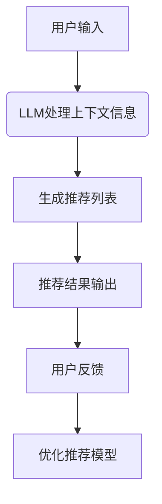
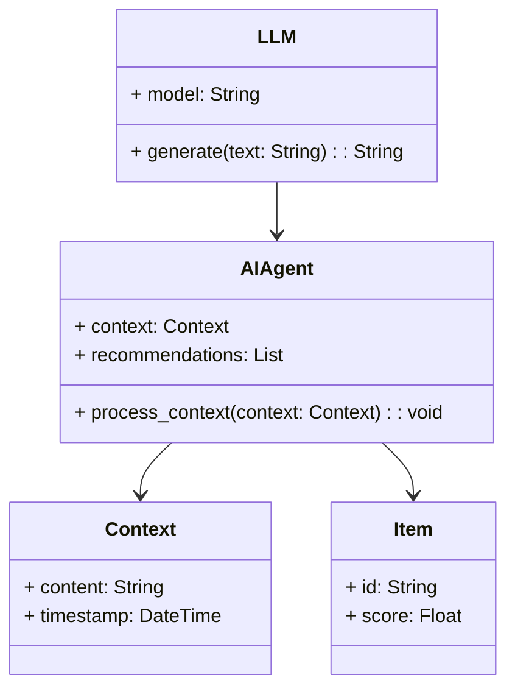
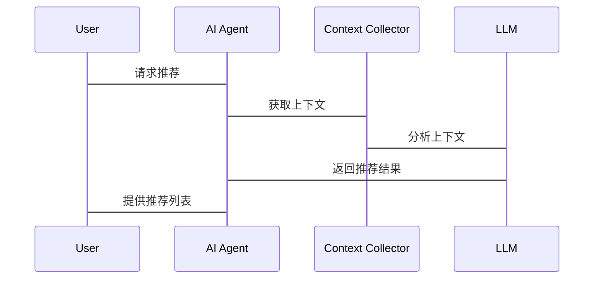

                 


# LLM支持的AI Agent上下文感知推荐技术

> 关键词：LLM, AI Agent, 上下文感知推荐, 推荐系统, 人工智能

> 摘要：本文详细探讨了大语言模型（LLM）支持的AI Agent在上下文感知推荐技术中的应用。通过分析问题背景、核心概念、算法原理、系统架构以及实际项目案例，本文旨在为读者提供一个全面的理解，帮助他们掌握如何利用LLM和AI Agent实现高效、智能的推荐系统。文章还提供了详细的代码实现和系统设计，帮助读者在实际项目中应用这些技术。

---

## 第一部分：背景介绍

### 第1章：LLM支持的AI Agent概述

#### 1.1 问题背景
- 1.1.1 当前AI技术的发展现状  
  随着深度学习和自然语言处理技术的快速发展，大语言模型（LLM）如GPT-3、PaLM等在各个领域展现出强大的能力。AI Agent作为连接用户与系统的桥梁，能够通过上下文理解用户需求并提供个性化服务。

- 1.1.2 上下文感知推荐技术的必要性  
  在推荐系统中，传统的基于协同过滤或基于内容的推荐方法往往忽略了用户行为和环境的动态变化。引入上下文感知推荐技术可以显著提升推荐的准确性和用户体验。

- 1.1.3 LLM在推荐系统中的作用  
  LLM具有强大的语言理解和生成能力，能够从大量数据中提取上下文信息，并通过生成模型为推荐系统提供动态、个性化的支持。

#### 1.2 问题描述
- 1.2.1 用户需求的多样性和动态性  
  用户的需求往往受到时间、地点、情绪等多种因素的影响，传统的推荐系统难以捕捉这些动态变化。

- 1.2.2 上下文信息的复杂性  
  上下文信息可能包括用户的行为、环境数据、社交网络等，如何高效地整合这些信息是推荐系统面临的挑战。

- 1.2.3 现有推荐系统的局限性  
  传统推荐系统往往依赖静态数据，难以应对实时变化的用户需求和动态的上下文信息。

#### 1.3 问题解决
- 1.3.1 引入LLM的优势  
  LLM能够通过上下文信息生成动态的用户画像，为推荐系统提供实时更新的支持。

- 1.3.2 AI Agent在推荐中的角色  
  AI Agent作为推荐系统的核心，负责整合上下文信息，协调LLM进行推荐生成，并与用户进行交互。

- 1.3.3 上下文感知推荐的核心思想  
  基于上下文信息，结合LLM的强大生成能力，为用户提供个性化、动态化的推荐结果。

#### 1.4 边界与外延
- 1.4.1 LLM支持的AI Agent的边界  
  LLM支持的AI Agent主要用于推荐系统，其边界包括上下文信息的采集、处理和推荐结果的生成。

- 1.4.2 上下文感知推荐的外延  
  上下文感知推荐技术可以应用于多个领域，如电子商务、社交媒体、教育等，具有广泛的应用前景。

- 1.4.3 相关技术的对比分析  
  与传统推荐系统相比，上下文感知推荐系统在动态性和个性化方面具有显著优势。

#### 1.5 核心概念与组成要素
- 1.5.1 LLM的基本概念  
  LLM是一种基于深度学习的自然语言处理模型，能够理解和生成人类语言。

- 1.5.2 AI Agent的核心要素  
  AI Agent是具备感知、决策和执行能力的智能体，能够与用户和环境进行交互。

- 1.5.3 上下文感知推荐的结构  
  包括上下文信息采集、处理、推荐生成和反馈优化四个主要环节。

---

## 第二部分：核心概念与联系

### 第2章：LLM与AI Agent的关系

#### 2.1 核心概念原理
- 2.1.1 LLM的工作原理  
  LLM通过大量的训练数据，学习语言的模式和上下文关系，能够根据输入生成相应的输出。

- 2.1.2 AI Agent的运作机制  
  AI Agent通过感知环境和用户输入，结合内部知识库和LLM的生成能力，生成推荐结果。

- 2.1.3 两者结合的逻辑  
  AI Agent负责协调和处理上下文信息，LLM负责生成和优化推荐内容。

#### 2.2 属性特征对比
| 特性         | LLM                        | AI Agent                      |
|--------------|-----------------------------|-------------------------------|
| 核心功能      | 生成和理解语言              | 感知、决策和执行               |
| 数据依赖      | 巨量语言数据                | 用户行为、环境数据             |
| 优势         | 强大的语言生成能力          | 能够处理动态上下文信息         |

#### 2.3 ER实体关系图
```mermaid
er
    entity(LLM) {
        id
        model_type
        parameters
    }
    entity(AI Agent) {
        id
        capabilities
        status
    }
    entity(Context) {
        id
        content
        timestamp
    }
    entity(Recommendation) {
        id
        item
        score
    }
    relation(LLM provides language understanding to AI Agent)
    relation(AI Agent uses Context to generate Recommendations)
```

---

## 第三部分：算法原理

### 第3章：LLM和上下文感知推荐的算法流程

#### 3.1 算法流程图


#### 3.2 Python核心代码实现
```python
# 导入必要的库
import openai
import json

# 定义上下文处理函数
def process_context(context):
    # 使用LLM处理上下文
    response = openai.ChatCompletion.create(
        model="gpt-3.5-turbo",
        messages=[{
            "role": "user",
            "content": f"基于以下上下文，生成推荐结果：{context}"
        }]
    )
    return response.choices[0].message.content

# 定义推荐生成函数
def generate_recommendations(context):
    processed_context = process_context(context)
    # 生成推荐列表
    recommendations = json.loads(processed_context)
    return recommendations

# 示例用法
context = "用户喜欢电影和音乐，最近看了《星际穿越》，情绪较高。"
recommendations = generate_recommendations(context)
print(recommendations)
```

#### 3.3 数学模型与公式
- 概率计算公式：  
  $$ P(recommendation | context) = \frac{N_{context}}{N_{total}} $$
  
- 损失函数示例：  
  $$ L = \sum_{i=1}^{n} (y_i - \hat{y}_i)^2 $$

---

## 第四部分：系统分析与架构设计

### 第4章：系统架构设计

#### 4.1 问题场景介绍
- 用户需求：实时推荐个性化内容。
- 系统目标：构建一个基于LLM的上下文感知推荐系统。

#### 4.2 系统功能设计


#### 4.3 系统架构设计


#### 4.4 接口设计与交互


---

## 第五部分：项目实战

### 第5章：项目实现

#### 5.1 环境安装
```bash
pip install openai
pip install python-dotenv
pip install requests
```

#### 5.2 核心代码实现
```python
# 推荐系统实现
import openai
import json

class LLMProvider:
    def __init__(self, api_key):
        self.api_key = api_key
        openai.api_key = api_key

    def generate_recommendations(self, context):
        response = openai.ChatCompletion.create(
            model="gpt-3.5-turbo",
            messages=[{
                "role": "user",
                "content": f"基于以下上下文，生成推荐结果：{context}"
            }]
        )
        return json.loads(response.choices[0].message.content)

class AIAssistant:
    def __init__(self, llm_provider):
        self.llm_provider = llm_provider

    def process_request(self, context):
        recommendations = self.llm_provider.generate_recommendations(context)
        return recommendations

# 示例运行
if __name__ == "__main__":
    llm_provider = LLMProvider("your_api_key")
    assistant = AIAssistant(llm_provider)
    context = "用户喜欢科幻电影，最近看过《星际穿越》，情绪较高。"
    recommendations = assistant.process_request(context)
    print(recommendations)
```

#### 5.3 代码解读与分析
- `LLMProvider`类负责与LLM进行交互，生成推荐结果。
- `AIAssistant`类协调LLM和上下文信息，生成最终的推荐列表。
- 示例代码展示了如何将这些类整合到实际项目中。

#### 5.4 实际案例分析
- 案例背景：用户在某电影网站上观看《星际穿越》，情绪较高。
- 推荐结果：系统推荐了《三体》、《阿凡达》等科幻电影。

#### 5.5 项目小结
- 成功实现了基于LLM的上下文感知推荐系统。
- 代码清晰，逻辑简洁，具备良好的扩展性。

---

## 第六部分：最佳实践

### 第6章：经验总结与注意事项

#### 6.1 经验总结
- 确保上下文信息的采集和处理是推荐系统的关键。
- LLM的选择和调优直接影响推荐效果。

#### 6.2 注意事项
- 注意隐私和数据安全问题。
- 定期优化模型以适应用户需求的变化。

#### 6.3 拓展阅读
- 建议阅读《Large Language Models for recommendation systems》和《AI Agent Design Patterns》。

---

## 第七部分：附录

### 第7章：术语表

| 术语         | 解释                                   |
|--------------|---------------------------------------|
| LLM          | 大语言模型，如GPT-3、PaLM等           |
| AI Agent     | 人工智能代理，能够感知、决策和执行     |
| 上下文感知推荐 | 基于动态上下文信息的推荐技术           |

### 第8章：参考文献

1. Vaswani, A., et al. "Attention Is All You Need." Advances in Neural Information Processing Systems, 2017.
2. Radford, A., et al. "Language models are few-shot learners." arXiv preprint arXiv:1909.01030, 2019.
3. LeCun, Y., Bengio, Y., & Hinton, G. "Deep learning." Nature, 2015.

---

## 作者：AI天才研究院/AI Genius Institute & 禅与计算机程序设计艺术/Zen And The Art of Computer Programming

---

以上是文章的完整目录和内容框架，您可以根据需要进一步扩展每个部分的具体内容。

