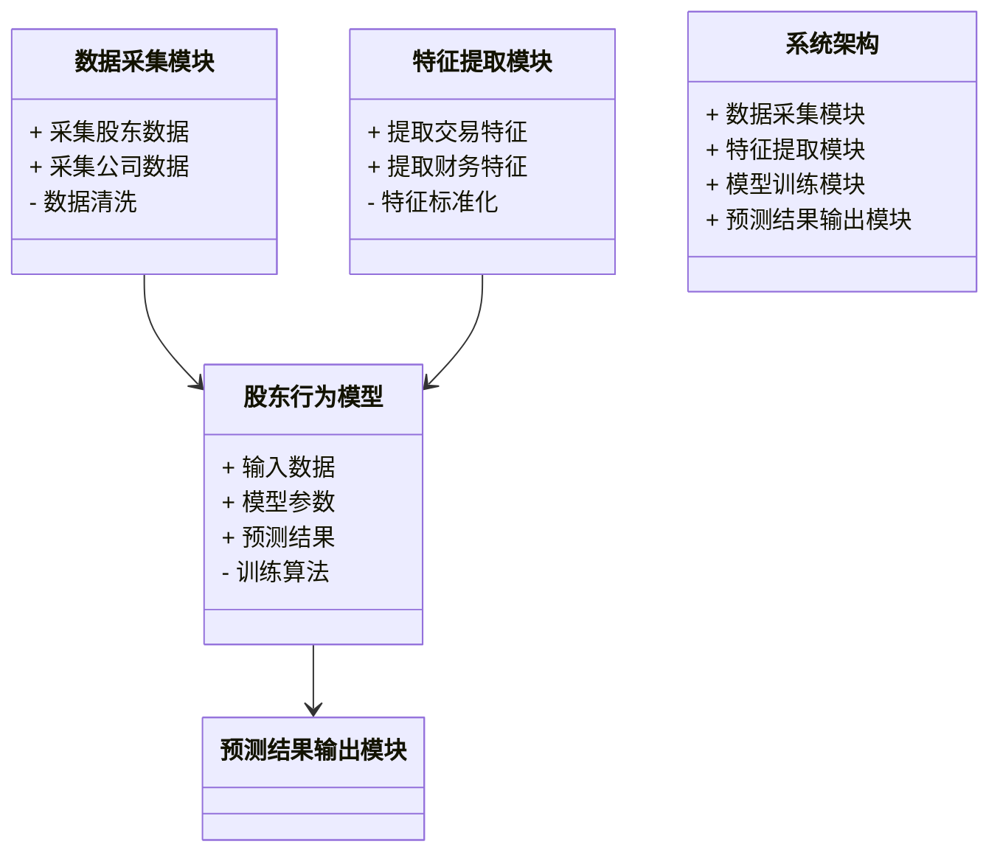
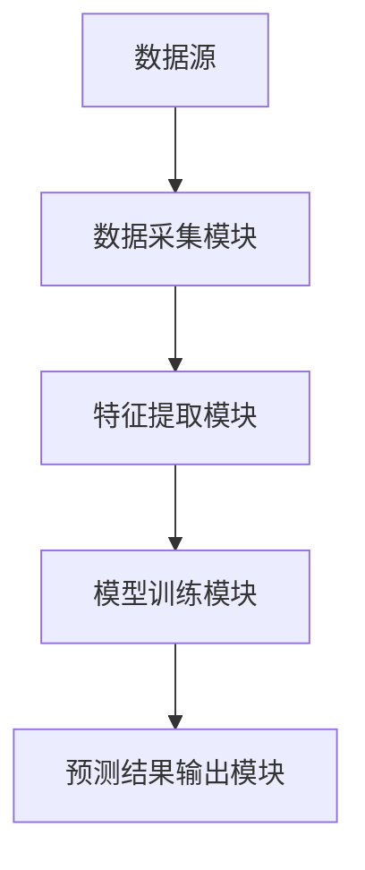
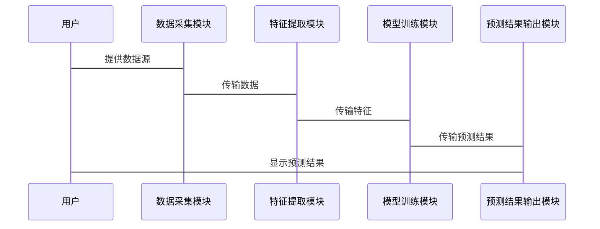

                 


# 利用AI构建自适应型股东行为模型：预测公司治理变化

> 关键词：股东行为模型，AI，公司治理，自适应算法，风险预测，动态模型

> 摘要：本文详细探讨了如何利用人工智能技术构建自适应型股东行为模型，以预测公司治理的变化。文章从背景介绍、核心概念、算法原理、系统设计到项目实战，全面阐述了该模型的构建过程和应用场景。通过数学建模、算法优化和系统实现，展示了如何利用AI技术提高股东行为预测的准确性和实用性，为公司治理优化和风险预警提供有力支持。

---

## 第一部分: 背景介绍

### 第1章: 股东行为模型与公司治理概述

#### 1.1 问题背景

##### 1.1.1 股东行为对公司治理的影响

股东作为公司的重要利益相关者，其行为对公司治理具有深远影响。股东的决策不仅影响公司的短期业绩，还可能引发公司战略调整、管理层变动甚至企业重组。例如，大股东的减持行为可能引发市场对公司前景的担忧，进而影响股价和投资者信心。

##### 1.1.2 现有股东行为分析的局限性

传统的股东行为分析方法主要依赖于统计分析和财务数据，难以捕捉股东行为的动态变化和复杂性。例如，现有的模型难以实时反映股东行为的变化，也无法有效预测股东行为对公司治理的潜在影响。

##### 1.1.3 利用AI技术解决股东行为预测的必要性

随着AI技术的快速发展，利用机器学习算法分析股东行为成为可能。AI技术能够处理海量数据，发现传统方法难以捕捉的模式和规律，从而提高股东行为预测的准确性和实时性。

#### 1.2 问题描述

##### 1.2.1 股东行为的复杂性与多样性

股东行为受到多种因素的影响，包括市场环境、公司业绩、股东结构等。不同类型的股东（如机构投资者、散户）行为差异显著，且可能随着市场变化而动态调整。

##### 1.2.2 公司治理变化的动态性

公司治理是一个动态过程，受到股东行为、管理层决策、外部环境等多种因素的影响。传统的静态模型难以捕捉这种动态变化。

##### 1.2.3 当前股东行为预测的挑战

现有的股东行为预测方法通常基于静态模型，难以适应公司治理的动态变化。此外，数据获取和处理的复杂性也增加了预测的难度。

#### 1.3 问题解决思路

##### 1.3.1 自适应型股东行为模型的核心思想

自适应型股东行为模型的核心思想是通过动态调整模型参数，实时反映股东行为的变化。这种模型能够根据新的数据不断优化预测结果，从而提高预测的准确性。

##### 1.3.2 AI技术在股东行为预测中的应用

AI技术，特别是机器学习算法，能够处理非结构化数据，发现复杂模式，从而为股东行为预测提供强有力的支持。例如，可以利用自然语言处理技术分析新闻报道和社交媒体数据，提取股东行为的潜在驱动因素。

##### 1.3.3 模型构建的目标与实现路径

模型构建的目标是实现股东行为的实时预测，并为公司治理优化提供决策支持。实现路径包括数据收集、特征提取、模型训练和结果验证。

#### 1.4 模型的边界与外延

##### 1.4.1 股东行为模型的适用范围

该模型适用于预测股东的短期行为变化，但难以预测长期趋势。此外，模型的有效性依赖于数据质量和多样性。

##### 1.4.2 公司治理变化的预测边界

模型主要用于预测公司治理的短期变化，如管理层变动和公司战略调整，但难以预测重大资产重组等复杂事件。

##### 1.4.3 模型的可扩展性与局限性

模型具有较强的可扩展性，可以集成更多的数据源和算法。然而，模型的预测精度受到数据质量和算法复杂度的限制。

#### 1.5 核心概念与组成

##### 1.5.1 股东行为模型的组成要素

模型由数据采集模块、特征提取模块、自适应算法模块和预测结果输出模块组成。

##### 1.5.2 自适应机制的关键特征

自适应机制能够根据新的数据动态调整模型参数，确保预测结果的准确性。

##### 1.5.3 模型与公司治理的关系

模型通过预测股东行为变化，为公司治理优化提供决策支持，从而实现公司治理的动态调整。

### 第2章: 自适应型股东行为模型的核心概念

#### 2.1 股东行为分析的理论基础

##### 2.1.1 股东行为的分类与特征

股东行为可以分为投资行为、投票行为和减持/增持行为。不同类型的行为具有不同的特征和驱动因素。

##### 2.1.2 股东决策的驱动因素

股东决策受到市场环境、公司业绩、股东结构和监管政策等多种因素的影响。

##### 2.1.3 股东行为对公司治理的影响

股东行为直接影响公司战略、管理层稳定和公司治理效率。例如，大股东的减持行为可能引发市场对公司前景的担忧，进而影响股价和投资者信心。

#### 2.2 自适应算法的基本原理

##### 2.2.1 自适应学习的核心思想

自适应学习的核心思想是通过动态调整模型参数，实时反映股东行为的变化。这种方法能够捕捉股东行为的短期波动，提高预测的准确性。

##### 2.2.2 算法的动态调整机制

模型通过不断更新权重和参数，根据新的数据优化预测结果。例如，可以使用在线学习算法，实时更新模型参数。

##### 2.2.3 自适应模型的更新策略

模型的更新策略包括定期重新训练和实时微调。定期重新训练可以确保模型的长期准确性，而实时微调则能够捕捉短期变化。

#### 2.3 模型的输入与输出

##### 2.3.1 输入数据的特征与处理

输入数据包括股东的历史交易数据、公司财务数据、市场环境数据和新闻数据。这些数据需要经过清洗和特征提取，以便模型处理。

##### 2.3.2 输出结果的定义与解释

输出结果包括股东行为的预测概率和对公司治理变化的预测结果。例如，模型可以预测某股东在未来一个月内减持的概率。

##### 2.3.3 模型的评价指标

常用的评价指标包括准确率、召回率和F1值。这些指标可以帮助评估模型的预测性能。

---

## 第二部分: 核心概念与联系

### 第3章: 股东行为模型与公司治理的关系

#### 3.1 股东行为对公司治理的影响路径

##### 3.1.1 股东决策对公司战略的影响

股东的决策直接影响公司的战略选择。例如，机构投资者可能推动公司采取更加稳健的财务策略。

##### 3.1.2 股东行为对公司管理层的制约

股东的行为对公司管理层形成制约，例如，股东可以通过投票权影响公司董事会的决策。

##### 3.1.3 股东结构对公司治理效率的作用

股东结构的多样性可能影响公司治理效率。例如，分散的股东结构可能增加公司治理的复杂性。

#### 3.2 自适应模型在公司治理中的应用

##### 3.2.1 模型在股东行为预测中的作用

模型能够预测股东的短期行为变化，帮助公司制定应对策略。例如，预测大股东减持行为，提前采取措施稳定股价。

##### 3.2.2 模型在公司治理优化中的应用

模型可以识别潜在的治理风险，帮助公司优化治理结构。例如，识别董事会中可能存在的利益冲突。

##### 3.2.3 模型在风险预警中的价值

模型能够预警潜在的治理风险，例如，预测公司可能面临的股东诉讼风险。

#### 3.3 模型与公司治理的动态关系

##### 3.3.1 模型如何适应公司治理的变化

模型通过动态调整参数和特征，适应公司治理的变化。例如，模型可以根据新的监管政策调整预测策略。

##### 3.3.2 公司治理变化对模型的影响

公司治理的变化，如管理层变动，会影响股东行为，进而影响模型的预测结果。

##### 3.3.3 模型与公司治理的协同进化

模型与公司治理相互作用，形成协同进化的关系。例如，模型的优化可能推动公司治理结构的改进，而公司治理的变化又会影响模型的预测结果。

---

## 第三部分: 算法原理

### 第4章: 自适应型股东行为模型的算法原理

#### 4.1 自适应学习算法的数学模型

自适应学习算法可以通过在线学习的方式，动态更新模型参数。例如，可以使用梯度下降算法，根据新的数据更新权重。

#### 4.2 算法实现步骤

##### 4.2.1 数据预处理

对输入数据进行清洗和特征提取，例如，提取股东的历史交易数据和公司财务数据。

##### 4.2.2 模型训练

使用训练数据训练模型，例如，使用逻辑回归或随机森林算法。

##### 4.2.3 模型预测

利用训练好的模型，预测股东的未来行为。

##### 4.2.4 模型优化

根据新的数据，动态调整模型参数，优化预测结果。

#### 4.3 算法的数学推导

例如，使用在线梯度下降算法，更新模型参数：

$$ w_{t+1} = w_t - \eta \cdot \nabla L(w_t) $$

其中，$w_t$ 是当前的权重，$\eta$ 是学习率，$\nabla L(w_t)$ 是损失函数的梯度。

#### 4.4 算法的代码实现

以下是Python代码示例：

```python
import numpy as np

def online_gradient_descent(X, y, learning_rate=0.1):
    # 初始化权重
    w = np.zeros(X.shape[1])
    for i in range(len(y)):
        # 计算预测值
        pred = np.dot(X[i], w)
        # 计算损失函数梯度
        gradient = 2 * (pred - y[i]) * X[i]
        # 更新权重
        w -= learning_rate * gradient
        # 输出当前权重
        print(f"Iteration {i+1}, Weights: {w}")
    return w
```

#### 4.5 算法的优缺点分析

自适应学习算法的优点是能够动态调整模型参数，实时捕捉股东行为的变化。缺点是模型的复杂性较高，且需要大量的计算资源。

---

## 第四部分: 系统分析与架构设计

### 第5章: 自适应型股东行为模型的系统设计

#### 5.1 问题场景介绍

系统需要实时预测股东行为，并为公司治理优化提供决策支持。例如，预测大股东的减持行为，提前采取措施稳定股价。

#### 5.2 系统功能设计

##### 5.2.1 数据采集模块

负责采集股东的历史交易数据、公司财务数据和市场环境数据。

##### 5.2.2 特征提取模块

对数据进行清洗和特征提取，例如，提取股东的交易频率和金额。

##### 5.2.3 模型训练模块

使用训练数据训练自适应型股东行为模型。

##### 5.2.4 预测结果输出模块

输出股东行为的预测结果，并生成公司治理变化的预警报告。

#### 5.3 系统架构设计

##### 5.3.1 领域模型设计

使用Mermaid类图展示系统中的主要实体和它们之间的关系。



##### 5.3.2 系统架构图

使用Mermaid架构图展示系统的整体架构。



##### 5.3.3 接口设计与交互流程

使用Mermaid序列图展示系统交互流程。



---

## 第五部分: 项目实战

### 第6章: 自适应型股东行为模型的实现

#### 6.1 项目环境安装

##### 6.1.1 安装必要的Python库

安装以下Python库：

- numpy
- pandas
- scikit-learn
- matplotlib

##### 6.1.2 数据集准备

准备股东的历史交易数据和公司财务数据。

#### 6.2 系统核心实现

##### 6.2.1 数据预处理

清洗数据并提取特征。

```python
import pandas as pd
import numpy as np

# 读取数据
data = pd.read_csv(' shareholder_data.csv ')

# 数据清洗
data.dropna()

# 特征提取
features = data[['交易金额', '交易频率', '股价波动率']]
target = data['股东行为标签']
```

##### 6.2.2 模型训练

使用逻辑回归算法训练模型。

```python
from sklearn.linear_model import LogisticRegression
from sklearn.model_selection import train_test_split

# 分割数据
X_train, X_test, y_train, y_test = train_test_split(features, target, test_size=0.2)

# 训练模型
model = LogisticRegression()
model.fit(X_train, y_train)

# 预测结果
y_pred = model.predict(X_test)
```

##### 6.2.3 模型优化

通过在线梯度下降算法优化模型。

```python
def online_gradient_descent(X, y, learning_rate=0.1):
    w = np.zeros(X.shape[1])
    for i in range(len(y)):
        pred = np.dot(X[i], w)
        gradient = 2 * (pred - y[i]) * X[i]
        w -= learning_rate * gradient
        print(f"Iteration {i+1}, Weights: {w}")
    return w

# 使用在线梯度下降优化模型
optimized_weights = online_gradient_descent(X_train, y_train)
```

#### 6.3 代码应用与分析

##### 6.3.1 代码实现细节

详细解释代码实现的每一步，包括数据预处理、特征提取、模型训练和优化。

##### 6.3.2 模型性能分析

分析模型的预测准确率、召回率和F1值，评估模型的性能。

#### 6.4 案例分析

##### 6.4.1 实际案例

以某公司为例，分析模型的预测结果。

##### 6.4.2 预测结果解读

解释预测结果的实际意义，例如，预测某股东在未来一个月内减持的概率为80%。

#### 6.5 项目小结

总结项目实现的关键步骤和成果，强调模型在公司治理中的应用价值。

---

## 第六部分: 最佳实践与总结

### 第7章: 自适应型股东行为模型的最佳实践

#### 7.1 最佳实践 tips

##### 7.1.1 数据质量的重要性

确保数据的准确性和完整性，避免噪声数据影响模型性能。

##### 7.1.2 模型的可解释性

选择具有可解释性的算法，便于分析结果和优化模型。

##### 7.1.3 模型的实时性

确保模型能够实时更新，捕捉股东行为的动态变化。

#### 7.2 小结

总结全文，强调自适应型股东行为模型在预测公司治理变化中的重要性。

#### 7.3 注意事项

##### 7.3.1 数据隐私与合规性

确保数据处理符合相关法律法规，保护股东隐私。

##### 7.3.2 模型的维护与更新

定期更新模型参数和特征，保持模型的预测精度。

##### 7.3.3 模型的可扩展性

为未来的数据源和算法优化留有扩展空间。

#### 7.4 拓展阅读

推荐相关的书籍和论文，帮助读者深入了解股东行为分析和公司治理优化。

---

## 作者：AI天才研究院/AI Genius Institute & 禅与计算机程序设计艺术 /Zen And The Art of Computer Programming

---

通过以上详细的内容，您可以构建一个完整的自适应型股东行为模型，并将其应用于公司治理变化的预测中。

