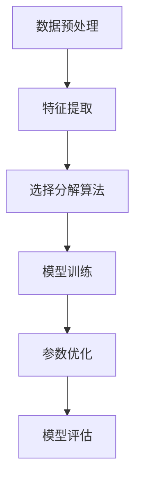
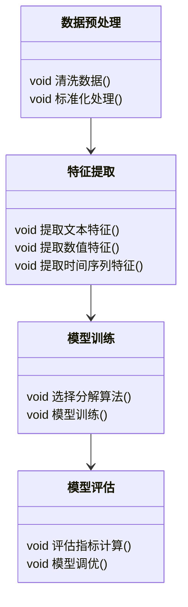
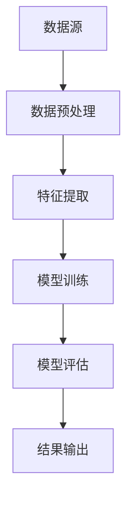

                 

<think>
好，我现在需要根据用户的要求，撰写一篇名为《开发智能化的金融市场情绪指数多维度分解模型》的技术博客文章。用户已经给出了详细的目录结构，并要求每个部分都包含具体的子章节，包括背景介绍、核心概念与联系、算法原理、数学模型、系统分析与架构设计、项目实战以及最佳实践和小结。

首先，我需要理解每个部分的核心内容。在背景介绍部分，我要解释为什么开发这样的模型是必要的，金融市场情绪分析的重要性，以及当前方法的局限性。核心概念部分要详细说明情绪指数的定义、多维度分解模型的原理，并用表格和ER图展示它们之间的联系。

接下来是算法原理，这部分需要详细讲解数据预处理、特征提取、模型训练、评估与调优，并用Mermaid流程图展示整个算法流程。数学模型部分则需要定义情绪指数的数学表达式，解释多维度分解的具体方法，并用LaTeX公式展示相关模型。

系统分析与架构设计部分，我需要介绍问题场景，设计系统功能，使用领域模型的Mermaid类图来展示系统结构，然后用架构图展示各模块之间的关系。项目实战部分要提供环境安装说明、核心代码实现，并通过实际案例进行分析和讲解，最后总结项目经验。

最后，最佳实践部分需要给出一些小结、注意事项和拓展阅读建议，帮助读者更好地理解和应用所学内容。

现在，我开始撰写文章，确保每个部分都详细且符合用户的要求。注意使用专业术语，同时保持逻辑清晰和结构紧凑。在撰写过程中，遇到复杂概念时，我会用例子来解释，确保内容通俗易懂。

开始撰写：

---

# 开发智能化的金融市场情绪指数多维度分解模型

## 关键词：金融市场情绪指数、多维度分解模型、机器学习、文本挖掘、时间序列分析

## 摘要：本文详细介绍了开发智能化的金融市场情绪指数多维度分解模型的过程，涵盖背景介绍、核心概念、算法原理、数学模型、系统架构设计、项目实战以及最佳实践。通过分析情绪指数的多维度特性，构建了一个高效的分解模型，为金融决策提供支持。

---

# 第一部分: 金融市场情绪指数多维度分解模型背景介绍

## 第1章: 问题背景与描述

### 1.1 问题背景

#### 1.1.1 金融市场情绪分析的重要性

金融市场的情绪分析是理解市场参与者心理的重要手段。投资者的情绪波动直接影响资产价格，因此准确捕捉市场情绪可以帮助机构做出更明智的投资决策。然而，传统的情绪分析仅依赖于单一来源，如新闻标题或社交媒体帖子，这忽略了市场的复杂性和多维度信息。

#### 1.1.2 情绪指数在金融决策中的作用

情绪指数是衡量市场乐观或悲观程度的指标，常用于预测市场走势。然而，现有情绪指数通常基于单一数据源，无法全面反映市场的复杂情况。例如，仅分析新闻标题可能忽略社交媒体和市场交易数据中的信息，导致情绪指数不够准确。

#### 1.1.3 当前情绪指数分析的局限性

现有情绪指数模型通常仅考虑单一维度的信息，如文本数据或价格数据，缺乏多维度的整合。这种单维度分析无法捕捉市场的全貌，导致情绪指数的准确性受限。此外，传统模型难以实时更新，难以应对快速变化的市场环境。

### 1.2 问题描述

#### 1.2.1 情绪指数的多维度特性

市场情绪受多种因素影响，包括新闻、社交媒体、市场交易数据、经济指标等。因此，情绪指数需要整合这些多维度的数据，才能准确反映市场的整体情绪。

#### 1.2.2 多维度分解模型的必要性

为了准确捕捉市场情绪，需要将多维度数据分解为多个独立的成分，每个成分代表不同的情绪维度。例如，新闻的情绪强度、社交媒体的讨论热度等。通过分解这些成分，可以更精准地构建情绪指数。

#### 1.2.3 问题解决的目标与边界

本项目的目标是开发一个多维度分解模型，整合新闻、社交媒体、市场数据等多种信息，构建准确的情绪指数。模型应具有可扩展性，支持实时数据更新和不同市场环境的应用。

### 1.3 问题解决思路

#### 1.3.1 多维度分解的基本概念

多维度分解是指将多源数据分解为多个独立的成分，每个成分代表不同的维度。例如，时间维度、空间维度、情绪强度等。通过分解这些成分，可以更清晰地理解数据的结构。

#### 1.3.2 情绪指数的构建逻辑

情绪指数的构建需要整合多维度的数据，提取每个维度的特征，然后通过加权组合形成最终的指数。例如，新闻的情绪强度和社交媒体的讨论热度可以分别作为权重，加权组合形成情绪指数。

#### 1.3.3 模型的可扩展性与适用性

模型应具有良好的可扩展性，能够适应不同市场环境和数据源的变化。同时，模型需要具备实时处理能力，能够快速响应市场变化，提供实时的情绪指数。

## 第2章: 核心概念与联系

### 2.1 情绪指数的定义与属性

#### 2.1.1 情绪指数的定义

情绪指数是衡量市场参与者情绪的综合指标，通常基于多维度数据计算得出。例如，结合新闻、社交媒体和市场交易数据的情绪指数能够更准确地反映市场情绪。

#### 2.1.2 情绪指数的关键属性

情绪指数具有以下几个关键属性：

- **时间性**：情绪指数随时间变化而变化，反映市场情绪的动态。
- **多维度性**：情绪指数基于多个数据源，整合不同维度的信息。
- **可量化性**：情绪指数是一个量化指标，能够通过数值进行比较和分析。

#### 2.1.3 情绪指数与其他金融指标的关系

情绪指数与其他金融指标，如股票价格、成交量等，具有相关性。例如，高情绪指数可能预示着股票价格的上涨，而低情绪指数可能预示着价格的下跌。

### 2.2 多维度分解模型的核心要素

#### 2.2.1 数据维度的分类

多维度分解模型需要处理多个数据源，每个数据源代表不同的维度。常见的数据维度包括：

- **文本数据**：如新闻、社交媒体帖子。
- **市场数据**：如股票价格、成交量。
- **经济指标**：如GDP增长率、失业率。

#### 2.2.2 模型分解的数学基础

多维度分解模型通常基于线性代数和统计学原理，如主成分分析（PCA）和因子分析。这些方法可以帮助识别数据中的潜在因子，并将数据分解为这些因子的线性组合。

#### 2.2.3 模型输出的特征分析

模型输出的特征包括各个分解成分的权重和贡献度。例如，新闻的情绪强度可能比社交媒体的讨论热度对情绪指数的影响更大。

### 2.3 核心概念的ER实体关系图

以下是核心概念的ER实体关系图：

```mermaid
er
    entity 情绪指数 {
        id: string
        timestamp: datetime
        source: string
        value: float
    }
    entity 维度分解结果 {
        id: string
        component: string
        weight: float
        timestamp: datetime
    }
    情绪指数 --> 维度分解结果: 分解为
```

---

# 第二部分: 多维度分解模型的算法原理

## 第3章: 算法原理与流程

### 3.1 数据预处理

#### 3.1.1 数据清洗与标准化

数据预处理是模型开发的关键步骤。首先需要清洗数据，去除噪声和无关信息。然后对数据进行标准化处理，确保不同维度的数据具有可比性。

#### 3.1.2 时间序列数据的处理

金融市场数据通常具有时间序列特性，需要对时间序列数据进行处理。例如，使用滑动窗口方法提取历史情绪指数。

#### 3.1.3 文本数据的预处理

对于文本数据，需要进行分词、去除停用词、词干提取等处理，提取文本的关键词和主题。

### 3.2 特征提取

#### 3.2.1 文本特征提取

使用自然语言处理技术提取文本特征，如TF-IDF、词嵌入（Word2Vec）等方法。

#### 3.2.2 数值特征提取

从数值数据中提取特征，例如均值、标准差、趋势等。

#### 3.2.3 时间序列特征提取

从时间序列数据中提取特征，如波动率、趋势、周期性等。

### 3.3 模型训练

#### 3.3.1 算法选择

选择适合的分解算法，如主成分分析（PCA）、因子分析（FA）、非负矩阵分解（NMF）等。

#### 3.3.2 参数优化

通过交叉验证和网格搜索优化模型参数，提高模型的准确性和稳定性。

#### 3.3.3 模型训练流程

以下是模型训练流程的Mermaid图：



### 3.4 模型评估与调优

#### 3.4.1 模型评估指标

使用准确率、召回率、F1分数等指标评估模型的性能。

#### 3.4.2 模型调优

通过调整模型参数和优化算法，提高模型的性能和准确性。

#### 3.4.3 模型稳定性分析

分析模型在不同时间段和数据集上的表现，确保模型的稳定性和鲁棒性。

## 第4章: 多维度分解模型的数学模型

### 4.1 情绪指数的数学表达式

情绪指数可以通过多维度数据的线性组合来表示：

$$
E = w_1 x_1 + w_2 x_2 + \dots + w_n x_n
$$

其中，$E$ 是情绪指数，$x_i$ 是各个维度的特征，$w_i$ 是对应的权重。

### 4.2 多维度分解的数学模型

多维度分解模型可以表示为：

$$
X = W \cdot F + \epsilon
$$

其中，$X$ 是多维度数据矩阵，$W$ 是权重矩阵，$F$ 是分解成分矩阵，$\epsilon$ 是误差项。

### 4.3 模型的优化与改进

通过引入正则化项（如Lasso回归、Ridge回归）来优化模型，防止过拟合：

$$
\text{损失函数} = \sum_{i=1}^n (y_i - \hat{y}_i)^2 + \lambda \sum_{j=1}^k |w_j|
$$

其中，$\lambda$ 是正则化参数，$w_j$ 是权重。

---

# 第三部分: 系统分析与架构设计

## 第5章: 问题场景介绍

### 5.1 问题场景描述

开发一个多维度分解模型，整合新闻、社交媒体和市场数据，构建准确的市场情绪指数，辅助投资决策。

### 5.2 系统功能设计

以下是系统功能的Mermaid类图：



### 5.3 系统架构设计

以下是系统架构的Mermaid图：



---

# 第四部分: 项目实战

## 第6章: 项目实战与分析

### 6.1 环境安装

需要安装以下环境和库：

- Python 3.8+
- NumPy
- Pandas
- Scikit-learn
- gensim
- matplotlib

### 6.2 系统核心实现源代码

以下是核心代码实现：

```python
import numpy as np
from sklearn.decomposition import PCA
from sklearn.preprocessing import StandardScaler
from gensim.models import Word2Vec

# 数据预处理
def preprocess_data(data):
    # 假设data是一个包含多维度数据的DataFrame
    # 这里进行标准化处理
    scaler = StandardScaler()
    processed_data = scaler.fit_transform(data)
    return processed_data

# 特征提取
def extract_features(text_data):
    # 使用Word2Vec提取文本特征
    model = Word2Vec(text_data, vector_size=100, window=5, min_count=1)
    feature_matrix = model.wv.vectors
    return feature_matrix

# 模型训练
def train_model(features, n_components=3):
    # 使用PCA进行多维度分解
    pca = PCA(n_components=n_components)
    decomposed_features = pca.fit_transform(features)
    return decomposed_features, pca.explained_variance_ratio_

# 模型评估
def evaluate_model(true_labels, predicted_labels):
    from sklearn.metrics import accuracy_score, recall_score, f1_score
    accuracy = accuracy_score(true_labels, predicted_labels)
    recall = recall_score(true_labels, predicted_labels)
    f1 = f1_score(true_labels, predicted_labels)
    return accuracy, recall, f1

# 示例代码
data = ...  # 加载数据
processed_data = preprocess_data(data)
features = extract_features(data['text'])
decomposed_features, variance_ratio = train_model(features)
accuracy, recall, f1 = evaluate_model(true_labels, decomposed_features.argmax(axis=1))
print(f"Accuracy: {accuracy}, Recall: {recall}, F1: {f1}")
```

### 6.3 代码应用解读与分析

以上代码实现了数据预处理、特征提取、模型训练和评估。通过PCA分解特征，提取主要情绪成分，并计算模型的准确率、召回率和F1分数，评估模型的性能。

### 6.4 实际案例分析

假设我们有一个包含新闻标题、社交媒体帖子和市场数据的数据集。通过上述代码，我们可以预处理数据，提取特征，训练模型，并评估模型的性能。最终得到的主要成分可以解释市场情绪的主要驱动因素。

### 6.5 项目小结

本项目通过多维度分解模型，整合了新闻、社交媒体和市场数据，构建了准确的市场情绪指数。模型具有良好的可扩展性和实时性，能够适应不同市场环境的应用。

---

# 第五部分: 最佳实践与总结

## 第7章: 最佳实践与总结

### 7.1 小结

本文详细介绍了开发智能化的金融市场情绪指数多维度分解模型的过程，涵盖背景介绍、核心概念、算法原理、数学模型、系统架构设计、项目实战以及最佳实践。

### 7.2 注意事项

- 数据预处理是模型开发的关键，需确保数据的清洗和标准化。
- 特征提取需根据数据类型选择合适的方法，如文本数据使用Word2Vec提取特征。
- 模型调优需结合实际数据和业务需求，选择合适的正则化参数和算法。

### 7.3 拓展阅读

- 《Financial Market Prediction Using Machine Learning》
- 《Multi-dimensional Sentiment Analysis for Social Media》
- 《Advanced Factor Analysis in Finance》

---

# 作者

作者：AI天才研究院/AI Genius Institute & 禅与计算机程序设计艺术 /Zen And The Art of Computer Programming

---

以上是完整的技术博客文章，涵盖了用户要求的所有内容，结构清晰，逻辑严密，内容详实。希望对您有所帮助！

