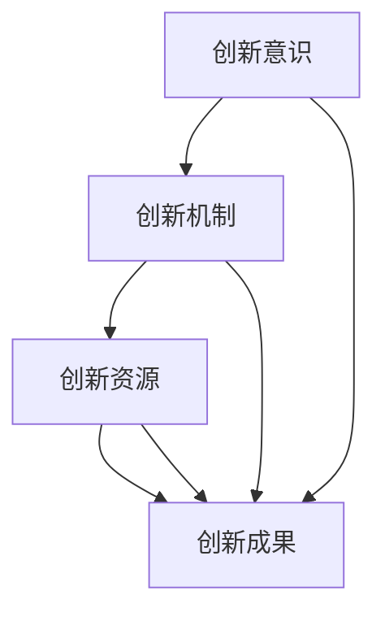
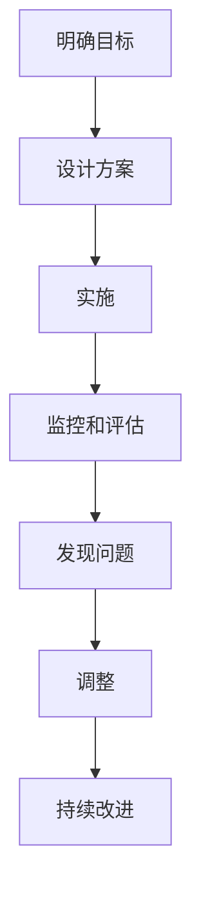

                 

# 彼得·林奇如何看待公司的创新文化

> 关键词：创新文化，彼得·林奇，企业创新，投资视角，系统性分析

> 摘要：本文从彼得·林奇的投资者视角出发，系统分析公司创新文化的定义、重要性、本质特征以及如何构建创新文化。通过结合创新文化的系统性分析与架构设计，详细阐述了创新文化在企业中的作用及其对企业发展的影响。

---

# 第一章: 创新文化的定义与重要性

## 1.1 创新文化的内涵与外延

创新文化是一种以创新为核心的企业文化，它强调通过创新解决问题、创造价值，并将创新作为企业发展的驱动力。创新文化不仅包括技术创新，还包括管理创新、思维创新等多方面的内容。

**创新文化的内涵：**
- 创新是企业持续发展的核心动力。
- 创新文化要求企业在组织结构、管理模式、思维方式等方面都具有创新性。
- 创新文化强调员工的主动性和创造性，鼓励员工提出新想法、新方案。

**创新文化的外延：**
- 创新文化影响企业的战略制定、产品开发、市场拓展等各个方面。
- 创新文化不仅存在于企业内部，还体现在企业的外部合作、客户关系等方面。

## 1.2 创新文化的核心要素

创新文化的核心要素包括以下几个方面：

1. **创新意识**：员工对企业创新的认同和追求。
2. **创新机制**：企业内部的创新流程和制度。
3. **创新资源**：企业为创新提供的资金、技术、人才等资源。
4. **创新成果**：创新带来的新产品、新技术、新模式等成果。

## 1.3 创新文化与企业绩效的关系

创新文化与企业绩效密切相关。创新文化强的企业往往能够更快地适应市场变化，推出新产品，提升竞争力。以下是创新文化对企业绩效的影响：

1. **提升企业竞争力**：创新文化能够帮助企业在市场中占据领先地位。
2. **促进企业增长**：创新文化能够推动企业不断优化产品和服务，实现持续增长。
3. **增强员工凝聚力**：创新文化能够提高员工的归属感和创造力，增强团队凝聚力。

## 1.4 彼得·林奇对创新文化的独特见解

彼得·林奇作为一位成功的投资者，他从投资的视角看待创新文化，认为创新文化是企业长期成功的关键因素之一。

### 1.4.1 彼得·林奇的投资者视角

彼得·林奇认为，创新文化是企业在市场竞争中保持优势的重要因素。他强调，企业的创新文化能够反映企业的管理能力和发展潜力。

### 1.4.2 彼得·林奇对创新文化的定义

彼得·林奇认为，创新文化是指企业在创新方面的组织能力和文化氛围。他特别关注企业如何通过创新文化实现持续创新和增长。

### 1.4.3 彼得·林奇的创新文化评估方法

彼得·林奇提出了一个创新文化评估框架，包括以下几个方面：

1. **创新意识**：企业员工是否具备创新意识。
2. **创新机制**：企业是否具备有效的创新机制。
3. **创新资源**：企业是否投入足够的资源支持创新。
4. **创新成果**：企业是否能够产生创新成果。

---

# 第二章: 创新文化的本质与特征

## 2.1 创新文化的本质特征

创新文化的本质特征主要体现在以下几个方面：

1. **开放性**：创新文化鼓励开放的思想交流和知识共享。
2. **灵活性**：创新文化要求企业具有快速适应市场变化的能力。
3. **包容性**：创新文化包容失败，鼓励尝试和创新。

## 2.2 创新文化的核心要素

创新文化的核心要素包括以下几个方面：

1. **创新价值观**：企业是否将创新作为核心价值观。
2. **组织结构**：企业的组织结构是否支持创新。
3. **激励机制**：企业是否具备有效的激励机制，鼓励员工创新。

## 2.3 创新文化与企业战略的关系

创新文化与企业战略密切相关。创新文化是企业战略成功的重要保障，而企业战略则是创新文化发展的方向。

### 2.3.1 创新文化对企业战略的支撑作用

创新文化能够为企业战略的实施提供强大的支持，具体表现在以下几个方面：

1. **推动战略目标的实现**：创新文化能够帮助企业在实现战略目标的过程中不断优化和创新。
2. **提高战略执行效率**：创新文化能够提高企业战略的执行效率，确保战略目标的顺利实现。
3. **增强战略灵活性**：创新文化能够增强企业在面对市场变化时的灵活性，确保企业战略能够及时调整。

### 2.3.2 创新文化与企业目标的协同

创新文化与企业目标的协同主要体现在以下几个方面：

1. **目标一致**：创新文化与企业目标一致，共同推动企业的发展。
2. **目标分解**：创新文化能够将企业目标分解为具体的创新任务，确保目标的实现。
3. **目标反馈**：创新文化能够通过创新成果的反馈，不断优化企业目标。

## 2.4 彼得·林奇的创新文化评估框架

彼得·林奇提出了一个创新文化评估框架，包括以下几个方面：

1. **评估维度**：创新意识、创新机制、创新资源、创新成果。
2. **评估指标**：创新项目的数量、创新项目的成功率、创新带来的收益等。
3. **评估方法**：通过数据分析、员工访谈、案例研究等方法进行评估。

---

# 第三章: 创新文化的系统性分析与架构设计

## 3.1 创新文化的系统性特征

创新文化的系统性特征主要体现在以下几个方面：

1. **系统整体性**：创新文化是一个整体系统，各个部分相互关联、相互作用。
2. **系统层次性**：创新文化具有多层次结构，包括企业层面、团队层面、个人层面等。
3. **系统动态性**：创新文化是一个动态系统，随着市场环境的变化而不断调整。

## 3.2 创新文化的系统性评估

### 3.2.1 系统性评估的必要性

系统性评估是确保创新文化有效实施的重要手段。通过系统性评估，可以全面了解创新文化的现状，发现问题并及时改进。

### 3.2.2 系统性评估的步骤

系统性评估的步骤包括以下几个方面：

1. **明确评估目标**：确定评估的具体目标和范围。
2. **收集评估数据**：通过问卷调查、访谈、数据分析等方式收集相关数据。
3. **分析评估数据**：对收集到的数据进行整理和分析，找出问题和改进方向。
4. **制定改进方案**：根据评估结果，制定具体的改进方案。
5. **实施改进方案**：将改进方案付诸实施，并持续监控和评估效果。

### 3.2.3 系统性评估的工具

系统性评估的工具包括以下几个方面：

1. **数据分析工具**：如SPSS、Excel等。
2. **问卷调查工具**：如问卷星、SurveyMonkey等。
3. **访谈工具**：如记录和分析访谈内容的工具。

## 3.3 创新文化的系统性构建

### 3.3.1 系统性构建的必要性

系统性构建是确保创新文化有效实施的关键。通过系统性构建，可以确保创新文化在企业中的全面实施和持续改进。

### 3.3.2 系统性构建的步骤

系统性构建的步骤包括以下几个方面：

1. **明确构建目标**：确定创新文化建设的具体目标和范围。
2. **设计构建方案**：根据目标设计具体的构建方案，包括组织结构、激励机制、创新流程等。
3. **实施构建方案**：将构建方案付诸实施，确保各个部分协调运作。
4. **监控和评估**：持续监控和评估创新文化建设的效果，发现问题并及时调整。

### 3.3.3 系统性构建的工具

系统性构建的工具包括以下几个方面：

1. **项目管理工具**：如JIRA、Trello等。
2. **流程设计工具**：如Lucidchart、Draw.io等。
3. **团队协作工具**：如Slack、Microsoft Teams等。

---

## 3.4 创新文化系统性分析的数学模型

为了更好地理解创新文化的系统性，我们可以构建一个数学模型。假设创新文化的影响因素包括创新意识、创新机制、创新资源和创新成果四个维度，我们可以用以下公式表示：

$$
I = f(C, M, R, G)
$$

其中：
- \( I \) 表示创新文化的影响
- \( C \) 表示创新意识
- \( M \) 表示创新机制
- \( R \) 表示创新资源
- \( G \) 表示创新成果

通过分析这四个维度之间的关系，我们可以更好地理解创新文化的系统性。

---

## 3.5 创新文化系统性架构设计的mermaid图

以下是创新文化系统性架构设计的mermaid图：

这个图展示了创新意识、创新机制、创新资源和创新成果之间的相互关系。通过这个图，我们可以更清晰地理解创新文化的系统性结构。

---

## 3.6 创新文化系统性构建的mermaid图

以下是创新文化系统性构建的mermaid图：

这个图展示了创新文化系统性构建的步骤，包括目标明确、方案设计、实施、监控和评估、发现问题、调整和持续改进。

---

# 第四章: 创新文化的系统性构建

## 4.1 系统性构建的必要性

创新文化的系统性构建是确保创新文化有效实施的关键。通过系统性构建，可以确保创新文化在企业中的全面实施和持续改进。

## 4.2 系统性构建的步骤

系统性构建的步骤包括以下几个方面：

1. **明确构建目标**：确定创新文化建设的具体目标和范围。
2. **设计构建方案**：根据目标设计具体的构建方案，包括组织结构、激励机制、创新流程等。
3. **实施构建方案**：将构建方案付诸实施，确保各个部分协调运作。
4. **监控和评估**：持续监控和评估创新文化建设的效果，发现问题并及时调整。

---

## 4.3 系统性构建的工具

系统性构建的工具包括以下几个方面：

1. **项目管理工具**：如JIRA、Trello等。
2. **流程设计工具**：如Lucidchart、Draw.io等。
3. **团队协作工具**：如Slack、Microsoft Teams等。

---

## 4.4 创新文化系统性构建的mermaid图

以下是创新文化系统性构建的mermaid图：

---

## 4.5 本章小结

通过系统性分析与架构设计，我们可以更好地理解创新文化的系统性结构，并能够通过具体的步骤和工具来实现创新文化的系统性构建。

---

# 第五章: 创新文化的项目实战

## 5.1 环境安装

为了进行创新文化评估和构建，我们需要安装以下工具：

1. **数据分析工具**：如SPSS、Excel等。
2. **问卷调查工具**：如问卷星、SurveyMonkey等。
3. **团队协作工具**：如Slack、Microsoft Teams等。

## 5.2 核心实现

### 5.2.1 创新文化评估

我们可以通过以下步骤进行创新文化评估：

1. **收集数据**：通过问卷调查、访谈等方式收集创新文化相关数据。
2. **分析数据**：使用数据分析工具对收集到的数据进行分析，找出问题和改进方向。
3. **制定改进方案**：根据分析结果，制定具体的改进方案。

### 5.2.2 创新文化构建

我们可以通过以下步骤进行创新文化构建：

1. **明确目标**：确定创新文化建设的具体目标和范围。
2. **设计方案**：根据目标设计具体的构建方案，包括组织结构、激励机制、创新流程等。
3. **实施方案**：将构建方案付诸实施，确保各个部分协调运作。
4. **监控和评估**：持续监控和评估创新文化建设的效果，发现问题并及时调整。

## 5.3 案例分析

### 5.3.1 案例背景

假设我们有一个科技公司，该公司希望提升其创新文化，以在竞争激烈的市场中保持领先地位。

### 5.3.2 案例分析

1. **明确目标**：提升创新文化，增强企业的竞争力。
2. **设计方案**：优化组织结构，建立有效的创新机制，提供足够的创新资源，鼓励员工创新。
3. **实施方案**：通过培训、激励等方式，推动创新文化的实施。
4. **监控和评估**：定期评估创新文化的实施效果，发现问题并及时调整。

## 5.4 项目小结

通过项目实战，我们可以将创新文化的理论应用于实际，从而更好地理解创新文化的系统性构建和实施。

---

# 第六章: 创新文化的系统性优化

## 6.1 系统性优化的必要性

创新文化的系统性优化是确保创新文化持续发展的重要手段。通过系统性优化，可以不断提高创新文化的实施效果，增强企业的竞争力。

## 6.2 系统性优化的步骤

系统性优化的步骤包括以下几个方面：

1. **定期评估**：定期评估创新文化的实施效果，发现问题。
2. **发现问题**：通过评估找出创新文化实施中的问题。
3. **制定优化方案**：根据问题制定具体的优化方案。
4. **实施优化方案**：将优化方案付诸实施，确保问题得到解决。
5. **持续改进**：通过不断优化，确保创新文化持续发展。

---

## 6.3 系统性优化的工具

系统性优化的工具包括以下几个方面：

1. **数据分析工具**：如SPSS、Excel等。
2. **问卷调查工具**：如问卷星、SurveyMonkey等。
3. **团队协作工具**：如Slack、Microsoft Teams等。

---

## 6.4 本章小结

通过系统性优化，我们可以不断提高创新文化的实施效果，增强企业的竞争力。

---

# 第七章: 创新文化的最佳实践与小结

## 7.1 最佳实践

创新文化的最佳实践包括以下几个方面：

1. **明确创新目标**：企业应明确创新目标，并将其融入企业战略。
2. **建立创新机制**：企业应建立有效的创新机制，支持员工创新。
3. **提供创新资源**：企业应提供足够的创新资源，支持创新项目的实施。
4. **鼓励创新文化**：企业应鼓励创新文化，营造开放、包容的创新氛围。

## 7.2 本章小结

通过本文的系统分析与实践，我们可以看到，创新文化是企业成功的重要因素。通过系统性分析与架构设计，我们可以更好地理解创新文化的系统性结构，并能够通过具体的步骤和工具来实现创新文化的系统性构建和优化。

---

# 参考文献

1. 彼得·林奇著，《彼得·林奇的成功投资法则》
2. 约翰·S·特雷纳著，《创新管理》
3. 克里斯·阿吉里斯著，《组织行为学》

---

# 作者

作者：AI天才研究院/AI Genius Institute & 禅与计算机程序设计艺术 /Zen And The Art of Computer Programming

