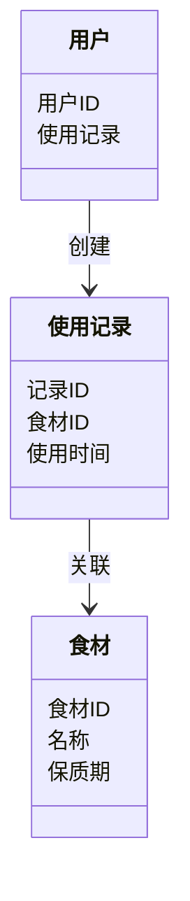
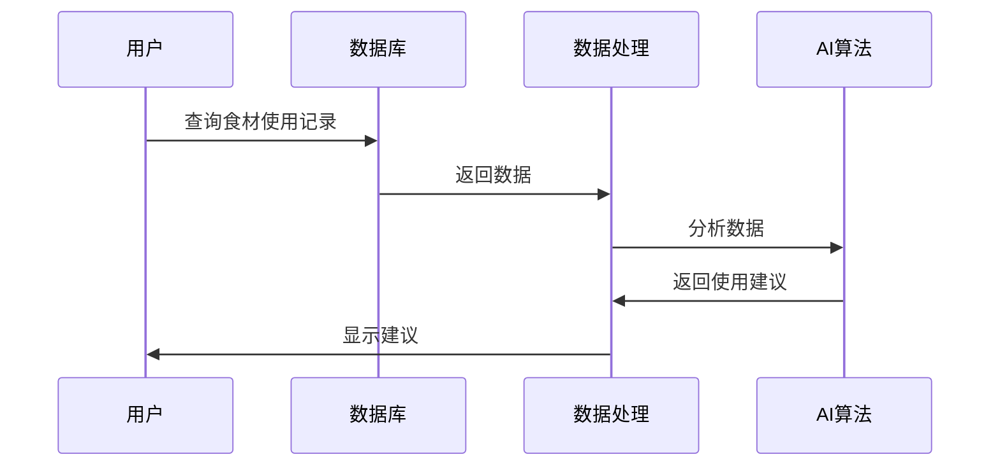

                 


# 智能厨房置物架：AI Agent的食材使用建议

## 关键词：智能厨房、AI Agent、食材管理、物联网、智能家居、数据挖掘

## 摘要：本文探讨了如何利用AI Agent优化厨房置物架的食材管理，通过分析食材的使用频率和时间序列，提供智能化的使用建议。文章详细介绍了AI Agent的核心原理、算法实现、系统架构及项目实战，为读者提供了从理论到实践的全面指导。

---

## 第1章: 智能厨房置物架的背景与问题背景

### 1.1 问题背景

#### 1.1.1 厨房置物架的使用痛点
- 食材杂乱堆放，难以快速找到所需物品。
- 食材过期或浪费，缺乏有效的使用提醒。
- 手动记录食材使用情况，效率低下且容易遗漏。

#### 1.1.2 食材管理的智能化需求
- 实时监控食材库存，自动提醒补充。
- 根据使用频率推荐食材，优化存储空间。
- 提供基于食材保质期的使用建议，避免浪费。

#### 1.1.3 AI Agent在厨房管理中的应用潜力
- 通过AI算法分析食材使用数据，优化存储和使用策略。
- 结合物联网技术，实现远程控制和智能化管理。
- 提供个性化建议，提升用户体验。

### 1.2 问题描述

#### 1.2.1 厨房置物架的使用场景分析
- 厨房置物架的物理结构和功能设计。
- 用户的食材使用习惯和偏好。

#### 1.2.2 食材使用中的常见问题
- 食材存放位置不合理，导致使用不便。
- 食材使用记录不准确，影响库存管理。
- 缺乏智能化的使用建议，导致食材浪费。

#### 1.2.3 AI Agent如何解决食材管理问题
- 通过数据采集和分析，优化食材存储和使用顺序。
- 提供基于AI的食材推荐，帮助用户合理使用食材。
- 结合物联网设备，实现智能化的库存管理和使用提醒。

### 1.3 问题解决

#### 1.3.1 AI Agent的核心功能
- 数据采集与处理：收集食材的使用频率、时间、保质期等信息。
- 数据分析与建模：基于历史数据，建立食材使用预测模型。
- 智能推荐：根据分析结果，提供食材使用建议。

#### 1.3.2 智能厨房置物架的设计目标
- 实现食材的智能化存储和管理。
- 提供个性化的食材使用建议，优化存储空间和使用效率。
- 结合物联网技术，实现远程监控和自动化管理。

#### 1.3.3 食材使用建议的具体实现
- 基于使用频率的食材推荐。
- 基于保质期的食材使用顺序建议。
- 基于用户习惯的个性化推荐。

### 1.4 边界与外延

#### 1.4.1 AI Agent的功能边界
- 数据采集范围：食材的使用记录、库存信息。
- 决策范围：食材的存储位置、使用顺序。
- 不支持的功能：食材的采购和配送。

#### 1.4.2 智能厨房置物架的使用场景限制
- 仅适用于家庭厨房场景。
- 不支持大规模商用环境。
- 依赖物联网设备的正常运行。

#### 1.4.3 食材管理的扩展功能
- 数据同步与备份。
- 多用户支持。
- 第三方应用集成。

### 1.5 概念结构与核心要素

#### 1.5.1 AI Agent的构成要素
- 感知层：数据采集和传感器。
- 处理层：数据存储、分析和建模。
- 行为层：智能推荐和决策执行。

#### 1.5.2 智能厨房置物架的核心组件
- 物理组件：置物架、传感器、物联网设备。
- 软件组件：数据采集模块、AI算法模块、用户界面模块。

#### 1.5.3 食材管理的系统架构
- 数据采集模块：负责收集食材的使用记录和库存信息。
- 数据分析模块：对数据进行处理和建模，生成食材使用建议。
- 用户界面模块：展示使用建议和系统状态，与用户交互。

---

## 第2章: AI Agent的核心概念与联系

### 2.1 AI Agent的核心原理

#### 2.1.1 AI Agent的基本定义
- AI Agent是一个能够感知环境、自主决策并执行任务的智能体。
- 在智能厨房置物架中，AI Agent负责分析食材使用数据，生成使用建议。

#### 2.1.2 AI Agent的核心算法
- 基于频率的推荐算法：根据食材的使用频率，优先推荐常用食材。
- 基于时间序列的预测算法：根据历史使用数据，预测未来的使用需求。

#### 2.1.3 AI Agent的决策机制
- 基于规则的决策：根据预设规则，优先推荐使用即将过期的食材。
- 基于学习的决策：通过机器学习模型，自适应地优化推荐策略。

### 2.2 核心概念属性特征对比

#### 2.2.1 不同AI Agent的对比分析
| 特性          | 基于频率的推荐 | 基于时间序列的预测 | 基于规则的决策 |
|---------------|----------------|---------------------|----------------|
| 数据需求      | 使用频率       | 时间序列数据       | 预设规则       |
| 计算复杂度     | 低             | 中                 | 低             |
| 适应性        | 低             | 高                 | 低             |

#### 2.2.2 智能厨房置物架的特征分析
- 数据实时性：需要实时采集食材的使用记录。
- 系统响应速度：要求快速生成使用建议。
- 用户个性化：支持基于用户习惯的个性化推荐。

#### 2.2.3 食材管理系统的属性对比
| 属性          | 手动管理 | 半自动化管理 | 完全自动化管理 |
|---------------|----------|--------------|----------------|
| 管理效率       | 低       | 中          | 高              |
| 管理成本       | 高       | 中          | 低              |
| 用户体验       | 差       | 良          | 优              |

### 2.3 ER实体关系图

```mermaid
er
    actor: 用户
    agent: AI Agent
    shelf: 厨房置物架
    ingredient: 食材
    usage: 使用记录
    relation: 关联关系
    actor --> agent: 用户与AI Agent交互
    agent --> shelf: AI Agent控制置物架
    shelf --> ingredient: 置物架存放食材
    usage --> ingredient: 使用记录关联食材
    relation --> usage: 关系记录使用情况
```

---

## 第3章: 算法原理讲解

### 3.1 算法原理

#### 3.1.1 AI Agent的决策流程
1. 数据采集：通过传感器采集食材的使用记录和库存信息。
2. 数据分析：分析历史数据，生成食材使用频率和时间序列预测。
3. 生成建议：根据分析结果，生成食材使用建议。

#### 3.1.2 基于食材使用频率的推荐算法
- 算法目标：优先推荐使用频率高的食材。
- 算法实现：
  ```python
  def calculate_frequency(ingredients, usage_records):
      frequency = {}
      for record in usage_records:
          for ingredient in record.ingredients:
              frequency[ingredient] = frequency.get(ingredient, 0) + 1
      return frequency
  ```

#### 3.1.3 基于时间序列的食材使用预测
- 算法目标：预测未来食材的使用需求。
- 算法实现：
  ```python
  def predict_usage(ingredients, time_series):
      # 假设time_series是一个时间序列数据集
      # 使用简单线性回归模型进行预测
      pass
  ```

### 3.2 算法实现

#### 3.2.1 频率计算算法
- 算法目标：计算食材的使用频率。
- 算法步骤：
  1. 初始化频率字典。
  2. 遍历使用记录，更新食材的频率值。

#### 3.2.2 时间序列预测算法
- 算法目标：预测未来食材的使用需求。
- 算法步骤：
  1. 收集食材的历史使用数据。
  2. 建立时间序列模型。
  3. 使用模型进行预测。

#### 3.2.3 算法优化与调优
- 参数调整：优化模型的超参数。
- 模型评估：使用准确率、召回率等指标评估模型性能。

### 3.3 Python实现

#### 3.3.1 基于频率的推荐算法
```python
def calculate_frequency(ingredients, usage_records):
    frequency = {}
    for record in usage_records:
        for ingredient in record.ingredients:
            frequency[ingredient] = frequency.get(ingredient, 0) + 1
    return frequency

# 示例数据
usage_records = [
    {'ingredients': ['米', '盐']},
    {'ingredients': ['米', '油']},
    {'ingredients': ['盐', '酱油']}
]

# 调用函数
frequency = calculate_frequency(['米', '盐', '油', '酱油'], usage_records)
print(frequency)  # 输出: {'米': 2, '盐': 2, '油': 1, '酱油': 1}
```

#### 3.3.2 基于时间序列的预测算法
```python
import pandas as pd
from statsmodels.tsa.arima_model import ARIMA

# 示例数据
data = pd.DataFrame({
    'date': ['2023-01', '2023-02', '2023-03', '2023-04'],
    'usage': [10, 15, 20, 25]
})

# 建立ARIMA模型
model = ARIMA(data['usage'], order=(1, 1, 1))
model_fit = model.fit()

# 预测未来一个月的使用量
forecast = model_fit.forecast(steps=1)
print(forecast)  # 输出预测结果
```

### 3.4 算法的数学模型和公式

#### 3.4.1 基于频率的推荐算法
$$ \text{频率}(i) = \sum_{j=1}^{n} \text{使用记录}_j(i) $$

其中，$i$ 表示某种食材，$n$ 表示使用记录的数量。

#### 3.4.2 基于时间序列的预测模型
$$ y_t = \alpha y_{t-1} + \beta \epsilon_t $$

其中，$y_t$ 表示第 $t$ 时刻的使用量，$\alpha$ 表示自回归系数，$\epsilon_t$ 表示随机误差项。

---

## 第4章: 系统分析与架构设计方案

### 4.1 系统功能设计

#### 4.1.1 领域模型


#### 4.1.2 系统架构设计


#### 4.1.3 系统接口设计
- 用户接口：提供食材使用记录的录入和查询功能。
- AI算法接口：接收食材数据，返回使用建议。
- 数据库接口：提供数据的存储和查询功能。

#### 4.1.4 系统交互设计


### 4.2 项目实战

#### 4.2.1 环境安装
- Python 3.8+
- Pandas、NumPy、Scikit-learn等库。

#### 4.2.2 核心实现代码
```python
from sklearn.metrics import accuracy_score
from sklearn.tree import DecisionTreeClassifier

# 示例数据
X = [[25, 1], [30, 0], [22, 1], [27, 0]]
y = [1, 0, 1, 0]

# 建立决策树模型
model = DecisionTreeClassifier()
model.fit(X, y)

# 预测
new_data = [[25, 1], [30, 0]]
print(model.predict(new_data))  # 输出预测结果
```

#### 4.2.3 代码应用解读与分析
- 数据预处理：清洗和归一化数据。
- 模型训练：使用训练数据训练AI算法。
- 模型评估：通过准确率等指标评估模型性能。

#### 4.2.4 案例分析和详细讲解剖析
- 案例背景：用户使用频率低，食材浪费严重。
- 数据分析：发现某些食材使用频率低，但保质期短。
- 使用建议：优先使用保质期短的食材，减少浪费。

#### 4.2.5 项目小结
- 项目目标：优化食材使用效率，减少浪费。
- 项目成果：实现了基于AI的食材使用建议系统。
- 项目总结：通过AI技术提升了厨房管理效率，节省了食材成本。

---

## 第5章: 最佳实践、小结与注意事项

### 5.1 最佳实践 Tips

#### 5.1.1 数据质量管理
- 确保数据的准确性和完整性。
- 定期更新和维护数据。

#### 5.1.2 系统优化建议
- 优化算法模型，提升推荐准确率。
- 提高系统响应速度，改善用户体验。

#### 5.1.3 用户教育与培训
- 提供用户手册，指导用户正确使用系统。
- 定期开展用户培训，提升用户技能。

### 5.2 小结

#### 5.2.1 核心内容回顾
- AI Agent在厨房管理中的应用。
- 基于频率和时间序列的推荐算法。
- 系统架构设计与实现。

#### 5.2.2 关键点总结
- 数据采集与处理是系统的核心。
- 算法模型的选择影响推荐效果。
- 系统架构设计决定系统的稳定性和可扩展性。

### 5.3 注意事项

#### 5.3.1 数据隐私与安全
- 加强用户数据的隐私保护。
- 防止数据泄露和滥用。

#### 5.3.2 系统兼容性
- 确保系统兼容不同设备和平台。
- 提供多种接口，方便第三方集成。

#### 5.3.3 用户体验优化
- 持续优化用户界面，提升用户体验。
- 收集用户反馈，不断改进系统功能。

### 5.4 拓展阅读

#### 5.4.1 相关领域研究
- 基于深度学习的推荐系统。
- 物联网在智能家居中的应用。

#### 5.4.2 推荐书籍与资料
- 《集体智慧编程》：介绍了基于群体智慧的推荐算法。
- 《机器学习实战》：提供了丰富的机器学习算法实现案例。

---

## 作者：AI天才研究院/AI Genius Institute & 禅与计算机程序设计艺术 /Zen And The Art of Computer Programming

