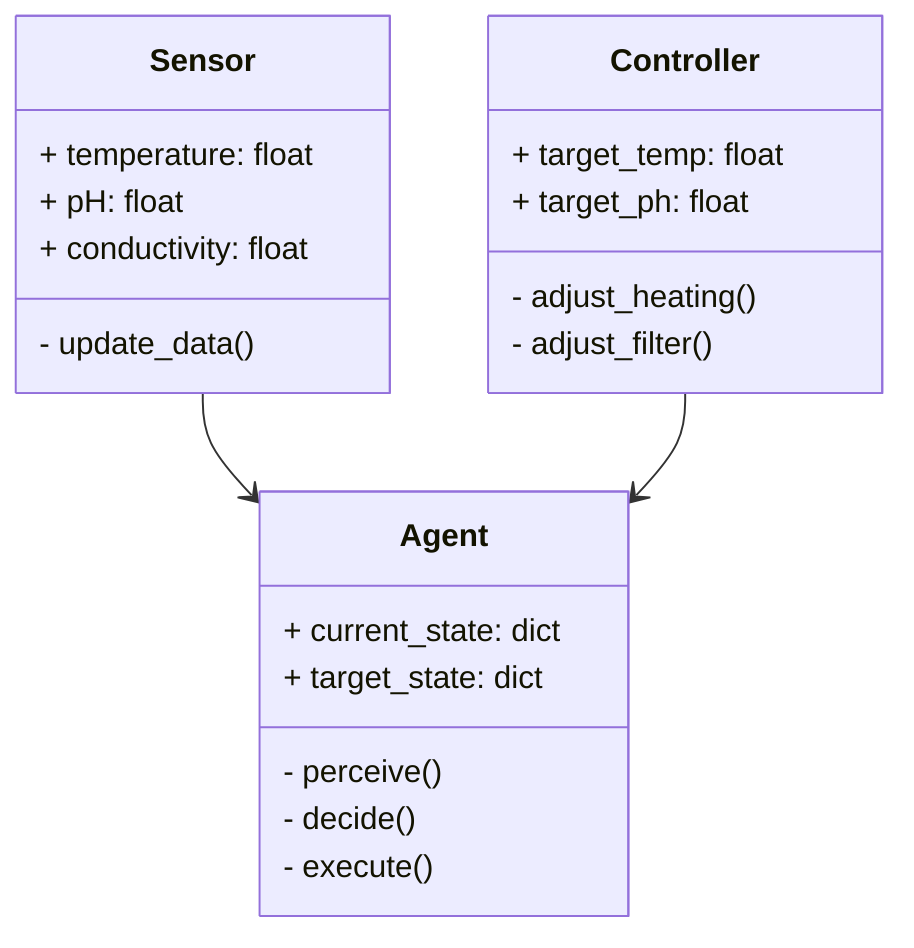
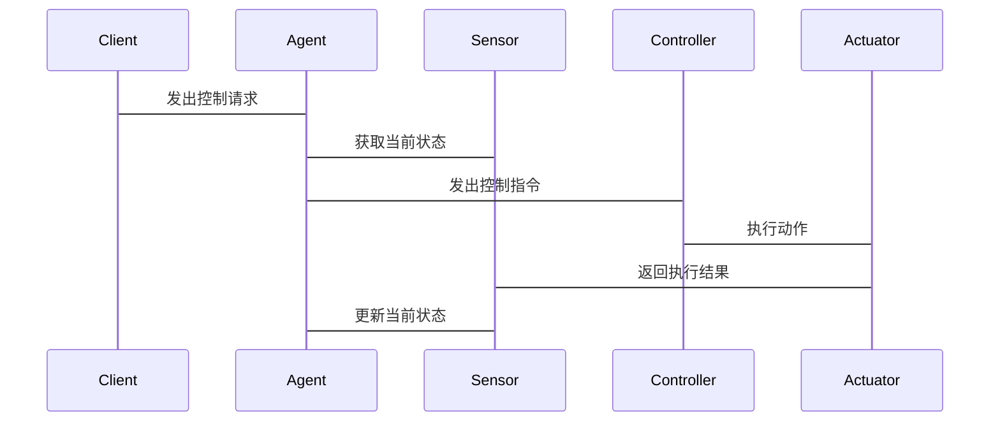

                 


# 智能鱼缸：AI Agent的水质平衡维护

> 关键词：智能鱼缸、AI Agent、水质平衡、机器学习、强化学习

> 摘要：本文详细探讨了如何利用AI Agent技术实现智能鱼缸的水质平衡维护。通过分析水质数据，构建感知、决策和执行模块，结合机器学习和强化学习算法，设计并实现了一套智能化的水质控制系统。本文从背景介绍、核心概念、算法原理、系统架构到项目实战，全面阐述了智能鱼缸AI Agent的实现过程，为水族爱好者和相关技术人士提供了理论与实践的参考。

---

# 第一部分: 智能鱼缸与AI Agent的背景介绍

# 第1章: 智能鱼缸与AI Agent概述

## 1.1 智能鱼缸的背景与意义
### 1.1.1 水族养殖的基本需求
水族养殖是一项需要精细管理的活动，水质的好坏直接影响到水生生物的生存和健康。传统的水族箱管理依赖于人工定期检测和调整水质参数，这种方式效率低下且容易出错。

### 1.1.2 智能化养殖的优势
随着物联网技术的发展，智能化水族箱逐渐成为可能。通过传感器实时采集水质数据，并利用AI技术进行分析和控制，可以实现自动化、精准化的水质管理。

### 1.1.3 AI Agent在智能鱼缸中的作用
AI Agent（智能代理）是一种能够感知环境、做出决策并执行操作的智能实体。在智能鱼缸中，AI Agent可以通过实时监测水质数据，自动调整设备（如水泵、加热器、过滤器等）的工作状态，以维持理想的水质条件。

## 1.2 水质平衡的核心问题
### 1.2.1 水质参数的重要性
水质参数包括温度、pH值、氨氮、亚硝酸盐、硝酸盐等。这些参数的动态变化直接影响到水生生物的生存环境。

### 1.2.2 水质失衡的常见原因
水质失衡可能是由于鱼的代谢物积累、过滤设备效率不足、换水不及时等多种因素引起的。

### 1.2.3 AI Agent如何实现水质平衡
AI Agent通过实时监测水质数据，利用机器学习模型预测水质变化趋势，并通过强化学习优化控制策略，实现对水质的主动调节和平衡。

## 1.3 AI Agent的基本概念与特点
### 1.3.1 什么是AI Agent
AI Agent是一种具有感知能力、决策能力和执行能力的智能实体。它能够根据环境信息做出自主决策，并通过执行动作影响环境状态。

### 1.3.2 AI Agent的核心特征
- **自主性**：能够自主决策和行动，无需人工干预。
- **反应性**：能够实时感知环境变化并做出反应。
- **主动性**：能够主动采取行动以实现目标。
- **学习能力**：能够通过学习优化自身的决策和控制策略。

### 1.3.3 AI Agent与传统自动控制系统的区别
传统控制系统通常基于固定的规则进行控制，而AI Agent能够通过学习和自适应优化控制策略，具有更强的灵活性和适应性。

## 1.4 本章小结
本章介绍了智能鱼缸的基本需求和AI Agent在其中的重要作用，阐述了水质平衡的核心问题，并总结了AI Agent的基本概念和特点。

---

# 第二部分: AI Agent的核心概念与原理

# 第2章: AI Agent的感知与决策机制

## 2.1 感知模块的核心原理
### 2.1.1 数据采集与传感器技术
智能鱼缸中的感知模块通过多种传感器（如温度传感器、pH传感器、电导率传感器等）实时采集水质数据。

### 2.1.2 数据预处理与特征提取
采集到的原始数据可能存在噪声和偏差，需要进行数据清洗和特征提取，以提高数据的质量和可用性。

### 2.1.3 感知模型的构建与训练
基于机器学习的方法，构建感知模型，用于识别和分类不同的水质状态。

## 2.2 决策模块的算法原理
### 2.2.1 基于规则的决策系统
基于预定义的规则进行决策，例如当温度超过某个阈值时，启动冷却系统。

### 2.2.2 基于机器学习的决策模型
利用机器学习算法（如支持向量机、随机森林等）构建决策模型，用于预测水质变化趋势并制定控制策略。

### 2.2.3 基于强化学习的优化策略
通过强化学习算法，AI Agent可以在与环境的交互中学习到最优的控制策略，从而实现对水质的精确调节。

## 2.3 执行模块的实现方式
### 2.3.1 控制系统的硬件实现
通过继电器、电机等硬件设备实现对鱼缸设备的控制。

### 2.3.2 执行模块的软件控制
编写控制程序，通过软件接口实现对硬件设备的控制。

### 2.3.3 执行效果的反馈机制
通过传感器实时反馈执行效果，形成闭环控制系统，确保水质维持在理想状态。

## 2.4 本章小结
本章详细介绍了AI Agent的感知、决策和执行模块的核心原理，分析了不同决策算法的特点和应用场景。

---

# 第三部分: AI Agent的算法实现

# 第3章: 智能鱼缸水质预测的算法模型

## 3.1 数据采集与特征工程
### 3.1.1 水质数据的采集方法
通过多种传感器实时采集水质数据，包括温度、pH值、溶解氧等。

### 3.1.2 数据清洗与特征提取
对采集到的数据进行去噪、归一化等预处理，提取有用的特征用于后续分析。

### 3.1.3 数据集的划分与预处理
将数据集划分为训练集、验证集和测试集，用于模型的训练和评估。

## 3.2 水质预测的机器学习模型
### 3.2.1 线性回归模型
线性回归是一种简单而有效的回归模型，适用于线性关系明显的水质预测。

### 3.2.2 支持向量回归模型
支持向量回归（SVR）基于支持向量机（SVM）理论，适用于非线性关系的水质预测。

### 3.2.3 随机森林回归模型
随机森林是一种基于树模型的集成学习方法，具有较高的鲁棒性和准确性。

## 3.3 基于强化学习的水质优化算法
### 3.3.1 强化学习的基本原理
强化学习通过智能体与环境的交互，学习最优策略以最大化累积奖励。

### 3.3.2 Q-learning算法在水质控制中的应用
通过Q-learning算法，AI Agent可以学习到最优的控制策略，实现对水质的动态调节。

## 3.4 算法实现的数学模型与公式
### 3.4.1 线性回归模型的数学公式
$$ y = \beta_0 + \beta_1x + \epsilon $$
其中，$y$ 是目标变量，$x$ 是自变量，$\beta_0$ 和 $\beta_1$ 是回归系数，$\epsilon$ 是误差项。

### 3.4.2 强化学习中的Q-learning算法
状态转移方程：
$$ Q(s, a) = r + \gamma \max_{a'} Q(s', a') $$
其中，$s$ 是当前状态，$a$ 是当前动作，$r$ 是奖励，$\gamma$ 是折扣因子，$s'$ 是下一个状态。

## 3.5 本章小结
本章详细介绍了水质预测的机器学习模型和基于强化学习的优化算法，给出了相关数学公式和实现方法。

---

# 第四部分: 智能鱼缸AI Agent的系统架构设计

# 第4章: 系统功能设计与架构

## 4.1 问题场景介绍
智能鱼缸AI Agent需要实时监测水质数据，根据数据变化自动调整设备参数，以维持水质的稳定。

## 4.2 项目介绍
本项目旨在设计并实现一个基于AI Agent的智能鱼缸水质控制系统，利用传感器、机器学习和强化学习技术实现水质的智能调节。

## 4.3 系统功能设计
### 4.3.1 领域模型（Mermaid 类图）


### 4.3.2 系统架构设计（Mermaid 架构图）


### 4.3.3 系统接口设计
- **感知接口**：传感器数据接口，用于获取水质参数。
- **控制接口**：设备控制接口，用于发送控制指令。
- **反馈接口**：系统反馈接口，用于接收执行结果。

### 4.3.4 系统交互设计（Mermaid 序列图）


## 4.4 本章小结
本章通过系统功能设计、架构设计和交互设计，详细描述了智能鱼缸AI Agent的整体架构和实现方式。

---

# 第五部分: 项目实战

# 第5章: 项目实现与案例分析

## 5.1 环境搭建与库的安装
### 5.1.1 Python环境的配置
安装Python 3.x 及其开发环境。

### 5.1.2 库的安装
安装必要的库，如：
```bash
pip install numpy
pip install scikit-learn
pip install matplotlib
pip install gym
```

## 5.2 系统核心实现
### 5.2.1 感知模块的实现
编写代码实现传感器数据的采集和处理。

### 5.2.2 决策模块的实现
基于机器学习和强化学习算法实现水质预测和控制策略。

### 5.2.3 执行模块的实现
通过GPIO或模拟接口控制鱼缸设备。

## 5.3 代码实现与解读
### 5.3.1 感知模块的代码实现
```python
import numpy as np

class Sensor:
    def __init__(self):
        self.temperature = 25.0
        self.pH = 7.0
        self.conductivity = 500.0

    def update_data(self):
        # 模拟传感器数据的更新
        self.temperature += np.random.normal(0, 0.5)
        self.pH += np.random.normal(0, 0.1)
        self.conductivity += np.random.normal(0, 50)
```

### 5.3.2 决策模块的代码实现
```python
from sklearn.ensemble import RandomForestRegressor

class DecisionModule:
    def __init__(self):
        self.model = RandomForestRegressor(n_estimators=100, random_state=42)

    def train(self, X, y):
        self.model.fit(X, y)

    def predict(self, X):
        return self.model.predict(X)
```

### 5.3.3 执行模块的代码实现
```python
class Controller:
    def __init__(self):
        self.target_temp = 25.0
        self.target_ph = 7.0

    def adjust_heating(self, current_temp):
        if current_temp < self.target_temp:
            return 'increase_heating'
        elif current_temp > self.target_temp:
            return 'decrease_heating'
        else:
            return 'no_change'

    def adjust_filter(self, current_ph):
        if current_ph < self.target_ph:
            return 'increase_filter'
        elif current_ph > self.target_ph:
            return 'decrease_filter'
        else:
            return 'no_change'
```

## 5.4 实际案例分析
通过具体案例分析，验证AI Agent在智能鱼缸中的实际应用效果，展示系统在不同场景下的表现。

## 5.5 本章小结
本章通过项目实战，详细展示了智能鱼缸AI Agent的实现过程，包括环境搭建、代码实现和案例分析。

---

# 第六部分: 最佳实践与总结

# 第6章: 最佳实践与总结

## 6.1 最佳实践
### 6.1.1 系统设计中的注意事项
在系统设计中，需要注意传感器的精度、算法的实时性和系统的稳定性。

### 6.1.2 系统实现中的技巧
在实现过程中，可以采用模块化设计，便于系统的扩展和维护。

## 6.2 项目小结
本项目通过AI Agent技术实现了智能鱼缸的水质平衡维护，验证了AI技术在水族养殖中的应用潜力。

## 6.3 注意事项
在实际应用中，需要注意传感器的校准、算法的优化以及系统的安全防护。

## 6.4 拓展阅读
推荐读者阅读相关领域的书籍和论文，深入学习AI Agent和水质控制的相关知识。

## 6.5 本章小结
本章总结了项目中的经验和教训，提出了实际应用中的注意事项，并推荐了进一步学习的资料。

---

# 作者信息

作者：AI天才研究院/AI Genius Institute & 禅与计算机程序设计艺术 /Zen And The Art of Computer Programming

