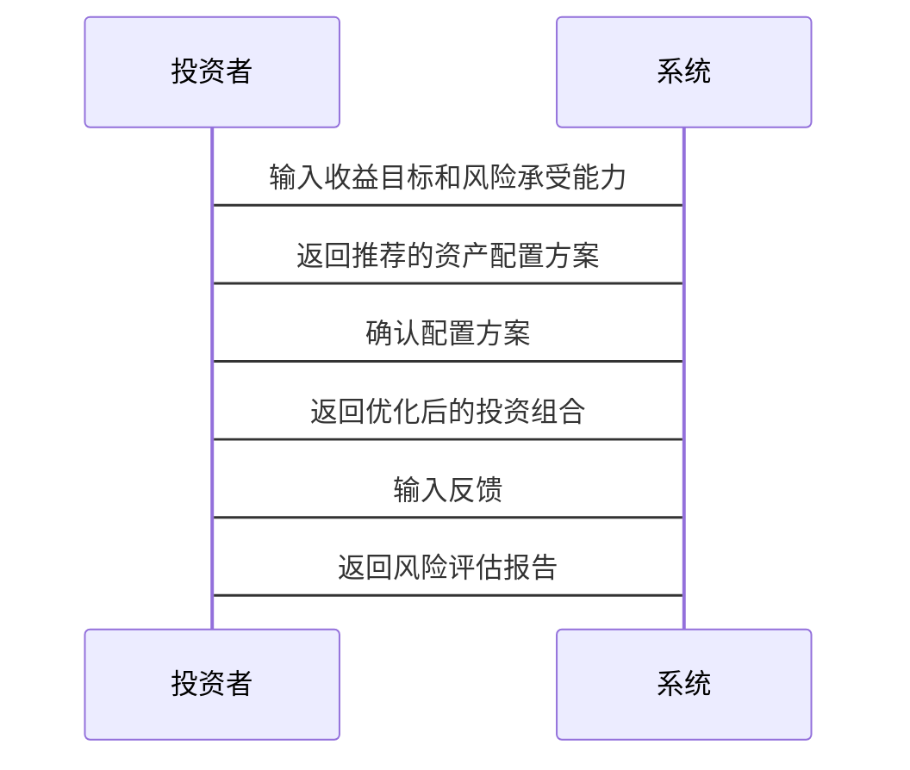

                 


# 约翰·伯格的简单投资法则

## 关键词：
- 约翰·伯格
- 投资法则
- 简单投资
- 长期投资
- 分散投资
- 指数基金

## 摘要：
《约翰·伯格的简单投资法则》一书深入探讨了约翰·伯格的投资理念，重点介绍了他的“简单投资”策略，强调长期持有和分散投资的重要性。通过分析投资的基本原理、数学模型和实际案例，本书为读者提供了实现稳健投资回报的系统化方法。书中结合理论与实践，详细讲解了指数基金的投资策略，并通过系统设计和项目实战，帮助读者掌握伯格的投资哲学。

---

## 第一部分: 投资的基本概念与约翰·伯格的简单投资法则

### 第1章: 投资的基本概念

#### 1.1 投资的定义与分类
- 1.1.1 投资的定义
  - 投资是通过将资金分配到不同资产类别（如股票、债券、房地产等）以实现财富增长的行为。
  - 投资的核心目标是通过时间和复利效应实现财富的保值和增值。

- 1.1.2 投资的分类
  - 短期投资：通常指持有时间不足一年的投资，主要用于套利或短期收益。
  - 长期投资：指持有时间超过一年的投资，目标是通过资产增值实现长期收益。
  - 主动投资：通过选股或择时主动管理投资组合以获得超额收益。
  - 被动投资：通过跟踪指数或市场基准，以较低的成本实现市场平均收益。

- 1.1.3 投资的基本原则
  - 风险与收益成正比：高风险投资通常伴随着更高的潜在收益，但也有更大的损失可能。
  - 时间价值：复利效应是投资增长的关键，长期投资能够最大化时间的价值。
  - 分散投资：通过将资金分配到不同的资产类别或行业中降低风险。

#### 1.2 约翰·伯格的生平与贡献
- 1.2.1 约翰·伯格的简介
  - 约翰·伯格（John Bogle）是美国著名投资者、指数基金之父，也是Vanguard集团的创始人。
  - 他于1949年创立了Vanguard集团，成为全球最大的指数基金提供商之一。

- 1.2.2 伯格在投资领域的贡献
  - 伯格倡导低成本投资，认为高额的管理费用是侵蚀投资者收益的主要因素。
  - 他发明了指数基金，为投资者提供了实现市场平均收益的低成本工具。
  - 伯格的投资理念强调长期持有和分散投资，反对频繁交易和市场择时。

- 1.2.3 伯格的投资哲学
  - 长期投资：伯格认为市场波动是短期的，长期来看，市场趋势是由经济发展驱动的。
  - 分散投资：通过投资于广泛的市场指数，降低个股或行业波动带来的风险。
  - 低成本投资：伯格认为高费用会显著侵蚀长期投资收益，因此提倡低成本的指数基金。

#### 1.3 简单投资法则的核心理念
- 1.3.1 简单投资法则的定义
  - 简单投资法则是一种以长期持有、分散投资和低成本为核心的投资策略。
  - 该策略强调避免复杂的市场预测和频繁交易，以降低投资成本和心理压力。

- 1.3.2 简单投资法则的特点
  - 长期性：注重长期投资，避免短期波动的干扰。
  - 分散性：通过广泛的投资分散风险，降低单一资产或市场的波动影响。
  - 低成本：选择费用低廉的投资工具，如指数基金，以最大化收益。

- 1.3.3 简单投资法则与复杂投资策略的对比
  - 简单投资法则强调长期、分散和低成本，适合风险承受能力较低的投资者。
  - 复杂投资策略通常涉及高频交易、市场择时和主动选股，风险较高，但潜在收益也更大。

---

## 第二部分: 投资的数学模型与算法

### 第2章: 投资的基本原理

#### 2.1 资产配置的重要性
- 2.1.1 资产配置的定义
  - 资产配置是指将资金分配到不同的资产类别（如股票、债券、现金等）以优化风险和收益的过程。
  - 资产配置的核心目标是平衡风险和收益，避免过度集中于某一资产类别。

- 2.1.2 资产配置的分类
  - 按时间划分：短期、中期和长期资产配置。
  - 按风险划分：保守型、平衡型和积极型资产配置。
  - 按地域划分：全球资产配置和本地资产配置。

- 2.1.3 资产配置的优缺点
  - 优点：分散风险，平衡收益，降低波动性。
  - 缺点：可能错失某些高增长资产的机会，需要定期调整以适应市场变化。

#### 2.2 复利效应的数学模型
- 2.2.1 复利的定义与公式
  - 复利是指投资收益再投资所产生的收益，其公式为：
    $$ A = P \times (1 + r)^t $$
    其中，\( A \) 是终值，\( P \) 是本金，\( r \) 是年化收益率，\( t \) 是投资时间（年）。

- 2.2.2 复利的计算方法
  - 单利计算：仅计算本金的利息，公式为：
    $$ A = P \times (1 + r \times t) $$
  - 复利计算：计算本金和之前累积的利息的利息，公式如前所述。

- 2.2.3 复利与投资回报的关系
  - 复利效应是投资增长的关键，尤其是长期投资中，复利能够显著放大投资收益。
  - 通过长期持有，复利效应能够帮助投资者实现财富的指数级增长。

#### 2.3 投资风险与收益的平衡
- 2.3.1 投资风险的定义
  - 投资风险是指在投资过程中可能遭受损失或收益低于预期的可能性。
  - 风险通常与潜在收益成正比，高风险投资可能带来高收益，但也有更高的损失可能。

- 2.3.2 投资收益的分类
  - 当期收益：包括股息、利息等现金流收益。
  - 资本收益：资产价格的上涨带来的收益。

- 2.3.3 风险与收益的平衡策略
  - 风险厌恶型投资者：倾向于选择低风险、稳定收益的投资工具。
  - 风险中性型投资者：追求与市场相匹配的风险和收益。
  - 风险偏好型投资者：愿意承担更高的风险以追求更高的收益。

### 第3章: 约翰·伯格的指数基金投资策略

#### 3.1 指数基金的定义与特点
- 3.1.1 指数基金的定义
  - 指数基金是一种跟踪特定市场指数（如标普500指数）的基金，其投资组合按照指数的成分股比例构建。
  - 指数基金的目标是实现与市场指数相等的收益，而非跑赢市场。

- 3.1.2 指数基金的特点
  - 成本低廉：指数基金的管理费用通常较低，因为它们采用被动管理策略。
  - 分散风险：通过广泛投资于市场指数的成分股，降低个股或行业的波动风险。
  - 简单透明：投资者可以通过指数的表现轻松了解基金的收益情况。

#### 3.2 约翰·伯格的简单投资法则
- 3.2.1 长期投资的重要性
  - 长期投资能够充分利用复利效应，降低市场短期波动的影响。
  - 长期投资需要耐心和纪律，避免频繁交易带来的成本和心理压力。

- 3.2.2 分散投资的风险控制
  - 通过投资于广泛的市场指数，分散个股或行业的波动风险。
  - 分散投资不仅限于股票，还可以包括债券、房地产信托等其他资产类别。

- 3.2.3 低成本投资的优势
  - 高额的管理费用会显著侵蚀长期投资收益，因此选择低成本基金至关重要。
  - 指数基金的管理费用通常低于主动管理型基金，适合长期投资。

#### 3.3 指数基金的长期表现分析
- 3.3.1 指数基金的长期收益
  - 标普500指数长期年化收益约为7%-8%，扣除费用后，指数基金的收益仍然具有吸引力。
  - 长期来看，指数基金的表现通常优于大多数主动管理型基金。

- 3.3.2 指数基金的风险分析
  - 指数基金的风险与市场整体风险相关，无法完全避免市场波动的影响。
  - 通过资产配置和分散投资，可以降低指数基金的风险。

- 3.3.3 指数基金的费用影响
  - 管理费用和托管费用是指数基金的主要费用来源，长期来看，低费用基金更具优势。
  - 费用低廉的指数基金更适合长期投资，因为复利效应能够放大低成本的优势。

### 第4章: 投资组合优化的数学模型

#### 4.1 投资组合优化的基本原理
- 4.1.1 投资组合优化的定义
  - 投资组合优化是指通过科学的方法构建最优投资组合，以实现风险和收益的平衡。
  - 优化的目标通常是在给定风险水平下实现最大收益，或在给定收益下实现最小风险。

- 4.1.2 投资组合优化的分类
  - 均值-方差优化：以收益和风险（方差）为优化目标。
  - 最大化收益：在风险约束下实现最大收益。
  - 最小化风险：在收益约束下实现最小风险。

- 4.1.3 投资组合优化的核心要素
  - 资产的预期收益和风险：需要估计每种资产的预期收益和风险。
  - 资产之间的相关性：资产之间的相关性会影响投资组合的风险分散效果。
  - 投资者的风险承受能力：投资者的风险偏好会影响优化的目标和约束条件。

#### 4.2 均值-方差优化模型
- 4.2.1 均值-方差优化的数学公式
  - 均值-方差优化的目标是最小化投资组合的方差（风险），在给定的收益约束下。
  - 数学公式如下：
    $$ \min_{w} \quad w^T \Sigma w $$
    $$ \text{subject to} \quad w^T \mu = r \quad \text{和} \quad w^T 1 = 1 $$
    其中，\( w \) 是投资权重向量，\( \Sigma \) 是资产之间的协方差矩阵，\( \mu \) 是资产的预期收益向量，\( r \) 是目标收益。

- 4.2.2 均值-方差优化的实现步骤
  - 估计资产的预期收益和协方差矩阵。
  - 构建优化模型，设定目标和约束条件。
  - 使用优化算法求解最优投资权重。

- 4.2.3 均值-方差优化的优缺点
  - 优点：能够有效分散风险，优化投资组合的收益-风险比。
  - 缺点：需要准确估计资产的预期收益和协方差矩阵，存在较高的计算复杂度。

#### 4.3 马科维茨投资组合理论
- 4.3.1 马科维茨理论的核心思想
  - 马科维茨（Harry Markowitz）提出的投资组合理论是现代投资组合理论（MPT）的基础。
  - 该理论认为，通过合理分散投资，可以实现投资组合风险的最小化。

- 4.3.2 马科维茨理论的数学模型
  - 马科维茨理论的目标是通过优化投资组合的方差（风险）来实现收益最大化或风险最小化。
  - 数学公式与均值-方差优化类似，但更加强调风险的最小化。

- 4.3.3 马科维茨理论的实际应用
  - 通过估计资产的预期收益和协方差矩阵，构建最优投资组合。
  - 在实际投资中，马科维茨理论常用于机构投资者的资产配置决策。

#### 4.4 CAPM模型与投资组合优化
- 4.4.1 CAPM模型的定义
  - CAPM（资本资产定价模型）用于估计资产的预期收益。
  - 公式为：
    $$ E(r_i) = r_f + \beta_i (E(r_m) - r_f) $$
    其中，\( E(r_i) \) 是资产 \( i \) 的预期收益，\( r_f \) 是无风险利率，\( \beta_i \) 是资产 \( i \) 的贝塔系数，\( E(r_m) \) 是市场预期收益。

- 4.4.2 CAPM模型在投资组合优化中的应用
  - 使用CAPM模型估计资产的预期收益，作为优化模型的输入。
  - 将CAPM模型与均值-方差优化结合，构建符合市场风险溢价的投资组合。

- 4.4.3 CAPM模型的优缺点
  - 优点：能够反映市场风险溢价，提供合理的收益估计。
  - 缺点：假设市场是有效的，且资产服从正态分布，实际中可能不成立。

---

## 第三部分: 投资组合优化的系统设计与实现

### 第5章: 系统分析与架构设计

#### 5.1 系统功能设计
- 5.1.1 问题场景介绍
  - 投资者需要根据自身的风险承受能力和收益目标，构建最优的投资组合。
  - 通过系统化的方法，帮助投资者实现资产配置和投资组合优化。

- 5.1.2 系统功能需求
  - 资产配置模块：根据投资者的收益目标和风险承受能力，推荐合适的资产配置方案。
  - 投资组合优化模块：基于市场数据和投资者需求，优化投资组合的收益-风险比。
  - 风险评估模块：评估投资组合的风险，并提供调整建议。

- 5.1.3 系统功能模块的交互流程
  - 投资者输入收益目标和风险承受能力。
  - 系统根据输入推荐资产配置方案。
  - 投资者确认配置方案后，系统优化投资组合。
  - 系统评估投资组合的风险，并提供调整建议。

#### 5.2 系统架构设计
- 5.2.1 系统架构概述
  - 系统架构采用分层设计，包括数据层、业务逻辑层和用户界面层。
  - 数据层负责存储和管理市场数据，业务逻辑层负责优化计算，用户界面层负责与用户交互。

- 5.2.2 数据层设计
  - 数据来源：包括历史市场数据、资产价格、收益率等。
  - 数据存储：使用数据库存储市场数据和优化结果。
  - 数据接口：通过API获取实时市场数据。

- 5.2.3 业务逻辑层设计
  - 资产配置模块：根据投资者需求，推荐合适的资产配置方案。
  - 投资组合优化模块：基于市场数据和优化模型，计算最优投资组合。
  - 风险评估模块：评估投资组合的风险，并提供调整建议。

- 5.2.4 用户界面层设计
  - 输入界面：投资者输入收益目标和风险承受能力。
  - 输出界面：显示推荐的资产配置方案、优化后的投资组合和风险评估结果。

#### 5.3 系统接口设计
- 5.3.1 数据接口
  - 数据输入接口：从数据库或外部API获取市场数据。
  - 数据输出接口：将优化结果存储到数据库或返回给用户界面。

- 5.3.2 用户接口
  - 输入接口：投资者输入收益目标和风险承受能力。
  - 输出接口：显示优化结果和风险评估报告。

#### 5.4 系统交互设计
- 5.4.1 系统交互流程
  - 投资者输入收益目标和风险承受能力。
  - 系统根据输入推荐资产配置方案。
  - 投资者确认配置方案后，系统优化投资组合。
  - 系统评估投资组合的风险，并提供调整建议。

- 5.4.2 交互流程的可视化
  - 使用Mermaid序列图展示系统交互流程，如下：



---

## 第四部分: 项目实战与投资组合优化

### 第6章: 项目实战——基于伯格理念的指数基金投资策略实现

#### 6.1 环境安装与配置
- 6.1.1 安装Python环境
  - 使用Anaconda安装Python 3.x环境。
  - 安装必要的库：pandas、numpy、scipy、matplotlib。

- 6.1.2 数据获取
  - 使用Yahoo Finance API获取指数基金的历史数据。
  - 下载标普500指数的历史数据作为参考。

- 6.1.3 工具安装
  - 安装Jupyter Notebook用于数据分析和可视化。

#### 6.2 系统核心实现
- 6.2.1 数据清洗与预处理
  - 读取历史数据，处理缺失值和异常值。
  - 标准化数据格式，便于后续分析。

- 6.2.2 指数基金投资策略实现
  - 计算指数基金的历史收益率和波动率。
  - 模拟指数基金的长期表现，验证伯格的投资理念。

- 6.2.3 投资组合优化实现
  - 使用均值-方差优化模型，构建最优投资组合。
  - 对比指数基金和其他主动管理型基金的表现。

#### 6.3 代码实现与解读
- 6.3.1 数据获取与清洗代码
  ```python
  import pandas as pd
  import numpy as np
  import requests
  import json

  def get_data(ticker, start_date, end_date):
      url = f"https://query1.finance.yahoo.com/v8/finance/chart/{ticker}"
      params = {
          'start': start_date,
          'end': end_date
      }
      response = requests.get(url, params=params)
      data = json.loads(response.text)
      df = pd.DataFrame(data['chart']['result'][0]['prices'])
      df.columns = ['Date', 'Open', 'High', 'Low', 'Close', 'Volume']
      df['Date'] = pd.to_datetime(df['Date'])
      return df.set_index('Date')

  sp500 = get_data('^GSPC', '2000-01-01', '2023-12-31')
  sp500 = sp500.resample('D').last().dropna()
  ```

- 6.3.2 投资组合优化代码
  ```python
  import numpy as np
  from scipy.optimize import minimize

  def portfolio_variance(weights, covariance_matrix):
      return np.dot(weights.T, np.dot(covariance_matrix, weights))

  def portfolio_optimization(returns, covariance, target_return):
      n = len(weights) = returns.shape[0]
      init_guess = np.array([1.0/n]*n)
      constraints = [{'type': 'eq', 'fun': lambda w: sum(w) - 1},
                     {'type': 'eq', 'fun': lambda w: sum(w*returns) - target_return}]
      result = minimize(portfolio_variance, init_guess, 
                        args=(covariance,), 
                        method='SLSQP',
                        constraints=constraints)
      return result.x

  target_return = 0.08
  covariance = sp500.pct_change().cov()
  weights = portfolio_optimization(sp500.pct_change().mean(), covariance, target_return)
  ```

- 6.3.3 结果分析
  - 计算投资组合的预期收益和波动率。
  - 比较指数基金与优化投资组合的表现。

#### 6.4 实际案例分析
- 6.4.1 案例背景
  - 假设投资者有10万元可用于投资，目标是实现年化8%的收益，风险承受能力为中等。

- 6.4.2 投资组合构建
  - 根据伯格的理念，选择标普500指数基金作为投资标的。
  - 通过优化模型，计算出最优的投资组合权重。

- 6.4.3 投资效果评估
  - 计算投资组合的累计收益和年化收益率。
  - 对比指数基金的历史表现和优化后的投资组合表现。

#### 6.5 投资策略优化
- 6.5.1 定期再平衡
  - 定期调整投资组合，以保持目标权重不变。
  - 再平衡的频率可以根据市场波动性和投资目标调整。

- 6.5.2 风险管理
  - 设置止损点，当投资组合的波动率超过预期时，减少投资比例。
  - 定期评估市场的风险溢价，调整投资组合的风险水平。

### 第7章: 总结与最佳实践

#### 7.1 总结
- 伯格的简单投资法则强调长期持有、分散投资和低成本。
- 通过系统化的方法，投资者可以实现稳健的投资回报。

#### 7.2 最佳实践
- 长期投资：坚持长期持有，避免频繁交易。
- 分散投资：通过指数基金实现广泛的市场分散。
- 低成本投资：选择费用低廉的投资工具，最大化收益。

#### 7.3 投资注意事项
- 定期评估投资组合，根据市场变化和个人财务状况进行调整。
- 避免情绪化投资，保持理性和纪律性。
- 保持学习和研究，不断提升自己的投资知识和技能。

#### 7.4 未来投资建议
- 关注全球经济趋势和市场变化，调整投资策略。
- 多元化投资，分散风险，降低市场波动的影响。
- 定期再平衡投资组合，保持目标权重。

#### 7.5 拓展阅读
- 《The Intelligent Investor》——本杰明·格雷厄姆
- 《The Richest Man in Babylon》——乔治·克拉森
- 《Investing: The Art and Science of Building Portfolios》——威廉·伯恩斯坦

---

## 作者：AI天才研究院/AI Genius Institute & 禅与计算机程序设计艺术 /Zen And The Art of Computer Programming

