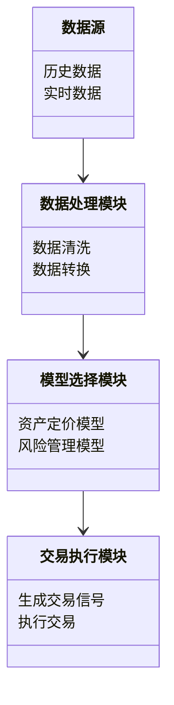
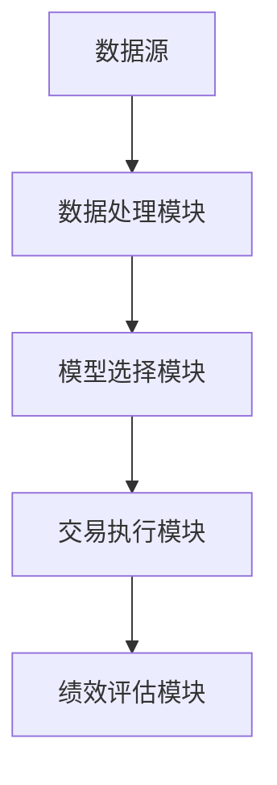
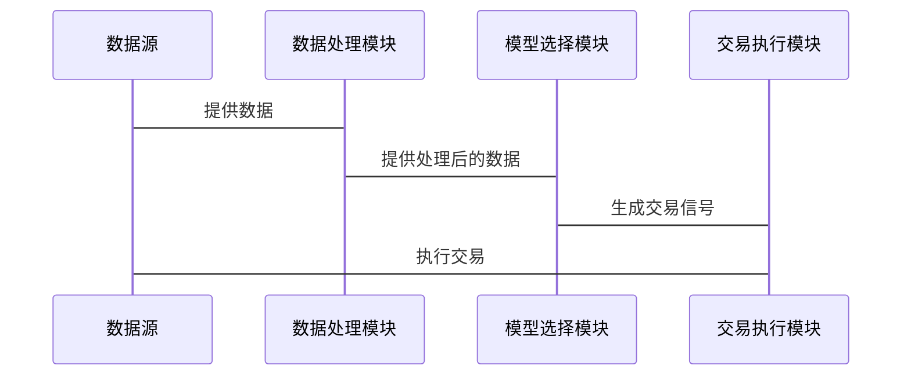

                 


# 芒格的"数学期望"思维在量化投资中的应用

> 关键词：芒格，数学期望，量化投资，投资决策，风险管理，系统架构

> 摘要：本文探讨了芒格的数学期望思维在量化投资中的应用，从数学期望的基本概念到其在资产定价、风险管理中的具体应用，结合系统架构设计和项目实战案例，深入分析了如何将芒格的思维方式融入量化投资的实践中，帮助投资者做出更科学的投资决策。

---

## 第1章: 芒格的"数学期望"思维简介

### 1.1 芒格的生平与投资理念

#### 1.1.1 芒格的生平简介
查理·芒格（Charlie Munger）是美国著名投资家、作家和演讲家，也是沃伦·巴菲特的长期合作伙伴。芒格于1924年出生在美国密歇根州，早年就读于哈佛法学院，后来转向法律和投资领域。他不仅是伯克希尔·哈撒韦公司的副主席，还以其独特的投资哲学和思维方式闻名。

#### 1.1.2 芒格的投资哲学
芒格的投资哲学以“价值投资”为核心，强调安全边际和长期持有的理念。他认为，投资的本质是通过分析企业的内在价值，寻找市场定价低于内在价值的投资标的。芒格的思维方式注重跨学科的思考，尤其是对概率论和数学期望的深刻理解，使其在投资决策中具有独特的视角。

#### 1.1.3 芒格的数学期望思维
芒格的数学期望思维是指在投资决策中，通过计算不同投资方案的期望值，结合概率分布，评估其潜在收益和风险。这种思维方式不仅帮助投资者量化潜在回报，还能帮助他们规避高风险的投资决策。

### 1.2 数学期望的基本概念

#### 1.2.1 数学期望的定义
数学期望，又称期望值，是指在概率论中，一个随机变量在不同取值下的加权平均值。其权重为各个取值的概率。数学期望的公式为：
$$ E[X] = \sum_{i=1}^{n} x_i p_i $$
其中，$x_i$ 是随机变量 $X$ 的可能取值，$p_i$ 是对应的概率。

#### 1.2.2 数学期望的性质
1. **线性性**：数学期望满足线性性质，即对于任意常数 $a$ 和 $b$，有：
   $$ E[aX + b] = aE[X] + b $$
2. **独立性**：如果两个随机变量 $X$ 和 $Y$ 独立，那么：
   $$ E[XY] = E[X]E[Y] $$
3. **非负性**：如果 $X$ 是非负随机变量，那么 $E[X] \geq 0$。

#### 1.2.3 数学期望的应用领域
数学期望广泛应用于概率论、统计学、金融学、工程学等领域。在金融领域，数学期望常用于评估投资组合的预期收益和风险。

---

## 第2章: 数学期望在投资中的应用

### 2.1 投资中的期望收益

#### 2.1.1 期望收益的计算
在投资中，数学期望被用来计算资产的期望收益。假设某资产在不同市场状态下的收益率分别为 $r_1, r_2, \dots, r_n$，对应的概率分别为 $p_1, p_2, \dots, p_n$，则该资产的期望收益为：
$$ E[r] = \sum_{i=1}^{n} r_i p_i $$

#### 2.1.2 投资组合的期望收益
对于一个包含 $k$ 种资产的投资组合，假设每种资产的权重分别为 $w_1, w_2, \dots, w_k$，每种资产的期望收益分别为 $E[r_1], E[r_2], \dots, E[r_k]$，则投资组合的期望收益为：
$$ E[r_p] = \sum_{i=1}^{k} w_i E[r_i] $$

#### 2.1.3 风险与期望收益的关系
在投资中，风险通常与收益的波动性相关。数学期望可以帮助投资者在不同风险水平下，评估资产或投资组合的期望收益。例如，通过计算夏普比率（Sharpe Ratio），投资者可以衡量投资组合的风险调整后收益。

### 2.2 数学期望与投资决策

#### 2.2.1 期望值在资产配置中的应用
资产配置的核心是根据投资者的风险偏好和收益目标，分配资金到不同的资产类别。数学期望可以帮助投资者计算不同资产组合的期望收益和风险，从而优化资产配置。

#### 2.2.2 期望值在风险管理中的作用
风险管理是投资的重要组成部分。通过计算投资组合的期望损失（Expected Loss）和尾部风险（Tail Risk），投资者可以更好地管理和控制风险。

#### 2.2.3 期望值在投资组合优化中的应用
投资组合优化的目标是在给定风险水平下，最大化期望收益。数学期望是投资组合优化的重要工具，常用于计算最优权重分配。

---

## 第3章: 量化投资中的数学期望思维

### 3.1 量化投资的基本原理

#### 3.1.1 量化投资的定义与特点
量化投资是通过数学模型和算法进行投资决策的过程。其特点是客观性、系统性和可重复性。量化投资依赖于数据驱动的决策，而非主观判断。

#### 3.1.2 量化投资的核心特点
1. **数据驱动**：量化投资依赖于历史数据和实时数据的分析。
2. **系统性**：通过制定明确的交易规则和策略，避免人为情绪干扰。
3. **可量化**：通过数学模型量化市场行为、资产价格和风险。

#### 3.1.3 量化投资与传统投资的区别
传统投资依赖于基本面分析和市场情绪判断，而量化投资则依赖于数学模型和算法。量化投资注重数据的系统性分析，而传统投资更注重个体分析。

### 3.2 量化投资中的数学模型

#### 3.2.1 时间序列分析
时间序列分析是量化投资中常用的方法，用于预测资产价格的未来走势。常用模型包括ARIMA、GARCH等。

#### 3.2.2 回归分析
回归分析用于研究资产价格与影响因素之间的关系。例如，通过回归模型分析宏观经济指标对股票价格的影响。

#### 3.2.3 随机过程模型
随机过程模型用于描述资产价格的随机波动。布朗运动和马尔可夫链是量化投资中常用的随机过程模型。

---

## 第4章: 芒格思维在量化投资中的具体应用

### 4.1 资产定价模型

#### 4.1.1 CAPM模型
CAPM（资本资产定价模型）用于计算资产的预期收益。其公式为：
$$ E[r_i] = r_f + \beta_i (E[r_m] - r_f) $$
其中，$r_f$ 是无风险利率，$\beta_i$ 是资产的贝塔系数，$E[r_m]$ 是市场预期收益。

#### 4.1.2 APT模型
APT（资产定价理论）是一种多因子定价模型，用于解释资产价格的波动。其公式为：
$$ E[r_i] = \sum_{j=1}^{n} \lambda_j F_{ij} $$
其中，$\lambda_j$ 是风险溢价，$F_{ij}$ 是资产 $i$ 在因子 $j$ 上的暴露程度。

#### 4.1.3 股票定价的期望收益计算
通过计算股票的期望收益，投资者可以评估其是否被市场低估或高估。例如，假设某股票的历史收益率为 $5\%$，市场预期收益率为 $10\%$，则该股票的预期收益可以通过CAPM或APT模型进行计算。

### 4.2 风险管理模型

#### 4.2.1 VaR模型
VaR（Value at Risk）用于衡量投资组合在一定置信水平下的潜在损失。例如，95%置信水平下的VaR表示在95%的概率下，投资组合的最大损失。

#### 4.2.2 CVaR模型
CVaR（Conditional Value at Risk）是VaR的扩展，用于衡量在VaR水平下的平均损失。CVaR模型更适用于风险厌恶型投资者。

#### 4.2.3 风险调整后的期望收益
通过计算风险调整后的期望收益，投资者可以更全面地评估投资决策的风险和收益。例如，通过夏普比率（Sharpe Ratio）衡量投资组合的风险调整后收益。

---

## 第5章: 系统分析与架构设计

### 5.1 系统分析

#### 5.1.1 问题场景介绍
量化投资系统需要处理大量数据，包括历史价格、交易数据、市场指标等。系统需要能够实时处理数据，并根据数学模型生成交易信号。

#### 5.1.2 项目介绍
本项目旨在设计一个量化投资系统，基于芒格的数学期望思维，结合量化投资的基本原理，构建一个能够自动进行资产配置、风险管理和交易执行的系统。

#### 5.1.3 系统功能设计
系统功能包括：
1. 数据采集与处理
2. 模型选择与参数优化
3. 交易信号生成
4. 风险管理与绩效评估

#### 5.1.4 领域模型类图


### 5.2 系统架构设计

#### 5.2.1 系统架构图


#### 5.2.2 系统接口设计
系统接口包括数据接口、模型接口和交易接口。数据接口用于与数据源交互，模型接口用于与数学模型交互，交易接口用于与交易系统交互。

#### 5.2.3 系统交互序列图


---

## 第6章: 项目实战

### 6.1 环境安装与配置

#### 6.1.1 Python环境安装
安装Python 3.8及以上版本，建议使用Anaconda环境。

#### 6.1.2 必需库的安装
安装以下库：
- pandas: 数据处理
- numpy: 数值计算
- matplotlib: 数据可视化
- scipy: 科学计算
- pmdarima: 时间序列分析
- pyfolio: 绩效评估

安装命令：
```bash
pip install pandas numpy matplotlib scipy pmdarima pyfolio
```

### 6.2 核心算法实现

#### 6.2.1 数学期望的计算代码
```python
import numpy as np

# 定义随机变量
x = np.array([1, 2, 3, 4, 5])
# 定义概率分布
p = np.array([0.1, 0.2, 0.3, 0.2, 0.2])

# 计算期望值
E_x = np.sum(x * p)
print("期望值为:", E_x)
```

#### 6.2.2 投资组合优化的代码
```python
import numpy as np
from scipy.optimize import minimize

# 定义目标函数（最小化风险）
def objective(weights, returns, covariance):
    return np.dot(weights.T, np.dot(covariance, weights)) * 0.5

# 定义约束条件
def constraint(weights, returns, target_return):
    return np.sum(weights * returns) - target_return

# 定义权重约束
def weight_constraint(weights):
    return np.sum(weights) - 1

# 参数
n_assets = 5
returns = np.array([0.1, 0.12, 0.08, 0.15, 0.1])
covariance = np.array([[0.02, 0.01, 0.015, 0.005, 0.01],
                        [0.01, 0.03, 0.02, 0.01, 0.015],
                        [0.015, 0.02, 0.03, 0.015, 0.02],
                        [0.005, 0.01, 0.015, 0.02, 0.01],
                        [0.01, 0.015, 0.02, 0.01, 0.03]])

# 初始化权重
initial_weights = np.array([1/5] * n_assets)

# 最优化问题
result = minimize(objective, initial_weights, args=(returns, covariance),
                 constraints={'type': 'eq', 'fun': constraint, 'args': (returns, 0.1)},
                 bounds=[(0, 1)] * n_assets)

# 输出结果
print("最优权重:", result.x)
print("最小方差:", result.fun)
```

#### 6.2.3 风险管理模型的实现
```python
import numpy as np
from pmdarima.arima import auto_arima

# 示例数据
data = np.array([1, 2, 3, 4, 5, 6, 7, 8, 9, 10])

# 自动选择ARIMA模型
model = auto_arima(data, seasonal=False, stepwise=True, verbose=False)

# 预测未来1步
forecast = model.predict(n_periods=1)
print("未来1步的预测值:", forecast)
```

### 6.3 案例分析与解读

#### 6.3.1 实际投资案例分析
假设我们有一个包含5只股票的投资组合，目标是实现10%的预期收益，同时最小化风险。通过上述代码，我们可以计算出最优权重和最小方差。

#### 6.3.2 案例中的数学期望应用
在案例中，我们使用数学期望来计算投资组合的预期收益，并通过优化算法找到最优权重分配。这帮助我们实现了风险与收益的最佳平衡。

#### 6.3.3 案例总结与反思
通过实际案例，我们可以看到数学期望在量化投资中的重要性。它不仅帮助我们量化潜在收益，还能帮助我们优化投资组合，降低风险。

---

## 第7章: 总结与展望

### 7.1 本书内容总结

#### 7.1.1 芒格的数学期望思维
芒格的数学期望思维是其投资哲学的核心之一，它帮助投资者在复杂市场中做出更科学的投资决策。

#### 7.1.2 量化投资中的应用
通过量化投资，我们可以将芒格的数学期望思维转化为具体的数学模型和算法，从而实现系统化投资。

#### 7.1.3 系统设计与项目实战
通过系统设计和项目实战，我们验证了芒格数学期望思维在量化投资中的可行性和有效性。

### 7.2 未来展望

#### 7.2.1 人工智能与量化投资的结合
随着人工智能技术的发展，量化投资将更加依赖于机器学习和深度学习算法，进一步提升投资决策的科学性和效率。

#### 7.2.2 大数据在量化投资中的应用
大数据技术可以帮助投资者获取更多市场信息，提升数学模型的准确性和预测能力。

#### 7.2.3 可持续投资与ESG因素的融入
未来，ESG（环境、社会、治理）因素将成为投资决策的重要考量，数学期望思维可以帮助投资者更好地评估ESG因素对投资组合的影响。

---

## 作者：AI天才研究院/AI Genius Institute & 禅与计算机程序设计艺术 /Zen And The Art of Computer Programming

---

通过以上内容，我们全面探讨了芒格的数学期望思维在量化投资中的应用，从理论到实践，从系统设计到项目实战，为投资者提供了一套科学的投资方法论。希望读者能够通过本文，更好地理解芒格的投资哲学，并将其应用于实际投资实践中。

