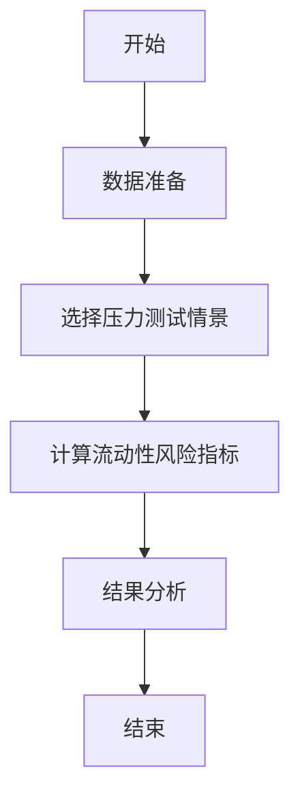
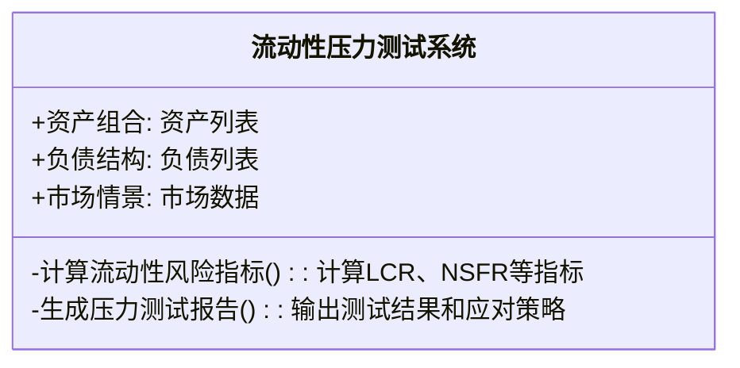
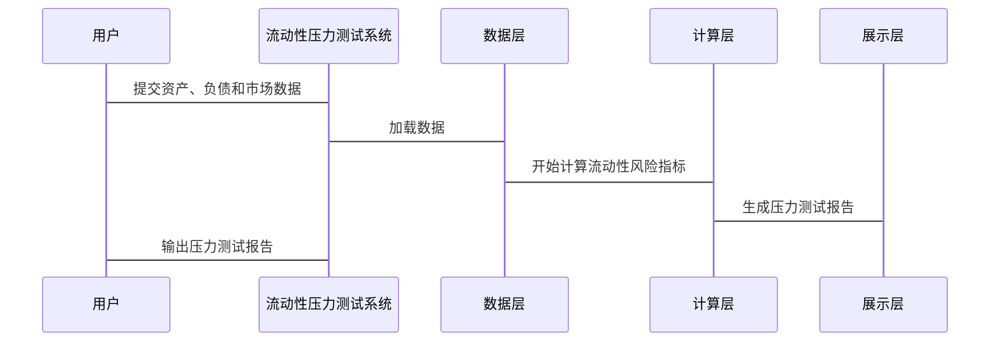

                 


# 金融市场流动性压力测试模型

> 关键词：金融市场，流动性压力测试，风险管理，压力测试模型，VaR，CVaR，系统架构设计

> 摘要：本文详细探讨了金融市场中流动性压力测试模型的设计与应用，分析了流动性风险的核心概念、压力测试的理论基础、模型的算法原理及其数学模型，并通过实际案例展示了模型的实现与优化过程。文章从理论到实践，系统性地介绍了流动性压力测试模型的构建方法，并提出了相应的系统架构设计方案和最佳实践建议。

---

## 第一部分: 金融市场流动性压力测试模型概述

### 第1章: 流动性压力测试模型的背景与意义

#### 1.1 金融市场流动性风险概述

##### 1.1.1 流动性风险的定义与特征

流动性风险是指金融机构在金融市场中无法以合理成本及时获得足够资金以满足其资产增长或偿还负债需求的风险。其主要特征包括：

- **短期性**：通常发生在较短的时间跨度内（如几天或几周）。
- **突发性**：往往由市场波动、突发事件或恐慌情绪引发。
- **传染性**：流动性风险可能迅速蔓延至整个金融系统，导致系统性风险。

##### 1.1.2 流动性风险的来源与影响

流动性风险的来源包括：

- **市场因素**：如市场波动、交易量骤减、资产价格暴跌。
- **机构行为**：如金融机构的过度杠杆、资金链断裂、恐慌性抛售。
- **政策因素**：如监管政策变化、央行政策调整。

流动性风险的影响包括：

- **资产贬值**：资产价值快速下降。
- **信用危机**：可能导致金融机构破产，引发系统性金融危机。
- **市场信心下降**：投资者对市场的信任度降低，进一步加剧流动性问题。

##### 1.1.3 流动性压力测试的重要性

流动性压力测试是评估金融机构在极端市场条件下应对流动性风险的能力的重要工具。通过压力测试，金融机构可以识别潜在的流动性缺口，制定应对策略，增强市场抗风险能力。

---

#### 1.2 压力测试的基本概念

##### 1.2.1 压力测试的定义

压力测试是一种模拟极端市场条件下的情景分析方法，用于评估金融机构在不利环境中的表现和抗风险能力。

##### 1.2.2 压力测试的目的与作用

压力测试的主要目的是：

- **识别风险**：发现潜在的流动性缺口或资产组合中的薄弱环节。
- **制定应对策略**：为金融机构在极端市场条件下提供应对措施。
- **提高市场稳定性**：通过压力测试，金融机构可以更好地应对市场波动，降低系统性风险。

##### 1.2.3 压力测试的分类与应用场景

压力测试的分类：

- **历史模拟法**：基于历史市场数据模拟极端情景。
- **情景分析法**：根据假设情景（如经济衰退、市场崩盘）进行测试。
- **VaR（Value at Risk）方法**：计算资产组合在给定置信水平下的潜在损失。
- **蒙特卡洛模拟法**：通过随机抽样模拟多种市场情景。

---

### 第2章: 流动性压力测试模型的理论基础

#### 2.1 流动性风险的度量指标

##### 2.1.1 流动性覆盖率（LCR）

流动性覆盖率（LCR）是衡量金融机构短期流动性的重要指标，计算公式为：

$$\text{LCR} = \frac{\text{合格流动性资产}}{\text{短期净流出}}$$

其中，合格流动性资产包括现金、中央银行存款、政府债券等，短期净流出包括活期存款、短期借款等。

##### 2.1.2 净稳定资金比率（NSFR）

净稳定资金比率（NSFR）是衡量金融机构长期流动性的重要指标，计算公式为：

$$\text{NSFR} = \frac{\text{合格稳定资金}}{\text{总负债}}$$

其中，合格稳定资金包括长期存款、发行的债券等，总负债包括所有负债。

##### 2.1.3 其他流动性风险指标

- **流动资金比例**：流动资产与流动负债的比率。
- **速动比率**：流动资产中扣除存货后的比率。

---

#### 2.2 压力测试的理论框架

##### 2.2.1 压力测试的基本假设

- 市场条件急剧恶化，如资产价格大幅下跌、交易量骤减。
- 金融机构在极端市场条件下无法获得外部融资。
- 金融机构需要依靠自身资产组合的流动性来应对短期资金需求。

##### 2.2.2 压力测试的假设情景

- **市场崩盘情景**：资产价格大幅下跌，交易量骤减。
- **流动性危机情景**：市场参与者大量抛售资产，导致资产价格暴跌。
- **政策冲击情景**：监管政策突然收紧，导致市场流动性枯竭。

##### 2.2.3 压力测试的模型选择

根据不同的压力测试情景，选择合适的模型：

- **历史模拟法**：适用于有类似历史数据的情景。
- **蒙特卡洛模拟法**：适用于复杂且无先例的情景。
- **VaR方法**：适用于风险量化和资本充足性评估。

---

### 第3章: 流动性压力测试模型的核心概念与联系

#### 3.1 核心概念原理

##### 3.1.1 流动性压力测试模型的输入变量

- **资产组合**：金融机构的资产组合，包括不同资产类别（如股票、债券、货币市场工具）。
- **负债结构**：金融机构的负债结构，包括短期和长期负债。
- **市场情景**：模拟的极端市场条件，如资产价格下跌、利率上升等。

##### 3.1.2 模型的假设与限制

- 假设市场条件在测试情景中保持不变。
- 假设金融机构在测试期间不进行新的资产或负债交易。
- 限制：模型无法完全预测所有极端市场情景。

##### 3.1.3 模型的输出与结果解读

- **流动性缺口**：金融机构在极端市场条件下的资金缺口。
- **VaR/CVaR**：资产组合在给定置信水平下的潜在损失。

---

#### 3.2 核心概念对比分析

##### 3.2.1 不同流动性压力测试模型的对比

| 模型名称      | 描述                       | 优点                     | 缺点                     |
|---------------|----------------------------|--------------------------|--------------------------|
| 历史模拟法     | 基于历史数据模拟极端情景   | 数据可靠，易于实现       | 无法预测新的极端情景   |
| 蒙特卡洛模拟法 | 通过随机抽样模拟市场情景   | 能够模拟复杂情景         | 计算复杂，耗时较长       |
| VaR方法       | 计算资产组合的潜在损失     | 明确的风险量化           | 忽略了极端尾部风险       |

##### 3.2.2 ER实体关系图架构的Mermaid流程图

```mermaid
erd
actor 流动性压力测试系统
actor 测试机构
entity 资产组合
entity 负债结构
entity 市场情景
```

---

### 第4章: 流动性压力测试模型的算法原理

#### 4.1 算法原理概述

##### 4.1.1 流动性压力测试模型的基本流程

1. **数据准备**：收集金融机构的资产、负债和市场数据。
2. **选择压力测试情景**：确定测试的市场情景（如市场崩盘、流动性危机）。
3. **计算流动性风险指标**：根据模型计算流动性覆盖率（LCR）、净稳定资金比率（NSFR）等指标。
4. **结果分析**：根据计算结果，识别流动性缺口，制定应对策略。

##### 4.1.2 模型的实现步骤

1. **数据预处理**：清洗和整理数据，确保数据的准确性和完整性。
2. **模型参数设置**：根据测试情景设置模型参数（如置信水平、情景强度）。
3. **模型计算**：根据算法计算流动性风险指标。
4. **结果分析**：解读计算结果，评估金融机构的流动性风险。

##### 4.1.3 算法的复杂度与优化方法

- **复杂度分析**：模型的复杂度取决于测试情景的复杂性和数据量。
- **优化方法**：通过并行计算、数据压缩等技术优化模型计算效率。

---

#### 4.2 算法实现的Mermaid流程图



---

### 第5章: 流动性压力测试模型的数学模型与公式

#### 5.1 数学模型概述

##### 5.1.1 流动性压力测试的基本数学模型

- **VaR模型**：计算资产组合在给定置信水平下的潜在损失。
- **CVaR模型**：计算资产组合在给定置信水平下的条件风险调整值。

##### 5.1.2 模型的变量与参数定义

- **资产组合**：$A = (a_1, a_2, \dots, a_n)$
- **负债结构**：$L = (l_1, l_2, \dots, l_m)$
- **市场情景**：$S = (s_1, s_2, \dots, s_k)$

##### 5.1.3 模型的假设条件与限制

- 假设市场情景独立，资产价格变化符合某种概率分布。
- 限制：模型无法完全预测所有极端市场情景。

---

#### 5.2 核心公式与推导

##### 5.2.1 VaR公式

$$\text{VaR}(\alpha) = \min_{p} \left\{ p \mid P(L \leq p) \geq \alpha \right\}$$

其中，$\alpha$ 是置信水平，$L$ 是资产组合的损失。

##### 5.2.2 CVaR公式

$$\text{CVaR}(\alpha) = \frac{1}{P(L \geq \text{VaR}(\alpha))} \int_{\text{VaR}(\alpha)}^{\infty} L f(L) dL$$

其中，$f(L)$ 是损失分布函数。

---

## 第二部分: 流动性压力测试模型的系统分析与架构设计

### 第6章: 系统分析与架构设计方案

#### 6.1 问题场景介绍

金融机构需要在极端市场条件下评估其流动性风险，确保其资产组合能够应对潜在的流动性危机。

#### 6.2 系统功能设计

##### 6.2.1 领域模型Mermaid类图



##### 6.2.2 系统架构设计Mermaid架构图


##### 6.2.3 系统接口设计

- **输入接口**：接收金融机构的资产、负债和市场数据。
- **输出接口**：生成压力测试报告，包括流动性风险指标和应对策略。

##### 6.2.4 系统交互Mermaid序列图



---

## 第三部分: 流动性压力测试模型的项目实战

### 第7章: 项目实战

#### 7.1 环境安装

- **安装Python**：确保安装了Python 3.8及以上版本。
- **安装依赖库**：安装NumPy、Pandas、SciPy等库。

#### 7.2 系统核心实现源代码

##### 7.2.1 VaR和CVaR的Python实现

```python
import numpy as np
import pandas as pd

def calculate VaR(data, alpha=0.95):
    sorted_data = np.sort(data)
    p = int(alpha * len(sorted_data))
    return sorted_data[p]

def calculate CVaR(data, alpha=0.95):
    var = calculate VaR(data, alpha)
    filtered_data = data[data >= var]
    cvar = np.mean(filtered_data)
    return cvar
```

##### 7.2.2 应用案例分析

- **案例1**：某银行的资产组合在市场崩盘情景下的VaR和CVaR计算。
- **案例2**：某保险公司的负债结构在流动性危机情景下的压力测试结果分析。

#### 7.3 代码应用解读与分析

- **代码解读**：详细解释代码的功能和实现步骤。
- **结果分析**：解读计算结果，评估金融机构的流动性风险。

#### 7.4 项目小结

总结项目实现的过程，提出改进建议和未来优化方向。

---

## 第四部分: 总结与展望

### 第8章: 总结与展望

#### 8.1 总结

本文详细探讨了金融市场流动性压力测试模型的设计与应用，分析了流动性风险的核心概念、压力测试的理论基础、模型的算法原理及其数学模型，并通过实际案例展示了模型的实现与优化过程。

#### 8.2 展望

未来，随着人工智能和大数据技术的发展，流动性压力测试模型将更加智能化和精准化。可以通过引入机器学习算法（如随机森林、神经网络）来提高模型的预测能力，同时利用大数据技术（如Hadoop、Spark）来提高模型的计算效率。

---

## 作者

作者：AI天才研究院/AI Genius Institute & 禅与计算机程序设计艺术 /Zen And The Art of Computer Programming

---

以上是《金融市场流动性压力测试模型》的详细目录和内容框架，涵盖了从理论到实践的各个方面，确保读者能够全面理解和掌握流动性压力测试模型的相关知识。

