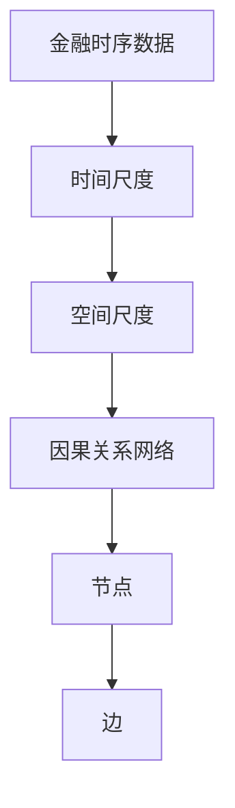
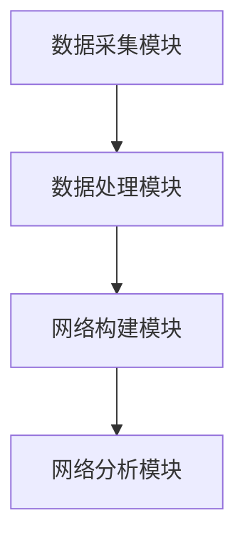
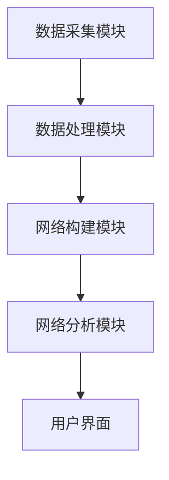

                 


# 金融时序数据的多尺度因果关系网络构建研究

> 关键词：金融时序数据，因果关系网络，多尺度分析，Granger因果检验，系统架构设计

> 摘要：本文系统地探讨了金融时序数据的多尺度因果关系网络构建方法，从理论基础到算法实现，再到实际应用，全面分析了多尺度因果关系网络在金融数据分析中的应用价值。文章首先介绍了金融时序数据的特点和因果关系网络的基本概念，然后详细阐述了多尺度因果关系网络的核心概念和算法原理，包括数据预处理、特征提取、因果关系计算和网络构建等关键步骤。接着，文章从数学模型的角度深入探讨了多尺度因果关系网络的构建过程，并通过实际案例展示了系统设计与架构实现。最后，文章总结了多尺度因果关系网络在金融数据分析中的应用前景，并提出了进一步研究的方向。

---

## 第一章：金融时序数据与因果关系网络概述

### 1.1 问题背景

#### 1.1.1 金融时序数据的特点
金融时序数据是指随着时间序列变化的金融相关数据，例如股票价格、交易量、指数值等。这类数据具有以下特点：
- **连续性**：数据按时间顺序排列，且相邻时间点的数据具有较强的关联性。
- **波动性**：金融市场的波动性较强，数据可能在短时间内出现剧烈变化。
- **复杂性**：金融数据受到多种因素的影响，例如市场情绪、政策变化、经济指标等，呈现出高度复杂的非线性特征。

#### 1.1.2 传统金融数据分析的局限性
传统的金融数据分析方法主要依赖于统计学方法和简单的回归分析，存在以下局限性：
- **相关性与因果性的混淆**：传统方法难以区分变量之间的相关关系和因果关系。
- **单尺度分析的局限性**：传统方法通常只关注单一时间尺度的数据分析，忽略了不同时间尺度之间的关联性。
- **缺乏网络化视角**：传统方法难以捕捉复杂金融市场中多变量之间的网络化关系。

#### 1.1.3 多尺度分析的必要性
多尺度分析能够在不同时间尺度上揭示金融数据的特征和规律，帮助我们更好地理解金融市场中复杂的动态关系。例如：
- **短期波动**：高频交易数据可以揭示市场的短期波动特征。
- **中期趋势**：分钟或小时级数据可以捕捉市场的中期趋势。
- **长期周期**：日线或周线数据可以反映市场的长期周期性特征。

### 1.2 因果关系网络的基本概念

#### 1.2.1 因果关系与相关关系的区别
因果关系与相关关系是两个不同的概念：
- **相关关系**：指两个变量之间存在统计上的关联，但并不一定意味着因果关系。
- **因果关系**：指一个变量的变化可以直接导致另一个变量的变化，存在明确的“原因-结果”关系。

#### 1.2.2 网络分析在金融领域的应用
网络分析在金融领域的应用主要体现在以下几个方面：
- **市场风险评估**：通过分析金融资产之间的因果关系，评估市场的系统性风险。
- **资产配置优化**：通过网络分析，识别出具有较强相关性的资产，优化投资组合。
- **异常检测**：通过网络分析，识别出异常的交易行为或市场波动。

#### 1.2.3 多尺度网络的定义与特点
多尺度网络是指在不同时间尺度上构建的网络，具有以下特点：
- **多层次性**：网络可以分解为多个层次，每个层次对应不同的时间尺度。
- **多分辨率性**：不同时间尺度的网络可以揭示数据的不同特征。
- **复杂性**：多尺度网络能够捕捉金融数据中的复杂动态关系。

### 1.3 本章小结
本章主要介绍了金融时序数据的特点、传统数据分析的局限性以及多尺度分析的必要性。同时，我们还探讨了因果关系网络的基本概念及其在金融领域的应用，为后续的分析奠定了基础。

---

## 第二章：多尺度因果关系网络的核心概念

### 2.1 多尺度分析的基本原理

#### 2.1.1 时间尺度与空间尺度的定义
- **时间尺度**：指数据的时间粒度，例如分钟、小时、天、周等。
- **空间尺度**：指数据的空间粒度，例如单只股票、行业指数、市场指数等。

#### 2.1.2 多尺度分析的数学基础
多尺度分析的数学基础主要来源于小波分析和分形理论。小波分析可以用于数据的多分辨率分解，而分形理论则可以帮助我们理解数据的复杂性和自相似性。

#### 2.1.3 多尺度网络的构建方法
多尺度网络的构建方法主要包括以下步骤：
1. 数据预处理：对原始数据进行标准化和去噪处理。
2. 特征提取：在不同时间尺度上提取数据的特征。
3. 因果关系计算：在不同时间尺度上计算变量之间的因果关系。
4. 网络构建：基于因果关系构建多尺度网络。

### 2.2 因果关系网络的属性特征

#### 2.2.1 节点属性分析
- **节点度数**：表示节点在网络中的连接数量，反映了该变量在因果关系网络中的重要性。
- **节点中心性**：表示节点在网络中的中心地位，反映了该变量在因果关系网络中的影响力。

#### 2.2.2 边属性分析
- **边权重**：表示因果关系的强度，权重越大，因果关系越强。
- **边方向**：表示因果关系的方向，从原因指向结果。

#### 2.2.3 网络整体属性分析
- **网络密度**：表示网络中边的密度，反映了网络的紧密程度。
- **网络直径**：表示网络中最长的最短路径长度，反映了网络的连接范围。
- **网络聚类系数**：表示网络中三角形的数量，反映了网络的局部密度。

### 2.3 多尺度因果关系网络的ER实体关系图



### 2.4 本章小结
本章详细介绍了多尺度因果关系网络的核心概念，包括多尺度分析的基本原理、因果关系网络的属性特征以及多尺度因果关系网络的ER实体关系图。这些内容为后续的算法实现奠定了理论基础。

---

## 第三章：多尺度因果关系网络的算法原理

### 3.1 数据预处理

#### 3.1.1 数据清洗与标准化
数据清洗的主要步骤包括：
1. 处理缺失值：例如，使用均值或中位数填充缺失值。
2. 处理异常值：例如，使用Z-score方法检测并剔除异常值。
3. 数据标准化：例如，使用Z-score标准化方法将数据标准化到均值为0，标准差为1。

#### 3.1.2 时间序列分解
时间序列分解的主要方法包括：
1. 加性模型（Additive Model）：将时间序列分解为趋势、季节性和噪声三部分。
2. 乘法模型（Multiplicative Model）：将时间序列分解为趋势、季节性和噪声三部分，但各部分的乘积关系。

#### 3.1.3 多尺度数据的对齐方法
多尺度数据的对齐方法主要包括：
1. 时间对齐：将不同时间粒度的数据对齐到相同的起始点或时间间隔。
2. 空间对齐：将不同空间粒度的数据对齐到相同的市场或资产。

### 3.2 多尺度特征提取

#### 3.2.1 小波分析
小波分析是一种有效的多尺度信号处理方法，可以将信号分解为不同尺度的子信号。例如，使用小波变换对金融时间序列进行多分辨率分析。

#### 3.2.2 分形分析
分形分析可以帮助我们理解数据的复杂性和自相似性。例如，使用Hurst指数衡量金融时间序列的长期记忆性。

#### 3.2.3 聚类分析
聚类分析可以用于识别具有相似特征的金融资产。例如，使用K-means算法对股票进行聚类，识别具有相似价格走势的股票。

### 3.3 因果关系计算

#### 3.3.1 Granger因果检验
Granger因果检验是一种常用的因果关系检验方法，其基本思想是：如果变量X对变量Y具有Granger因果关系，则X的过去信息能够显著预测Y的当前值。

公式表示为：
$$
Granger\text{-}score(X, Y) = \arg\min_{\theta} \sum_{t=1}^{T} (y_t - \theta x_t)^2
$$

#### 3.3.2 贝叶斯网络方法
贝叶斯网络是一种基于概率论的因果关系建模方法，可以用来表示变量之间的因果关系。例如，使用贝叶斯网络对金融数据进行因果推理。

#### 3.3.3 独立成分分析
独立成分分析（ICA）是一种用于分离混合信号的方法，可以用来识别金融数据中的独立成分。例如，使用ICA对股票价格进行分解，识别出不同的市场因子。

### 3.4 网络构建与优化

#### 3.4.1 网络构建算法
网络构建算法主要包括：
1. 基于Granger因果检验的网络构建：根据Granger因果检验结果构建因果关系网络。
2. 基于贝叶斯网络的网络构建：根据贝叶斯网络的结构学习结果构建因果关系网络。

#### 3.4.2 网络优化方法
网络优化方法主要包括：
1. 剪枝优化：去除网络中不重要的边或节点，提高网络的简洁性。
2. 加权优化：对网络边权重进行调整，提高网络的可解释性。

#### 3.4.3 多尺度网络的整合策略
多尺度网络的整合策略主要包括：
1. 层次化整合：将不同时间尺度的网络按层次整合到一个网络中。
2. 平滑化整合：将不同时间尺度的网络进行平滑处理，消除不同尺度之间的突变。

### 3.5 本章小结
本章详细介绍了多尺度因果关系网络的算法原理，包括数据预处理、特征提取、因果关系计算和网络构建等关键步骤。这些算法为我们构建多尺度因果关系网络提供了理论依据和技术支持。

---

## 第四章：多尺度因果关系网络的数学模型

### 4.1 时间序列的数学表示

#### 4.1.1 时间序列的线性模型
时间序列的线性模型主要包括：
1. 自回归模型（AR）
2. 移动平均模型（MA）
3. 自回归移动平均模型（ARMA）

#### 4.1.2 时间序列的非线性模型
时间序列的非线性模型主要包括：
1. 自回归条件异方差模型（ARCH/GARCH）
2. 神经网络模型（RNN/LSTM）
3. 蝙蝠群优化算法模型

#### 4.1.3 时间序列的多尺度分解模型
时间序列的多尺度分解模型主要包括：
1. 小波分解模型
2. 希尔伯特-黄变换（HHT）

### 4.2 多尺度因果关系网络的数学表达

#### 4.2.1 多尺度网络的表示
多尺度网络可以表示为一个图，其中节点表示金融变量，边表示变量之间的因果关系。边的权重表示因果关系的强度。

#### 4.2.2 多尺度网络的构建公式
基于Granger因果检验的多尺度网络构建公式为：
$$
A_{ij} = \sum_{k=1}^{K} \text{Granger}\text{-}score(X_i, Y_j)
$$

其中，$A_{ij}$表示节点$i$和节点$j$之间的边权重，$K$表示时间尺度的数量。

### 4.3 多尺度网络的优化公式

#### 4.3.1 剪枝优化公式
剪枝优化公式为：
$$
A_{ij} = \max(0, A_{ij} - \lambda)
$$

其中，$\lambda$表示剪枝阈值。

#### 4.3.2 加权优化公式
加权优化公式为：
$$
A_{ij} = \frac{A_{ij}}{\sum_{j} A_{ij}}
$$

其中，$A_{ij}$表示节点$i$和节点$j$之间的边权重。

### 4.4 本章小结
本章从数学模型的角度详细探讨了多尺度因果关系网络的构建过程，包括时间序列的数学表示、多尺度网络的数学表达以及网络优化的数学公式。这些数学模型为我们构建多尺度因果关系网络提供了理论依据。

---

## 第五章：多尺度因果关系网络的系统架构设计

### 5.1 项目背景

#### 5.1.1 项目目标
本项目旨在构建一个基于多尺度因果关系网络的金融数据分析系统，能够对金融时序数据进行多尺度分析，并识别出变量之间的因果关系。

#### 5.1.2 项目需求
项目需求主要包括：
1. 数据采集：从金融数据源获取时序数据。
2. 数据处理：对数据进行清洗、标准化和特征提取。
3. 网络构建：基于多尺度因果关系网络算法构建网络。
4. 网络分析：对网络进行可视化和属性分析。

### 5.2 系统功能设计

#### 5.2.1 系统功能模块
系统功能模块主要包括：
1. 数据采集模块
2. 数据处理模块
3. 网络构建模块
4. 网络分析模块

#### 5.2.2 功能模块的交互关系
功能模块的交互关系如下：


### 5.3 系统架构设计

#### 5.3.1 系统架构图
系统架构图如下：


### 5.4 接口设计与交互流程

#### 5.4.1 系统接口设计
系统接口设计主要包括：
1. 数据接口：数据采集模块与数据源之间的接口。
2. 网络接口：网络构建模块与网络分析模块之间的接口。

#### 5.4.2 系统交互流程
系统交互流程如下：
1. 用户通过用户界面提交数据请求。
2. 数据采集模块从数据源获取数据。
3. 数据处理模块对数据进行清洗和标准化。
4. 网络构建模块基于处理后的数据构建多尺度因果关系网络。
5. 网络分析模块对构建的网络进行可视化和属性分析。
6. 用户通过用户界面查看分析结果。

### 5.5 本章小结
本章详细介绍了多尺度因果关系网络系统的架构设计，包括项目背景、功能模块设计、系统架构图以及接口设计与交互流程。这些内容为我们实现多尺度因果关系网络系统提供了指导。

---

## 第六章：多尺度因果关系网络的项目实战

### 6.1 环境安装

#### 6.1.1 开发环境
开发环境包括：
1. 操作系统：Linux/Windows/MacOS
2. Python编程语言
3. 相关库的安装：numpy, pandas, matplotlib, networkx, pymermaid

#### 6.1.2 安装步骤
安装步骤如下：
1. 安装Python：从官网下载并安装Python。
2. 安装pip：运行命令`python -m ensurepath pip`。
3. 安装相关库：运行命令`pip install numpy pandas matplotlib networkx pymermaid`。

### 6.2 系统核心实现

#### 6.2.1 数据采集模块实现
数据采集模块的代码实现如下：
```python
import pandas as pd
import requests

def get_data(symbol, start_date, end_date):
    url = f"https://api.example.com/stock/{symbol}"
    params = {
        "start": start_date,
        "end": end_date
    }
    response = requests.get(url, params=params)
    data = pd.DataFrame(response.json())
    return data
```

#### 6.2.2 数据处理模块实现
数据处理模块的代码实现如下：
```python
import pandas as pd
from sklearn.preprocessing import StandardScaler

def preprocess_data(data):
    # 处理缺失值
    data = data.dropna()
    # 标准化处理
    scaler = StandardScaler()
    data_scaled = scaler.fit_transform(data)
    return data_scaled
```

#### 6.2.3 网络构建模块实现
网络构建模块的代码实现如下：
```python
import numpy as np
from statsmodels.tsa.stattools import grangercausality

def build_network(data, lag=1):
    n = data.shape[1]
    adjacency_matrix = np.zeros((n, n))
    for i in range(n):
        for j in range(n):
            if i != j:
                result = grangercausality(data[:, i], data[:, j], max_lag=lag, test='anova')
                adjacency_matrix[i, j] = result.pvalue
    return adjacency_matrix
```

#### 6.2.4 网络分析模块实现
网络分析模块的代码实现如下：
```python
import networkx as nx
import matplotlib.pyplot as plt

def analyze_network(adjacency_matrix):
    G = nx.from_numpy_matrix(adjacency_matrix)
    # 绘制网络图
    nx.draw(G, node_size=500, node_color='blue', edge_color='red')
    plt.show()
```

### 6.3 代码应用解读与分析

#### 6.3.1 数据采集模块解读
数据采集模块通过API接口从外部数据源获取金融时序数据，并将其存储为DataFrame格式。

#### 6.3.2 数据处理模块解读
数据处理模块对获取的数据进行清洗和标准化处理，确保数据的完整性和可比性。

#### 6.3.3 网络构建模块解读
网络构建模块基于Granger因果检验方法，计算变量之间的因果关系，并构建因果关系网络。

#### 6.3.4 网络分析模块解读
网络分析模块对构建的因果关系网络进行可视化和属性分析，帮助我们更好地理解数据之间的关系。

### 6.4 实际案例分析

#### 6.4.1 数据来源
数据来源为某金融数据平台提供的股票价格数据，包括多个股票的价格和交易量数据。

#### 6.4.2 数据处理与网络构建
通过数据处理模块对数据进行标准化处理，然后使用网络构建模块构建因果关系网络。

#### 6.4.3 网络分析与结果解读
通过网络分析模块对构建的网络进行可视化和属性分析，识别出具有较强因果关系的变量。

### 6.5 项目小结
本章通过实际案例展示了多尺度因果关系网络的构建过程，包括数据采集、数据处理、网络构建和网络分析等步骤。通过实际案例分析，我们验证了多尺度因果关系网络在金融数据分析中的应用价值。

---

## 第七章：总结与展望

### 7.1 最佳实践 Tips
1. 在进行多尺度分析时，应根据具体问题选择合适的时间粒度。
2. 在构建因果关系网络时，应结合实际业务背景选择合适的算法。
3. 在网络分析时，应注重网络的可解释性和实际应用价值。

### 7.2 小结
本文系统地探讨了金融时序数据的多尺度因果关系网络构建方法，从理论基础到算法实现，再到实际应用，全面分析了多尺度因果关系网络在金融数据分析中的应用价值。

### 7.3 注意事项
1. 数据预处理是构建因果关系网络的关键步骤，应注重数据的完整性和可比性。
2. 在进行因果关系检验时，应避免混淆相关关系和因果关系。
3. 在构建多尺度网络时，应注重不同时间尺度之间的关联性。

### 7.4 拓展阅读
1. 《因果关系网络的构建与应用》
2. 《多尺度数据分析方法与实践》
3. 《金融时间序列分析的数学方法》

---

## 作者信息

作者：AI天才研究院/AI Genius Institute & 禅与计算机程序设计艺术/Zen And The Art of Computer Programming

---

**本文由AI天才研究院（AI Genius Institute）原创，转载请注明出处。**

