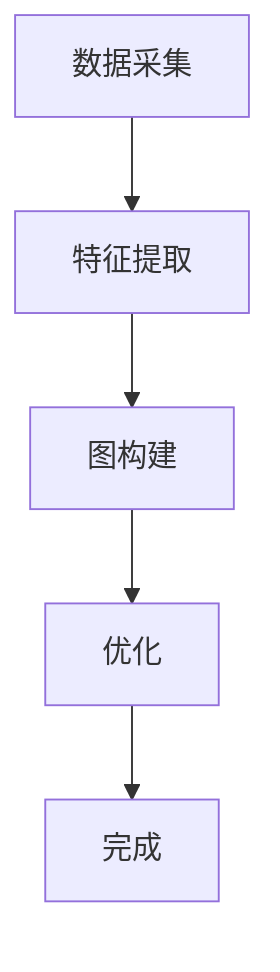
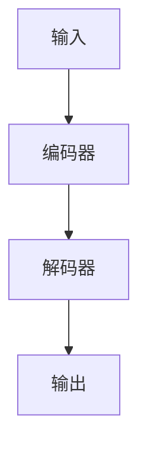
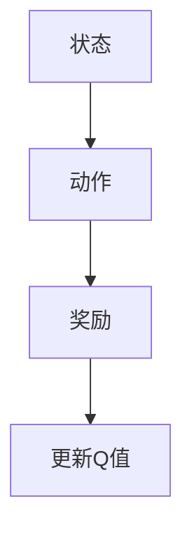
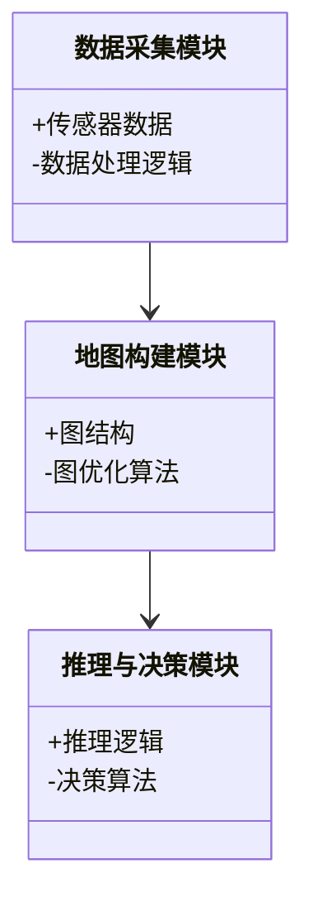
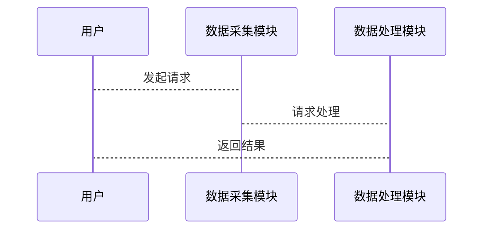

                 


# AI Agent的认知地图构建：空间信息的表示与利用

## 关键词：AI Agent，认知地图，空间信息，表示方法，算法原理

## 摘要：  
本文系统地探讨了AI Agent认知地图构建的核心问题，重点分析了空间信息的表示方法及其在认知地图中的应用。文章从认知地图的基本概念出发，深入解析了空间信息的属性特征、表示模型和算法原理，结合实际项目案例，详细介绍了认知地图构建的系统架构与实现方案。最后，本文总结了认知地图构建的未来发展方向与挑战，为相关领域的研究与实践提供了参考。

---

# 第一部分: AI Agent认知地图构建的背景与基础

## 第1章: 认知地图与AI Agent概述

### 1.1 认知地图的基本概念  
认知地图是一种表示空间信息的模型，用于帮助AI Agent理解和推理环境中的空间关系。认知地图的核心在于将物理空间转化为可计算的数字表示，使AI能够基于这些表示进行决策和行动。  

#### 1.1.1 认知地图的定义与特点  
认知地图是AI Agent对环境空间的抽象表示，具有以下特点：  
1. **抽象性**：认知地图不直接表示物理空间的几何细节，而是关注关键实体及其关系。  
2. **动态性**：认知地图能够实时更新，反映环境的动态变化。  
3. **可计算性**：认知地图的表示形式适合计算机处理和推理。  

#### 1.1.2 AI Agent与认知地图的关系  
AI Agent通过认知地图构建对环境的语义理解，从而实现自主决策和行动。认知地图为AI Agent提供了环境的“心智模型”，使其能够基于地图进行路径规划、目标识别和交互推理。  

#### 1.1.3 认知地图在AI Agent中的作用  
认知地图在AI Agent中主要用于以下方面：  
1. **空间推理**：帮助AI Agent理解环境中的空间关系。  
2. **路径规划**：基于认知地图进行高效的路径计算。  
3. **语义交互**：支持人机交互中的空间语义理解。  

### 1.2 空间信息表示的基本原理  
空间信息表示是认知地图构建的核心问题，涉及如何将物理空间转化为可计算的数字形式。  

#### 1.2.1 空间信息的定义与分类  
空间信息可以分为以下几类：  
1. **几何信息**：描述空间的形状、大小和位置。  
2. **语义信息**：描述空间中实体的意义和用途。  
3. **关系信息**：描述实体之间的空间关系。  

#### 1.2.2 空间信息表示的数学模型  
空间信息的表示可以通过多种数学模型实现，如图论模型、向量空间模型和拓扑模型。这些模型各有优缺点，适用于不同的应用场景。  

#### 1.2.3 空间信息表示的挑战与解决方案  
空间信息表示的主要挑战包括数据的复杂性、动态性和不确定性。为了解决这些问题，可以采用基于概率的表示方法、深度学习方法等。  

### 1.3 AI Agent认知地图构建的意义  
认知地图的构建对AI Agent的能力提升具有重要意义，特别是在复杂环境中的自主决策和人机交互方面。  

#### 1.3.1 认知地图在智能决策中的作用  
认知地图为AI Agent提供了环境的语义理解能力，支持其进行高效的决策。  

#### 1.3.2 认知地图在机器人导航中的应用  
认知地图在机器人导航中用于路径规划和避障，提高了导航的智能性和效率。  

#### 1.3.3 认知地图在人机交互中的价值  
认知地图为人机交互提供了空间语义支持，使交互更加自然和高效。  

### 1.4 本章小结  
本章介绍了认知地图的基本概念、空间信息表示的原理及其在AI Agent中的作用，为后续内容奠定了基础。

---

## 第2章: 认知地图的核心概念与联系  

### 2.1 认知地图的结构与组成  
认知地图的结构由多个层次组成，包括感知层、表示层和推理层。  

#### 2.1.1 认知地图的层次结构  
认知地图的层次结构分为感知层、表示层和推理层：  
1. **感知层**：接收环境中的原始数据。  
2. **表示层**：将感知数据转化为认知地图的表示形式。  
3. **推理层**：基于认知地图进行推理和决策。  

#### 2.1.2 认知地图的核心要素  
认知地图的核心要素包括空间实体、关系和语义信息。  

#### 2.1.3 认知地图的动态更新机制  
认知地图的动态更新机制包括增量更新和全量更新两种方式，适用于不同的环境变化场景。  

### 2.2 空间信息表示的属性特征对比  
空间信息的表示方法可以通过对比分析来选择最优方案。  

#### 2.2.1 不同空间信息表示方法的对比分析  
常见的空间信息表示方法包括基于图论、基于向量和基于拓扑的方法。  

#### 2.2.2 基于特征的对比表格  
下表展示了不同表示方法的对比：  
| 表示方法 | 优势 | 劣势 | 适用场景 |  
|---------|------|------|----------|  
| 图论 | 表示关系清晰 | 计算复杂 | 路径规划 |  
| 向量 | 计算高效 | 表示关系不足 | 语义分析 |  
| 拓扑 | 动态适应性强 | 表示细节不足 | 网络建模 |  

#### 2.2.3 基于属性的空间信息表示模型  
基于属性的空间信息表示模型通过属性描述空间实体，适用于语义丰富的场景。  

### 2.3 认知地图的ER实体关系图  
认知地图的ER实体关系图展示了实体之间的关系，帮助理解空间结构。  

#### 2.3.1 实体关系图的定义  
ER实体关系图用于描述认知地图中的实体及其关系。  

#### 2.3.2 实体关系图的构建方法  
构建ER实体关系图需要先提取环境中的实体，然后建立实体之间的关系。  

#### 2.3.3 实体关系图的优化与应用  
通过优化ER实体关系图，可以提高认知地图的表示效率和准确性。  

### 2.4 本章小结  
本章深入探讨了认知地图的结构与核心概念，通过对比分析和ER实体关系图，明确了空间信息表示的方法和优化方向。

---

## 第3章: 认知地图构建的算法原理  

### 3.1 基于图论的认知地图构建算法  
基于图论的算法通过构建图结构来表示空间关系。  

#### 3.1.1 图论的基本概念  
图论的基本概念包括节点、边和图的表示。  

#### 3.1.2 基于图论的认知地图构建算法流程  
基于图论的算法流程包括数据采集、图构建和优化三个阶段。  

#### 3.1.3 算法实现的mermaid流程图  


#### 3.1.4 算法实现的Python代码示例  
```python
def build_graph(data):
    nodes = []
    edges = []
    # 数据处理逻辑
    return graph
```

### 3.2 基于深度学习的认知地图表示方法  
基于深度学习的方法通过神经网络提取空间特征。  

#### 3.2.1 深度学习的基本概念  
深度学习的基本概念包括神经网络、卷积层和池化层。  

#### 3.2.2 基于深度学习的认知地图表示模型  
基于深度学习的认知地图表示模型包括编码器-解码器结构。  

#### 3.2.3 深度学习模型的数学公式  
编码器-解码器模型的数学公式为：  
$$ y = f(x; \theta) $$  
其中，$x$ 是输入，$y$ 是输出，$f$ 是模型函数。  

#### 3.2.4 深度学习模型的mermaid流程图  


### 3.3 基于强化学习的认知地图更新策略  
基于强化学习的策略通过奖励机制优化地图更新。  

#### 3.3.1 强化学习的基本概念  
强化学习的基本概念包括状态、动作和奖励。  

#### 3.3.2 基于强化学习的认知地图更新策略  
基于强化学习的认知地图更新策略通过状态转移矩阵进行优化。  

#### 3.3.3 策略优化的数学公式  
状态转移矩阵的优化公式为：  
$$ Q(s, a) = r + \gamma \max(Q(s', a')) $$  
其中，$Q$ 是价值函数，$s$ 是当前状态，$a$ 是动作，$r$ 是奖励，$\gamma$ 是折扣因子。  

#### 3.3.4 策略优化的mermaid流程图  


### 3.4 本章小结  
本章详细介绍了认知地图构建的三种主要算法，包括基于图论、深度学习和强化学习的方法，并通过mermaid流程图和Python代码示例进行了详细说明。

---

## 第4章: 认知地图构建的系统分析与架构设计  

### 4.1 系统分析与功能设计  
认知地图构建系统的功能模块包括数据采集、地图构建、推理与决策。  

#### 4.1.1 问题场景介绍  
认知地图构建系统的应用场景包括智能仓储、自动驾驶和智能助手。  

#### 4.1.2 系统功能设计  
系统功能模块包括数据采集模块、地图构建模块和推理与决策模块。  

#### 4.1.3 系统功能的mermaid类图  


### 4.2 系统架构设计  
认知地图构建系统的架构包括数据层、逻辑层和应用层。  

#### 4.2.1 系统架构的mermaid架构图  


#### 4.2.2 系统接口设计  
系统接口包括数据接口、推理接口和决策接口。  

#### 4.2.3 系统交互的mermaid序列图  


### 4.3 本章小结  
本章从系统分析与架构设计的角度，详细介绍了认知地图构建系统的功能模块、架构和交互流程。

---

## 第5章: 认知地图构建的项目实战  

### 5.1 项目背景与目标  
认知地图构建项目的背景包括智能仓储和自动驾驶，目标是实现高效的路径规划和环境理解。  

#### 5.1.1 项目介绍  
项目旨在通过认知地图构建技术，实现智能仓储中的路径规划。  

### 5.2 环境配置与数据采集  
环境配置包括传感器部署和数据采集工具的安装。  

#### 5.2.1 环境配置  
环境配置步骤包括硬件部署和软件安装。  

#### 5.2.2 数据采集  
数据采集工具包括激光雷达和摄像头。  

### 5.3 系统核心实现  
系统核心实现包括地图构建算法和推理与决策算法。  

#### 5.3.1 地图构建实现  
地图构建算法实现包括数据预处理、图构建和优化。  

#### 5.3.2 推理与决策实现  
推理与决策算法实现包括路径规划和行为决策。  

### 5.4 代码实现与应用解读  
代码实现包括数据处理、地图构建和推理与决策模块。  

#### 5.4.1 代码实现  
```python
def main():
    data =采集数据()
    graph = build_graph(data)
    decision =推理与决策(graph)
    return decision
```

### 5.5 案例分析与经验总结  
案例分析包括路径规划和环境理解的优化。  

#### 5.5.1 案例分析  
案例分析包括路径规划的成功案例和环境理解的优化经验。  

#### 5.5.2 经验总结  
经验总结包括算法优化和系统设计的改进。  

### 5.6 本章小结  
本章通过实际项目案例，详细介绍了认知地图构建的环境配置、代码实现和案例分析，总结了项目实施的经验和优化方向。

---

## 第6章: 认知地图构建的高级主题与应用案例  

### 6.1 认知地图的动态更新与自适应优化  
认知地图的动态更新技术包括实时数据处理和增量更新算法。  

#### 6.1.1 动态更新技术  
动态更新技术包括基于时间戳和事件驱动的更新方法。  

#### 6.1.2 自适应优化算法  
自适应优化算法包括基于反馈的优化和基于模型的优化。  

### 6.2 认知地图的多模态融合与协同推理  
认知地图的多模态融合技术包括传感器数据融合和多源信息协同推理。  

#### 6.2.1 多模态融合技术  
多模态融合技术包括数据融合和信息协同推理。  

#### 6.2.2 协同推理算法  
协同推理算法包括基于规则的推理和基于模型的推理。  

### 6.3 认知地图在群体协作中的应用  
认知地图在群体协作中的应用包括多智能体协同和分布式决策。  

#### 6.3.1 多智能体协同  
多智能体协同技术包括通信协议和协同推理算法。  

#### 6.3.2 分布式决策  
分布式决策技术包括分布式计算和去中心化推理。  

### 6.4 认知地图在智慧城市与自动驾驶中的应用案例  
认知地图在智慧城市中的应用包括智能交通管理和城市规划。  

#### 6.4.1 智慧城市中的应用案例  
智慧城市中的应用案例包括智能交通管理和城市资源优化。  

#### 6.4.2 自动驾驶中的应用案例  
自动驾驶中的应用案例包括路径规划和环境理解。  

### 6.5 本章小结  
本章探讨了认知地图的高级主题，包括动态更新、多模态融合和群体协作，并通过实际应用案例展示了认知地图的广泛用途。

---

## 第7章: 认知地图构建的未来展望与挑战  

### 7.1 认知地图构建的技术发展趋势  
认知地图构建技术的发展趋势包括多模态融合、实时性提升和语义理解增强。  

#### 7.1.1 技术趋势分析  
技术趋势包括深度学习与强化学习的结合、多模态数据融合和实时性优化。  

### 7.2 认知地图构建的研究热点  
认知地图构建的研究热点包括动态环境下的自适应算法、多模态数据融合方法和群体协作推理技术。  

#### 7.2.1 研究热点分析  
研究热点包括动态环境下的自适应算法、多模态数据融合方法和群体协作推理技术。  

### 7.3 认知地图构建的应用前景  
认知地图构建的应用前景包括智慧城市、自动驾驶和智能助手等领域的广泛应用。  

#### 7.3.1 应用前景展望  
认知地图构建技术将在智慧城市、自动驾驶和智能助手等领域发挥重要作用。  

### 7.4 本章小结  
本章展望了认知地图构建技术的未来发展方向，分析了研究热点和应用前景。

---

## 第8章: 总结与展望  

### 8.1 本章总结  
认知地图构建是AI Agent实现智能决策和自主行动的核心技术，本文从理论、算法和应用三个层面进行了系统探讨。  

### 8.2 未来研究方向  
未来的研究方向包括多模态融合、动态更新和群体协作推理。  

### 8.3 学习与实践建议  
学习与实践建议包括理论学习、算法实现和项目实践。  

### 8.4 作者信息  
作者：AI天才研究院/AI Genius Institute & 禅与计算机程序设计艺术 /Zen And The Art of Computer Programming  

---

以上是《AI Agent的认知地图构建：空间信息的表示与利用》的技术博客文章的完整目录大纲。通过逐步分析和详细讲解，本文系统地介绍了认知地图构建的核心概念、算法原理、系统设计和实际应用，为相关领域的研究与实践提供了参考。

