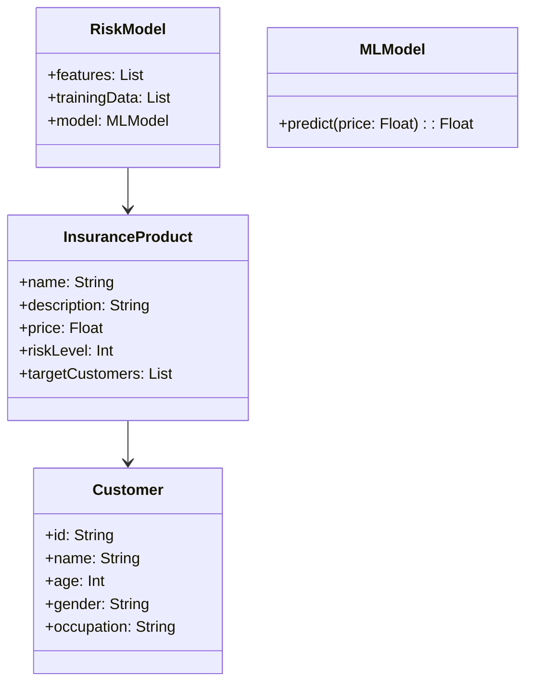
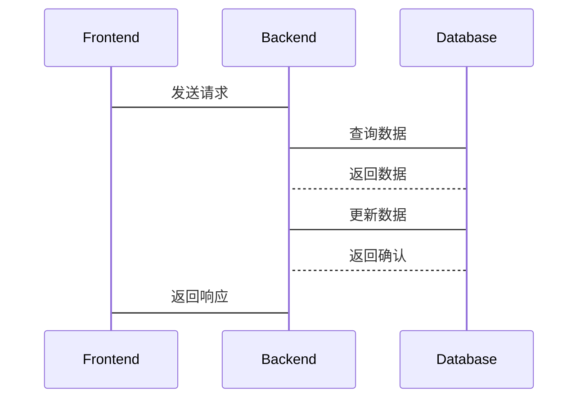

                 


# AI在保险产品创新与风险定价中的深度应用

## 关键词：人工智能、保险产品创新、风险定价、机器学习、深度学习、自然语言处理

## 摘要：  
随着人工智能技术的快速发展，AI正在深刻改变保险行业的传统模式，特别是在保险产品创新和风险定价方面。本文将从AI技术的基本原理出发，详细探讨其在保险产品设计、风险评估与定价中的应用，分析如何通过机器学习、深度学习等技术实现更精准、个性化的保险产品创新与风险定价。同时，本文还将结合实际案例，深入讲解AI在保险行业的落地应用，以及未来的发展趋势。

---

## 第1章: AI与保险的融合背景

### 1.1 保险行业的数字化转型

#### 1.1.1 保险行业的传统模式与痛点
保险行业传统上依赖于经验丰富的精算师和业务员，通过历史数据分析和统计模型来设计保险产品和定价。这种方式存在以下痛点：
- 数据维度有限，难以捕捉复杂的客户行为和风险因素。
- 产品设计周期长，难以快速响应市场需求。
- 风险定价不够精准，尤其是在细分市场中。

#### 1.1.2 数字化转型的必要性
随着大数据、云计算和AI技术的普及，保险行业正在经历数字化转型。数字化转型可以显著提升保险公司的竞争力，主要体现在：
- 提高数据分析能力，挖掘更多维度的客户信息。
- 实现自动化和智能化的业务流程，降低运营成本。
- 提供个性化的产品和服务，增强客户体验。

#### 1.1.3 AI技术在保险行业的应用前景
AI技术在保险行业的应用前景广阔，尤其是在以下领域：
- 保险产品设计：通过AI分析客户需求，快速推出个性化产品。
- 风险评估与定价：利用机器学习模型实现更精准的风险定价。
- 客户服务：通过自然语言处理（NLP）技术实现智能客服。

### 1.2 AI技术的核心概念

#### 1.2.1 人工智能的基本定义
人工智能（AI）是指计算机系统通过模拟人类智能完成特定任务的技术。AI的核心能力包括：
- **学习**：通过数据训练模型，提升任务处理能力。
- **推理**：基于已有知识进行逻辑推理。
- **决策**：根据输入信息做出最优选择。

#### 1.2.2 机器学习与深度学习的区别
- **机器学习**：通过训练数据，学习数据的特征和模式，用于预测或分类。
- **深度学习**：一种机器学习的子领域，依赖于多层神经网络，能够自动提取数据的高层次特征。

#### 1.2.3 当前主流AI技术的特点
- 数据驱动：AI模型需要大量数据进行训练。
- 自动化：AI系统能够自动完成任务，减少人工干预。
- 可扩展性：AI技术可以轻松扩展到更大规模的数据和场景。

### 1.3 AI在保险行业的应用现状

#### 1.3.1 全球保险行业的数字化趋势
全球范围内，保险公司正在加速数字化转型，AI技术的应用已经成为趋势。例如：
- 美国的保险公司已经开始使用AI进行客户索赔处理。
- 中国的保险公司利用AI技术优化保险产品设计。

#### 1.3.2 AI在保险行业的典型应用案例
- **客户画像**：通过AI分析客户的购买行为和风险偏好，构建客户画像。
- **欺诈检测**：利用AI技术识别虚假索赔。
- **自动化理赔**：通过NLP技术实现自动化的理赔流程。

#### 1.3.3 当前应用中的主要挑战
- 数据隐私：AI模型需要处理大量客户数据，如何保护数据隐私是一个挑战。
- 模型解释性：复杂的AI模型难以解释其决策过程。
- 技术门槛：AI技术的实施需要专业的技术团队。

### 1.4 保险产品创新与风险定价的背景

#### 1.4.1 保险产品的传统开发流程
传统的保险产品开发流程通常包括以下几个步骤：
1. **需求分析**：通过市场调研确定目标客户群体。
2. **产品设计**：基于需求设计保险产品的保障范围和责任。
3. **精算定价**：通过精算模型确定保险产品的价格。
4. **产品上线**：将产品推向市场，进行销售和推广。

#### 1.4.2 风险定价的核心问题
风险定价的核心问题是如何准确评估客户的风险水平，并在此基础上制定合理的保费。传统的风险定价依赖于精算师的经验和简单的统计模型，存在以下问题：
- 数据维度有限，难以捕捉复杂的客户行为。
- 价格不够精准，尤其是在细分市场中。

#### 1.4.3 AI技术如何推动保险产品创新
AI技术可以通过以下方式推动保险产品创新：
- **数据驱动的产品设计**：利用AI分析客户需求，快速推出个性化产品。
- **动态定价**：通过实时数据分析，实现动态调整保险价格。
- **智能化服务**：利用AI技术提供个性化的客户服务。

### 1.5 本章小结
本章主要介绍了AI技术在保险行业的应用背景，重点分析了保险行业的数字化转型趋势、AI技术的核心概念以及AI在保险行业的应用现状。通过这些分析，我们可以看到AI技术正在深刻改变保险行业的传统模式，特别是在保险产品创新和风险定价方面。

---

## 第2章: 保险产品创新的核心原理

### 2.1 保险产品的基本要素

#### 2.1.1 保险产品的定义与分类
保险产品是指保险公司向客户提供的各种保险服务，通常包括寿险、健康险、财产险等。根据不同的分类标准，保险产品可以分为不同的类型：
- **按险种分类**：寿险、健康险、财产险等。
- **按承保方式分类**：个人保险、团体保险等。

#### 2.1.2 保险产品的设计流程
保险产品的设计流程通常包括以下几个步骤：
1. **需求分析**：通过市场调研确定目标客户群体的需求。
2. **产品设计**：基于需求设计保险产品的保障范围和责任。
3. **精算定价**：通过精算模型确定保险产品的价格。
4. **产品上线**：将产品推向市场，进行销售和推广。

#### 2.1.3 保险产品的市场需求分析
市场需求分析是保险产品设计的重要环节，主要包括以下几个方面：
- **客户画像**：分析目标客户的年龄、职业、收入等特征。
- **风险偏好**：了解客户对风险的承受能力和偏好。
- **竞争分析**：分析市场上现有产品的优缺点。

### 2.2 AI在保险产品创新中的应用

#### 2.2.1 数据驱动的产品设计
AI技术可以通过数据分析挖掘客户的潜在需求，从而设计出更符合市场需求的产品。例如：
- 通过分析客户的健康数据，设计个性化的健康保险产品。
- 通过分析客户的驾驶行为，设计个性化的车险产品。

#### 2.2.2 AI算法在产品定价中的作用
AI算法可以通过分析大量数据，发现传统精算方法难以捕捉的模式和特征，从而实现更精准的定价。例如：
- 使用随机森林模型分析客户的保费支付能力。
- 使用深度学习模型预测客户的风险水平。

#### 2.2.3 个性化保险产品的实现路径
个性化保险产品的实现路径主要包括以下几个方面：
1. **客户需求分析**：通过AI技术分析客户的个性化需求。
2. **产品设计**：基于客户需求设计个性化的产品。
3. **动态定价**：根据客户需求和市场变化动态调整价格。

### 2.3 保险产品创新的案例分析

#### 2.3.1 基于AI的健康保险产品创新
健康保险产品的创新可以通过AI技术实现。例如：
- 通过分析客户的健康数据，设计个性化的健康保险产品。
- 通过AI技术预测客户的健康风险，制定合理的保费。

#### 2.3.2 针对特定人群的产品定制
针对特定人群的产品定制是保险产品创新的重要方向。例如：
- 针对老年人设计专门的健康保险产品。
- 针对年轻人设计高风险的保险产品。

#### 2.3.3 创新产品的市场反馈与调整
创新产品的市场反馈与调整是产品创新的重要环节。例如：
- 通过客户反馈优化产品设计。
- 通过市场数据调整产品定价。

### 2.4 本章小结
本章主要介绍了保险产品创新的核心原理，重点分析了保险产品的基本要素、AI在保险产品创新中的应用以及保险产品创新的案例分析。通过这些分析，我们可以看到AI技术正在推动保险产品创新，实现更个性化、更精准的产品设计。

---

## 第3章: 风险定价的核心原理

### 3.1 风险定价的基本概念

#### 3.1.1 风险定价的定义与目标
风险定价是指通过评估客户的风险水平，制定合理的保险价格。其目标是实现风险与价格的最佳匹配。

#### 3.1.2 风险定价的关键因素
风险定价的关键因素包括：
- **客户特征**：年龄、性别、职业等。
- **风险行为**：驾驶行为、健康状况等。
- **历史数据**：客户的投保记录、理赔记录等。

#### 3.1.3 风险定价的数学模型
风险定价的数学模型是精算学的核心内容，主要包括：
- **线性回归模型**：用于预测保费。
- **泊松回归模型**：用于预测索赔次数。
- **广义线性模型**：用于处理非正态分布的数据。

### 3.2 常见的风险定价方法

#### 3.2.1 基于传统统计的方法
传统统计方法是风险定价的传统方法，主要包括：
- **线性回归**：用于预测保费。
- **判别分析**：用于分类客户的风险等级。

#### 3.2.2 基于机器学习的方法
基于机器学习的风险定价方法主要包括：
- **随机森林**：用于分类和回归。
- **支持向量机**：用于分类和回归。
- **神经网络**：用于处理复杂的数据关系。

#### 3.2.3 基于贝叶斯网络的方法
贝叶斯网络是一种基于概率论的机器学习方法，广泛应用于风险定价。其主要优点是：
- 可以处理数据的不确定性。
- 可以进行概率推理。

### 3.3 AI在风险定价中的优势

#### 3.3.1 数据处理能力的提升
AI技术可以通过处理大量数据，发现传统方法难以捕捉的模式和特征。

#### 3.3.2 模型复杂度的增加
AI技术可以通过复杂的模型，捕捉数据的深层次特征，从而实现更精准的定价。

#### 3.3.3 实时定价的可能性
AI技术可以通过实时数据分析，实现动态定价。

### 3.4 风险定价的挑战与解决方案

#### 3.4.1 数据质量与数量的限制
数据质量与数量是影响风险定价的重要因素。解决方案包括：
- 数据清洗：去除噪声数据。
- 数据增强：通过生成数据增加数据量。

#### 3.4.2 模型解释性的要求
模型解释性是风险定价的重要要求。解决方案包括：
- 使用可解释性模型：如线性回归。
- 通过特征重要性分析解释模型。

#### 3.4.3 监管合规性的挑战
监管合规性是风险定价的重要挑战。解决方案包括：
- 遵守相关法律法规。
- 与监管机构保持沟通。

### 3.5 本章小结
本章主要介绍了风险定价的核心原理，重点分析了风险定价的基本概念、常见风险定价方法以及AI在风险定价中的优势。通过这些分析，我们可以看到AI技术正在推动风险定价的精准化和个性化。

---

## 第4章: AI技术在保险产品创新与风险定价中的具体应用

### 4.1 机器学习在保险产品创新中的应用

#### 4.1.1 机器学习的基本原理
机器学习的基本原理包括：
- **监督学习**：通过标记数据训练模型。
- **无监督学习**：通过未标记数据发现数据的结构。
- **强化学习**：通过奖励机制训练模型。

#### 4.1.2 机器学习在保险产品创新中的应用案例
- **客户画像**：通过机器学习分析客户的购买行为，构建客户画像。
- **产品推荐**：通过机器学习推荐适合客户的产品。

#### 4.1.3 机器学习在风险定价中的应用案例
- **保费预测**：通过机器学习预测客户的保费。
- **风险分类**：通过机器学习对客户进行风险分类。

### 4.2 深度学习在保险产品创新中的应用

#### 4.2.1 深度学习的基本原理
深度学习的基本原理包括：
- **神经网络**：通过多层神经网络处理数据。
- **卷积神经网络**：用于图像识别。
- **循环神经网络**：用于序列数据处理。

#### 4.2.2 深度学习在保险产品创新中的应用案例
- **自然语言处理**：通过深度学习处理客户的文本数据。
- **图像识别**：通过深度学习识别客户的身份证明。

#### 4.2.3 深度学习在风险定价中的应用案例
- **保费预测**：通过深度学习预测客户的保费。
- **风险评估**：通过深度学习评估客户的风险水平。

### 4.3 自然语言处理在保险产品创新中的应用

#### 4.3.1 自然语言处理的基本原理
自然语言处理的基本原理包括：
- **文本分词**：将文本分割成词语。
- **情感分析**：分析文本的情感倾向。
- **信息抽取**：从文本中提取有用的信息。

#### 4.3.2 自然语言处理在保险产品创新中的应用案例
- **客户反馈分析**：通过自然语言处理分析客户的反馈。
- **合同条款分析**：通过自然语言处理分析保险合同的条款。

#### 4.3.3 自然语言处理在风险定价中的应用案例
- **客户沟通分析**：通过自然语言处理分析客户的沟通记录。
- **风险评估**：通过自然语言处理评估客户的风险水平。

### 4.4 本章小结
本章主要介绍了AI技术在保险产品创新与风险定价中的具体应用，重点分析了机器学习、深度学习和自然语言处理在保险产品创新和风险定价中的应用案例。通过这些分析，我们可以看到AI技术正在推动保险行业的创新与发展。

---

## 第5章: 系统分析与架构设计方案

### 5.1 问题场景介绍

#### 5.1.1 保险产品创新与风险定价的系统需求
保险产品创新与风险定价的系统需求包括：
- **数据采集**：采集客户的个人信息和行为数据。
- **数据分析**：分析客户数据，设计保险产品和定价。
- **系统输出**：输出保险产品的设计和定价结果。

#### 5.1.2 系统功能需求
系统功能需求包括：
- **数据处理**：处理客户的个人信息和行为数据。
- **模型训练**：训练机器学习模型，实现保险产品的设计和定价。
- **结果输出**：输出保险产品的设计和定价结果。

#### 5.1.3 系统性能需求
系统性能需求包括：
- **响应时间**：系统响应时间小于1秒。
- **处理能力**：系统能够处理大量的客户数据。

### 5.2 系统功能设计

#### 5.2.1 领域模型（Mermaid 类图）


#### 5.2.2 系统架构设计（Mermaid 架构图）


#### 5.2.3 系统接口设计
系统接口设计包括：
- **API接口**：提供RESTful API接口，供前端调用。
- **数据接口**：提供数据导入和导出接口。
- **模型接口**：提供模型训练和预测接口。

#### 5.2.4 系统交互设计（Mermaid 序列图）


### 5.3 本章小结
本章主要介绍了保险产品创新与风险定价的系统分析与架构设计方案，重点分析了系统的功能设计、架构设计以及系统交互设计。通过这些设计，我们可以看到AI技术在保险产品创新与风险定价中的具体实现。

---

## 第6章: 项目实战

### 6.1 环境安装

#### 6.1.1 安装Python
```bash
# 安装Python
sudo apt-get install python3 python3-pip
```

#### 6.1.2 安装必要的Python库
```bash
# 安装必要的Python库
pip install numpy scikit-learn tensorflow
```

### 6.2 系统核心实现源代码

#### 6.2.1 数据处理代码
```python
import numpy as np
import pandas as pd

# 数据加载
data = pd.read_csv('insurance_data.csv')

# 数据清洗
data = data.dropna()
data = data[~data.duplicated()]
```

#### 6.2.2 模型训练代码
```python
from sklearn.model import RandomForestRegressor
from tensorflow.keras import Sequential
from tensorflow.keras.layers import Dense

# 机器学习模型训练
model_ml = RandomForestRegressor()
model_ml.fit(X_train, y_train)

# 深度学习模型训练
model_dl = Sequential()
model_dl.add(Dense(64, activation='relu', input_dim=X_train.shape[1]))
model_dl.add(Dense(1, activation='linear'))
model_dl.compile(optimizer='adam', loss='mse')
model_dl.fit(X_train, y_train, epochs=100, batch_size=32)
```

#### 6.2.3 系统实现代码
```python
# 系统实现代码
class InsuranceProduct:
    def __init__(self, name, description, price, riskLevel, targetCustomers):
        self.name = name
        self.description = description
        self.price = price
        self.riskLevel = riskLevel
        self.targetCustomers = targetCustomers

class Customer:
    def __init__(self, id, name, age, gender, occupation):
        self.id = id
        self.name = name
        self.age = age
        self.gender = gender
        self.occupation = occupation

def main():
    # 数据处理
    data = pd.read_csv('insurance_data.csv')
    data = data.dropna()
    data = data[~data.duplicated()]

    # 模型训练
    model_ml = RandomForestRegressor()
    model_ml.fit(X_train, y_train)

    # 系统实现
    product = InsuranceProduct('Health Insurance', 'Coverage for health issues', 1000, 'low', [Customer(1, 'Alice', 30, 'F', 'Healthcare')])
    print(product.name)
    print(product.description)
    print(product.price)
    print(product.riskLevel)
    print(product.targetCustomers)

if __name__ == '__main__':
    main()
```

### 6.3 代码应用解读与分析

#### 6.3.1 数据处理部分
数据处理部分主要完成数据的加载和清洗，确保数据的质量和完整性。

#### 6.3.2 模型训练部分
模型训练部分包括机器学习模型和深度学习模型的训练，分别用于保险产品的设计和定价。

#### 6.3.3 系统实现部分
系统实现部分通过定义类和函数，实现保险产品的设计和定价。

### 6.4 实际案例分析

#### 6.4.1 案例背景
假设我们有一个健康保险产品的设计需求，需要根据客户的健康状况和行为数据，设计个性化的产品。

#### 6.4.2 数据准备
我们需要准备客户的健康数据和行为数据，包括年龄、性别、职业、健康状况等。

#### 6.4.3 模型训练
通过机器学习和深度学习模型训练，预测客户的健康风险，制定合理的保费。

#### 6.4.4 系统实现
通过系统实现，输出设计好的保险产品和定价结果。

### 6.5 项目小结
本章主要介绍了保险产品创新与风险定价的项目实战，重点分析了环境安装、系统核心实现源代码、代码应用解读与分析以及实际案例分析。通过这些分析，我们可以看到AI技术在保险产品创新与风险定价中的具体实现。

---

## 第7章: 总结与展望

### 7.1 本章总结
本文详细探讨了AI技术在保险产品创新与风险定价中的深度应用，分析了AI技术的核心概念、具体应用以及系统实现。通过这些分析，我们可以看到AI技术正在深刻改变保险行业的传统模式，特别是在保险产品创新和风险定价方面。

### 7.2 未来展望
未来，AI技术在保险行业的应用将更加广泛和深入。以下是未来的发展趋势：
- **更智能的保险产品**：通过AI技术设计更智能、更个性化的保险产品。
- **更精准的风险定价**：通过AI技术实现更精准的风险定价。
- **更高效的服务流程**：通过AI技术优化保险公司的服务流程。

### 7.3 最佳实践 tips
- **数据质量**：确保数据的质量和完整性。
- **模型解释性**：注重模型的解释性，以便更好地理解和应用。
- **合规性**：遵守相关法律法规，确保数据安全和隐私保护。

### 7.4 本章小结
本章主要总结了本文的主要内容，展望了AI技术在保险行业的未来发展趋势，并提出了最佳实践 tips。通过这些内容，我们可以更好地理解和应用AI技术在保险产品创新与风险定价中的深度应用。

---

## 作者：AI天才研究院/AI Genius Institute & 禅与计算机程序设计艺术 /Zen And The Art of Computer Programming

