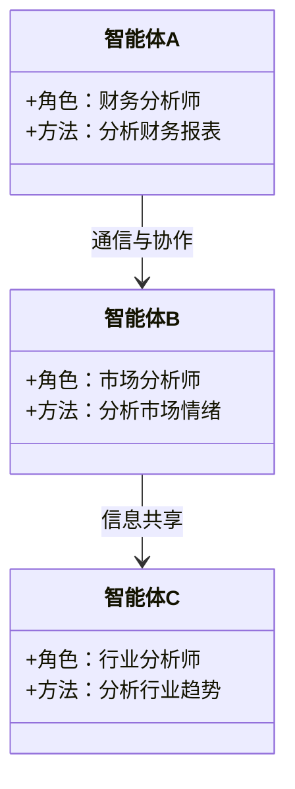
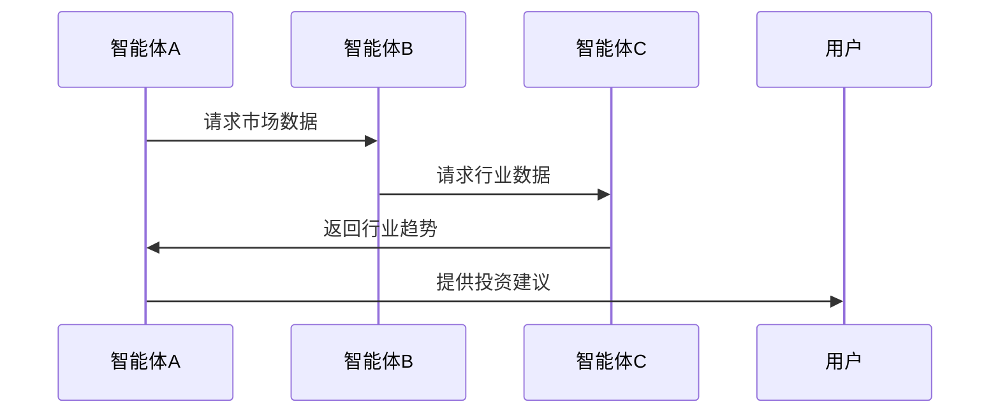

                 


# AI多智能体在价值投资中的竞争优势分析

> 关键词：AI多智能体，价值投资，强化学习，多智能体协作，投资决策，系统架构

> 摘要：本文深入分析了AI多智能体在价值投资中的应用及其竞争优势。通过探讨多智能体系统的核心原理、价值投资的基本概念以及两者的结合方式，揭示了AI多智能体在投资决策中的独特优势。文章进一步详细阐述了相关算法原理、系统架构设计、项目实战案例及最佳实践，为读者提供了全面而深入的分析。

---

## 第1章: 价值投资与AI多智能体概述

### 1.1 价值投资的基本概念

#### 1.1.1 价值投资的定义与核心理念
价值投资是一种以基本面分析为基础的投资策略，旨在通过识别市场中被低估的资产来实现长期稳定的收益。其核心理念是寻找具有持续竞争优势和良好治理结构的企业，长期持有以获得超额收益。

#### 1.1.2 价值投资的哲学基础
价值投资的哲学基础可以追溯到本杰明·格雷厄姆和戴维·多德的理论。他们强调安全边际、margin of safety以及市场的非理性波动，认为市场先生是人类情绪的反映，而非理性定价为价值投资者提供了套利机会。

#### 1.1.3 价值投资的实践方法
价值投资的实践方法包括对公司财务报表的深入分析、行业地位评估、管理层能力和企业竞争优势的识别。传统方法依赖分析师的主观判断和经验，但这种方法在面对复杂市场环境时，效率和准确性受到限制。

### 1.2 AI多智能体的定义与特点

#### 1.2.1 多智能体系统的基本概念
多智能体系统（Multi-Agent System, MAS）是由多个相互作用的智能体组成的系统，这些智能体能够通过通信和协作完成复杂任务。每个智能体都有自己的目标、知识和决策机制，能够独立行动并与其他智能体协同工作。

#### 1.2.2 AI多智能体的核心特征
- **分布式智能**：多个智能体协同工作，避免单点故障。
- **自主性**：智能体能够自主决策，无需外部干预。
- **协作性**：通过通信和协作完成复杂任务。
- **适应性**：能够根据环境变化动态调整策略。

#### 1.2.3 多智能体与传统AI的区别
与传统AI相比，多智能体系统更强调分布式计算和协作能力。传统AI通常基于单一智能体的决策，而多智能体系统通过多个智能体的协同实现整体目标。

### 1.3 价值投资与AI多智能体的结合

#### 1.3.1 价值投资中的信息处理需求
价值投资依赖于对公司基本面的深入分析，包括财务数据、行业趋势、市场情绪等多方面的信息。这些信息的处理和分析需要高度的效率和准确性。

#### 1.3.2 AI多智能体在投资决策中的优势
AI多智能体能够同时处理大量信息，通过分布式计算和协作机制提高决策效率。多个智能体可以分别负责不同的任务，例如财务分析、市场情绪预测、行业趋势分析等，最终形成综合决策。

#### 1.3.3 多智能体在价值投资中的应用场景
- **数据收集与处理**：多个智能体分别收集不同来源的数据，进行清洗和预处理。
- **多维度分析**：智能体协同分析财务报表、市场情绪、行业趋势等信息，提供全面的评估。
- **动态调整**：根据市场变化，智能体实时调整投资策略。

### 1.4 本章小结
本章介绍了价值投资的基本概念和AI多智能体的核心特征，分析了两者结合的必要性和可能性。AI多智能体通过分布式计算和协作机制，能够显著提升价值投资的效率和准确性。

---

## 第2章: 多智能体系统的原理与架构

### 2.1 多智能体系统的核心原理

#### 2.1.1 分布式智能的基本概念
分布式智能是指将智能分散到多个独立的智能体中，通过它们的协作实现整体智能。这种分布式架构能够提高系统的可靠性和容错能力。

#### 2.1.2 多智能体系统中的通信与协作
智能体之间的通信是多智能体系统的核心机制。通信可以基于直接消息传递或通过共享数据库实现。协作机制包括任务分配、信息共享和决策共识。

#### 2.1.3 多智能体系统的任务分配与协调
任务分配是多智能体系统中的关键问题，通常基于智能体的能力和当前状态进行动态分配。协调机制确保任务分配的合理性和高效性。

### 2.2 多智能体系统的架构设计

#### 2.2.1 分层架构的优缺点
分层架构将系统划分为多个层次，每个层次负责不同的功能。优点是结构清晰，易于管理和扩展；缺点是层次之间的通信可能增加复杂性。

#### 2.2.2 基于角色的协作模式
基于角色的协作模式将智能体划分为不同的角色，每个角色负责特定的任务。这种模式能够提高系统的专业化程度和协作效率。

#### 2.2.3 基于规则的交互机制
基于规则的交互机制通过预定义的规则实现智能体之间的协作。规则可以包括优先级、任务分配和冲突解决机制。

### 2.3 多智能体系统中的学习机制

#### 2.3.1 强化学习的基本原理
强化学习是一种通过试错机制学习策略的方法。智能体通过与环境的交互获得奖励或惩罚，逐步优化自身的决策策略。

#### 2.3.2 多智能体协作学习的挑战
多智能体协作学习面临策略协调、通信效率和计算复杂度等挑战。智能体需要通过通信和协作实现共同目标，同时避免策略冲突。

#### 2.3.3 基于经验的策略优化
基于经验的策略优化通过积累历史数据和经验，不断优化智能体的决策策略。这种方法能够提高系统的适应性和鲁棒性。

### 2.4 本章小结
本章详细介绍了多智能体系统的核心原理和架构设计，分析了分布式智能、通信协作和任务分配等关键问题。学习机制是多智能体系统的重要组成部分，能够显著提升系统的智能化水平。

---

## 第3章: 价值投资中的信息处理与决策

### 3.1 价值投资中的信息来源与处理

#### 3.1.1 财务数据的分析与建模
财务数据是价值投资的核心信息来源。智能体可以通过数据分析和建模，识别财务指标之间的关系，评估企业的财务健康状况。

#### 3.1.2 市场情绪的分析与预测
市场情绪分析是价值投资中的重要环节。智能体可以通过自然语言处理和情感分析技术，实时监控市场情绪，预测市场走势。

#### 3.1.3 行业趋势的识别与评估
行业趋势分析是价值投资的重要内容。智能体可以通过大数据分析和趋势预测，识别行业的潜在机会和风险。

### 3.2 AI多智能体在信息处理中的优势

#### 3.2.1 并行处理能力
多智能体系统能够同时处理大量信息，显著提高信息处理的效率。多个智能体可以分别负责不同的任务，实现并行处理。

#### 3.2.2 智能体之间的信息共享与协同
智能体之间的信息共享能够提高决策的准确性和全面性。通过协作机制，智能体可以实时共享信息，避免信息孤岛。

#### 3.2.3 复杂场景下的决策优化
多智能体系统能够在复杂场景下优化决策。通过分布式计算和协作机制，智能体能够快速响应市场变化，优化投资策略。

### 3.3 价值投资中的决策模型

#### 3.3.1 基于多智能体的决策框架
基于多智能体的决策框架将投资决策分解为多个子任务，由多个智能体分别完成。这种框架能够提高决策的效率和准确性。

#### 3.3.2 多智能体协作的决策流程
多智能体协作的决策流程包括任务分配、信息收集、决策制定和结果反馈等环节。智能体通过协作完成复杂任务，实现整体目标。

#### 3.3.3 决策结果的验证与优化
决策结果的验证与优化是价值投资的重要环节。通过回测和风险评估，智能体可以不断优化决策策略，提高投资收益。

### 3.4 本章小结
本章分析了价值投资中的信息处理与决策过程，介绍了AI多智能体在信息处理中的优势。通过多智能体系统的协作，能够显著提高投资决策的效率和准确性。

---

## 第4章: AI多智能体在价值投资中的算法与模型

### 4.1 多智能体协作算法

#### 4.1.1 基于强化学习的多智能体协作
基于强化学习的多智能体协作是一种新兴的研究方向。智能体通过强化学习算法，学习协作策略，实现共同目标。这种方法能够提高系统的智能化水平，但需要解决策略协调和通信效率等问题。

#### 4.1.2 多智能体协作的通信机制
多智能体协作需要高效的通信机制。智能体之间可以通过直接通信或通过共享数据库实现信息共享。通信机制的设计需要考虑系统的实时性和安全性。

#### 4.1.3 基于Q-learning的协作学习
基于Q-learning的协作学习是一种常见的强化学习方法。智能体通过Q-learning算法，学习协作策略，实现共同目标。这种方法简单易行，但需要解决策略同步和奖励分配等问题。

### 4.2 多智能体系统的数学模型

#### 4.2.1 强化学习的基本公式
强化学习的基本公式包括Q值更新公式：
$$ Q(s, a) = Q(s, a) + \alpha (r + \gamma \max Q(s', a') - Q(s, a)) $$
其中，$s$是状态，$a$是动作，$\alpha$是学习率，$\gamma$是折扣因子，$r$是奖励。

#### 4.2.2 多智能体协作的数学模型
多智能体协作的数学模型可以表示为：
$$ V(s) = \max_{i} Q_i(s, a_i) $$
其中，$V(s)$是整体价值函数，$Q_i(s, a_i)$是智能体$i$的Q值。

#### 4.2.3 基于马尔可夫决策过程的模型
基于马尔可夫决策过程的模型可以描述为：
$$ \text{状态空间} S, \text{动作空间} A, \text{转移概率} P, \text{奖励函数} R $$

### 4.3 本章小结
本章详细介绍了多智能体协作算法及其数学模型，分析了强化学习和协作学习的基本原理。通过数学公式和算法流程图，能够更好地理解多智能体系统的实现机制。

---

## 第5章: 价值投资中的系统架构设计

### 5.1 问题场景介绍

#### 5.1.1 投资决策中的复杂性
投资决策面临复杂性，包括市场波动、信息不完整、决策滞后等问题。传统方法依赖人工分析，效率和准确性有限。

#### 5.1.2 AI多智能体的应用场景
AI多智能体在价值投资中的应用场景包括数据收集与处理、多维度分析、动态调整等。通过多智能体系统的协作，能够显著提高投资决策的效率和准确性。

#### 5.1.3 系统设计的目标
系统设计的目标是实现高效、智能、可靠的多智能体投资决策系统。通过模块化设计和协作机制，确保系统的可扩展性和可维护性。

### 5.2 系统功能设计

#### 5.2.1 领域模型设计
领域模型设计包括智能体的角色划分、任务分配和功能模块设计。通过类图可以清晰地展示系统结构和功能关系。



#### 5.2.2 系统架构设计
系统架构设计包括分层架构、模块化设计和通信机制。通过架构图可以清晰地展示系统的各个部分及其关系。


#### 5.2.3 系统接口设计
系统接口设计包括智能体之间的通信接口、数据接口和用户接口。通过接口设计，确保系统的模块化和可扩展性。

#### 5.2.4 系统交互流程
系统交互流程包括任务分配、信息收集、决策制定和结果反馈等环节。通过交互流程图可以清晰地展示系统的运行过程。



### 5.3 本章小结
本章分析了价值投资中的系统架构设计，包括领域模型设计、系统架构设计和系统交互流程。通过模块化设计和协作机制，能够显著提高投资决策的效率和准确性。

---

## 第6章: 项目实战——基于AI多智能体的股票分析系统

### 6.1 项目背景与目标

#### 6.1.1 项目背景
股票市场是一个复杂的金融市场，价值投资在其中具有重要的应用价值。通过AI多智能体系统，能够实现高效、智能的股票分析。

#### 6.1.2 项目目标
本项目的目标是设计并实现一个基于AI多智能体的股票分析系统，通过多智能体的协作，实现股票的多维度分析和投资决策。

### 6.2 系统核心实现

#### 6.2.1 环境安装与配置
系统环境包括Python、TensorFlow、Keras等工具的安装与配置。以下是具体的安装命令：

```bash
pip install numpy
pip install pandas
pip install tensorflow
pip install matplotlib
pip install scikit-learn
```

#### 6.2.2 核心代码实现

##### 6.2.2.1 多智能体协作算法实现
以下是基于强化学习的多智能体协作算法实现：

```python
import numpy as np

class Agent:
    def __init__(self, state_space, action_space):
        self.state_space = state_space
        self.action_space = action_space
        self.Q = np.zeros((state_space, action_space))

    def act(self, state):
        return np.argmax(self.Q[state])

    def update(self, state, action, reward, next_state):
        self.Q[state, action] += 0.1 * (reward + 0.9 * np.max(self.Q[next_state]) - self.Q[state, action])

def main():
    state_space = 10
    action_space = 5
    agent = Agent(state_space, action_space)
    for _ in range(1000):
        state = np.random.randint(0, state_space)
        action = agent.act(state)
        next_state = np.random.randint(0, state_space)
        reward = np.random.randn()
        agent.update(state, action, reward, next_state)

if __name__ == "__main__":
    main()
```

##### 6.2.2.2 股票数据分析与建模
以下是股票数据分析与建模的代码实现：

```python
import pandas as pd
import numpy as np

data = pd.read_csv('stock_data.csv')
data['收盘价'] = data['收盘价'].astype(float)
data['开盘价'] = data['开盘价'].astype(float)
data['最高价'] = data['最高价'].astype(float)
data['最低价'] = data['最低价'].astype(float)

# 数据预处理
from sklearn.preprocessing import MinMaxScaler
scaler = MinMaxScaler()
scaled_data = scaler.fit_transform(data[['开盘价', '收盘价', '最高价', '最低价']])

# 模型训练
from sklearn.linear_model import LinearRegression
model = LinearRegression()
model.fit(scaled_data[:-1], scaled_data[1:])

# 模型预测
predicted_prices = model.predict(scaled_data[-1].reshape(1, -1))
print(predicted_prices)
```

### 6.3 项目实战分析

#### 6.3.1 数据收集与预处理
数据收集与预处理是股票分析系统的核心环节。通过数据清洗和特征提取，能够提高模型的准确性和鲁棒性。

#### 6.3.2 模型训练与验证
模型训练与验证是股票分析系统的重要环节。通过交叉验证和性能评估，能够优化模型的参数，提高预测的准确性。

#### 6.3.3 系统交互与结果展示
系统交互与结果展示是股票分析系统的最终目标。通过用户友好的界面，能够直观地展示分析结果，帮助用户做出投资决策。

### 6.4 项目总结与优化建议

#### 6.4.1 项目总结
本项目实现了基于AI多智能体的股票分析系统，通过多智能体的协作，显著提高了股票分析的效率和准确性。系统设计合理，功能完善，具有较高的实用价值。

#### 6.4.2 优化建议
未来可以进一步优化多智能体协作算法，提高系统的智能化水平。同时，可以增加更多的数据源和分析维度，进一步提高模型的准确性和鲁棒性。

---

## 第7章: 最佳实践与未来展望

### 7.1 最佳实践

#### 7.1.1 系统设计中的注意事项
在系统设计中，需要注意模块化设计、通信效率和系统安全性。通过合理的架构设计，能够提高系统的可扩展性和可维护性。

#### 7.1.2 算法实现中的注意事项
在算法实现中，需要注意参数调优和模型评估。通过交叉验证和性能评估，能够优化模型的参数，提高预测的准确性。

#### 7.1.3 系统部署与维护
系统部署与维护是系统应用的重要环节。通过合理的部署策略和维护计划，能够确保系统的稳定性和可靠性。

### 7.2 未来展望

#### 7.2.1 多智能体系统的未来发展
多智能体系统在价值投资中的应用前景广阔。随着人工智能技术的不断发展，多智能体系统的智能化水平和协作能力将不断提高。

#### 7.2.2 价值投资与AI的深度融合
价值投资与AI的深度融合是未来的重要趋势。通过多智能体系统的协作，能够实现更加高效、智能的投资决策。

#### 7.2.3 技术创新与应用拓展
技术创新与应用拓展是多智能体系统发展的关键。未来可以通过技术创新，进一步优化多智能体系统的算法和架构，拓展其在金融领域的应用。

### 7.3 本章小结
本章总结了AI多智能体在价值投资中的最佳实践，展望了未来的发展方向。通过技术创新和应用拓展，多智能体系统将在金融领域发挥更加重要的作用。

---

## 作者：AI天才研究院/AI Genius Institute & 禅与计算机程序设计艺术/Zen And The Art of Computer Programming

---

以上是《AI多智能体在价值投资中的竞争优势分析》的完整目录大纲和详细内容。希望对您有所帮助！

