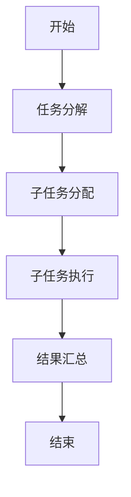
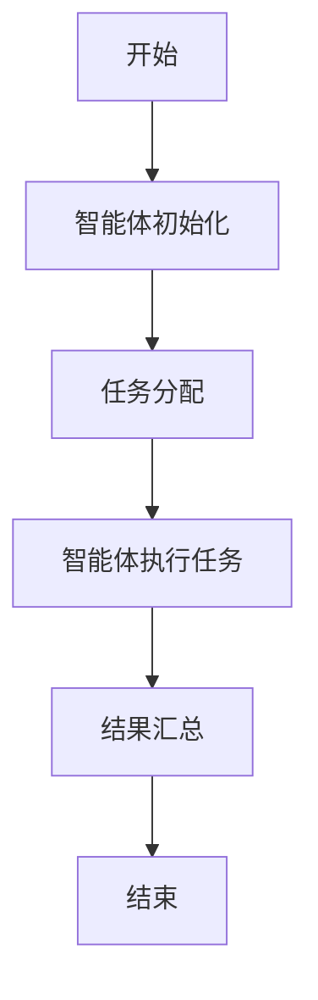
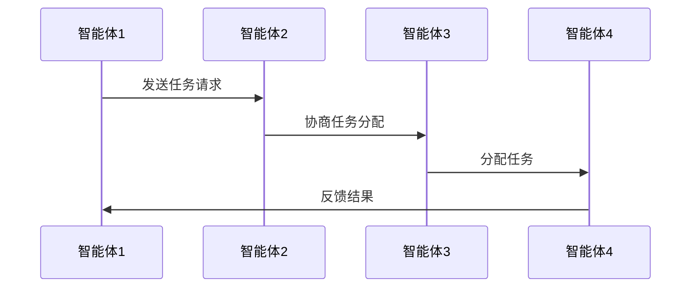

                 


# 多智能体系统在全球供应链分析中的角色

> **关键词**：多智能体系统，全球供应链，分布式计算，协作机制，博弈论，优化理论

> **摘要**：  
> 随着全球供应链的复杂化和全球化程度的加深，传统的供应链管理方式已难以应对日益增长的挑战。多智能体系统（Multi-Agent Systems, MAS）作为一种新兴的技术，凭借其分布式计算、协作性和自适应性等特性，正在成为优化全球供应链管理的重要工具。本文将从多智能体系统的概念、算法原理、系统架构设计、实际案例分析等方面，全面探讨多智能体系统在全球供应链分析中的角色与应用。通过详细的技术分析和实际案例，本文旨在为读者提供一个多维度的视角，理解多智能体系统如何在全球供应链中实现高效协作与优化。

---

## 第一章: 多智能体系统概述

### 1.1 多智能体系统的基本概念

#### 1.1.1 多智能体系统的定义与特点
多智能体系统（MAS）是由多个智能体（Agent）组成的分布式系统，这些智能体通过通信和协作完成复杂的任务。MAS的核心特点包括：
- **分布式性**：智能体独立运行，无中心节点。
- **协作性**：智能体之间通过通信和协商完成任务。
- **自治性**：每个智能体都具有自主决策能力。
- **动态性**：系统能够适应环境的变化。

#### 1.1.2 多智能体系统的核心要素
1. **智能体（Agent）**：具有感知环境、决策和执行任务的能力。
2. **通信机制**：智能体之间的信息交换方式。
3. **协作机制**：智能体之间协同工作的规则。
4. **任务分配**：根据系统目标分配智能体的任务。

#### 1.1.3 多智能体系统与传统单智能体系统的区别
| **对比维度** | **多智能体系统（MAS）** | **单智能体系统** |
|--------------|-------------------------|------------------|
| **结构**      | 分布式、去中心化         | 集中式、单中心化 |
| **协作性**    | 高                     | 低               |
| **适应性**    | 强                     | 弱               |
| **灵活性**    | 高                     | 低               |

### 1.2 全球供应链分析的基本概念

#### 1.2.1 供应链的基本结构与功能
供应链包括供应商、制造商、分销商、零售商和消费者等多个环节，其功能包括：
- **物流管理**：优化货物运输和存储。
- **库存管理**：降低库存成本，提高周转率。
- **需求预测**：基于历史数据预测未来需求。

#### 1.2.2 全球供应链的独特挑战
1. **全球化**：跨越多个国家和地区的复杂性。
2. **不确定性**：自然灾害、政策变化等不可预测因素。
3. **信息孤岛**：供应链各环节之间的信息不透明。

#### 1.2.3 多智能体系统在供应链中的潜在价值
- **提高效率**：通过智能体的协作优化供应链流程。
- **增强灵活性**：快速适应市场变化和突发事件。
- **降低成本**：通过分布式计算减少资源浪费。

### 1.3 多智能体系统在全球供应链中的应用背景

#### 1.3.1 当前供应链管理的痛点与挑战
1. **信息不透明**：供应链各环节之间缺乏有效的信息共享。
2. **协作效率低**：传统供应链管理中的协调成本高。
3. **应对突发事件能力弱**：如疫情、自然灾害等对供应链的冲击。

#### 1.3.2 多智能体系统如何解决供应链问题
- **分布式计算**：通过多个智能体分别处理不同环节的任务。
- **协作机制**：智能体之间实时通信，优化资源分配。
- **动态调整**：根据实时数据快速调整供应链策略。

#### 1.3.3 多智能体系统在供应链中的角色定位
- **决策支持**：智能体提供数据支持和决策建议。
- **任务分配**：智能体根据需求分配资源。
- **监控与反馈**：智能体实时监控供应链状态并反馈信息。

---

## 第二章: 多智能体系统的核心概念与联系

### 2.1 多智能体系统的核心原理

#### 2.1.1 多智能体系统的通信机制
智能体之间的通信可以通过以下方式实现：
- **消息传递**：智能体通过发送消息进行信息交换。
- **共享数据库**：智能体通过共享数据库进行信息同步。

#### 2.1.2 多智能体系统的协作机制
协作机制包括：
- **协商与谈判**：智能体通过协商分配任务。
- **合作与分工**：智能体根据自身能力分配任务。
- **冲突解决**：智能体通过协商解决任务冲突。

#### 2.1.3 多智能体系统的决策机制
决策机制包括：
- **局部决策**：智能体基于局部信息做出决策。
- **全局决策**：通过通信协商做出全局决策。

### 2.2 多智能体系统与全球供应链的关系

#### 2.2.1 多智能体系统在全球供应链中的角色分析
- **供应商智能体**：负责原材料采购和供应。
- **制造商智能体**：负责生产计划和调度。
- **分销商智能体**：负责货物运输和仓储管理。
- **零售商智能体**：负责市场需求预测和订单处理。

#### 2.2.2 多智能体系统与供应链网络的互动关系
- **信息共享**：智能体之间共享供应链数据。
- **任务协作**：智能体之间协作完成供应链任务。
- **动态调整**：智能体根据实时数据动态调整供应链策略。

#### 2.2.3 多智能体系统对供应链效率的提升作用
- **减少延迟**：通过智能体的协作优化供应链流程。
- **降低成本**：通过分布式计算减少资源浪费。
- **提高响应速度**：智能体实时反馈信息，快速应对变化。

### 2.3 多智能体系统的核心概念对比表

| **对比维度** | **多智能体系统（MAS）** | **分布式系统** | **集中式系统** |
|--------------|-------------------------|----------------|----------------|
| **控制方式**  | 去中心化、自治性       | 分散控制       | 单一控制中心   |
| **协作性**    | 高                     | 中             | 低             |
| **适应性**    | 强                     | 弱             | 较弱           |

### 2.4 多智能体系统的ER实体关系图

```mermaid
er
  %% 多智能体系统中的实体关系图
  %% Author: AI Genius Institute
  title 多智能体系统中的实体关系图
  %% 实体定义
  actor 智能体
  actor 供应链
  actor 任务
  %% 关系定义
  智能体 --> 供应链: 参与
  供应链 --> 任务: 执行
  智能体 --> 任务: 分配
```

---

## 第三章: 多智能体系统的算法原理

### 3.1 分布式计算算法

#### 3.1.1 分布式计算的基本原理
分布式计算通过多个计算节点协作完成任务，其核心思想是将任务分解为多个子任务，分别在不同的节点上执行。

#### 3.1.2 分布式计算的实现方法


#### 3.1.3 分布式计算在供应链中的应用
```python
import threading

class Agent:
    def __init__(self, id):
        self.id = id
        self.task = None

    def execute_task(self):
        if self.task:
            print(f"Agent {self.id} executing task {self.task}")
            # 处理任务
            self.task = None

class SupplyChainManager:
    def __init__(self, num_agents):
        self.agents = [Agent(i) for i in range(num_agents)]
        self.tasks = []

    def distribute_task(self, task):
        for agent in self.agents:
            if agent.task is None:
                agent.task = task
                break

    def execute_all_tasks(self):
        for agent in self.agents:
            thread = threading.Thread(target=agent.execute_task)
            thread.start()

    def collect_results(self):
        for agent in self.agents:
            if agent.task is not None:
                print(f"Agent {agent.id} has not completed task {agent.task}")
```

### 3.2 多智能体协调算法

#### 3.2.1 多智能体协调的基本原理
多智能体协调算法通过智能体之间的通信和协商完成任务分配。

#### 3.2.2 多智能体协调的实现方法
```mermaid
graph TD
    A[智能体1] --> B[智能体2]: 通信
    B --> C[智能体3]: 协商
    C --> D[智能体4]: 分配任务
```

#### 3.2.3 多智能体协调在供应链中的应用
```python
import json
import zmq

class Agent:
    def __init__(self, id, port):
        self.id = id
        self.port = port

    def setup_communication(self):
        context = zmq.Context()
        self.socket = context.socket(zmq.REP)
        self.socket.bind(f"tcp://*:{self.port}")

    def receive_message(self, message):
        return json.loads(message.decode())

    def send_message(self, message):
        self.socket.send(json.dumps(message).encode())

    def execute_task(self, task):
        print(f"Agent {self.id} executing task {task}")
        return f"Task {task} completed by Agent {self.id}"

# 示例用法
agent1 = Agent(1, 5000)
agent1.setup_communication()

while True:
    message = agent1.socket.recv()
    response = agent1.execute_task(agent1.receive_message(message))
    agent1.send_message(response)
```

### 3.3 多智能体系统中的博弈论算法

#### 3.3.1 博弈论的基本原理
博弈论通过分析决策者之间的互动关系，找到最优策略。

#### 3.3.2 博弈论在多智能体系统中的应用
```latex
$$ \text{收益函数} = \sum_{i=1}^{n} u_i(x_i) $$
```

#### 3.3.3 博弈论在供应链中的应用
```python
def nash_equilibrium(agents, payoff_matrix):
    # 通过计算纳什均衡确定最优策略
    pass
```

---

## 第四章: 数学模型

### 4.1 博弈论模型

#### 4.1.1 供应链中的收益函数
$$ \text{收益} = \text{销量} \times (\text{售价} - \text{成本}) $$

#### 4.1.2 供应链中的成本函数
$$ \text{成本} = \text{生产成本} + \text{物流成本} + \text{库存成本} $$

#### 4.1.3 供应链中的优化目标
$$ \max \sum_{i=1}^{n} u_i(x_i) $$

### 4.2 优化理论

#### 4.2.1 优化问题的数学表示
$$ \min f(x) $$
$$ \text{subject to } g(x) \leq 0 $$

#### 4.2.2 优化理论在供应链中的应用
$$ \min \sum_{i=1}^{n} c_i x_i $$
$$ \text{subject to } \sum_{i=1}^{n} x_i \geq D $$

---

## 第五章: 系统分析与架构设计

### 5.1 问题场景介绍

#### 5.1.1 供应链管理中的问题
- **信息孤岛**：供应链各环节之间缺乏信息共享。
- **协作效率低**：传统供应链管理中的协调成本高。
- **应对突发事件能力弱**：如疫情、自然灾害等对供应链的冲击。

### 5.2 项目介绍

#### 5.2.1 项目目标
通过多智能体系统优化全球供应链管理。

#### 5.2.2 项目范围
涵盖供应链的各个环节，包括供应商、制造商、分销商和零售商。

### 5.3 系统功能设计

#### 5.3.1 系统功能模块
- **智能体管理模块**：管理供应链中的智能体。
- **任务分配模块**：分配任务给智能体。
- **通信模块**：实现智能体之间的通信。
- **监控模块**：实时监控供应链状态。

#### 5.3.2 系统功能流程


### 5.4 系统架构设计

#### 5.4.1 系统架构图


### 5.5 系统接口设计

#### 5.5.1 系统接口描述
- **智能体接口**：智能体之间的通信接口。
- **用户接口**：供用户查看和管理供应链状态。

### 5.6 系统交互流程

#### 5.6.1 系统交互流程图


---

## 第六章: 项目实战

### 6.1 环境安装

#### 6.1.1 系统需求
- **Python 3.8 或更高版本**
- **ZMQ库**：用于智能体之间的通信。

#### 6.1.2 环境配置
```bash
pip install zmq
```

### 6.2 系统核心实现源代码

#### 6.2.1 智能体类
```python
import zmq

class Agent:
    def __init__(self, id, port):
        self.id = id
        self.port = port

    def setup_communication(self):
        context = zmq.Context()
        self.socket = context.socket(zmq.REP)
        self.socket.bind(f"tcp://*:{self.port}")

    def receive_message(self, message):
        return json.loads(message.decode())

    def send_message(self, message):
        self.socket.send(json.dumps(message).encode())
```

#### 6.2.2 供应链管理类
```python
class SupplyChainManager:
    def __init__(self, num_agents):
        self.agents = [Agent(i, 5000 + i) for i in range(num_agents)]

    def distribute_task(self, task):
        for agent in self.agents:
            if agent.task is None:
                agent.task = task
                break

    def execute_all_tasks(self):
        for agent in self.agents:
            thread = threading.Thread(target=agent.execute_task)
            thread.start()

    def collect_results(self):
        for agent in self.agents:
            if agent.task is not None:
                print(f"Agent {agent.id} has not completed task {agent.task}")
```

### 6.3 代码应用解读与分析

#### 6.3.1 智能体通信实现
智能体通过ZMQ库实现通信，每个智能体运行在一个独立的线程中。

#### 6.3.2 任务分配与执行
供应链管理类将任务分配给智能体，智能体独立执行任务。

### 6.4 实际案例分析

#### 6.4.1 案例背景
某全球供应链企业希望通过多智能体系统优化其供应链管理。

#### 6.4.2 案例分析
通过智能体协作优化库存管理，降低物流成本。

### 6.5 项目小结

#### 6.5.1 项目总结
多智能体系统在供应链中的应用能够显著提高效率和降低成本。

#### 6.5.2 项目经验
- **优势**：提高协作效率，降低成本。
- **挑战**：通信延迟和数据一致性问题。

---

## 第七章: 最佳实践

### 7.1 小结与展望

#### 7.1.1 小结
多智能体系统在全球供应链分析中的角色日益重要，能够有效解决供应链中的复杂问题。

#### 7.1.2 展望
未来，多智能体系统将在供应链的智能化和自动化方面发挥更大的作用。

### 7.2 注意事项

#### 7.2.1 设计注意事项
- **通信机制**：确保智能体之间的通信高效可靠。
- **协作机制**：制定合理的协作规则，避免冲突。

#### 7.2.2 实施注意事项
- **系统安全性**：确保智能体之间的通信安全。
- **数据一致性**：保证系统中数据的一致性。

### 7.3 拓展阅读

#### 7.3.1 推荐书籍
- 《Multi-Agent Systems: Complexity, Decentralization and Adaptation》
- 《Supply Chain Management: Design, Performance and Innovation》

#### 7.3.2 推荐博客
- [Multi-Agent Systems](https://example.com/mas)
- [Supply Chain Management](https://example.com/scm)

---

## 作者：AI天才研究院/AI Genius Institute & 禅与计算机程序设计艺术/Zen And The Art of Computer Programming

---

**注**：本文是一个详细的《多智能体系统在全球供应链分析中的角色》的技术博客文章框架，包含了从基础概念到实际应用的完整内容。通过清晰的章节划分和详细的代码示例，本文旨在帮助读者全面理解多智能体系统在全球供应链分析中的角色与应用。

