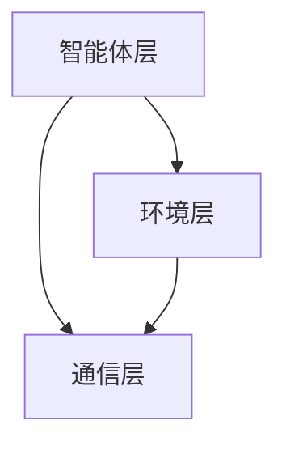
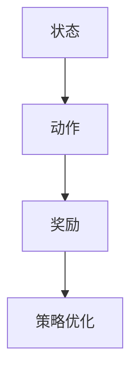
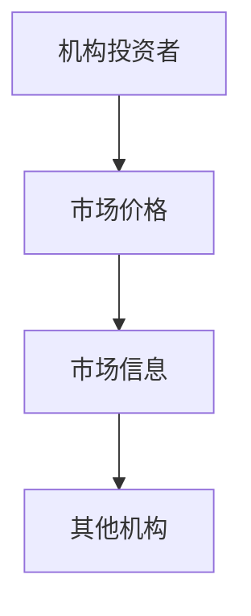
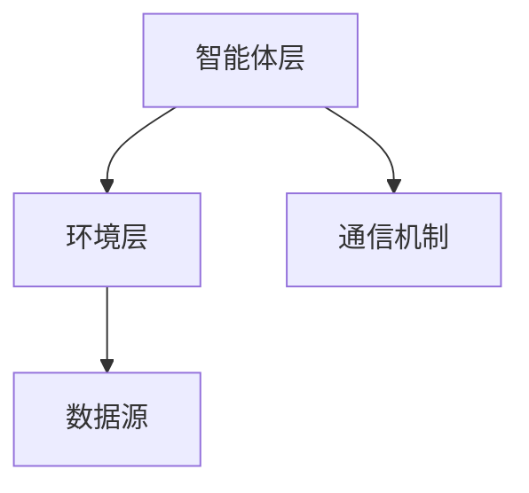
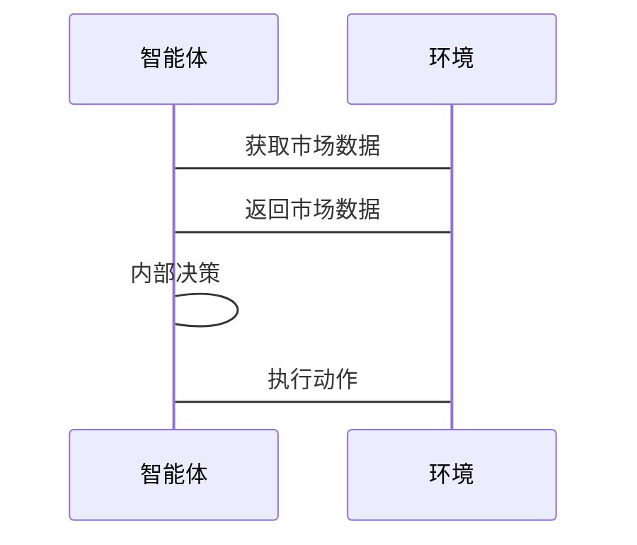

                 


```markdown
# 多智能体系统模拟机构投资行为

> 关键词：多智能体系统, 机构投资行为, 金融建模, 强化学习, 系统模拟

> 摘要：本文探讨了如何利用多智能体系统来模拟机构投资者在金融市场中的行为。通过分析多智能体系统的核心概念与机构投资行为的关联性，本文提出了基于强化学习和博弈论的建模方法，并设计了系统的架构与实现方案。文章还通过具体案例展示了多智能体系统在模拟机构投资行为中的实际应用，并提出了相关的注意事项和未来研究方向。

---

# 第一部分: 多智能体系统与机构投资行为的背景介绍

# 第1章: 多智能体系统与机构投资行为的背景介绍

## 1.1 多智能体系统的定义与特点

### 1.1.1 多智能体系统的定义

多智能体系统（Multi-Agent System, MAS）是由多个智能体组成的分布式系统，这些智能体通过协作与竞争完成特定目标。每个智能体都具有一定的自主性、反应性和社会性。

$$\text{MAS} = \{\text{智能体}, \text{环境}, \text{通信机制}\}$$

### 1.1.2 多智能体系统的核心特点

- **自主性**：每个智能体都具有独立决策的能力。
- **反应性**：智能体能够感知环境并实时调整行为。
- **协作性**：多个智能体通过协作完成复杂任务。
- **分布性**：智能体之间不存在中心化的控制结构。

### 1.1.3 多智能体系统与传统单智能体系统的区别

| 特性        | 多智能体系统          | 单智能体系统          |
|-------------|----------------------|----------------------|
| 控制结构    | 分布式               | 集中式               |
| 智能体数量  | 多个                 | 单个                 |
| 行为复杂度  | 高                   | 低                   |
| 应用场景     | 金融市场、交通控制等 | 单任务处理等         |

## 1.2 机构投资行为的定义与特点

### 1.2.1 机构投资者的定义

机构投资者是指以机构为主体进行证券投资的投资者，包括基金公司、保险公司、资产管理公司等。

$$\text{机构投资者} = \{\text{基金公司}, \text{保险公司}, \text{资产管理公司}\}$$

### 1.2.2 机构投资行为的核心特点

- **理性决策**：基于市场信息和数据分析做出决策。
- **分散投资**：通过多元化投资降低风险。
- **长期策略**：注重长期收益，而非短期波动。

### 1.2.3 机构投资行为的分类与分析

| 行为类型        | 定义                          | 特点                          |
|-----------------|----------------------------|----------------------------|
| 主动管理型      | 积极选股，追求超额收益        | 风险高，收益潜力大            |
| 被动管理型      | 模拟指数，追求市场平均收益      | 风险低，费用低                |
| 投资策略型      | 基于特定策略（如价值投资）      | 稳定性高，风险可控            |

## 1.3 多智能体系统模拟机构投资行为的背景与意义

### 1.3.1 问题背景

金融市场中的机构投资者行为复杂，涉及多方利益和动态博弈，传统的单智能体模型难以捕捉其全貌。

### 1.3.2 问题描述

如何利用多智能体系统模拟机构投资者在金融市场中的行为，并分析其对市场价格的影响。

### 1.3.3 问题解决的思路与方法

- **建模**：构建多智能体模型，模拟机构投资者的决策过程。
- **仿真**：通过仿真分析机构投资者行为对市场的影响。
- **优化**：优化智能体的决策策略，提高模型的准确性。

### 1.3.4 多智能体系统模拟机构投资行为的边界与外延

- **边界**：仅模拟机构投资者行为，不考虑散户和其他市场参与者。
- **外延**：可扩展到更复杂的金融市场模拟，如加入央行政策等。

## 1.4 本章小结

本章介绍了多智能体系统的定义与特点，分析了机构投资行为的核心特点，并提出了利用多智能体系统模拟机构投资行为的思路与方法。

---

# 第二部分: 多智能体系统的核心概念与机构投资行为的联系

# 第2章: 多智能体系统的核心概念与原理

## 2.1 多智能体系统的组成与结构

### 2.1.1 多智能体系统的组成要素

$$\text{MAS} = \{\text{智能体}, \text{环境}, \text{通信机制}\}$$

### 2.1.2 多智能体系统的层次结构



### 2.1.3 多智能体系统的通信机制

- **直接通信**：智能体之间直接交换信息。
- **间接通信**：通过中介传递信息。

## 2.2 多智能体系统的协作与竞争机制

### 2.2.1 协作机制的定义与实现

- **协作目标**：共同完成特定任务。
- **协作方式**：基于协商或共享信息。

### 2.2.2 竞争机制的定义与实现

- **竞争目标**：争夺有限资源。
- **竞争方式**：基于策略或规则。

### 2.2.3 协作与竞争的动态平衡

- **动态平衡**：根据环境变化调整协作与竞争强度。

## 2.3 多智能体系统的决策与学习机制

### 2.3.1 基于强化学习的决策机制



### 2.3.2 基于博弈论的决策模型

- **纳什均衡**：所有参与者策略的稳定状态。
- **博弈树**：表示决策过程的树状结构。

### 2.3.3 多智能体系统的自适应学习算法

- **Q-learning**：基于状态-动作-奖励的强化学习算法。
- **Actor-Critic**：基于策略和价值函数的强化学习算法。

---

# 第3章: 机构投资行为的建模与分析

## 3.1 机构投资行为的建模方法

### 3.1.1 基于多智能体的机构投资行为建模

$$\text{模型} = \{\text{智能体}, \text{市场环境}, \text{决策规则}\}$$

### 3.1.2 机构投资行为的特征提取与分析

| 特征       | 描述                     |
|------------|--------------------------|
| 投资策略   | 主动或被动投资策略       |
| 风险偏好   | 风险厌恶或风险中性       |
| 时间窗口   | 短期或长期投资           |

### 3.1.3 机构投资行为的动态变化模型

$$\text{动态变化} = f(\text{市场信息}, \text{机构策略}, \text{外部环境})$$`

## 3.2 机构投资行为的核心要素与关系

### 3.2.1 机构投资者的决策目标

- **收益最大化**：追求最大投资收益。
- **风险最小化**：降低投资风险。

### 3.2.2 机构投资行为的影响因素

| 因素       | 描述                     |
|------------|--------------------------|
| 市场信息     | 包括价格、成交量等       |
| 机构策略     | 包括主动或被动投资策略     |
| 外部环境     | 包括政策、经济环境等       |

### 3.2.3 机构投资行为的相互作用关系



## 3.3 多智能体系统与机构投资行为的关联性分析

### 3.3.1 多智能体系统在模拟机构投资行为中的优势

- **分布式决策**：能够模拟多个机构投资者的独立决策。
- **动态交互**：能够捕捉机构投资者之间的动态博弈。

### 3.3.2 机构投资行为对多智能体系统的影响

- **复杂性增加**：机构投资者的行为增加了系统的复杂性。
- **数据需求**：需要大量市场数据支持模型的运行。

### 3.3.3 多智能体系统模拟机构投资行为的可行性

- **技术可行性**：现有的多智能体技术可以支持机构投资行为的模拟。
- **数据可行性**：金融市场数据的可获取性为模型提供了基础。

---

# 第四部分: 系统分析与架构设计方案

# 第4章: 多智能体系统模拟机构投资行为的系统架构设计

## 4.1 问题场景介绍

- **场景描述**：模拟机构投资者在股票市场中的投资行为。
- **参与者**：机构投资者、市场环境、数据源。

## 4.2 系统功能设计

### 4.2.1 领域模型类图


### 4.2.2 系统架构图



### 4.2.3 系统接口设计

- **智能体接口**：提供决策和动作的接口。
- **环境接口**：提供市场数据的接口。
- **通信接口**：提供消息传递的接口。

### 4.2.4 系统交互序列图



---

# 第五部分: 项目实战

# 第5章: 多智能体系统模拟机构投资行为的项目实战

## 5.1 环境安装与配置

### 5.1.1 安装Python环境

```bash
python --version
pip install numpy matplotlib
```

### 5.1.2 安装其他依赖

```bash
pip install gym keras tensorflow
```

## 5.2 系统核心实现源代码

### 5.2.1 智能体类

```python
class Agent:
    def __init__(self, state_space, action_space):
        self.state_space = state_space
        self.action_space = action_space
        self.model = self.build_model()

    def build_model(self):
        # 构建深度学习模型
        pass

    def decide(self, state):
        # 根据状态做出决策
        pass
```

### 5.2.2 环境类

```python
class Environment:
    def __init__(self, data):
        self.data = data
        self.current_step = 0

    def get_state(self):
        # 获取当前状态
        pass

    def execute_action(self, action):
        # 执行动作并返回奖励
        pass
```

### 5.2.3 训练过程

```python
agent = Agent(state_space, action_space)
env = Environment(data)
for episode in range(num_episodes):
    state = env.get_state()
    action = agent.decide(state)
    reward = env.execute_action(action)
    # 更新智能体模型
```

## 5.3 代码实现与应用解读

### 5.3.1 智能体的决策过程

- **状态感知**：获取当前市场状态。
- **决策制定**：基于状态做出投资决策。
- **动作执行**：执行决策并观察结果。

### 5.3.2 环境的模拟过程

- **市场数据生成**：生成模拟的市场数据。
- **状态更新**：根据智能体的动作更新市场状态。
- **奖励计算**：根据市场变化计算奖励。

## 5.4 实际案例分析与详细讲解剖析

### 5.4.1 案例介绍

- **案例名称**：模拟股票市场中的机构投资者行为。
- **数据来源**：使用历史股票数据进行训练。

### 5.4.2 模拟结果分析

- **收益分析**：比较智能体的收益与实际机构投资者的收益。
- **风险分析**：比较智能体的风险与实际机构投资者的风险。

## 5.5 项目小结

本章通过具体案例展示了多智能体系统在模拟机构投资行为中的应用，详细讲解了系统的实现过程，并对模拟结果进行了分析。

---

# 第六部分: 总结与展望

# 第6章: 总结与展望

## 6.1 总结

本文探讨了多智能体系统模拟机构投资行为的方法，提出了基于强化学习和博弈论的建模方法，并设计了系统的架构与实现方案。

## 6.2 注意事项

- **数据质量**：确保市场数据的准确性和完整性。
- **模型优化**：不断优化智能体的决策策略。
- **系统扩展**：扩展到更复杂的金融市场模拟。

## 6.3 未来研究方向

- **多智能体系统的优化**：研究更高效的多智能体算法。
- **机构投资行为的深度建模**：结合更多的市场因素进行建模。
- **实际应用**：将多智能体系统应用于实际的金融交易中。

## 6.4 拓展阅读

- 《Multi-Agent Systems: Complexity and Coordination》
- 《Reinforcement Learning: Theory and Algorithms》

---

# 作者

作者：AI天才研究院/AI Genius Institute & 禅与计算机程序设计艺术/Zen And The Art of Computer Programming
```

