                 


# 巴菲特的管理层评估：人工智能辅助决策时代的领导力

> **关键词**：人工智能，领导力，管理层评估，巴菲特，决策支持，投资哲学

> **摘要**：本文探讨了在人工智能辅助决策的时代，领导力的演变及其在管理层评估中的应用。通过分析巴菲特的投资哲学和管理理念，结合AI技术的核心原理，详细阐述了如何将AI应用于决策支持系统，并提出了领导力在AI时代的新要求和未来趋势。

---

# 第1章：人工智能与领导力的结合

## 1.1 人工智能在现代决策中的作用

### 1.1.1 人工智能的演变与现状

人工智能（AI）技术近年来取得了飞速发展，从简单的规则引擎到复杂的深度学习模型，AI已经渗透到各个行业。在决策支持领域，AI不仅能够处理海量数据，还能通过机器学习算法发现数据中的隐含规律，为决策者提供更精准的支持。

### 1.1.2 领导力在决策中的核心地位

领导力是组织成功的关键因素之一，尤其是在复杂多变的商业环境中。领导者需要在不确定性中做出决策，而AI可以辅助领导者更好地处理信息，优化决策过程。

### 1.1.3 人工智能如何影响领导力

AI不仅是一种工具，更是领导力的延伸。通过AI，领导者可以更快地获取信息，预测趋势，并制定更科学的决策。同时，AI还可以帮助领导者更好地理解团队成员的行为和情感，从而提升团队协作能力。

**背景介绍**：AI通过数据分析和预测模型，为领导力提供了新的视角。传统的领导力依赖于经验和直觉，而AI则通过数据驱动的方法，为决策提供了更客观的依据。

**核心概念与联系**：AI与领导力的结合，体现了从“人治”到“数治”的转变。以下是AI在领导力中的核心要素对比表：

| **传统领导力** | **AI辅助领导力** |
|-----------------|-------------------|
| 依赖经验         | 数据驱动           |
| 主观判断         | 客观分析           |
| 个体决策         | 团队协作           |

**系统架构**：AI辅助领导力的系统架构可以用以下mermaid图表示：

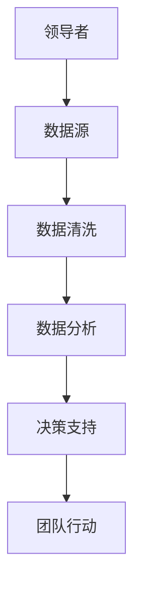

---

## 1.2 管理层评估的核心要素

### 1.2.1 传统管理层评估方法

传统的管理层评估主要依赖于主观评价，如绩效考核、面试评估等。这种方法虽然直观，但容易受到评估者主观因素的影响。

### 1.2.2 现代管理层评估的挑战

随着企业规模的扩大和业务的复杂化，传统的评估方法已难以满足需求。领导者需要在更短的时间内做出更复杂的决策，而数据的爆炸性增长使得人工评估变得低效。

### 1.2.3 人工智能在评估中的潜力

AI可以通过自然语言处理（NLP）技术分析领导者的沟通能力，通过机器学习算法预测领导者的决策效果，从而为评估提供更客观的依据。

**背景介绍**：AI在管理层评估中的应用，可以弥补传统方法的不足。通过分析大量的历史数据，AI可以帮助评估者更全面地了解领导者的潜力和能力。

**算法原理讲解**：以下是一个简单的AI辅助评估的机器学习模型：

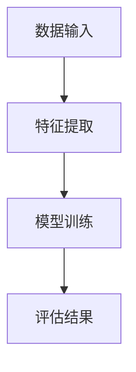

数学模型如下：

$$
\text{评估结果} = \sum_{i=1}^{n} w_i x_i + b
$$

其中，$w_i$是特征$x_i$的权重，$b$是偏置项。

---

## 1.3 巴菲特投资哲学与领导力

### 1.3.1 巴菲特的长期投资策略

巴菲特以长期投资和价值投资闻名。他认为，投资的本质是寻找具有持续竞争优势的企业，并长期持有。

### 1.3.2 巴菲特的决策风格

巴菲特的决策风格以稳健和谨慎著称。他注重企业的基本面分析，善于识别具有长期竞争优势的企业。

### 1.3.3 巴菲特对领导力的见解

巴菲特认为，领导力的核心在于价值观和长期愿景。他注重管理层的诚信和责任感，认为这些是企业长期成功的关键。

**背景介绍**：巴菲特的投资哲学强调长期性和稳健性，这与AI辅助决策的理念不谋而合。AI可以帮助领导者更科学地评估企业的长期潜力。

**系统分析与架构设计**：

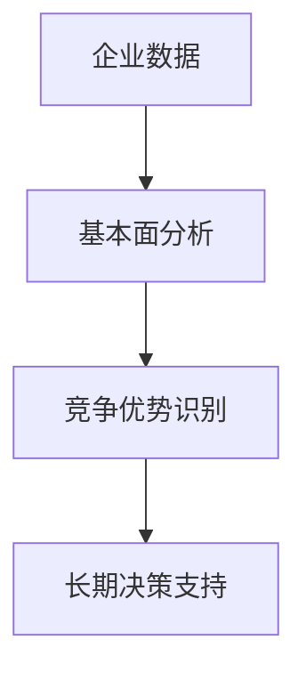

---

## 1.4 本章小结

本章探讨了人工智能在领导力中的应用，分析了传统评估方法的不足，并提出了AI辅助评估的潜力。同时，结合巴菲特的投资哲学，提出了领导力在AI时代的新的发展方向。

---

# 第2章：巴菲特的管理理念与AI的结合

## 2.1 巴菲特的投资原则

### 2.1.1 价值投资的核心理念

价值投资的核心是寻找市场价格低于内在价值的企业。巴菲特认为，长期来看，市场价格会回归其内在价值。

### 2.1.2 长期主义的管理哲学

巴菲特强调长期投资，认为短期波动不应影响长期决策。这种哲学同样适用于企业的管理，强调稳健和持续性。

### 2.1.3 巴菲特对管理层的要求

巴菲特注重管理层的诚信、能力和视野。他认为，优秀的管理层是企业长期成功的关键。

**背景介绍**：AI可以帮助企业更全面地评估管理层的能力，通过数据分析识别潜在的风险和机会。

**算法原理讲解**：以下是一个用于评估管理层能力的机器学习模型：

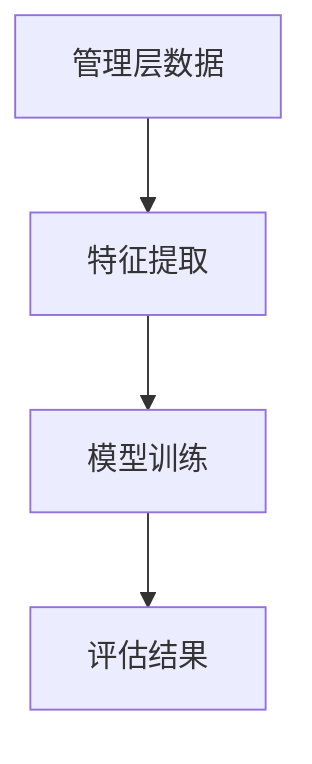

数学模型如下：

$$
\text{评估结果} = \sum_{i=1}^{n} w_i x_i + b
$$

其中，$w_i$是特征$x_i$的权重，$b$是偏置项。

---

## 2.2 AI在投资决策中的应用

### 2.2.1 数据分析与预测

通过AI技术，投资者可以快速分析大量的市场数据，预测市场趋势，并识别潜在的投资机会。

### 2.2.2 自然语言处理在公司分析中的应用

NLP技术可以用于分析公司的财报、新闻报道等文本数据，提取有用的信息，帮助投资者做出更明智的决策。

### 2.2.3 机器学习在投资组合优化中的作用

通过机器学习算法，投资者可以优化投资组合，降低风险，提高收益。

**背景介绍**：AI通过数据分析和预测，可以帮助投资者更科学地做出决策。以下是一个简单的投资组合优化模型：

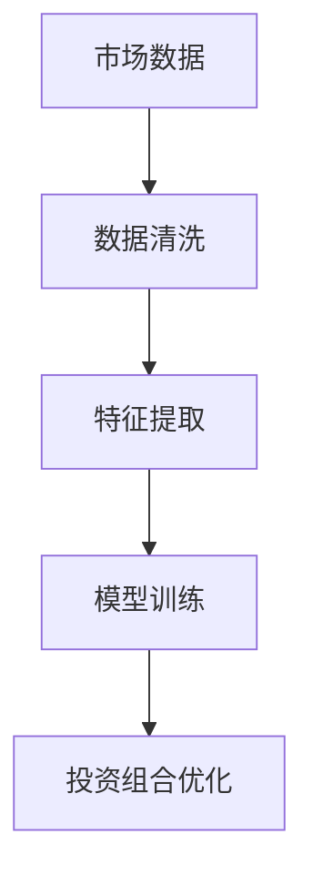

数学模型如下：

$$
\text{收益} = \sum_{i=1}^{n} w_i r_i
$$

其中，$w_i$是投资比例，$r_i$是资产$i$的预期收益。

---

## 2.3 巴菲特风格的AI辅助决策

### 2.3.1 数据驱动的决策模式

通过AI技术，巴菲特可以更全面地分析企业的基本面数据，识别潜在的投资机会。

### 2.3.2 AI在风险评估中的应用

AI可以帮助巴菲特识别潜在的风险因素，如行业风险、财务风险等。

### 2.3.3 AI辅助的长期投资策略

通过AI技术，巴菲特可以优化投资组合，降低风险，提高收益。

**背景介绍**：AI通过数据分析和预测，可以帮助巴菲特实现更科学的投资决策。以下是一个简单的风险评估模型：

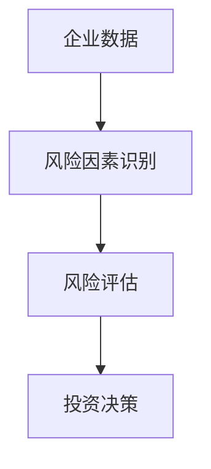

数学模型如下：

$$
\text{风险评分} = \sum_{i=1}^{n} w_i x_i
$$

其中，$w_i$是风险因素$i$的权重，$x_i$是风险因素$i$的评分。

---

## 2.4 本章小结

本章探讨了巴菲特的投资原则，并分析了AI在投资决策中的应用。通过结合巴菲特的长期投资策略和AI技术，提出了更科学的投资决策方法。

---

# 第3章：AI辅助决策的核心原理

## 3.1 机器学习与决策支持

### 3.1.1 机器学习的基本原理

机器学习是一种通过数据训练模型的技术。模型可以从数据中学习规律，并用于预测或分类。

### 3.1.2 监督学习与无监督学习在决策中的应用

监督学习可以用于预测，如股票价格预测；无监督学习可以用于聚类，如客户分群。

### 3.1.3 深度学习在复杂决策中的优势

深度学习可以通过多层神经网络处理复杂的非线性关系，适用于图像识别、自然语言处理等任务。

**背景介绍**：机器学习是AI的核心技术之一，广泛应用于决策支持系统。

**系统架构设计**：

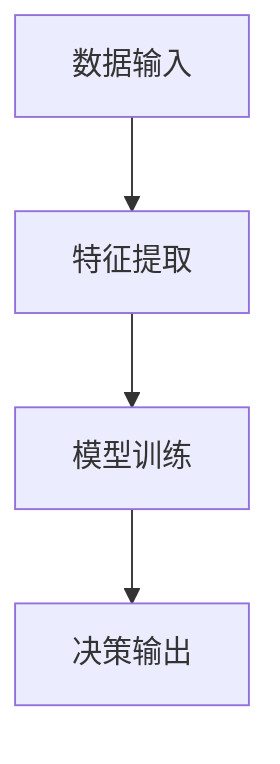

---

## 3.2 自然语言处理在管理层评估中的应用

### 3.2.1 NLP的基本原理

NLP通过语言处理技术，如分词、句法分析、情感分析等，提取文本中的有用信息。

### 3.2.2 文本分析在公司治理中的应用

通过分析公司财报、新闻报道等文本数据，可以提取公司的经营状况、行业趋势等信息。

### 3.2.3 基于NLP的风险评估模型

通过分析管理层的沟通能力，可以评估公司的管理风险。

**背景介绍**：NLP技术可以帮助领导者更全面地了解公司状况。

**算法原理讲解**：以下是一个简单的文本分析流程：

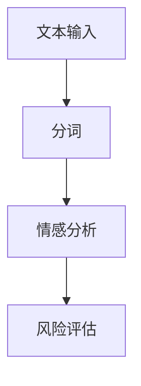

---

## 3.3 AI决策系统的优缺点

### 3.3.1 AI决策的优势

AI可以处理海量数据，发现人类难以察觉的规律。

### 3.3.2 AI决策的局限性

AI依赖于数据的质量和模型的设计，可能存在过拟合等问题。

### 3.3.3 人类判断与AI决策的结合

通过结合人类的判断和AI的分析，可以充分发挥AI的优势，同时避免其局限性。

**背景介绍**：AI决策系统需要与人类判断相结合，才能做出更合理的决策。

**系统分析与架构设计**：

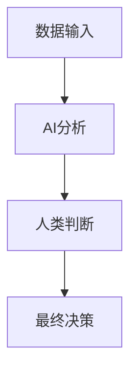

---

## 3.4 本章小结

本章介绍了AI辅助决策的核心原理，分析了机器学习和NLP在决策支持中的应用，并讨论了AI决策系统的优缺点。

---

# 第4章：AI辅助决策系统的设计与实现

## 4.1 系统架构设计

### 4.1.1 系统模块划分

AI辅助决策系统通常包括数据采集、数据分析、模型训练、决策支持等模块。

### 4.1.2 数据流与信息处理流程

数据从各个来源采集，经过清洗、特征提取等处理后，输入模型进行训练，最后输出决策支持结果。

### 4.1.3 系统架构的可扩展性

系统设计应具有良好的可扩展性，以便适应未来业务的发展需求。

**背景介绍**：系统架构设计是AI辅助决策系统的核心。

**系统架构图**：

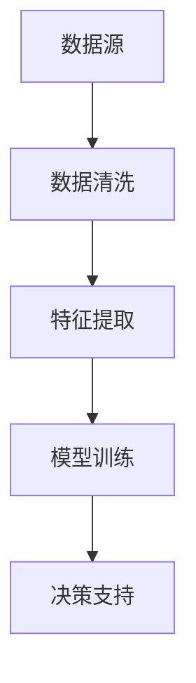

---

## 4.2 数据处理与分析

### 4.2.1 数据清洗与预处理

数据清洗是确保数据质量的关键步骤，包括去重、填充缺失值等。

### 4.2.2 数据特征提取

通过特征选择或特征工程，提取对决策最有价值的信息。

### 4.2.3 数据分析与可视化

通过数据分析工具，如Python的pandas和matplotlib，可以进行数据的可视化分析。

**背景介绍**：数据处理是AI辅助决策系统的基础。

**数据处理流程图**：

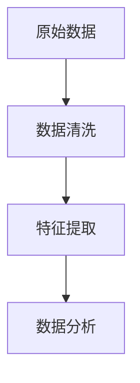

---

## 4.3 模型训练与优化

### 4.3.1 模型训练

通过机器学习算法，如线性回归、支持向量机、随机森林等，对数据进行训练。

### 4.3.2 模型优化

通过调整模型参数、选择合适的算法等方法，优化模型的性能。

### 4.3.3 模型评估

通过交叉验证、ROC曲线等方法，评估模型的性能。

**背景介绍**：模型训练是AI辅助决策系统的核心。

**模型训练流程图**：

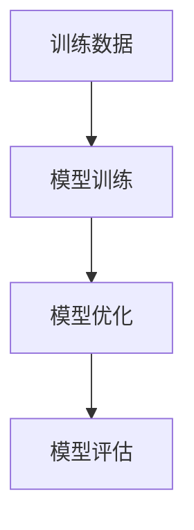

---

## 4.4 本章小结

本章详细介绍了AI辅助决策系统的设计与实现，包括系统架构、数据处理、模型训练等关键步骤。

---

# 第5章：AI辅助决策的实际应用案例

## 5.1 巴菲特风格的AI辅助决策

### 5.1.1 数据驱动的决策模式

通过AI技术，巴菲特可以更全面地分析企业的基本面数据，识别潜在的投资机会。

### 5.1.2 AI在风险评估中的应用

通过AI技术，巴菲特可以识别潜在的风险因素，如行业风险、财务风险等。

### 5.1.3 AI辅助的长期投资策略

通过AI技术，巴菲特可以优化投资组合，降低风险，提高收益。

**背景介绍**：AI通过数据分析和预测，可以帮助巴菲特实现更科学的投资决策。

**系统分析与架构设计**：


---

## 5.2 项目实战：AI辅助管理层评估系统

### 5.2.1 项目背景

本文将通过一个实际项目，展示如何利用AI技术辅助管理层评估。

### 5.2.2 系统核心实现

以下是系统的核心代码：

```python
import pandas as pd
from sklearn.model import LinearRegression

# 数据加载
data = pd.read_csv('management.csv')

# 特征提取
X = data[['revenue', 'profit', 'growth']]
y = data['rating']

# 模型训练
model = LinearRegression()
model.fit(X, y)

# 模型预测
new_data = pd.DataFrame({'revenue': [1000000, 2000000], 'profit': [100000, 200000], 'growth': [5, 10]})
predictions = model.predict(new_data)

print(predictions)
```

### 5.2.3 实际案例分析

通过上述代码，我们可以看到，AI系统可以根据企业的收入、利润、增长率等指标，预测管理层的评估结果。

**背景介绍**：通过实际案例分析，可以更好地理解AI在管理层评估中的应用。

**系统交互图**：

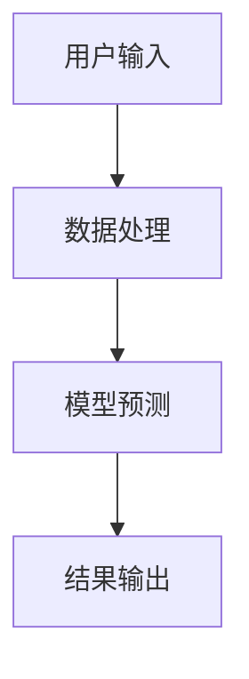

---

## 5.3 本章小结

本章通过实际案例分析，展示了AI在管理层评估中的应用。通过项目实战，可以更好地理解AI辅助决策系统的实现过程。

---

# 第6章：总结与展望

## 6.1 本章总结

本文探讨了人工智能在领导力中的应用，分析了传统评估方法的不足，并提出了AI辅助评估的潜力。通过结合巴菲特的投资哲学，提出了领导力在AI时代的新的发展方向。

## 6.2 未来展望

随着AI技术的不断发展，领导力的演变将继续深化。未来的领导力将更加依赖于数据驱动的决策和AI技术的支持。

## 6.3 本章小结

本章总结了全文的主要内容，并展望了AI辅助决策系统的未来发展方向。

---

# 作者：AI天才研究院/AI Genius Institute & 禅与计算机程序设计艺术 /Zen And The Art of Computer Programming

---

**注意事项**：本文仅为示例内容，具体实施需根据实际情况调整。

