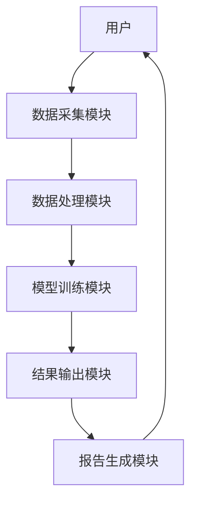

                 


# 设计智能化的企业信用风险定价模型

> 关键词：企业信用风险，智能化定价模型，机器学习，信用评分，风险评估

> 摘要：本文将详细介绍如何设计智能化的企业信用风险定价模型，从背景介绍、核心概念、算法原理、数学模型到系统架构和项目实战，逐步分析和实现这一模型。通过结合数据驱动与人工智能技术，我们能够更准确地评估企业信用风险，优化定价策略。

---

# 第1章: 企业信用风险定价模型的背景与概念

## 1.1 信用风险的定义与问题背景

### 1.1.1 信用风险的基本概念
信用风险是指企业在履行债务时，由于债务人或交易对手无法履行合同义务，导致债权人遭受损失的可能性。在企业融资、贷款和投资等领域，信用风险是影响决策的重要因素。

### 1.1.2 信用风险在企业融资中的重要性
企业在申请贷款或进行其他融资活动时，金融机构需要评估企业的信用风险。信用风险的定价直接影响企业的融资成本和金融机构的风险控制能力。

### 1.1.3 传统信用风险定价的局限性
传统的信用风险定价方法通常基于财务指标和历史数据，缺乏对复杂市场环境和企业行为的动态捕捉能力。此外，传统方法难以处理大规模数据和非结构化数据，导致定价不够精准。

## 1.2 智能化定价模型的提出

### 1.2.1 数据驱动与人工智能的结合
随着大数据和人工智能技术的发展，通过收集和分析企业的多维度数据（如财务数据、市场数据、社交媒体数据等），可以构建更加精准的信用风险定价模型。

### 1.2.2 智能化定价模型的核心目标
智能化信用风险定价模型的目标是通过机器学习算法，实时分析企业的信用状况，动态调整定价策略，降低风险，提高收益。

### 1.2.3 智能化定价模型的潜在价值
智能化定价模型可以帮助金融机构更准确地评估信用风险，优化资产配置，降低风险敞口，并提升客户体验。

## 1.3 本章小结
本章介绍了信用风险的基本概念、传统定价方法的局限性以及智能化定价模型的核心目标和潜在价值，为后续章节的分析奠定了基础。

---

# 第2章: 企业信用风险定价模型的核心概念

## 2.1 信用风险定价模型的结构与组成

### 2.1.1 数据输入层
数据输入层包括企业的财务数据、市场数据、行业数据、管理团队信息、法律纠纷记录、社交媒体数据等。

### 2.1.2 模型处理层
模型处理层包括特征提取、数据清洗、数据增强、模型训练和模型优化等步骤。

### 2.1.3 结果输出层
结果输出层包括信用评分、信用等级、违约概率、风险定价等输出结果。

## 2.2 关键概念的对比分析

### 2.2.1 信用评分与信用定价的对比
| 比较维度 | 信用评分 | 信用定价 |
|----------|----------|----------|
| 定义     | 衡量企业信用状况的指标 | 确定企业融资的利率或费用 |
| 方法     | 基于历史数据和统计模型 | 基于未来风险预测和市场定价 |

### 2.2.2 传统模型与智能模型的对比
| 比较维度 | 传统模型 | 智能模型 |
|----------|----------|----------|
| 数据来源 | 单一来源 | 多源数据 |
| 模型复杂度 | 简单线性 | 复杂非线性 |
| 性能     | 较低 | 较高 |

### 2.2.3 不同模型的优缺点分析
- 传统模型：简单易懂，但缺乏对复杂因素的捕捉能力。
- 智能模型：能够处理多维度数据，但需要大量计算资源和专业知识。

## 2.3 ER实体关系图架构

```mermaid
er
  actor: 企业
  model: 智能化信用风险定价模型
  data: 输入数据
  result: 输出结果
  actor --> data: 提供数据
  data --> model: 输入数据
  model --> result: 输出结果
  actor <-- result: 获取信用评分
```

## 2.4 本章小结
本章详细介绍了企业信用风险定价模型的结构和组成，并通过对比分析和实体关系图，明确了智能化模型的优势和应用场景。

---

# 第3章: 企业信用风险定价模型的算法原理

## 3.1 基于机器学习的信用风险定价

### 3.1.1 线性回归模型
线性回归模型通过建立因变量（信用评分）与自变量（财务指标）之间的线性关系，预测企业的信用风险。

$$y = \beta_0 + \beta_1x_1 + \beta_2x_2 + ... + \beta_nx_n + \epsilon$$

### 3.1.2 支持向量机模型
支持向量机通过构建超平面，将数据点分类到不同的信用等级。

$$y = \sum_{i=1}^n \alpha_i (x_i \cdot x) + b$$

### 3.1.3 随机森林模型
随机森林通过集成多个决策树模型，提高预测的准确性和稳定性。

```python
from sklearn.ensemble import RandomForestClassifier
model = RandomForestClassifier(n_estimators=100, random_state=42)
model.fit(X_train, y_train)
```

## 3.2 神经网络模型的应用

### 3.2.1 多层感知机（MLP）
多层感知机通过多层神经网络结构，捕捉数据的非线性关系。

$$a^{(l+1)} = \sigma(w^{(l)}a^{(l)} + b^{(l)})$$

### 3.2.2 长短期记忆网络（LSTM）
LSTM用于处理时间序列数据，捕捉企业的动态信用风险变化。

### 3.2.3 Transformer模型
Transformer模型通过自注意力机制，分析企业之间的关联性。

## 3.3 算法选择与优化

### 3.3.1 算法性能对比
| 比较维度 | 线性回归 | 支持向量机 | 随机森林 | LSTM | Transformer |
|----------|----------|------------|-----------|-------|-----------|
| 准确率   | 低       | 中         | 高         | 高     | 中         |
| 训练时间 | 短       | 中         | 长         | 长     | 长         |

### 3.3.2 超参数优化
通过网格搜索或随机搜索优化模型的超参数，如学习率、迭代次数等。

### 3.3.3 模型调优策略
- 数据预处理：标准化、特征选择。
- 模型选择：根据数据类型和任务选择合适的算法。
- 模型评估：使用交叉验证和指标（如准确率、召回率、F1值）评估模型性能。

## 3.4 本章小结
本章介绍了几种常用的机器学习算法，并通过对比分析和优化策略，帮助读者选择最适合的算法来构建信用风险定价模型。

---

# 第4章: 企业信用风险定价模型的数学模型与公式

## 4.1 信用风险定价的基础模型

### 4.1.1 线性回归模型公式
$$y = \beta_0 + \beta_1x_1 + \beta_2x_2 + ... + \beta_nx_n + \epsilon$$

### 4.1.2 逻辑回归模型公式
$$P(y=1|x) = \frac{e^{\beta_0 + \beta_1x_1 + ... + \beta_nx_n}}{1 + e^{\beta_0 + \beta_1x_1 + ... + \beta_nx_n}}$$

## 4.2 基于机器学习的优化模型

### 4.2.1 支持向量回归公式
$$y = \sum_{i=1}^n \alpha_i (x_i \cdot x) + b$$

### 4.2.2 随机森林回归公式
随机森林通过集成多个决策树的预测结果，得到最终的信用评分。

## 4.3 神经网络模型的数学表达

### 4.3.1 多层感知机公式
$$a^{(l+1)} = \sigma(w^{(l)}a^{(l)} + b^{(l)})$$

### 4.3.2 LSTM公式
$$c_t = f gate \cdot c_{t-1} + i gate \cdot g(x_t)$$
$$h_t = o gate \cdot c_t$$

## 4.4 本章小结
本章详细推导了各种算法的数学公式，并通过对比分析，帮助读者理解不同模型的内在机制。

---

# 第5章: 企业信用风险定价模型的系统架构设计

## 5.1 系统功能设计

### 5.1.1 数据采集模块
通过API接口获取企业的财务数据、市场数据、行业数据等。

### 5.1.2 数据处理模块
对数据进行清洗、特征提取和数据增强。

### 5.1.3 模型训练模块
基于预处理后的数据，训练并优化信用风险定价模型。

### 5.1.4 结果输出模块
输出信用评分、信用等级等结果，并生成报告。

## 5.2 系统架构图



## 5.3 接口设计

### 5.3.1 数据接口
- 输入接口：接收企业的多维度数据。
- 输出接口：返回信用评分和风险定价。

### 5.3.2 模型接口
- 训练接口：接收训练数据，返回训练好的模型。
- 预测接口：接收实时数据，返回预测结果。

## 5.4 本章小结
本章通过系统架构设计，明确了各模块的功能和交互关系，为后续的实现奠定了基础。

---

# 第6章: 项目实战——构建智能化企业信用风险定价模型

## 6.1 环境安装

### 6.1.1 安装Python环境
```bash
python --version
pip install --upgrade pip
```

### 6.1.2 安装机器学习库
```bash
pip install numpy scikit-learn tensorflow pandas
```

## 6.2 核心实现代码

### 6.2.1 数据预处理代码
```python
import pandas as pd
import numpy as np
from sklearn.model_selection import train_test_split
from sklearn.preprocessing import StandardScaler

# 加载数据
data = pd.read_csv('credit_data.csv')
X = data.drop('target', axis=1)
y = data['target']

# 数据分割
X_train, X_test, y_train, y_test = train_test_split(X, y, test_size=0.2, random_state=42)

# 标准化处理
scaler = StandardScaler()
X_train = scaler.fit_transform(X_train)
X_test = scaler.transform(X_test)
```

### 6.2.2 模型训练代码
```python
from sklearn.ensemble import RandomForestClassifier
from tensorflow.keras.models import Sequential
from tensorflow.keras.layers import Dense

# 随机森林模型
rf_model = RandomForestClassifier(n_estimators=100, random_state=42)
rf_model.fit(X_train, y_train)

# 神经网络模型
nn_model = Sequential()
nn_model.add(Dense(64, activation='relu', input_dim=X_train.shape[1]))
nn_model.add(Dense(1, activation='sigmoid'))
nn_model.compile(optimizer='adam', loss='binary_crossentropy', metrics=['accuracy'])
nn_model.fit(X_train, y_train, epochs=10, batch_size=32)
```

### 6.2.3 模型评估代码
```python
from sklearn.metrics import classification_report

# 随机森林模型评估
y_pred = rf_model.predict(X_test)
print(classification_report(y_test, y_pred))

# 神经网络模型评估
y_pred_nn = nn_model.predict(X_test).round()
print(classification_report(y_test, y_pred_nn))
```

## 6.3 案例分析与解读

### 6.3.1 数据分析
分析企业的财务数据、市场数据等，提取关键特征。

### 6.3.2 模型训练
使用训练好的模型对测试数据进行预测，生成信用评分。

### 6.3.3 结果解读
解读模型预测结果，评估模型的准确性和稳定性。

## 6.4 本章小结
通过项目实战，读者可以掌握从数据准备到模型训练再到结果解读的整个流程，实际操作中加深对理论的理解。

---

# 第7章: 最佳实践与小结

## 7.1 最佳实践

### 7.1.1 数据质量的重要性
确保数据的准确性和完整性，避免数据偏差。

### 7.1.2 模型选择的灵活性
根据具体场景选择合适的算法，避免盲目使用复杂模型。

### 7.1.3 模型解释性
确保模型的可解释性，便于业务理解和风险控制。

## 7.2 小结

### 7.2.1 核心要点回顾
- 信用风险定价模型的重要性
- 数据驱动与人工智能的结合
- 各种算法的优缺点和适用场景
- 系统架构设计和项目实现步骤

### 7.2.2 展望
未来，随着人工智能技术的不断发展，信用风险定价模型将更加智能化和个性化，为企业和金融机构提供更精准的风险评估和定价服务。

---

# 作者：AI天才研究院/AI Genius Institute & 禅与计算机程序设计艺术 /Zen And The Art of Computer Programming

---

通过以上详细的内容结构，我们逐步构建了智能化的企业信用风险定价模型，从理论到实践，帮助读者全面理解和掌握相关知识。

