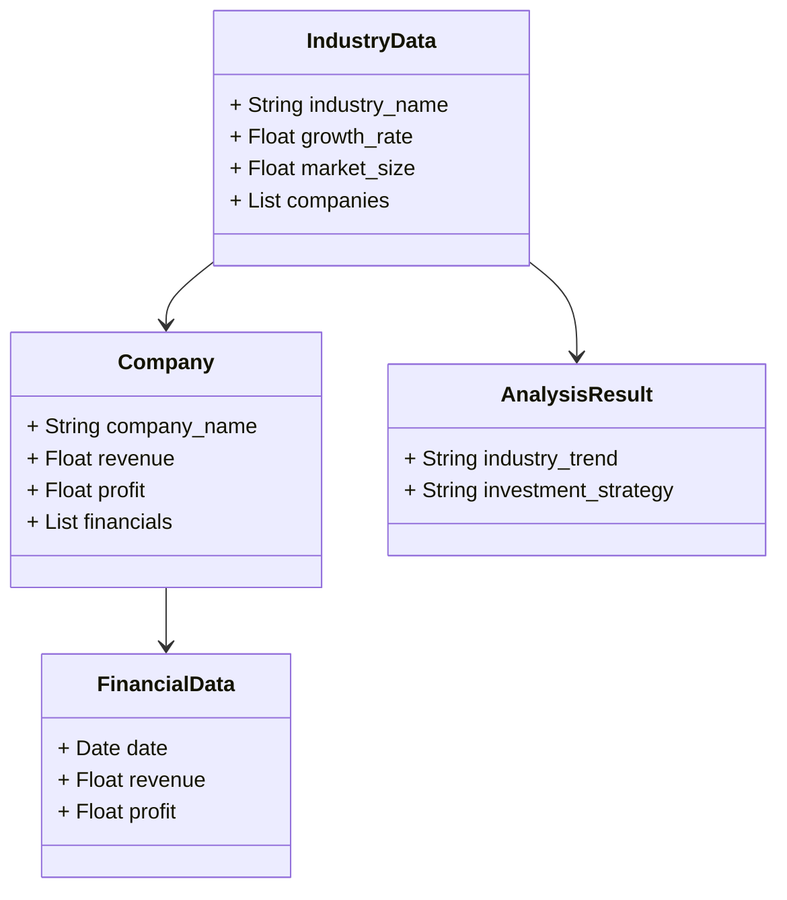
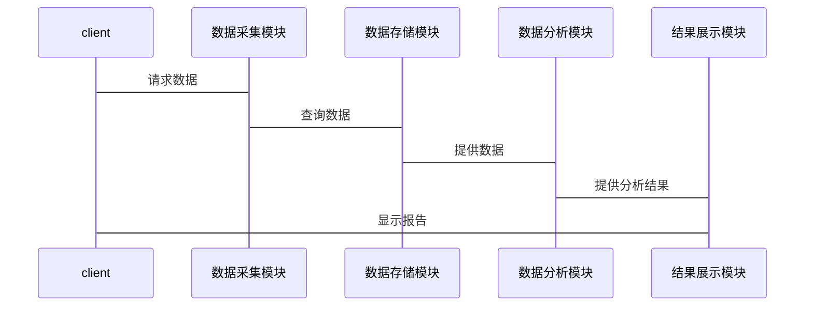

                 


# 费雪的行业趋势分析：把握未来增长机会

> 关键词：行业趋势分析，投资策略，费雪理论，成长股，趋势预测，数据分析

> 摘要：本文基于费雪的投资理念，系统性地分析了行业趋势分析的核心概念、数学模型和系统架构，帮助读者掌握如何通过行业趋势分析来把握未来增长机会。文章从费雪的投资理论出发，结合行业生命周期模型、五力竞争模型等核心工具，详细讲解了行业趋势分析的步骤、方法、数学模型和系统实现。同时，本文还提供了丰富的实战案例和工具推荐，帮助读者在实际投资中应用这些方法。

---

## 第一部分: 费雪的行业趋势分析基础

### 第1章: 费雪投资理念与行业趋势分析概述

#### 1.1 费雪投资理论的核心思想

##### 1.1.1 费雪的成长股投资策略
菲利普·费雪（Philip Fisher）是20世纪著名的投资家，他提出了“成长股投资”的理念，强调选择那些具有持续增长潜力的企业进行投资。费雪认为，投资的目的是寻找那些能够持续增长的公司，并且这种增长不仅仅体现在财务数据上，更体现在公司的管理能力、市场地位和创新能力等方面。

**费雪的成长股投资策略的核心思想包括：**
1. **长期投资**：费雪反对短期交易，主张长期持有优质股票。
2. **选择具有持续增长潜力的企业**：他强调公司未来收入和利润的持续增长，而非仅仅关注当前的盈利能力。
3. **注重管理层素质**：费雪认为，公司的管理层对公司的发展至关重要，优秀的企业家能够带领公司持续成长。

##### 1.1.2 费雪的长期投资理念
费雪的投资理念可以总结为“买入并持有”，他认为市场波动是不可避免的，但优质企业的长期增长是可靠的。因此，投资者应该关注企业的基本面，选择那些具有持续增长潜力的公司，并且在市场波动中坚持长期持有的策略。

##### 1.1.3 费雪与行业趋势分析的关联
费雪的投资理念与行业趋势分析密切相关。行业趋势分析的核心在于识别行业的发展方向和潜在的增长点，而费雪的“成长股”理念正是基于对行业趋势的判断。通过分析行业趋势，投资者可以更好地识别出那些符合行业发展方向、具有持续增长潜力的企业。

#### 1.2 行业趋势分析的重要性

##### 1.2.1 行业趋势分析的定义
行业趋势分析是指通过对行业内部和外部环境的分析，预测行业未来的发展方向和变化趋势。这种分析不仅包括行业当前的状况，还包括行业未来可能面临的机遇和挑战。

##### 1.2.2 行业趋势分析的必要性
行业趋势分析是投资决策的重要依据。通过行业趋势分析，投资者可以更好地理解行业的发展方向，识别出具有增长潜力的企业，从而制定出更有效的投资策略。此外，行业趋势分析还可以帮助投资者规避行业风险，降低投资失败的概率。

##### 1.2.3 行业趋势分析的边界与外延
行业趋势分析的边界是指分析的范围和深度。一般来说，行业趋势分析的边界包括行业生命周期、行业竞争结构、行业关键成功因素等方面。行业趋势分析的外延则包括对宏观经济环境、政策法规、技术进步、消费者需求等因素的分析。

#### 1.3 行业趋势分析的核心要素

##### 1.3.1 行业生命周期模型
行业生命周期模型是行业趋势分析的重要工具之一。它将行业的生命周期划分为四个阶段：导入期、成长期、成熟期和衰退期。每个阶段的特征和策略都不同，投资者需要根据行业所处的生命周期阶段，制定相应的投资策略。

##### 1.3.2 行业竞争结构分析
行业竞争结构分析是行业趋势分析的另一个核心要素。通过分析行业的竞争结构，投资者可以更好地理解行业的竞争格局，识别出行业的关键成功因素和竞争优势。

##### 1.3.3 行业关键成功因素
行业关键成功因素是指那些对行业成功至关重要的因素。例如，在科技行业，技术创新是关键成功因素；在消费品行业，品牌影响力是关键成功因素。通过识别行业关键成功因素，投资者可以更好地判断企业的竞争优势。

#### 1.4 行业趋势分析的步骤与方法

##### 1.4.1 数据收集与整理
行业趋势分析的第一步是数据收集与整理。投资者需要收集与行业相关的各种数据，包括市场规模、增长率、竞争结构、政策法规等。这些数据可以通过行业报告、市场调研、公司财报等渠道获取。

##### 1.4.2 数据分析与建模
在收集到数据后，投资者需要对数据进行分析和建模。常用的分析方法包括时间序列分析、回归分析、聚类分析等。通过这些方法，投资者可以更好地理解行业的发展趋势，并预测未来的行业走势。

##### 1.4.3 结果解读与策略制定
最后，投资者需要对分析结果进行解读，并制定相应的投资策略。例如，如果行业处于成长期，投资者可以重点关注那些具有持续增长潜力的企业；如果行业处于成熟期，投资者可以关注那些具有竞争优势的龙头企业。

#### 1.5 本章小结
本章从费雪的投资理念出发，详细介绍了行业趋势分析的重要性、核心要素和步骤方法。通过行业生命周期模型、行业竞争结构分析和行业关键成功因素的分析，投资者可以更好地理解行业的发展趋势，并制定出更有效的投资策略。

---

## 第二部分: 行业趋势分析的核心概念与联系

### 第2章: 行业趋势分析的核心概念

#### 2.1 行业生命周期模型

##### 2.1.1 行业生命周期的四个阶段
行业生命周期模型将行业的生命周期划分为四个阶段：
1. **导入期**：行业刚刚出现，市场规模小，竞争激烈。
2. **成长期**：行业开始快速发展，市场规模扩大，竞争逐渐加剧。
3. **成熟期**：行业增长放缓，市场规模趋于稳定，竞争格局基本确定。
4. **衰退期**：行业增长停滞或下降，市场规模缩小，企业逐渐退出。

##### 2.1.2 不同阶段的特征与策略
在不同的行业生命周期阶段，投资者需要采取不同的策略。例如，在导入期，投资者可以关注那些具有创新能力和市场潜力的企业；在成熟期，投资者可以关注那些具有竞争优势的龙头企业。

##### 2.1.3 生命周期模型的适用性
行业生命周期模型适用于大多数行业，但需要注意的是，不同行业的生命周期可能会有所不同。例如，科技行业的生命周期可能会比传统制造业更短。

#### 2.2 行业竞争结构分析

##### 2.2.1 五力模型的介绍
五力模型是迈克尔·波特提出的，用于分析行业的竞争结构。五力包括：
1. **新进入者的威胁**：行业壁垒越高，新进入者的威胁越小。
2. **替代品的威胁**：替代品的存在会减少行业的市场份额。
3. **供应商的议价能力**：供应商的数量和集中度会影响其议价能力。
4. **买家的议价能力**：买家的数量和集中度会影响其议价能力。
5. **行业内竞争者的竞争程度**：行业内竞争者的数量和市场份额分布会影响竞争程度。

##### 2.2.2 行业竞争结构的特征
行业竞争结构的特征包括：
1. **市场集中度**：行业内主要企业的市场份额集中程度。
2. **进入壁垒**：行业新进入者需要克服的障碍。
3. **替代品威胁**：替代品的存在对行业的影响。

##### 2.2.3 竞争结构与投资策略的关系
行业竞争结构直接影响投资策略。例如，如果行业集中度高，投资者可以关注龙头企业；如果行业进入壁垒低，投资者需要警惕新进入者的威胁。

#### 2.3 行业关键成功因素

##### 2.3.1 关键成功因素的定义
行业关键成功因素是指那些对行业成功至关重要的因素。例如，在科技行业，技术创新是关键成功因素；在消费品行业，品牌影响力是关键成功因素。

##### 2.3.2 关键成功因素的识别方法
识别行业关键成功因素的方法包括：
1. **行业分析**：通过分析行业内的成功企业，总结其成功经验。
2. **竞争分析**：通过分析竞争对手的策略和优势，识别关键成功因素。
3. **客户调查**：通过客户反馈，了解客户的需求和偏好。

##### 2.3.3 关键成功因素的动态变化
行业关键成功因素可能会随着行业的发展而发生变化。例如，随着技术的进步，科技行业的关键成功因素可能从技术创新转向市场推广。

#### 2.4 核心概念的联系

##### 2.4.1 生命周期与竞争结构的交互影响
行业生命周期与竞争结构密切相关。例如，在导入期，行业竞争结构可能较为分散；在成熟期，行业竞争结构可能趋于集中。

##### 2.4.2 关键成功因素与投资策略的结合
行业关键成功因素与投资策略密切相关。例如，如果技术创新是科技行业的关键成功因素，投资者可以关注那些具有创新能力的企业。

##### 2.4.3 行业趋势分析的系统性框架
行业趋势分析需要构建一个系统性的框架，将行业生命周期、竞争结构和关键成功因素有机结合起来，才能全面把握行业的未来发展趋势。

#### 2.5 本章小结
本章详细介绍了行业趋势分析的核心概念，包括行业生命周期模型、行业竞争结构分析和行业关键成功因素。通过这些核心概念的分析，投资者可以更好地理解行业的整体发展趋势，并制定出更有效的投资策略。

---

## 第三部分: 行业趋势分析的数学模型与算法原理

### 第3章: 行业趋势分析的数学模型

#### 3.1 时间序列分析模型

##### 3.1.1 时间序列分析的基本概念
时间序列分析是一种统计分析方法，用于分析随时间变化的数据序列。它可以帮助投资者预测未来趋势。

##### 3.1.2 ARIMA模型的原理
ARIMA（自回归积分滑动平均）模型是一种常用的时间序列分析模型。它由自回归部分和滑动平均部分组成，可以用来预测未来的趋势。

##### 3.1.3 案例分析：行业销售额预测
假设我们有一个行业的销售额数据，我们可以使用ARIMA模型来进行预测。以下是Python代码示例：

```python
import pandas as pd
from statsmodels.tsa.arima_model import ARIMA
import matplotlib.pyplot as plt

# 加载数据
data = pd.read_csv('industry_sales.csv')
data.index = pd.to_datetime(data['date'])

# 拟合ARIMA模型
model = ARIMA(data['sales'], order=(1, 1, 1))
model_fit = model.fit()

# 预测未来销售额
forecast = model_fit.forecast(steps=5)
print(forecast)
```

#### 3.2 回归分析模型

##### 3.2.1 线性回归的基本原理
线性回归是一种统计分析方法，用于分析变量之间的关系。它可以用来预测行业的增长趋势。

##### 3.2.2 多元回归模型的应用
多元回归模型可以同时考虑多个自变量对因变量的影响。例如，可以用来分析行业增长的驱动因素。

##### 3.2.3 案例分析：行业增长驱动因素分析
以下是多元回归模型的Python代码示例：

```python
import pandas as pd
from sklearn.linear_model import LinearRegression
from sklearn.metrics import r2_score

# 加载数据
data = pd.read_csv('industry_growth.csv')

# 定义自变量和因变量
X = data[['revenue', 'profit', 'employees']]
y = data['growth']

# 拟合多元回归模型
model = LinearRegression()
model.fit(X, y)

# 预测增长
predicted_growth = model.predict(X)
print('R-squared:', r2_score(y, predicted_growth))
```

#### 3.3 聚类分析模型

##### 3.3.1 聚类分析的基本概念
聚类分析是一种数据挖掘技术，用于将数据划分为不同的类别。它可以用来识别行业的细分市场。

##### 3.3.2 K-means算法的实现
K-means算法是一种常用的聚类算法，可以用来将数据划分为K个簇。

##### 3.3.3 案例分析：行业细分市场的识别
以下是K-means算法的Python代码示例：

```python
from sklearn.cluster import KMeans
import matplotlib.pyplot as plt

# 加载数据
data = pd.read_csv('industry_market.csv')

# 定义特征向量
X = data[['revenue', 'profit']]

# 初始化K-means模型
kmeans = KMeans(n_clusters=3, random_state=0)
kmeans.fit(X)

# 可视化结果
plt.scatter(X['revenue'], X['profit'], c=kmeans.labels_, cmap='viridis')
plt.xlabel('Revenue')
plt.ylabel('Profit')
plt.show()
```

#### 3.4 算法原理的数学公式

##### 3.4.1 ARIMA模型公式
ARIMA模型的数学公式可以表示为：
$$
ARIMA(p, d, q) = \phi(B) \cdot \nabla^d X_t = \theta(B) \cdot \epsilon_t
$$

##### 3.4.2 线性回归模型公式
线性回归模型的数学公式可以表示为：
$$
y = \beta_0 + \beta_1x_1 + \beta_2x_2 + \cdots + \beta_nx_n + \epsilon
$$

##### 3.4.3 K-means算法公式
K-means算法的目标是最小化以下损失函数：
$$
\sum_{i=1}^K \sum_{x_j \in C_i} (x_j - \mu_i)^2
$$

#### 3.5 本章小结
本章详细介绍了行业趋势分析的数学模型，包括时间序列分析模型、回归分析模型和聚类分析模型。通过这些模型的分析，投资者可以更好地预测行业趋势，并制定出更有效的投资策略。

---

## 第四部分: 行业趋势分析的系统架构与工具

### 第4章: 行业趋势分析的系统架构

#### 4.1 系统功能设计

##### 4.1.1 数据采集模块
数据采集模块负责收集与行业相关的数据，包括市场规模、增长率、竞争结构等。

##### 4.1.2 数据分析模块
数据分析模块负责对数据进行分析和建模，包括时间序列分析、回归分析、聚类分析等。

##### 4.1.3 结果展示模块
结果展示模块负责将分析结果以可视化的方式展示出来，例如图表、报告等。

#### 4.2 系统架构设计

##### 4.2.1 领域模型（Mermaid 类图）


##### 4.2.2 系统架构（Mermaid 架构图）
```mermaid
client --> 数据采集模块: 提供数据源
数据采集模块 --> 数据存储模块: 存储数据
数据存储模块 --> 数据分析模块: 分析数据
数据分析模块 --> 结果展示模块: 展示结果
结果展示模块 --> 用户: 查看报告
```

##### 4.2.3 系统接口设计
系统接口设计包括数据接口和用户接口。数据接口用于获取行业数据，用户接口用于展示分析结果。

##### 4.2.4 系统交互（Mermaid 序列图）


#### 4.3 本章小结
本章详细介绍了行业趋势分析的系统架构，包括系统功能设计、系统架构设计、系统接口设计和系统交互设计。通过这些设计，投资者可以构建一个完整的行业趋势分析系统，从而更高效地进行投资决策。

---

## 附录: 工具推荐与拓展阅读

### 4.1 工具推荐

#### 4.1.1 数据分析工具
- **Python**：适合数据处理和建模。
- **R**：适合统计分析。
- **SQL**：适合数据查询和管理。

#### 4.1.2 数据可视化工具
- **Matplotlib**：适合数据可视化。
- **Tableau**：适合数据可视化和报告生成。

#### 4.1.3 行业报告工具
- **Mergers & Acquisitions**：提供行业并购报告。
- **IBISWorld**：提供行业分析报告。

### 4.2 拓展阅读

#### 4.2.1 经典书籍
- 《投资学》（ Investments ）—— 巴鲁克·费雷德曼·缪格雷尼（Baruch F. M. M. L.）
- 《股票作手回忆录》—— 朱利安·罗伯逊（Julian Robertson）

#### 4.2.2 在线资源
- **Coursera**：提供投资学和数据分析的在线课程。
- **YouTube**：提供行业趋势分析的视频教程。

---

## 作者：AI天才研究院/AI Genius Institute & 禅与计算机程序设计艺术 /Zen And The Art of Computer Programming

---

这篇文章通过系统性的分析，详细介绍了费雪的行业趋势分析方法，帮助投资者更好地把握未来增长机会。从理论基础到数学模型，从系统架构到工具推荐，本文为投资者提供了全面的指导和实践建议。希望读者能够通过本文，掌握行业趋势分析的核心思想，并在实际投资中灵活运用这些方法。

