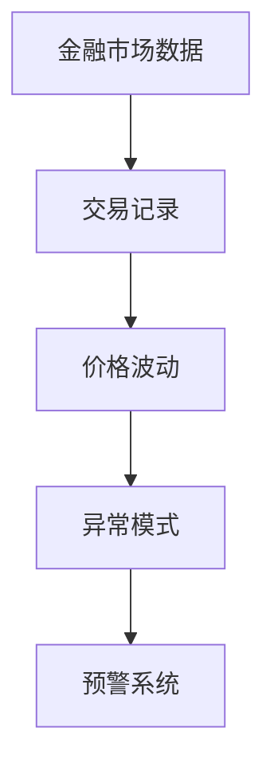
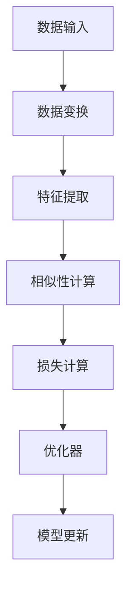
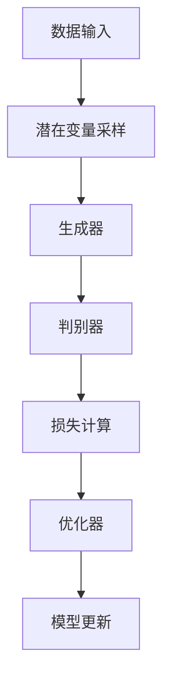
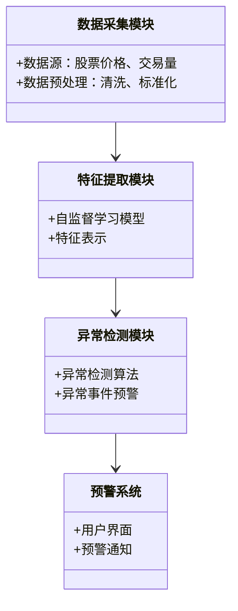
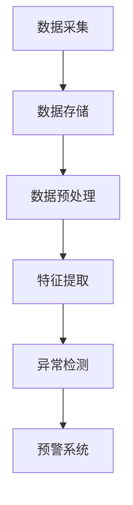
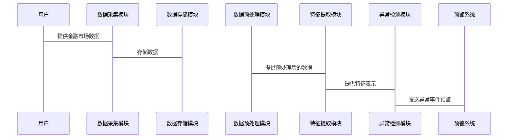

                 


# 金融领域自监督学习在市场异常模式早期识别中的应用

> 关键词：自监督学习，金融市场，异常模式识别，深度学习，金融数据分析

> 摘要：本文探讨自监督学习在金融市场异常模式早期识别中的应用，分析其核心原理和算法，结合系统设计与项目实战，展示如何利用自监督学习技术有效识别金融市场中的异常模式，实现早期预警。

---

# 第一部分: 金融领域自监督学习背景与基础

## 第1章: 金融市场与异常模式识别概述

### 1.1 金融市场现状与挑战

金融市场是现代经济的核心，其复杂性和不确定性对投资者和监管机构提出了巨大挑战。传统金融分析依赖于历史数据和统计模型，但在面对非线性、噪声干扰和复杂市场行为时，这些方法往往显得力不从心。

#### 1.1.1 金融市场的复杂性与不确定性
金融市场受多种因素影响，包括宏观经济指标、政策变化、市场情绪等。这些因素相互作用，导致市场价格波动剧烈且不可预测。传统的统计方法难以捕捉复杂的市场动态，尤其是在高频交易和大数据时代，市场数据量剧增，传统的线性模型显得过于简单。

#### 1.1.2 传统金融分析的局限性
传统金融分析主要依赖回归分析、时间序列分析等方法。这些方法在处理非线性关系和高维数据时表现不佳，尤其是在面对异常事件（如市场崩盘、闪崩）时，传统方法往往无法及时捕捉和预警。

#### 1.1.3 异常模式识别的必要性
金融市场中的异常模式识别对于风险管理和投资决策至关重要。例如，识别市场操纵、欺诈行为或潜在的市场崩盘信号，可以为投资者和监管机构提供及时预警，避免重大损失。

### 1.2 自监督学习的背景与意义

自监督学习（Self-supervised Learning）是一种无需大量标注数据的无监督学习方法，通过利用数据本身的结构信息进行自我监督。其核心思想是通过预测部分数据来学习有用的特征表示。

#### 1.2.1 自监督学习的基本概念
自监督学习通过构建 pretext tasks（预设任务）来学习数据的特征表示。例如，在自然语言处理中，可以通过删除部分单词并要求模型重建这些单词来学习词向量。自监督学习的优势在于，它可以在无标注数据上进行，从而减少对标注数据的依赖。

#### 1.2.2 自监督学习在金融领域的优势
在金融领域，标注数据通常昂贵且难以获取。例如，识别市场异常模式可能需要专家标注的异常事件数据，这在实际中难以实现。自监督学习可以通过利用市场数据的内在结构，从无标注数据中学习有用的特征，从而降低对标注数据的依赖。

#### 1.2.3 自监督学习与监督学习的对比
| 特性                | 监督学习                   | 自监督学习                 |
|---------------------|---------------------------|---------------------------|
| 数据需求            | 需要大量标注数据           | 利用无标注数据进行学习     |
| 灵活性              | 对标注数据依赖较高         | 对标注数据依赖较低         |
| 适用场景            | 适用于明确分类任务         | 适用于特征学习和无监督任务   |

### 1.3 问题背景与目标

#### 1.3.1 市场异常模式的定义与分类
市场异常模式通常指偏离正常市场行为的事件，例如价格剧烈波动、交易量突增等。这些异常模式可能由多种因素引起，如市场操纵、突发事件或技术故障。

#### 1.3.2 问题解决的核心目标
本文的核心目标是利用自监督学习技术，从金融市场数据中提取有用的特征，并识别潜在的异常模式，从而实现早期预警。

#### 1.3.3 边界与外延
本文主要关注基于自监督学习的异常模式识别，但不涉及具体的交易策略或风险管理措施。我们的目标是提供一种技术手段，帮助投资者和监管机构更好地识别和应对市场异常。

---

## 第2章: 自监督学习的核心概念与联系

### 2.1 自监督学习的原理与机制

#### 2.1.1 正则化自监督学习
正则化自监督学习通过引入正则化项来约束模型的预测结果，从而迫使模型学习有用的特征表示。例如，在图像领域，可以通过旋转图像并要求模型预测旋转角度来学习图像特征。

#### 2.1.2 对比学习
对比学习通过将同一数据的不同变换视为正样本对，并最大化其相似性，从而学习数据的特征表示。这种方法在自然语言处理和图像领域表现出色。

#### 2.1.3 生成式自监督学习
生成式自监督学习通过生成模型（如GAN、VAE）来学习数据的特征表示。例如，可以通过生成图像并要求模型区分真实图像和生成图像来学习图像特征。

### 2.2 核心概念对比分析

#### 2.2.1 不同自监督学习方法的对比表格
| 方法               | 特点                     | 优缺点                   |
|--------------------|--------------------------|--------------------------|
| 正则化自监督学习    | 通过正则化项约束预测结果  | 实现简单，但效果有限       |
| 对比学习            | 基于对比最大化相似性      | 表现优秀，但计算复杂       |
| 生成式自监督学习    | 基于生成模型             | 效果显著，但实现复杂       |

#### 2.2.2 ER实体关系图架构


### 2.3 金融场景中的自监督学习应用

#### 2.3.1 数据特征提取
自监督学习可以通过预设任务从金融市场数据中提取有用的特征，例如通过预测未来的价格波动来学习价格特征。

#### 2.3.2 异常检测与预测
通过自监督学习，可以训练模型识别正常市场行为，并检测偏离正常行为的异常模式。

#### 2.3.3 交易策略优化
自监督学习可以帮助优化交易策略，例如通过预测市场趋势来指导投资决策。

---

## 第3章: 自监督学习算法原理与实现

### 3.1 对比学习算法原理

#### 3.1.1 对比学习的核心思想
对比学习通过将同一数据的不同变换视为正样本对，并最大化其相似性，从而学习数据的特征表示。

#### 3.1.2 对比学习的数学模型
$$ L = -\log \frac{e^{sim(x_i, x_j)}}{e^{sim(x_i, x_k)} + e^{sim(x_j, x_k)}}} $$
其中，$sim$ 表示相似性度量。

#### 3.1.3 对比学习的实现步骤


#### 3.1.4 对比学习的代码实现
```python
import torch
import torch.nn as nn

class ContrastiveLoss(nn.Module):
    def __init__(self, temperature=0.1):
        super(ContrastiveLoss, self).__init__()
        self.temperature = temperature

    def forward(self, features, labels):
        # 计算正样本对
        positives = features[::2] * features[1::2]
        positives_sum = torch.sum(positives, dim=1)
        # 计算负样本对
        negatives = features[:, None] - features
        negatives = negatives[~torch.eye(*negatives.shape, dtype=bool)]
        negatives_sum = torch.sum(negatives, dim=1)
        # 计算损失
        loss = -torch.mean(torch.log(positives_sum / (positives_sum + negatives_sum)))
        return loss
```

### 3.2 生成式自监督学习算法原理

#### 3.2.1 生成式模型的核心思想
生成式模型（如GAN、VAE）通过生成数据来学习数据的特征表示。

#### 3.2.2 生成式模型的数学模型
$$ G(x) = \argmax_{z} P(x|z) $$
其中，$G$ 是生成器，$z$ 是潜在变量。

#### 3.2.3 生成式模型的实现步骤


#### 3.2.4 生成式模型的代码实现
```python
import torch
import torch.nn as nn

class Generator(nn.Module):
    def __init__(self, latent_dim, hidden_dim):
        super(Generator, self).__init__()
        self.fc = nn.Linear(latent_dim, hidden_dim)
        self.relu = nn.ReLU()

    def forward(self, z):
        x = self.fc(z)
        x = self.relu(x)
        return x

class Discriminator(nn.Module):
    def __init__(self, hidden_dim, output_dim):
        super(Discriminator, self).__init__()
        self.fc = nn.Linear(hidden_dim, output_dim)
        self.sigmoid = nn.Sigmoid()

    def forward(self, x):
        x = self.fc(x)
        x = self.sigmoid(x)
        return x
```

---

## 第4章: 系统分析与架构设计方案

### 4.1 问题场景介绍

#### 4.1.1 金融市场数据特点
金融市场数据具有高维性、时序性、噪声多等特点。

#### 4.1.2 异常模式识别的挑战
识别异常模式需要处理数据的稀疏性和复杂性，同时需要实时性。

### 4.2 项目介绍

#### 4.2.1 项目目标
开发一个基于自监督学习的金融市场异常模式识别系统。

#### 4.2.2 项目范围
涵盖数据采集、特征提取、异常检测和预警系统。

### 4.3 系统功能设计

#### 4.3.1 领域模型（类图）


#### 4.3.2 系统架构图


#### 4.3.3 接口设计
系统提供以下接口：
- 数据输入接口：接收金融市场数据
- 模型训练接口：训练自监督学习模型
- 异常检测接口：实时检测异常模式
- 预警接口：发送异常事件预警通知

#### 4.3.4 交互流程


---

## 第5章: 项目实战

### 5.1 环境安装

#### 5.1.1 安装依赖
```bash
pip install numpy pandas scikit-learn torch matplotlib
```

### 5.2 系统核心实现源代码

#### 5.2.1 数据预处理代码
```python
import pandas as pd
import numpy as np

def load_data(filename):
    data = pd.read_csv(filename)
    return data

def preprocess(data):
    # 数据清洗
    data = data.dropna()
    # 标准化
    from sklearn.preprocessing import StandardScaler
    scaler = StandardScaler()
    data_scaled = scaler.fit_transform(data)
    return data_scaled
```

#### 5.2.2 自监督学习模型实现
```python
import torch
import torch.nn as nn

class SelfSupervisedModel(nn.Module):
    def __init__(self, input_dim, hidden_dim):
        super(SelfSupervisedModel, self).__init__()
        self.encoder = nn.Sequential(
            nn.Linear(input_dim, hidden_dim),
            nn.ReLU()
        )
        self.decoder = nn.Sequential(
            nn.Linear(hidden_dim, input_dim),
            nn.Sigmoid()
        )

    def forward(self, x):
        encoded = self.encoder(x)
        decoded = self.decoder(encoded)
        return decoded
```

#### 5.2.3 异常检测代码
```python
import torch
import torch.nn as nn

class AnomalyDetector(nn.Module):
    def __init__(self, input_dim, hidden_dim):
        super(AnomalyDetector, self).__init__()
        self.model = SelfSupervisedModel(input_dim, hidden_dim)
        self.criterion = nn.MSELoss()

    def forward(self, x):
        reconstructed = self.model(x)
        loss = self.criterion(x, reconstructed)
        return loss
```

#### 5.2.4 预警系统实现
```python
import time

def send_alert(message):
    print(f"Alert: {message}")
    time.sleep(1)
    print("Alert sent successfully")

# 示例预警
alert_message = "Market anomaly detected!"
send_alert(alert_message)
```

### 5.3 代码应用解读与分析

#### 5.3.1 数据预处理
数据预处理是自监督学习的关键步骤。通过清洗和标准化数据，可以提高模型的训练效果。

#### 5.3.2 自监督学习模型
自监督学习模型通过编码器-解码器结构，从数据中学习有用的特征表示。编码器将输入数据映射到潜在空间，解码器将潜在空间的数据还原为原始数据。

#### 5.3.3 异常检测
异常检测模块通过计算原始数据和重建数据之间的损失，判断是否存在异常。损失越大，异常可能性越高。

#### 5.3.4 预警系统
预警系统通过预设阈值，判断异常检测模块的输出是否超过阈值。如果超过阈值，触发预警通知。

### 5.4 实际案例分析与详细讲解

#### 5.4.1 数据准备
我们以某股票的历史价格数据为例，数据包括开盘价、收盘价、最高价、最低价、成交量等。

#### 5.4.2 模型训练
通过自监督学习模型，对股票价格数据进行特征提取，训练模型识别正常市场行为。

#### 5.4.3 异常检测
在测试阶段，模型对新数据进行重建，并计算重建损失。当重建损失超过阈值时，触发异常检测。

#### 5.4.4 预警系统
当检测到异常时，系统发送预警通知，提醒投资者和监管机构注意潜在风险。

### 5.5 项目小结

通过自监督学习技术，我们可以有效识别金融市场中的异常模式，实现早期预警。本文通过详细分析自监督学习的核心概念和算法，结合实际项目案例，展示了如何在金融领域应用自监督学习技术。

---

## 第6章: 最佳实践、小结、注意事项与拓展阅读

### 6.1 最佳实践 tips
- 数据预处理是自监督学习的关键，确保数据质量。
- 选择合适的自监督学习方法，根据具体场景调整参数。
- 定期更新模型，保持其对市场变化的适应性。

### 6.2 小结
本文详细探讨了自监督学习在金融市场异常模式识别中的应用，分析了其核心原理和算法，并通过实际项目案例展示了其应用效果。自监督学习作为一种无需大量标注数据的学习方法，为金融市场异常模式识别提供了新的思路。

### 6.3 注意事项
- 自监督学习模型的训练需要大量计算资源，需合理配置硬件。
- 异常检测阈值的设置需要根据具体场景调整。
- 需要定期更新模型，以适应市场变化。

### 6.4 拓展阅读
- 学习更多自监督学习方法，如对比学习、生成式模型。
- 探索自监督学习在其他金融任务中的应用，如信用评估、风险管理。

---

# 作者：AI天才研究院/AI Genius Institute & 禅与计算机程序设计艺术 /Zen And The Art of Computer Programming

