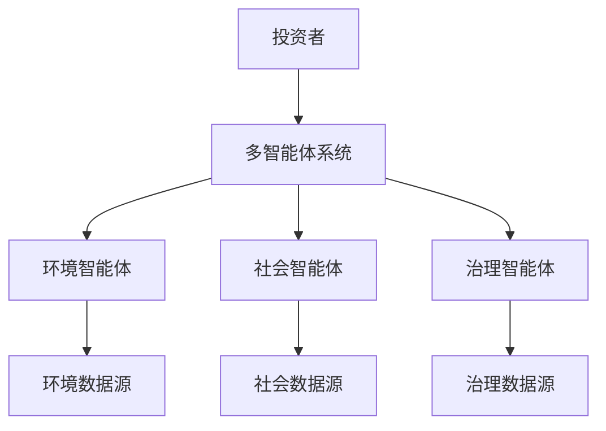

                 


# AI多智能体在价值投资中的ESG因素分析

## 关键词：
AI多智能体，ESG因素，价值投资，环境、社会、治理，投资决策

## 摘要：
本文探讨了如何利用AI多智能体技术在价值投资中分析环境、社会和治理（ESG）因素。通过多智能体系统，投资者可以更全面地评估企业价值，将ESG因素纳入决策过程，实现可持续投资目标。文章从背景、概念、算法、系统设计、实战案例到最佳实践，全面解析了AI多智能体在ESG分析中的应用。

---

## 第一部分：AI多智能体在价值投资中的ESG因素分析背景介绍

### 第1章：ESG概念与价值投资的结合

#### 1.1 ESG概念的定义与演进
##### 1.1.1 环境（Environmental）因素
环境因素关注企业在环境保护方面的表现，包括碳排放、能源使用效率、可持续资源利用等。随着全球气候变化问题的加剧，环境因素在投资决策中的重要性日益凸显。

##### 1.1.2 社会（Social）因素
社会因素关注企业在社会层面的贡献和责任，包括员工权益、社会责任、劳动条件、社区关系等。企业是否关注员工福利、公平对待供应商以及积极参与社会公益项目，都是衡量社会因素的重要指标。

##### 1.1.3 治理（Governance）因素
治理因素关注企业的管理和治理结构，包括董事会构成、管理层透明度、内部控制、反腐败措施等。良好的公司治理是企业长期稳定发展的基石，也是投资者关注的重点。

#### 1.2 多智能体系统在投资分析中的应用
##### 1.2.1 多智能体系统的定义
多智能体系统（Multi-Agent System, MAS）是由多个智能体组成的系统，每个智能体具有自主性、反应性、社会性和协作性。在投资分析中，每个智能体可以专注于不同的任务，如数据采集、特征提取、模型训练等。

##### 1.2.2 多智能体系统与投资分析的结合
多智能体系统能够通过分布式计算和协作学习，提高投资分析的效率和准确性。多个智能体可以分别处理不同的数据源和分析任务，最终协同得出综合结论。

##### 1.2.3 多智能体系统在ESG分析中的优势
多智能体系统能够同时处理海量的ESG数据，从不同维度进行分析，并将结果整合为一个统一的评估体系。这种分布式计算方式能够提高分析的效率和准确性，同时降低单点故障风险。

#### 1.3 价值投资与ESG因素的结合
##### 1.3.1 传统价值投资的定义与特点
价值投资是一种投资策略，强调以低于市场价值的价格买入优质资产。传统价值投资注重企业的基本面分析，如盈利能力、财务状况、市场地位等。

##### 1.3.2 ESG因素在价值投资中的重要性
随着社会对可持续发展的关注增加，投资者逐渐意识到ESG因素对企业长期价值的影响。将ESG因素纳入价值投资的决策过程，可以帮助投资者识别那些不仅财务表现良好，而且在社会责任和环境保护方面表现优异的企业。

##### 1.3.3 多智能体系统如何辅助价值投资
多智能体系统可以通过协同工作，分别从环境、社会和治理三个维度进行分析，并将结果整合为一个综合的ESG评分。投资者可以根据评分结果，筛选出符合价值投资标准的优质企业。

---

### 第2章：ESG分析的演进与现状

#### 2.1 ESG分析的历史发展
##### 2.1.1 ESG概念的起源
ESG概念起源于20世纪60年代的环境运动和社会责任投资（SRI）运动。早期的SRI主要关注企业的社会责任和道德行为。

##### 2.1.2 ESG分析的发展阶段
随着全球化的推进和环境问题的加剧，ESG分析从早期的简单筛选逐步发展为一种系统化的投资策略。近年来，随着大数据和人工智能技术的进步，ESG分析的深度和广度都有了显著提升。

##### 2.1.3 当前ESG分析的主要趋势
当前，ESG分析越来越受到机构投资者的关注。越来越多的投资者将ESG因素纳入投资决策过程，并通过多智能体系统等技术手段提高分析的效率和准确性。

#### 2.2 多智能体系统在金融领域的应用现状
##### 2.2.1 多智能体系统在金融分析中的应用案例
目前，多智能体系统已经在金融领域得到了广泛应用。例如，一些机构利用多智能体系统进行实时市场监控、风险评估和投资组合优化。

##### 2.2.2 当前ESG分析中的技术挑战
尽管ESG分析的重要性日益增加，但在实际应用中仍然面临一些技术挑战，如数据稀缺性、信息不对称和模型复杂性。

##### 2.2.3 多智能体系统在ESG分析中的潜力
多智能体系统在ESG分析中的潜力巨大。通过分布式计算和协作学习，多智能体系统可以更高效地处理复杂的数据和信息，为投资者提供更精准的ESG评分。

#### 2.3 价值投资中的ESG因素分析现状
##### 2.3.1 传统价值投资中的ESG因素
传统价值投资在一定程度上忽视了ESG因素，主要关注企业的财务表现和市场地位。

##### 2.3.2 现代价值投资中的ESG因素
随着社会对可持续发展的关注增加，现代价值投资越来越重视ESG因素。越来越多的投资者开始将ESG评分作为投资决策的重要依据。

##### 2.3.3 ESG因素对投资决策的影响
ESG因素对投资决策的影响主要体现在风险控制和长期收益上。企业如果在ESG方面表现优异，通常具有更强的抗风险能力和更高的长期收益潜力。

---

## 第二部分：AI多智能体在ESG分析中的核心概念与联系

### 第3章：多智能体系统与ESG分析的核心概念

#### 3.1 多智能体系统的核心原理
##### 3.1.1 多智能体系统的定义与特点
多智能体系统由多个智能体组成，每个智能体具有自主性、反应性、社会性和协作性。多个智能体协同工作，能够完成复杂的任务。

##### 3.1.2 多智能体系统的组成部分
多智能体系统通常包括以下几个组成部分：
- 智能体：负责具体任务的执行。
- 环境：智能体所处的外部环境，包括数据源、市场信息等。
- 通信机制：智能体之间进行信息交换的渠道。
- 协作协议：智能体之间协同工作的规则和协议。

##### 3.1.3 多智能体系统与传统单智能体系统的区别
与传统单智能体系统相比，多智能体系统具有分布式计算、协作学习和容错性更强的特点。这些特点使得多智能体系统在复杂任务中表现更优。

#### 3.2 ESG分析的核心要素
##### 3.2.1 环境因素的核心要素
环境因素的核心要素包括碳排放、能源使用效率、资源利用效率等。

##### 3.2.2 社会因素的核心要素
社会因素的核心要素包括员工权益、社会责任、社区关系等。

##### 3.2.3 治理因素的核心要素
治理因素的核心要素包括董事会构成、管理层透明度、内部控制等。

#### 3.3 多智能体系统在ESG分析中的应用原理
##### 3.3.1 多智能体系统如何处理ESG数据
多智能体系统可以分别从环境、社会和治理三个维度进行数据采集和分析。每个智能体负责一个维度的分析任务，最终将结果整合为一个综合的ESG评分。

##### 3.3.2 多智能体系统在ESG分析中的协作机制
多智能体系统通过协作机制，将不同维度的分析结果进行整合。协作机制可以采用加权平均、投票机制等方式，确保综合评分的准确性和公正性。

##### 3.3.3 多智能体系统在ESG分析中的优势
多智能体系统在ESG分析中的优势主要体现在高效性、准确性和协作性上。通过分布式计算和协作学习，多智能体系统能够更高效地处理复杂的数据和信息。

---

## 第4章：多智能体系统与ESG分析的关联

### 4.1 多智能体系统与ESG分析的核心联系
多智能体系统通过分布式计算和协作学习，能够高效地处理ESG数据，并生成综合的ESG评分。这种评分可以作为投资者进行价值投资的重要依据。

### 4.2 多智能体系统在ESG分析中的具体应用
多智能体系统可以在以下几个方面具体应用于ESG分析：
- 数据采集与处理：智能体从不同数据源采集环境、社会和治理相关的数据，并进行清洗和预处理。
- 特征提取与建模：智能体从清洗后的数据中提取特征，并构建预测模型。
- 综合评分与决策：智能体将不同维度的分析结果进行整合，生成综合的ESG评分，并为投资者提供决策建议。

### 4.3 多智能体系统在ESG分析中的协作流程
多智能体系统在ESG分析中的协作流程通常包括以下几个步骤：
1. 数据采集：智能体从不同数据源采集环境、社会和治理相关的数据。
2. 数据清洗：智能体对采集到的数据进行清洗和预处理。
3. 特征提取：智能体从清洗后的数据中提取特征。
4. 模型训练：智能体基于提取的特征进行模型训练。
5. 结果整合：智能体将不同维度的分析结果进行整合，生成综合的ESG评分。
6. 决策支持：智能体为投资者提供基于ESG评分的决策建议。

---

## 第5章：多智能体系统在ESG分析中的算法原理

### 5.1 多智能体系统的算法原理
多智能体系统的算法原理包括以下几个方面：
- 分布式计算：智能体通过分布式计算完成任务。
- 协作学习：智能体通过协作学习提高分析的准确性。
- 信息共享：智能体之间通过信息共享实现协同工作。

### 5.2 ESG分析的算法原理
ESG分析的算法原理包括以下几个方面：
- 数据预处理：对采集到的数据进行清洗和标准化处理。
- 特征提取：从数据中提取有助于预测的特征。
- 模型训练：基于提取的特征训练预测模型。
- 结果整合：将不同维度的分析结果进行整合，生成综合的ESG评分。

### 5.3 多智能体系统与ESG分析的协同算法
多智能体系统与ESG分析的协同算法通常包括以下几个步骤：
1. 数据分配：将数据分配给不同的智能体进行处理。
2. 特征提取：每个智能体从分配的数据中提取特征。
3. 模型训练：每个智能体基于提取的特征进行模型训练。
4. 结果整合：将所有智能体的分析结果进行整合，生成综合的ESG评分。
5. 决策支持：基于综合评分为投资者提供决策建议。

---

## 第三部分：AI多智能体在ESG分析中的系统设计与实现

### 第6章：系统分析与架构设计

#### 6.1 问题场景介绍
在价值投资中，投资者需要综合考虑企业的财务表现、市场地位、社会责任和治理结构等因素。传统的价值投资方法在分析ESG因素时存在效率低下、信息不对称和分析深度不足等问题。

#### 6.2 系统功能设计
##### 6.2.1 领域模型设计
领域模型是系统设计的重要组成部分。在ESG分析中，领域模型需要包括环境、社会和治理三个维度的相关实体和关系。

##### 6.2.2 系统架构设计
系统架构设计需要考虑多智能体系统的分布式计算和协作学习特点。系统架构通常包括数据层、计算层和决策层三个部分。

##### 6.2.3 系统接口设计
系统接口设计需要考虑智能体之间的信息共享和协同工作。通常需要设计智能体之间的通信接口和数据交换格式。

#### 6.3 系统架构图


#### 6.4 系统交互流程
##### 6.4.1 信息采集与处理
投资者通过多智能体系统采集环境、社会和治理相关的数据，并进行清洗和预处理。

##### 6.4.2 分析与建模
环境智能体、社会智能体和治理智能体分别从不同维度进行分析和建模。

##### 6.4.3 结果整合与决策支持
多智能体系统将不同维度的分析结果进行整合，生成综合的ESG评分，并为投资者提供决策建议。

---

### 第7章：项目实战与代码实现

#### 7.1 环境安装与配置
为了实现多智能体系统在ESG分析中的应用，需要安装和配置以下工具和库：
- Python编程语言
- 数据处理库（如Pandas、NumPy）
- 机器学习库（如Scikit-learn、XGBoost）
- 多智能体框架（如Multi-Agent Framework）

#### 7.2 核心代码实现
##### 7.2.1 数据预处理
```python
import pandas as pd
import numpy as np

# 数据加载
df = pd.read_csv('esg_data.csv')

# 数据清洗
df.dropna(inplace=True)
df = df[~df['score'].isnull()]
```

##### 7.2.2 特征提取
```python
from sklearn.feature_selection import SelectKBest
from sklearn.feature_selection import chi2

# 特征选择
selector = SelectKBest(score_func=chi2, k=5)
selector.fit_transform(df.drop('score', axis=1), df['score'])
```

##### 7.2.3 模型训练
```python
from sklearn.ensemble import RandomForestRegressor

# 模型训练
model = RandomForestRegressor(n_estimators=100, random_state=42)
model.fit(X_train, y_train)
```

##### 7.2.4 结果整合
```python
from sklearn.metrics import mean_squared_error

# 结果预测
y_pred = model.predict(X_test)
print(mean_squared_error(y_test, y_pred))
```

#### 7.3 案例分析与结果解读
##### 7.3.1 案例分析
以某公司为例，分析其在环境、社会和治理三个维度的表现，并生成综合的ESG评分。

##### 7.3.2 结果解读
通过多智能体系统的分析，投资者可以更全面地了解该公司的ESG表现，并据此做出投资决策。

#### 7.4 项目小结
通过本项目的实战，我们可以看到多智能体系统在ESG分析中的巨大潜力。通过分布式计算和协作学习，多智能体系统能够高效地处理复杂的数据和信息，为投资者提供更精准的ESG评分。

---

## 第四部分：AI多智能体在ESG分析中的最佳实践

### 第8章：最佳实践与注意事项

#### 8.1 最佳实践
在实际应用中，投资者需要注意以下几点：
- 数据质量：确保数据的准确性和完整性。
- 模型选择：根据具体需求选择合适的模型和算法。
- 系统维护：定期更新数据和模型，确保系统的高效运行。

#### 8.2 注意事项
在实际应用中，需要注意以下几点：
- 数据隐私：确保数据的安全性和隐私性。
- 系统稳定：保证系统的稳定性和容错性。
- 结果解释：确保分析结果的可解释性和透明性。

#### 8.3 拓展阅读
对于有兴趣的读者，可以进一步阅读以下文献：
- 多智能体系统在金融领域的应用
- ESG分析的最新研究
- 人工智能在投资决策中的应用

---

## 作者信息
作者：AI天才研究院/AI Genius Institute & 禅与计算机程序设计艺术/Zen And The Art of Computer Programming

---

通过以上章节的详细讲解，我们可以看到AI多智能体在价值投资中的ESG因素分析具有广阔的应用前景。通过多智能体系统的协作学习和分布式计算，投资者可以更全面地评估企业的ESG表现，实现可持续投资目标。

