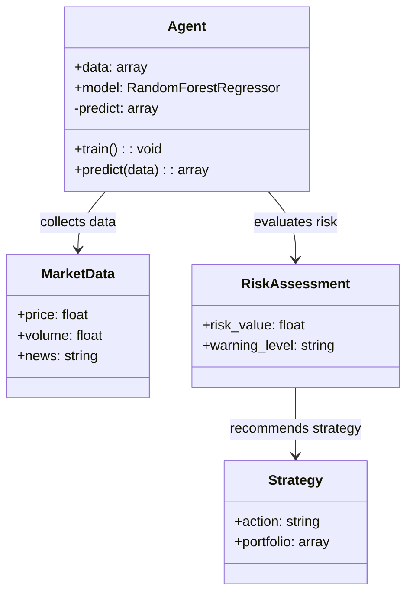
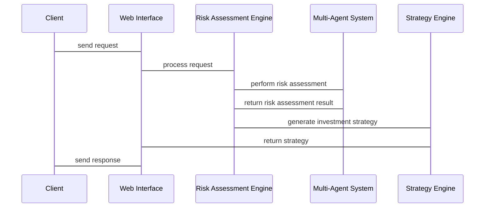

                 


# AI多智能体系统对投资风险的动态评估

> 关键词：AI多智能体系统、投资风险评估、动态评估、金融风险管理、人工智能算法

> 摘要：本文深入探讨了AI多智能体系统在投资风险动态评估中的应用。通过分析多智能体系统的核心原理、投资风险评估的数学模型，以及结合实际案例，本文详细阐述了如何利用多智能体系统提升投资风险评估的准确性和实时性。文章还提供了系统的架构设计和代码实现，为读者提供了从理论到实践的完整指南。

---

# 第一部分: AI多智能体系统与投资风险评估概述

## 第1章: AI多智能体系统与投资风险评估概述

### 1.1 多智能体系统的定义与特点
#### 1.1.1 多智能体系统的定义
多智能体系统（Multi-Agent System, MAS）是由多个相互作用的智能体组成的系统，这些智能体能够通过通信和协作完成复杂的任务。每个智能体都有一定的自主性，能够感知环境并做出决策。

#### 1.1.2 多智能体系统的核心特点
- **分布性**：多个智能体协同工作，而非单一中心化系统。
- **自主性**：智能体能够自主决策，无需外部干预。
- **协作性**：智能体之间通过通信和协作完成共同目标。
- **动态性**：系统能够适应环境的变化，实时调整策略。

#### 1.1.3 多智能体系统与传统单智能体系统的区别
| 特性          | 多智能体系统                    | 单智能体系统                  |
|---------------|-------------------------------|-----------------------------|
| 结构          | 分布式结构                    | 集中式结构                  |
| 智能体数量    | 多个智能体                    | 单个智能体                  |
| 协作方式      | 智能体间协作                  | 单一智能体独立完成任务      |
| 灵活性        | 高，适应性强                  | 较低，适应性有限            |

### 1.2 投资风险评估的基本概念
#### 1.2.1 投资风险的定义
投资风险是指在投资过程中，由于市场波动、经济环境变化等因素，导致投资收益低于预期或出现损失的可能性。

#### 1.2.2 投资风险的主要类型
- **市场风险**：由于市场波动导致的投资损失风险。
- **信用风险**：由于债务人违约导致的损失风险。
- **流动性风险**：资产难以快速变现的风险。
- **操作风险**：由于操作失误或内部管理不当导致的风险。

#### 1.2.3 投资风险评估的重要性
投资风险评估是投资者在做出投资决策前的重要步骤，它帮助投资者识别潜在风险，制定风险管理策略，从而提高投资收益并降低损失。

### 1.3 AI多智能体系统在投资风险评估中的应用前景
#### 1.3.1 AI多智能体系统的优势
- **分布式计算能力**：能够处理大量数据，提高计算效率。
- **协作能力**：多个智能体协同工作，能够从多个角度分析风险。
- **动态适应性**：能够实时调整策略，适应市场变化。

#### 1.3.2 多智能体系统在投资风险评估中的潜在应用场景
- **实时风险监控**：通过多个智能体实时监控市场动态，及时发现潜在风险。
- **风险分散策略**：利用多智能体协作，制定最优的风险分散投资策略。
- **市场预测**：通过分析历史数据和市场趋势，预测未来市场走势，降低投资风险。

#### 1.3.3 当前研究与实践的挑战
- **智能体之间的通信与协作**：如何确保智能体之间的高效通信和协作，是当前研究的难点。
- **数据隐私与安全**：多智能体系统需要处理大量敏感数据，数据隐私和安全问题亟待解决。
- **系统的可扩展性**：随着市场数据的增加，如何保证系统的可扩展性是一个重要挑战。

### 1.4 本章小结
本章介绍了多智能体系统的基本概念和特点，阐述了投资风险评估的重要性和主要类型，并探讨了AI多智能体系统在投资风险评估中的应用前景和面临的挑战。

---

# 第二部分: 多智能体系统与投资风险评估的核心概念

## 第2章: 多智能体系统与投资风险评估的核心概念

### 2.1 多智能体系统的核心原理
#### 2.1.1 多智能体系统的组成要素
- **智能体**：系统的基本单元，具有自主性、反应性和协作性。
- **通信机制**：智能体之间通过通信机制进行信息交换。
- **协作协议**：智能体之间的协作规则和协议。

#### 2.1.2 多智能体系统中的通信与协作机制
- **直接通信**：智能体之间通过消息传递进行直接通信。
- **间接协作**：智能体通过共享信息或环境状态进行协作。

#### 2.1.3 多智能体系统的决策过程
- **分布式决策**：每个智能体根据自己的信息做出决策。
- **集中式决策**：由中心决策者根据所有智能体的信息做出决策。

### 2.2 投资风险评估的数学模型
#### 2.2.1 风险评估的基本数学模型
$$ \text{风险值} = f(\text{资产价值}, \text{市场波动}, \text{信用评级}) $$

#### 2.2.2 常见的风险评估指标
- **方差**：衡量资产收益的波动性。
- **标准差**：衡量资产收益的离散程度。
- **VaR（在险价值）**：衡量在一定置信水平下的潜在损失。

#### 2.2.3 风险评估模型的优缺点对比
| 模型类型   | 优点                     | 缺点                     |
|------------|--------------------------|--------------------------|
| 线性回归模型 | 简单易懂，计算效率高      | 易受数据分布影响，非线性关系表现不佳 |
| 时间序列模型 | 能捕捉时间依赖性         | 需要较长的历史数据，预测精度有限     |
| 随机森林模型 | 高准确性，能够处理非线性关系 | 计算复杂，解释性较差         |

### 2.3 多智能体系统与投资风险评估的结合点
#### 2.3.1 多智能体系统在风险评估中的角色
- **数据收集与处理**：智能体负责收集和处理市场数据。
- **风险分析与预测**：智能体通过协作分析数据，预测潜在风险。
- **风险应对策略**：智能体根据预测结果制定应对策略。

#### 2.3.2 多智能体系统如何提升风险评估的准确性
- **分布式计算**：多个智能体协同计算，提高计算效率。
- **多维度分析**：从多个角度分析风险，提高评估的全面性。
- **动态调整**：根据市场变化实时调整评估模型。

#### 2.3.3 多智能体系统在动态风险评估中的应用
- **实时监控**：智能体实时监控市场动态，及时发现潜在风险。
- **动态调整策略**：根据市场变化动态调整投资策略，降低风险。

### 2.4 本章小结
本章深入探讨了多智能体系统的核心原理，分析了投资风险评估的数学模型，并探讨了多智能体系统在投资风险评估中的应用和优势。

---

# 第三部分: 多智能体系统在投资风险评估中的算法原理

## 第3章: 多智能体系统在投资风险评估中的算法原理

### 3.1 多智能体协同学习算法
#### 3.1.1 多智能体协同学习的基本原理
多智能体协同学习是一种分布式机器学习方法，多个智能体通过协作完成学习任务。

#### 3.1.2 基于强化学习的多智能体协作
- **强化学习**：智能体通过与环境互动，学习最优策略。
- **多智能体强化学习**：多个智能体通过协作，共同学习最优策略。

#### 3.1.3 多智能体协作中的通信与协调机制
- **直接通信**：智能体之间通过消息传递进行通信。
- **间接协作**：智能体通过共享信息或环境状态进行协作。

#### 3.1.4 多智能体协作的数学模型
$$ Q(s, a) = \max_{a'} \sum_{i=1}^{n} Q_i(s, a_i) $$

### 3.2 投资风险评估的数学模型与公式
#### 3.2.1 风险评估的线性回归模型
$$ \text{风险值} = \beta_0 + \beta_1 \times \text{资产价值} + \beta_2 \times \text{市场波动} + \epsilon $$

#### 3.2.2 风险评估的随机森林模型
随机森林通过集成多个决策树模型，提高预测精度。

### 3.3 基于多智能体系统的投资风险评估算法
#### 3.3.1 算法流程
1. 初始化多个智能体。
2. 每个智能体收集市场数据。
3. 智能体通过通信机制共享数据。
4. 多智能体协同学习，预测投资风险。
5. 根据预测结果制定风险应对策略。

#### 3.3.2 算法实现
```python
import numpy as np
from sklearn.ensemble import RandomForestRegressor

class Agent:
    def __init__(self, data):
        self.data = data
        self.model = RandomForestRegressor(n_estimators=100)
    
    def train(self):
        self.model.fit(self.data, target)
    
    def predict(self, input_data):
        return self.model.predict(input_data)

# 初始化多个Agent
agents = [Agent(data1), Agent(data2), Agent(data3)]
# 训练模型
for agent in agents:
    agent.train()
# 预测风险
input_data = ...
predictions = [agent.predict(input_data) for agent in agents]
```

### 3.4 本章小结
本章详细讲解了多智能体协同学习算法在投资风险评估中的应用，介绍了算法的实现步骤和代码示例，为后续的系统设计和项目实战奠定了基础。

---

# 第四部分: 系统分析与架构设计方案

## 第4章: 系统分析与架构设计方案

### 4.1 问题场景介绍
投资市场中，投资者需要实时监控市场动态，及时发现潜在风险，并制定相应的投资策略。传统的单智能体系统难以满足实时性和高准确性的要求，而多智能体系统能够通过协作提高评估的准确性和实时性。

### 4.2 系统功能设计
#### 4.2.1 功能模块
- **数据采集模块**：收集市场数据，如股票价格、交易量等。
- **风险评估模块**：基于多智能体系统，评估投资风险。
- **风险预警模块**：根据评估结果，发出风险预警信号。
- **策略制定模块**：根据风险评估结果，制定投资策略。

#### 4.2.2 领域模型（Mermaid类图）


### 4.3 系统架构设计
#### 4.3.1 系统架构（Mermaid架构图）
```mermaid
archi
    title Investment Risk Assessment System
    client --> Web Interface: sends request
    Web Interface --> Risk Assessment Engine: processes request
    Risk Assessment Engine --> Database: queries historical data
    Risk Assessment Engine --> Multi-Agent System: performs risk assessment
    Multi-Agent System --> Market Data Feeds: collects real-time data
    Risk Assessment Engine --> Strategy Engine: generates investment strategy
    Strategy Engine --> Web Interface: returns result
```

### 4.4 系统接口设计
#### 4.4.1 接口描述
- **输入接口**：市场数据接口、用户请求接口。
- **输出接口**：风险评估结果接口、投资策略接口。

#### 4.4.2 接口交互流程图（Mermaid序列图）


### 4.5 系统稳定性与可扩展性
- **稳定性**：通过冗余设计和错误恢复机制，确保系统的稳定性。
- **可扩展性**：采用微服务架构，支持系统的横向扩展。

### 4.6 本章小结
本章分析了系统的功能模块和架构设计，通过Mermaid图展示了系统的整体架构和接口交互流程，为后续的项目实施提供了指导。

---

# 第五部分: 项目实战

## 第5章: 项目实战

### 5.1 项目背景
本项目旨在利用多智能体系统对股票市场的投资风险进行动态评估，帮助投资者制定最优的投资策略。

### 5.2 环境安装
#### 5.2.1 安装Python
```bash
# 安装Python
sudo apt-get install python3 python3-pip
```

#### 5.2.2 安装依赖库
```bash
pip install numpy pandas scikit-learn matplotlib
```

### 5.3 系统核心实现
#### 5.3.1 数据预处理
```python
import pandas as pd
data = pd.read_csv('market_data.csv')
data.dropna(inplace=True)
data['date'] = pd.to_datetime(data['date'])
```

#### 5.3.2 模型训练与预测
```python
from sklearn.ensemble import RandomForestRegressor
model = RandomForestRegressor(n_estimators=100)
model.fit(X_train, y_train)
 predictions = model.predict(X_test)
```

#### 5.3.3 风险评估与预警
```python
def calculate-risk-score(data):
    # 计算风险评分
    return np.mean(data['returns'] < 0)

risk_score = calculate-risk-score(predictions)
if risk_score > 0.05:
    print("高风险预警")
else:
    print("低风险")
```

### 5.4 项目小结
本章通过具体案例展示了多智能体系统在投资风险评估中的应用，详细讲解了项目环境的搭建、数据预处理、模型训练与预测，以及风险评估与预警的实现过程。

---

# 第六部分: 总结与展望

## 第6章: 总结与展望

### 6.1 本项目总结
本项目通过多智能体系统对投资风险进行了动态评估，验证了多智能体系统在投资风险评估中的优势。系统的实现不仅提高了风险评估的准确性，还能够实时调整策略，适应市场变化。

### 6.2 应用注意事项
- **数据质量**：确保数据的准确性和完整性。
- **模型鲁棒性**：选择合适的算法，提高模型的鲁棒性。
- **系统稳定性**：通过冗余设计和错误恢复机制，确保系统的稳定性。

### 6.3 未来展望
- **算法优化**：研究更高效的多智能体协作算法，提高系统的计算效率。
- **应用场景扩展**：将多智能体系统应用于更多的金融领域，如外汇交易、基金投资等。
- **数据隐私保护**：研究数据隐私保护技术，确保系统的安全性。

### 6.4 本章小结
本章总结了项目的实现过程和成果，提出了应用中的注意事项，并展望了未来的研究方向。

---

# 作者：AI天才研究院/AI Genius Institute & 禅与计算机程序设计艺术 /Zen And The Art of Computer Programming

---

以上是《AI多智能体系统对投资风险的动态评估》的技术博客文章的完整目录大纲和内容结构。

