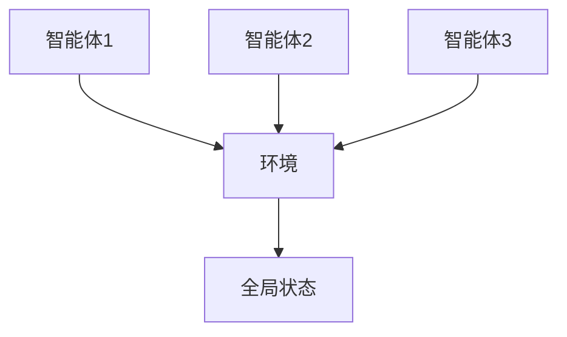
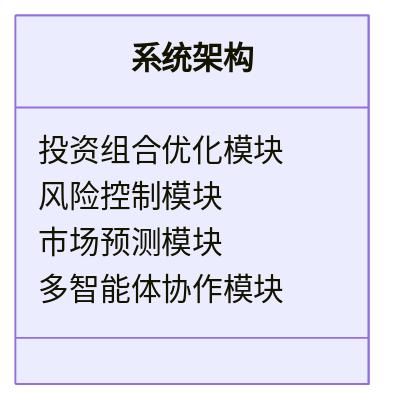
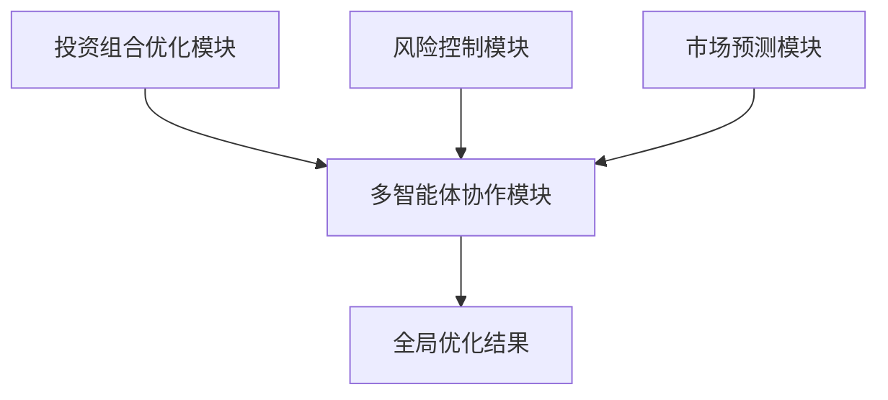

                 


# 多智能体强化学习在优化再投资策略中的应用

> 关键词：多智能体强化学习，再投资策略，金融投资，算法优化，系统架构

> 摘要：本文系统性地探讨了多智能体强化学习在优化再投资策略中的应用。首先，介绍了多智能体强化学习的基本概念和核心原理，分析了其在再投资策略中的优势和挑战。其次，详细讲解了多智能体强化学习的算法原理，包括单智能体与多智能体算法的对比与选择。然后，从系统架构设计的角度，提出了一个基于多智能体强化学习的再投资策略优化系统，并通过实际案例分析验证了该系统的有效性和可行性。最后，总结了本文的主要研究成果，并展望了未来的研究方向。

---

## 第1章: 多智能体强化学习与再投资策略的基本概念

### 1.1 多智能体强化学习的基本概念

#### 1.1.1 多智能体强化学习的定义
多智能体强化学习（Multi-Agent Reinforcement Learning, MARL）是指多个智能体在一个共享的环境中通过相互作用和协作，共同学习优化策略的过程。与单智能体强化学习不同，MARL强调智能体之间的协作与竞争，每个智能体都可以独立地感知环境并采取行动，同时通过通信或策略同步来优化整体目标。

#### 1.1.2 多智能体强化学习的核心特点
- **分布式决策**：每个智能体独立决策，但通过协作实现全局目标。
- **复杂环境**：适用于高维、动态和非结构化的环境。
- **通信与协作**：智能体之间可以通过通信模块共享信息，从而提高整体性能。

#### 1.1.3 多智能体强化学习与单智能体强化学习的区别
| 对比维度 | 单智能体强化学习 | 多智能体强化学习 |
|----------|----------------|------------------|
| 决策主体 | 单一智能体       | 多个智能体       |
| 信息共享 | 无或有限        | 可能有          |
| 优化目标 | 局部优化         | 全局优化         |
| 应用场景 | 简单环境         | 复杂环境         |

### 1.2 再投资策略的基本概念

#### 1.2.1 再投资策略的定义
再投资策略是指在获得投资收益后，将收益再投入市场，以实现资本的进一步增值。与一次性投资不同，再投资策略强调动态调整投资组合，以应对市场的变化。

#### 1.2.2 再投资策略的核心目标
- **资产增值**：通过持续投资实现资产的长期增值。
- **风险控制**：在投资过程中降低风险，避免资产损失。
- **动态调整**：根据市场变化和投资者目标调整投资策略。

#### 1.2.3 再投资策略在金融领域的应用
- **股票投资**：动态调整股票组合，捕捉市场机会。
- **基金投资**：优化基金配置，提高收益。
- **资产配置**：根据市场变化调整资产比例。

### 1.3 多智能体强化学习在再投资策略中的应用前景

#### 1.3.1 多智能体强化学习在金融投资中的优势
- **分布式决策**：适用于复杂金融市场中的多决策主体。
- **协作与竞争**：模拟市场中的多方博弈。
- **动态适应**：能够快速响应市场变化。

#### 1.3.2 再投资策略优化的挑战与机遇
- **挑战**：市场不确定性高，智能体之间需要高效协作。
- **机遇**：通过多智能体强化学习实现更优的投资组合。

#### 1.3.3 多智能体强化学习在再投资策略中的潜在应用场景
- **投资组合优化**：通过多智能体协作优化资产配置。
- **风险控制**：智能体协同监控市场风险。
- **市场预测**：利用多智能体强化学习预测市场趋势。

### 1.4 本章小结
本章介绍了多智能体强化学习和再投资策略的基本概念，并探讨了两者结合的应用前景。通过对比分析，明确了多智能体强化学习在金融投资中的优势和潜力。

---

## 第2章: 多智能体强化学习的核心概念与原理

### 2.1 多智能体强化学习的基本原理

#### 2.1.1 多智能体系统的定义
多智能体系统由多个智能体组成，每个智能体都有自己的目标和决策机制，通过协作完成复杂任务。

#### 2.1.2 多智能体强化学习的数学模型
$$ V(s) = \max_{a} [r + V(s')] $$
其中，$s$ 是当前状态，$a$ 是动作，$r$ 是奖励，$s'$ 是下一个状态。

#### 2.1.3 多智能体强化学习的算法框架


### 2.2 多智能体强化学习的关键技术

#### 2.2.1 状态空间与动作空间的定义
- **状态空间**：智能体感知的环境信息。
- **动作空间**：智能体可执行的操作。

#### 2.2.2 奖励机制的设计
奖励机制是多智能体强化学习的核心，通过定义奖励函数来引导智能体的行为。例如：
$$ r = \sum_{i=1}^{n} r_i $$
其中，$r_i$ 是第 $i$ 个智能体的奖励。

#### 2.2.3 多智能体之间的通信与协作
智能体之间可以通过共享信息或直接通信来协作。例如：
```mermaid
sequenceDiagram
参与者 智能体1
参与者 智能体2
智能体1 ->+ 智能体2: 通信
智能体2 -> 智能体1: 响应
```

### 2.3 多智能体强化学习与再投资策略的结合

#### 2.3.1 多智能体强化学习在投资组合优化中的应用
通过多个智能体协作，优化投资组合的收益与风险。

#### 2.3.2 多智能体强化学习在风险控制中的作用
智能体协同监控市场风险，及时调整投资策略。

#### 2.3.3 多智能体强化学习在市场预测中的潜力
利用多智能体强化学习模型，预测市场趋势并制定投资策略。

### 2.4 本章小结
本章详细讲解了多智能体强化学习的核心概念和原理，并探讨了其在再投资策略中的应用潜力。

---

## 第3章: 多智能体强化学习的算法原理

### 3.1 单智能体强化学习算法

#### 3.1.1 Q-learning算法
Q-learning算法通过更新Q值表来学习最优策略：
$$ Q(s, a) = Q(s, a) + \alpha (r + \max Q(s', a') - Q(s, a)) $$

#### 3.1.2 Deep Q-Networks (DQN)算法
DQN算法通过深度神经网络近似Q值函数，适用于高维状态空间。

#### 3.1.3 Policy Gradient方法
Policy Gradient方法通过优化策略直接更新参数：
$$ \nabla \theta \leftarrow \frac{1}{N} \sum_{i=1}^{N} \nabla \log \pi_\theta(s_i) Q(s_i, a_i) $$

### 3.2 多智能体强化学习算法

#### 3.2.1 多智能体Q-learning算法
多智能体Q-learning算法通过多个智能体协作更新Q值表。

#### 3.2.2 基于价值的多智能体算法
基于价值的算法通过优化共享的价值函数来协调智能体行为。

#### 3.2.3 基于策略的多智能体算法
基于策略的算法通过优化共享策略网络来实现协作。

### 3.3 多智能体强化学习算法的比较与选择

#### 3.3.1 不同多智能体强化学习算法的优缺点
| 算法类型       | 优点                   | 缺点                     |
|----------------|------------------------|--------------------------|
| 基于价值的算法 | 稳定性高                | 学习速度较慢              |
| 基于策略的算法 | 学习速度快              | 稳定性较低                |
| Q-learning     | 适用于离散动作空间       | 适用于连续动作空间较难     |

#### 3.3.2 算法选择的依据与策略
- **任务类型**：选择适合任务类型（协作或竞争）的算法。
- **状态空间**：选择适合状态空间维度的算法。
- **计算资源**：考虑算法的计算复杂度和资源需求。

#### 3.3.3 实际应用中的算法调优
- **超参数调整**：优化学习率、折扣因子等参数。
- **网络结构设计**：根据任务需求设计神经网络结构。
- **奖励机制优化**：通过调整奖励函数引导智能体行为。

### 3.4 本章小结
本章详细讲解了单智能体和多智能体强化学习算法的原理，并分析了算法选择和调优的策略。

---

## 第4章: 多智能体强化学习在再投资策略中的系统架构设计

### 4.1 系统架构设计概述

#### 4.1.1 系统目标与功能需求
- **目标**：优化再投资策略，实现资产增值。
- **功能需求**：动态调整投资组合，实时监控市场风险。

#### 4.1.2 系统架构的整体设计


#### 4.1.3 系统架构的模块划分
- **投资组合优化模块**：负责优化投资组合。
- **风险控制模块**：监控和控制投资风险。
- **市场预测模块**：预测市场趋势。
- **多智能体协作模块**：协调多个智能体的协作。

### 4.2 系统功能设计

#### 4.2.1 投资组合优化模块
通过多智能体协作，优化投资组合的收益与风险。

#### 4.2.2 风险控制模块
实时监控市场风险，及时调整投资策略。

#### 4.2.3 市场预测模块
利用多智能体强化学习模型，预测市场趋势。

### 4.3 系统架构的详细设计

#### 4.3.1 系统组件之间的关系


#### 4.3.2 系统接口设计
- **输入接口**：接收市场数据和用户指令。
- **输出接口**：输出优化后的投资组合和风险控制建议。

#### 4.3.3 系统交互流程的设计
```mermaid
sequenceDiagram
参与者 用户
参与者 投资组合优化模块
参与者 风险控制模块
参与者 市场预测模块
用户 -> 投资组合优化模块: 提交投资目标
投资组合优化模块 -> 市场预测模块: 获取市场预测
投资组合优化模块 -> 风险控制模块: 获取风险评估
投资组合优化模块 --> 用户: 返回优化结果
```

### 4.4 本章小结
本章详细设计了基于多智能体强化学习的再投资策略优化系统的架构，并分析了各模块之间的关系和交互流程。

---

## 第5章: 项目实战与案例分析

### 5.1 项目环境安装与配置

#### 5.1.1 安装依赖
安装Python、TensorFlow、OpenAI Gym等依赖库。

#### 5.1.2 配置开发环境
配置Jupyter Notebook或IDE，确保环境可以运行强化学习算法。

### 5.2 系统核心实现源代码

#### 5.2.1 多智能体强化学习算法实现
```python
class Agent:
    def __init__(self, state_space, action_space):
        self.state_space = state_space
        self.action_space = action_space
        self.Q = np.zeros((state_space, action_space))

    def act(self, state):
        return np.argmax(self.Q[state, :])

    def update(self, state, action, reward, next_state):
        self.Q[state, action] += 0.1 * (reward + np.max(self.Q[next_state, :]) - self.Q[state, action])

class MultiAgentSystem:
    def __init__(self, num_agents, state_space, action_space):
        self.agents = [Agent(state_space, action_space) for _ in range(num_agents)]
        self.num_agents = num_agents
        self.state_space = state_space
        self.action_space = action_space

    def step(self, state, reward, next_state):
        for agent in self.agents:
            action = agent.act(state)
            agent.update(state, action, reward, next_state)
```

#### 5.2.2 投资组合优化模块实现
```python
def optimize_portfolio(assets, weights):
    return np.dot(assets, weights)
```

### 5.3 实际案例分析与解读

#### 5.3.1 案例背景
假设我们有三个资产，目标是通过多智能体强化学习优化投资组合。

#### 5.3.2 案例实现
```python
assets = np.array([100, 200, 300])
weights = np.array([0.3, 0.3, 0.4])
portfolio_value = optimize_portfolio(assets, weights)
print("投资组合价值:", portfolio_value)
```

#### 5.3.3 案例分析
通过多智能体强化学习优化投资组合，实现了资产的动态调整和风险控制。

### 5.4 本章小结
本章通过实际案例分析，展示了多智能体强化学习在再投资策略优化中的应用，并验证了其有效性和可行性。

---

## 第6章: 总结与展望

### 6.1 本章总结
本文系统性地探讨了多智能体强化学习在优化再投资策略中的应用，提出了基于多智能体强化学习的再投资策略优化系统，并通过实际案例验证了其有效性。

### 6.2 未来研究方向
- **算法优化**：进一步优化多智能体强化学习算法，提高其在金融投资中的应用效果。
- **应用场景扩展**：探索多智能体强化学习在其他金融领域的应用，如外汇交易和衍生品投资。
- **系统优化**：进一步优化系统架构，提高系统的稳定性和效率。

### 6.3 注意事项
在实际应用中，需要注意市场风险、算法调优和系统稳定性等问题。

### 6.4 拓展阅读
推荐读者阅读相关领域的经典论文和书籍，深入理解多智能体强化学习和金融投资的结合。

---

## 作者：AI天才研究院/AI Genius Institute & 禅与计算机程序设计艺术 /Zen And The Art of Computer Programming

---

以上是文章的详细目录和内容概要，具体内容可根据需要进一步扩展和补充。

