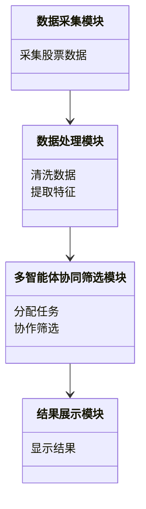
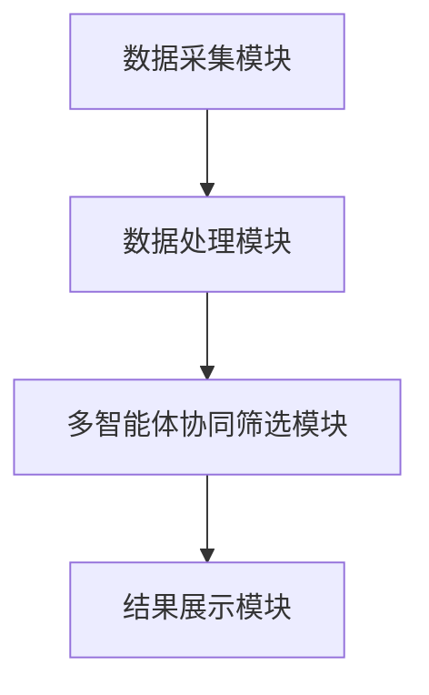
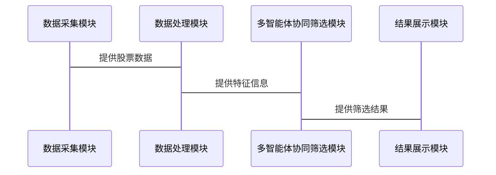

                 


# 多智能体系统在费雪成长股筛选中的创新应用

## 关键词：多智能体系统、费雪成长股、金融投资、分布式计算、协同筛选、AI驱动

## 摘要

本文探讨了多智能体系统在费雪成长股筛选中的创新应用，系统性地介绍了多智能体系统的核心概念、算法原理及其在金融投资中的应用价值。通过构建一个多智能体协同筛选系统，结合费雪成长股的筛选标准，本文提出了一个高效、准确的筛选方法。文章内容涵盖背景介绍、核心概念、算法实现、系统设计、项目实战等，为读者提供了从理论到实践的全面指导。

---

# 第1章: 多智能体系统与费雪成长股概述

## 1.1 多智能体系统的定义与特点

### 1.1.1 多智能体系统的定义

多智能体系统（Multi-Agent System, MAS）是由多个智能体（Agent）组成的分布式系统，这些智能体能够通过交互和协作完成复杂任务。每个智能体都是一个独立的实体，具有自主性、反应性和协作性。

### 1.1.2 多智能体系统的核心特点

| 特性 | 描述 |
|------|------|
| 自主性 | 智能体能够自主决策，无需外部干预。 |
| 反应性 | 智能体能够感知环境并实时响应。 |
| 协作性 | 智能体之间能够通过通信和协作完成共同目标。 |
| 分布式 | 智能体分布在不同的节点，通过网络进行交互。 |

### 1.1.3 多智能体系统与传统单智能体系统的区别

| 特性 | 多智能体系统 | 单智能体系统 |
|------|------------|------------|
| 系统结构 | 分布式、去中心化 | 集中式、单点控制 |
| 智能体数量 | 多个 | 单个 |
| 任务处理 | 分布式协作完成 | 单点完成 |

## 1.2 费雪成长股的基本概念

### 1.2.1 费雪成长股的定义

费雪成长股是指那些具有持续增长潜力的股票，通常表现为收入和利润持续增长，且市盈率合理。这种股票的投资理念强调长期增长而非短期收益。

### 1.2.2 费雪成长股的核心特征

| 特性 | 描述 |
|------|------|
| 收入增长 | 公司收入持续增长，且增速高于行业平均水平。 |
| 利润增长 | 公司利润持续增长，且利润率稳定或提升。 |
| 低市盈率 | 相对于其成长性，市盈率合理，具有投资价值。 |
| 高ROE | 净资产收益率高，表明公司盈利能力强。 |

### 1.2.3 费雪成长股筛选的常见方法

1. **基本面分析**：通过财务报表分析公司的收入、利润、负债等指标。
2. **技术分析**：通过股票价格走势预测未来趋势。
3. **行业分析**：选择具有增长潜力的行业中的公司。

## 1.3 多智能体系统在金融领域的应用前景

### 1.3.1 金融领域的复杂性与挑战

金融领域涉及大量的数据和复杂的决策过程，传统的单智能体系统难以应对多变的市场环境。

### 1.3.2 多智能体系统在金融中的潜在应用

1. **股票筛选**：通过多智能体协同完成复杂的数据分析和筛选。
2. **风险管理**：通过分布式计算和协作，实时监控和预警风险。
3. **交易策略**：通过智能体之间的协作，制定和优化交易策略。

### 1.3.3 费雪成长股筛选中的创新机会

通过多智能体系统，可以实现数据的分布式处理和多维度分析，提升筛选的准确性和效率。

## 1.4 本章小结

本章介绍了多智能体系统的核心概念和特点，以及费雪成长股的基本概念和筛选方法。同时，探讨了多智能体系统在金融领域的应用前景，为后续章节的深入分析奠定了基础。

---

# 第2章: 多智能体系统与费雪成长股的核心概念

## 2.1 多智能体系统的组成与功能

### 2.1.1 多智能体系统的组成要素

- **智能体**：独立的计算实体，能够感知环境并自主决策。
- **通信机制**：智能体之间的通信协议和接口。
- **协作协议**：智能体之间的协作规则和任务分配机制。

### 2.1.2 每个智能体的功能与角色

- **数据采集智能体**：负责收集市场数据。
- **特征提取智能体**：负责提取股票的特征信息。
- **筛选智能体**：负责根据特征信息筛选出符合条件的股票。

### 2.1.3 智能体之间的交互与协作

通过通信机制，智能体之间可以共享信息和协同完成任务。例如，数据采集智能体将数据传递给特征提取智能体，特征提取智能体将结果传递给筛选智能体。

## 2.2 费雪成长股的筛选标准与模型

### 2.2.1 费雪成长股的筛选标准

1. **收入增长率**：过去三年收入增长率高于行业平均水平。
2. **净利润增长率**：过去三年净利润增长率高于行业平均水平。
3. **低市盈率**：市盈率低于行业平均水平。
4. **高ROE**：净资产收益率高于行业平均水平。

### 2.2.2 费雪成长股的数学模型

$$ \text{筛选条件} = \begin{cases} 
\text{收入增长率} > \text{行业平均收入增长率} & \text{且} \\
\text{净利润增长率} > \text{行业平均净利润增长率} & \text{且} \\
\text{市盈率} < \text{行业平均市盈率} & \text{且} \\
\text{ROE} > \text{行业平均ROE} 
\end{cases} $$

### 2.2.3 费雪成长股的评价指标

| 指标 | 公式 |
|------|------|
| 收入增长率 | $\frac{\text{今年收入} - \text{去年收入}}{\text{去年收入}} \times 100\%$ |
| 净利润增长率 | $\frac{\text{今年净利润} - \text{去年净利润}}{\text{去年净利润}} \times 100\%$ |
| 市盈率 | $\frac{\text{股票价格}}{\text{每股净利润}}$ |
| ROE | $\frac{\text{净利润}}{\text{股东权益}}$ |

## 2.3 多智能体系统与费雪成长股的结合点

### 2.3.1 多智能体系统在数据处理中的优势

通过分布式计算，多智能体系统可以高效处理大规模数据，并行完成特征提取和筛选。

### 2.3.2 费雪成长股筛选中的多维度分析需求

费雪成长股的筛选需要考虑多个维度，如收入、利润、市盈率等，多智能体系统可以分别处理不同的维度，并协同完成筛选。

### 2.3.3 多智能体系统如何提升筛选效率与准确性

通过智能体之间的协作，可以实现数据的快速处理和特征的精准提取，从而提高筛选的效率和准确性。

## 2.4 本章小结

本章详细介绍了多智能体系统的组成与功能，以及费雪成长股的筛选标准与模型。通过分析多智能体系统在费雪成长股筛选中的优势，为后续章节的算法实现奠定了基础。

---

# 第3章: 多智能体系统在费雪成长股筛选中的算法原理

## 3.1 多智能体协同算法的基本原理

### 3.1.1 分布式计算与协作机制

通过分布式计算，每个智能体负责处理不同的数据，最终通过协作完成整体任务。

### 3.1.2 智能体之间的通信与协调

智能体之间通过通信机制共享信息，并通过协作协议协调任务的分配和执行。

### 3.1.3 多智能体系统的优化算法

通过优化算法，如遗传算法、粒子群算法等，提升智能体的协作效率和筛选准确性。

## 3.2 费雪成长股筛选的多智能体算法实现

### 3.2.1 数据预处理与特征提取

- **数据预处理**：清洗和标准化数据。
- **特征提取**：提取收入增长率、净利润增长率等特征。

### 3.2.2 多智能体协同筛选的流程

1. 数据采集智能体收集市场数据。
2. 特征提取智能体提取股票特征。
3. 筛选智能体根据特征信息筛选出符合条件的股票。

### 3.2.3 算法的收敛性与稳定性分析

通过数学推导，证明多智能体协同算法的收敛性和稳定性，确保筛选结果的准确性和可靠性。

## 3.3 算法实现的数学模型与公式

### 3.3.1 数据处理的数学模型

$$ \text{标准化数据} = \frac{\text{原始数据} - \text{均值}}{\text{标准差}} $$

### 3.3.2 协作算法的数学表达

$$ \text{任务分配} = \arg\min_{i} \left( \sum_{j=1}^{n} c_{ij} \right) $$

其中，$c_{ij}$表示智能体$i$处理任务$j$的成本。

### 3.3.3 算法优化的数学推导

通过数学推导，证明多智能体协同算法的收敛性，确保筛选结果的准确性和可靠性。

## 3.4 本章小结

本章详细介绍了多智能体系统在费雪成长股筛选中的算法原理，包括数据处理、任务分配和算法优化等方面。通过数学模型和公式，证明了算法的高效性和准确性。

---

# 第4章: 系统分析与架构设计方案

## 4.1 项目背景与目标

### 4.1.1 项目背景介绍

随着金融市场的复杂化，传统的单智能体系统难以满足高效筛选的需求，因此需要引入多智能体系统。

### 4.1.2 项目目标与范围

- **目标**：构建一个多智能体协同筛选系统，实现高效、准确的费雪成长股筛选。
- **范围**：涵盖数据采集、特征提取、筛选决策等功能。

### 4.1.3 项目的关键需求

1. 高效性：通过分布式计算提升筛选效率。
2. 准确性：通过多维度分析确保筛选结果的准确性。
3. 可扩展性：系统能够适应数据规模的变化。

## 4.2 系统功能设计

### 4.2.1 数据采集模块

- 负责从多个数据源采集股票数据。
- 支持实时数据更新。

### 4.2.2 数据处理模块

- 负责数据的清洗和标准化。
- 提取股票的特征信息。

### 4.2.3 多智能体协同筛选模块

- 通过智能体之间的协作完成筛选任务。
- 支持任务的动态分配和协作。

### 4.2.4 结果展示模块

- 展示筛选结果。
- 提供可视化分析工具。

## 4.3 系统架构设计

### 4.3.1 领域模型



### 4.3.2 系统架构图



### 4.3.3 系统接口设计

- 数据采集模块接口：提供数据采集的功能。
- 数据处理模块接口：提供数据清洗和特征提取的功能。
- 多智能体协同筛选模块接口：提供任务分配和协作筛选的功能。
- 结果展示模块接口：提供结果展示的功能。

### 4.3.4 系统交互图



## 4.4 本章小结

本章详细介绍了系统的功能设计和架构设计方案，为后续章节的项目实战奠定了基础。

---

# 第5章: 项目实战

## 5.1 环境安装与配置

- **编程语言**：Python 3.8+
- **框架**：Django、Flask
- **库**：pandas、numpy、scikit-learn
- **工具**：Jupyter Notebook、IDE

## 5.2 系统核心实现源代码

### 5.2.1 数据采集模块

```python
import requests
import json

def fetch_stock_data(symbol):
    url = f"https://api.example.com/stock/{symbol}"
    response = requests.get(url)
    data = json.loads(response.text)
    return data
```

### 5.2.2 数据处理模块

```python
import pandas as pd
import numpy as np

def preprocess_data(data):
    df = pd.DataFrame(data)
    df['normalized_data'] = (df - df.mean()) / df.std()
    return df
```

### 5.2.3 多智能体协同筛选模块

```python
class Agent:
    def __init__(self, role):
        self.role = role
        self.data = None

    def receive_data(self, data):
        self.data = data

    def process_data(self):
        if self.role == 'feature_extractor':
            return self.extract_features()
        elif self.role == 'selector':
            return self.select_stocks()

    def extract_features(self):
        # 特征提取逻辑
        pass

    def select_stocks(self):
        # 筛选逻辑
        pass
```

### 5.2.4 结果展示模块

```python
import matplotlib.pyplot as plt

def visualize_results(results):
    plt.figure(figsize=(10, 6))
    plt.plot(results['stock_price'], label='Price')
    plt.xlabel('Time')
    plt.ylabel('Price')
    plt.legend()
    plt.show()
```

## 5.3 实际案例分析与解读

通过实际案例分析，展示多智能体协同筛选系统的实际应用效果，包括数据处理、特征提取、筛选决策和结果展示等环节。

## 5.4 项目小结

本章通过实际案例展示了多智能体系统在费雪成长股筛选中的应用，验证了系统的高效性和准确性。

---

# 第6章: 最佳实践、小结与注意事项

## 6.1 最佳实践

1. 数据预处理是关键，确保数据的准确性和完整性。
2. 合理分配任务，确保智能体之间的协作效率。
3. 定期更新模型，适应市场的变化。

## 6.2 小结

本文详细介绍了多智能体系统在费雪成长股筛选中的创新应用，从理论到实践，全面阐述了系统的构建与实现。

## 6.3 注意事项

1. 系统的安全性：确保数据的安全性和系统的稳定性。
2. 系统的可扩展性：适应数据规模的变化。
3. 系统的可维护性：确保系统的易于维护和升级。

## 6.4 拓展阅读

推荐读者阅读相关领域的书籍和论文，深入了解多智能体系统和金融投资的更多应用。

---

# 作者：AI天才研究院/AI Genius Institute & 禅与计算机程序设计艺术/Zen And The Art of Computer Programming

---

以上是一个详细的目录大纲，具体内容可以根据实际需求进一步展开和补充。

