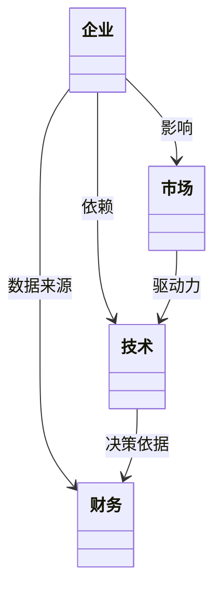
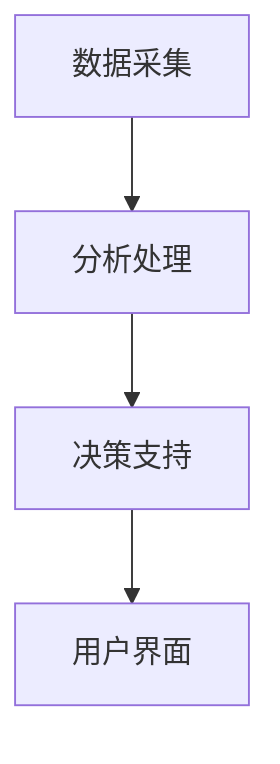
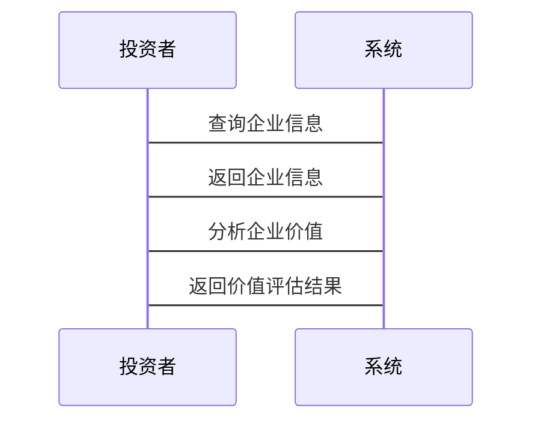

                 


# 巴菲特-芒格的智能材料投资：未来制造业的革命

## 关键词
- 巴菲特
- 芒格
- 智能材料
- 投资策略
- 制造业革命
- 数学模型
- 价值投资

## 摘要
本文将深入探讨巴菲特和芒格的投资理念如何应用于智能材料领域，分析智能材料在制造业中的革命性影响。通过详细分析智能材料的定义、分类及其在不同制造业领域的应用场景，结合投资价值分析的方法，本文旨在为投资者提供一套基于数学模型的价值评估体系，帮助他们在智能材料投资中做出明智决策。文章还通过实际案例和系统架构设计，展示了如何将理论应用于实践，为未来制造业的革命提供创新思路。

---

# 第一部分：巴菲特与芒格的投资哲学

## 第1章：巴菲特与芒格的投资哲学

### 1.1 巴菲特的价值投资理念

#### 1.1.1 巴菲特的投资哲学概述
巴菲特的价值投资理念强调长期持有、安全边际和企业内在价值。他主张投资那些具有强大护城河、良好管理团队和稳定财务状况的企业。这种理念的核心是寻找那些能够持续创造价值的企业，而不是短期波动的股票。

#### 1.1.2 芒格的多元思维模型
芒格提倡“多元思维模型”，即通过多个学科的知识框架来理解问题。他认为，投资者应该具备跨学科的知识，以便更好地识别投资机会和风险。这种思维方式帮助芒格在投资决策中做出更全面的判断。

#### 1.1.3 价值投资的核心原则
价值投资的核心原则包括：寻找价格低于内在价值的股票、关注企业的基本面、长期投资和分散投资。这些原则为投资者提供了一套系统化的投资框架，帮助他们在复杂市场中做出明智决策。

### 1.2 智能材料与制造业的结合

#### 1.2.1 智能材料的基本概念
智能材料是指能够感知环境变化并做出相应反应的材料。它们通常具有形状记忆、导电性、磁性、压电性等特性，能够在外界刺激下改变自身的物理或化学性质。智能材料的应用范围广泛，包括汽车、航空航天、电子设备等领域。

#### 1.2.2 智能材料在制造业中的应用
智能材料在制造业中的应用主要体现在以下几个方面：1) 智能传感器：用于监测设备状态和环境参数；2) 智能结构材料：用于航空航天和汽车制造，提高结构强度和耐久性；3) 智能电子材料：用于柔性电子设备和可穿戴设备。

#### 1.2.3 智能材料的投资价值
智能材料的投资价值主要体现在其市场需求的增长潜力和技术创新的驱动作用。随着制造业向智能化和高效化方向发展，智能材料的应用前景广阔，具有较高的投资回报潜力。

---

## 第2章：智能材料的基本概念与分类

### 2.1 智能材料的定义与特点

#### 2.1.1 智能材料的定义
智能材料是指能够感知外界环境变化并做出相应反应的材料。它们通常具有形状记忆、导电性、磁性、压电性等特性，能够在外界刺激下改变自身的物理或化学性质。

#### 2.1.2 智能材料的核心属性
智能材料的核心属性包括：1) 感知能力：能够感知外界环境的变化；2) 响应能力：能够在外界刺激下做出相应反应；3) 可编程性：可以通过编程控制其行为。

#### 2.1.3 智能材料与传统材料的对比
| 属性         | 智能材料       | 传统材料       |
|--------------|----------------|----------------|
| 感知能力     | 高             | 低             |
| 响应能力     | 高             | 低             |
| 可编程性     | 高             | 低             |
| 应用场景     | 智能设备、航空航天等 | 建筑、制造等   |

### 2.2 智能材料的分类

#### 2.2.1 按功能分类
1. 感知类：用于监测环境参数，如温度、压力等。
2. 执行类：用于执行特定动作，如形状记忆合金。
3. 能源类：用于能量存储和转换，如压电材料。

#### 2.2.2 按应用场景分类
1. 汽车制造：用于智能传感器和结构材料。
2. 航空航天：用于轻量化和高强度材料。
3. 电子设备：用于柔性电子材料和可穿戴设备。

#### 2.2.3 按材料类型分类
1. 金属基智能材料：如形状记忆合金。
2. 高分子基智能材料：如压电高分子。
3. 复合材料：如智能复合材料。

---

## 第3章：智能材料在制造业中的应用场景

### 3.1 智能材料在汽车制造中的应用

#### 3.1.1 智能材料在汽车轻量化中的作用
智能材料如碳纤维复合材料在汽车制造中被广泛用于轻量化设计，从而提高燃油效率和续航里程。

#### 3.1.2 智能材料在汽车安全系统中的应用
智能材料如压电材料被用于气囊触发系统和碰撞吸能材料，提高汽车的安全性能。

#### 3.1.3 智能材料在电动汽车中的应用
智能材料如锂离子电池的关键材料在电动汽车中被用于能量存储和转换，推动电动汽车的发展。

### 3.2 智能材料在航空航天中的应用

#### 3.2.1 智能材料在飞机结构优化中的作用
智能材料如形状记忆合金被用于飞机结构的优化设计，提高飞机的强度和耐久性。

#### 3.2.2 智能材料在卫星制造中的应用
智能材料如压电材料被用于卫星的天线展开系统，提高卫星的通信能力。

#### 3.2.3 智能材料在航天器耐高温材料中的应用
智能材料如高温陶瓷被用于航天器的耐高温材料，保护航天器免受高温环境的损害。

### 3.3 智能材料在电子设备中的应用

#### 3.3.1 智能材料在柔性电子设备中的应用
智能材料如石墨烯被用于柔性显示屏和可穿戴设备，推动电子设备的创新。

#### 3.3.2 智能材料在可穿戴设备中的应用
智能材料如压力敏感材料被用于可穿戴设备的传感器，提供更精准的监测功能。

#### 3.3.3 智能材料在智能传感器中的应用
智能材料如压电材料被用于智能传感器，实现对环境参数的实时监测和反馈。

---

## 第4章：智能材料的投资价值分析

### 4.1 智能材料行业的市场分析

#### 4.1.1 全球智能材料市场的现状
全球智能材料市场近年来快速增长，主要驱动力来自制造业的智能化和高效化需求。

#### 4.1.2 智能材料市场的增长趋势
随着技术的进步和应用领域的扩展，智能材料市场预计将继续保持快速增长，特别是在汽车、航空航天和电子设备领域。

#### 4.1.3 智能材料市场的竞争格局
智能材料市场主要由少数几家领先企业主导，如3M、陶氏化学和杜邦等。这些企业凭借其技术优势和品牌影响力，在市场中占据重要地位。

### 4.2 智能材料企业的财务分析

#### 4.2.1 企业的财务指标分析
投资者需要关注企业的收入增长率、利润率和研发投入等财务指标，以评估企业的财务健康状况和成长潜力。

#### 4.2.2 企业的盈利能力分析
智能材料企业的盈利能力主要取决于其技术水平和市场竞争力。具有较高技术水平和强大市场竞争力的企业通常能够实现较高的利润率。

#### 4.2.3 企业的成长性分析
智能材料行业的成长性主要体现在市场需求的快速增长和技术的不断创新。投资者需要关注企业的研发投入和技术储备，以评估其长期成长潜力。

### 4.3 智能材料企业的竞争优势分析

#### 4.3.1 技术优势
智能材料企业的核心竞争优势在于其技术水平和研发能力。具有自主研发能力和技术储备的企业通常能够在竞争中占据优势。

#### 4.3.2 市场优势
智能材料企业的市场优势体现在其客户资源、销售渠道和品牌影响力。拥有广泛客户资源和强大销售渠道的企业通常能够实现更高的市场份额。

#### 4.3.3 财务优势
智能材料企业的财务优势体现在其财务状况的健康和资本运作能力。具有强大财务实力和良好资本运作能力的企业通常能够实现更高的投资回报。

---

## 第5章：智能材料投资价值的数学模型

### 5.1 价值评估模型的构建

#### 5.1.1 模型的核心假设
1. 智能材料企业的收入与市场需求呈正相关关系。
2. 企业的盈利能力与技术水平和成本控制能力密切相关。
3. 企业的成长性与研发投入和技术储备密切相关。

#### 5.1.2 模型的输入变量
1. 企业收入增长率
2. 企业利润率
3. 企业研发投入
4. 企业技术储备
5. 行业竞争格局

### 5.2 价值评估模型的数学表达

#### 5.2.1 价值评估公式
$$ V = \frac{E}{P} $$
其中，$V$ 表示企业的价值，$E$ 表示企业的净利润，$P$ 表示企业的市盈率。

#### 5.2.2 模型的验证与优化
通过实际案例分析，验证模型的有效性和准确性，并根据实际情况对模型进行优化和调整。

---

## 第6章：智能材料投资的系统架构设计

### 6.1 系统功能设计

#### 6.1.1 领域模型设计
使用Mermaid类图展示智能材料投资系统的领域模型，包括企业、市场、技术和财务四个核心模块。



#### 6.1.2 系统架构设计
使用Mermaid架构图展示智能材料投资系统的整体架构，包括数据采集、分析处理、决策支持和用户界面四个模块。



### 6.2 系统接口设计

#### 6.2.1 数据接口设计
智能材料投资系统需要与多个数据源进行接口对接，包括企业财务数据、市场数据和技术数据。

#### 6.2.2 用户接口设计
用户界面设计需要简洁直观，方便投资者进行数据查询、分析和决策。

### 6.3 系统交互设计

#### 6.3.1 投资者与系统交互流程
使用Mermaid序列图展示投资者与智能材料投资系统的交互流程。



---

## 第7章：智能材料投资的项目实战

### 7.1 环境安装与配置

#### 7.1.1 安装Python环境
使用Anaconda安装Python环境，并配置必要的库，如Pandas、NumPy和Scipy。

#### 7.1.2 安装数据分析工具
安装Jupyter Notebook和Visual Studio Code等数据分析工具，方便后续的数据分析和建模工作。

### 7.2 核心代码实现

#### 7.2.1 数据清洗与预处理
使用Pandas库对数据进行清洗和预处理，确保数据的准确性和完整性。

```python
import pandas as pd
data = pd.read_csv('material_data.csv')
data_clean = data.dropna().astype(float)
```

#### 7.2.2 模型训练与验证
使用Scikit-learn库对价值评估模型进行训练和验证，确保模型的准确性和可靠性。

```python
from sklearn.linear_model import LinearRegression
model = LinearRegression()
model.fit(X_train, y_train)
```

#### 7.2.3 结果可视化与解读
使用Matplotlib库对模型结果进行可视化，帮助投资者更好地理解和应用模型。

```python
import matplotlib.pyplot as plt
plt.scatter(X, y, color='blue')
plt.plot(X, model.predict(X), color='red')
plt.xlabel('X')
plt.ylabel('Y')
plt.show()
```

### 7.3 实际案例分析

#### 7.3.1 案例选择
选择具有代表性的智能材料企业作为案例，分析其财务数据和技术优势。

#### 7.3.2 模型应用
将模型应用于实际案例中，评估企业的投资价值，并提出投资建议。

### 7.4 项目小结

#### 7.4.1 项目成果
通过项目实战，投资者能够掌握智能材料投资的理论和实践技能，提升投资决策能力。

#### 7.4.2 经验总结
总结项目实施过程中的经验和教训，为未来的投资决策提供参考。

---

## 第8章：智能材料投资的未来展望

### 8.1 未来趋势分析

#### 8.1.1 技术创新的驱动作用
智能材料技术的不断创新将推动行业的发展，为投资者带来新的投资机会。

#### 8.1.2 市场需求的增长潜力
随着制造业的智能化和高效化发展，智能材料的需求将快速增长，为投资者带来丰厚的回报。

### 8.2 投资策略调整

#### 8.2.1 灵活调整投资组合
投资者需要根据市场变化和技术进步，灵活调整投资组合，以应对未来的挑战和机遇。

#### 8.2.2 关注技术创新型企业
技术创新是智能材料行业发展的核心驱动力，投资者应重点关注那些具有强大研发能力和技术储备的企业。

### 8.3 风险管理与控制

#### 8.3.1 建立风险管理机制
投资者需要建立完善的风险管理机制，以应对市场波动和技术风险。

#### 8.3.2 多元化投资策略
通过多元化投资策略，分散投资风险，降低单一投资品种对整体投资组合的影响。

---

## 第9章：总结与展望

### 9.1 全文总结

#### 9.1.1 核心内容回顾
本文系统介绍了巴菲特和芒格的投资理念，分析了智能材料的基本概念和分类，探讨了智能材料在制造业中的应用场景，构建了智能材料投资的价值评估模型，并通过项目实战展示了如何将理论应用于实践。

#### 9.1.2 投资理念的总结
巴菲特和芒格的价值投资理念强调长期持有、安全边际和企业内在价值。这些理念为智能材料投资提供了重要的指导原则。

### 9.2 未来展望

#### 9.2.1 技术创新的推动作用
智能材料技术的不断创新将推动行业的发展，为投资者带来新的投资机会。

#### 9.2.2 市场需求的增长潜力
随着制造业的智能化和高效化发展，智能材料的需求将快速增长，为投资者带来丰厚的回报。

#### 9.2.3 投资策略的优化方向
投资者应关注技术创新型企业，建立完善的风险管理机制，灵活调整投资组合，以应对未来的挑战和机遇。

---

## 作者：AI天才研究院/AI Genius Institute & 禅与计算机程序设计艺术 /Zen And The Art of Computer Programming

---

通过以上目录和内容设计，我们可以系统地探讨巴菲特和芒格的智能材料投资策略，分析智能材料在制造业中的革命性影响，为投资者提供一套基于数学模型的价值评估体系，并通过实际案例和系统架构设计，帮助投资者在智能材料投资中做出明智决策。

