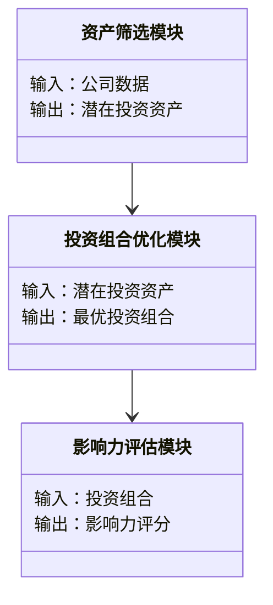

                 


# 格雷厄姆特价股票理论在社会影响力投资中的新应用

**关键词**：格雷厄姆特价股票理论、社会影响力投资、价值投资、影响力投资、多目标优化模型、ESG因素、投资组合优化

**摘要**：本文探讨了格雷厄姆的价值投资理论在社会影响力投资中的应用。通过分析特价股票理论的核心概念、数学模型以及在影响力投资中的适应性，本文提出了将价值投资与社会影响力相结合的新方法。文章详细介绍了多目标优化模型的构建与应用，并通过实际案例展示了如何在社会影响力投资中实现收益与社会价值的双重目标。

---

## 第1章 格雷厄姆特价股票理论概述

### 1.1 格雷厄姆特价股票理论的核心概念

#### 1.1.1 价值投资的基本原理
价值投资是一种以低于内在价值的价格买入优质股票的投资策略。格雷厄姆认为，市场的短期波动为投资者提供了以折扣价买入优质资产的机会。以下是价值投资的核心原理：

1. **内在价值**：资产的内在价值是其未来现金流的现值，可以通过数学公式计算。
   $$ V = \sum_{t=1}^{\infty} \frac{CF_t}{(1+r)^t} $$
   其中，\( V \) 是内在价值，\( CF_t \) 是第 \( t \) 年的现金流，\( r \) 是折现率。

2. **市场波动性**：市场价格围绕内在价值波动，投资者应利用这种波动性寻找低估资产。

3. **安全边际**：买入价格应低于内在价值，以确保投资的安全性。

#### 1.1.2 特价股票的定义与特征
格雷厄姆将特价股票定义为市场价格远低于内在价值的股票。以下是其主要特征：

- **低市盈率**：市盈率低于行业平均水平。
- **低市净率**：市净率低于行业平均水平。
- **高股息率**：股息收益率高于行业平均水平。

#### 1.1.3 格雷厄姆投资策略的数学模型
格雷厄姆提出的投资策略可以通过以下公式简化：

$$ \text{安全边际} = \text{内在价值} - \text{市场价格} $$

当安全边际为正时，投资具有较高的潜在收益。

### 1.2 格雷厄姆投资理论的分析框架

#### 1.2.1 股票内在价值的计算方法
股票的内在价值可以通过以下步骤计算：

1. 预测未来现金流。
2. 确定合理的折现率。
3. 计算现金流的现值。

例如，假设一家公司的年现金流为 $100，折现率为 5%，则其内在价值为：

$$ V = \frac{100}{0.05} = 2000 $$

#### 1.2.2 市场先生与投资者的关系
格雷厄姆将市场比作“市场先生”，认为市场的短期波动为投资者提供了以合理价格买入资产的机会。投资者应忽略市场的短期波动，专注于长期价值。

#### 1.2.3 投资组合的构建策略
格雷厄姆建议构建多元化的投资组合，以分散风险。以下是构建策略的步骤：

1. 确定投资目标和风险承受能力。
2. 选择低估资产。
3. 分散投资以降低风险。

### 1.3 格雷厄姆理论与传统投资的区别

#### 1.3.1 价值投资与投机的区别
- **价值投资**：基于基本面分析，寻找低估资产。
- **投机**：基于市场情绪，追求短期收益。

#### 1.3.2 格雷厄姆理论的局限性
- **市场流动性**：在市场流动性不足时，难以以合理价格买入资产。
- **预测难度**：未来现金流的预测具有不确定性。

#### 1.3.3 现代投资组合理论的对比分析
现代投资组合理论强调分散化和风险调整后的收益，而格雷厄姆理论更注重资产的内在价值和安全边际。

### 1.4 本章小结
本章介绍了格雷厄姆价值投资理论的核心概念，包括内在价值、安全边际以及投资组合的构建策略。通过分析，我们可以看出，格雷厄姆理论为社会影响力投资提供了重要的理论基础。

---

## 第2章 社会影响力投资的理论基础

### 2.1 社会影响力投资的定义与特征

#### 2.1.1 社会影响力投资的定义
社会影响力投资是一种以实现社会价值为目标的投资方式，同时追求财务回报。以下是其主要特征：

- **社会目标**：投资旨在解决社会问题，如贫困、环境问题等。
- **影响力评估**：通过影响力指标（如联合国可持续发展目标）评估投资的社会价值。

#### 2.1.2 影响力投资的核心要素
- **环境、社会和治理（ESG）因素**：包括环境影响、社会责任和公司治理。
- **影响力投资工具**：如影响力债券、社会责任基金等。

#### 2.1.3 影响力投资的分类与范围
影响力投资可以分为以下几类：

1. **影响力债券**：用于解决社会问题的债务工具。
2. **社会责任基金**：投资于符合社会目标的公司。
3. **影响力私募股权**：投资于具有社会影响力的初创企业。

### 2.2 社会影响力投资的驱动因素

#### 2.2.1 社会责任投资的兴起
随着全球社会问题的加剧，投资者越来越关注投资的社会影响。以下是社会责任投资兴起的原因：

1. **监管压力**：各国政府要求金融机构披露ESG信息。
2. **客户需求**：越来越多的投资者希望其投资具有社会价值。
3. **长期收益**：研究表明，ESG表现良好的公司具有更高的长期收益。

#### 2.2.2 环境、社会和治理（ESG）因素
ESG因素是影响力投资的重要组成部分。以下是其主要作用：

- **环境因素**：减少对环境的负面影响。
- **社会因素**：促进社会公平与包容。
- **治理因素**：提高公司治理水平。

#### 2.2.3 影响力投资的经济与社会价值
影响力投资不仅有助于解决社会问题，还能为投资者带来长期收益。以下是其主要价值：

- **经济价值**：通过投资创造就业机会。
- **社会价值**：推动社会进步与可持续发展。

### 2.3 格雷厄姆理论与社会影响力投资的契合点

#### 2.3.1 价值投资与社会影响力的结合
格雷厄姆的价值投资理论强调寻找低估资产，而影响力投资关注资产的社会价值。以下是两者的契合点：

1. **共同目标**：两者都追求资产的长期价值。
2. **安全边际**：影响力投资可以通过安全边际筛选出具有社会价值的低估资产。

#### 2.3.2 格雷厄姆理论在影响力投资中的应用潜力
格雷厄姆理论可以为影响力投资提供以下支持：

1. **资产筛选**：通过内在价值评估筛选具有社会影响力的资产。
2. **投资策略**：利用价值投资策略构建影响力投资组合。

#### 2.3.3 影响力投资对传统价值投资的补充作用
影响力投资可以弥补传统价值投资的不足，例如：

1. **社会价值**：传统价值投资忽视社会价值，而影响力投资将其作为核心目标。
2. **风险分散**：通过投资具有社会价值的资产，降低投资组合的整体风险。

### 2.4 本章小结
本章分析了社会影响力投资的理论基础，包括其定义、核心要素和驱动因素。通过对比分析，我们发现格雷厄姆理论与社会影响力投资具有良好的契合点，可以为影响力投资提供理论支持。

---

## 第3章 格雷厄姆特价股票理论在社会影响力投资中的数学模型

### 3.1 多目标优化模型的构建

#### 3.1.1 投资目标的多维度分析
影响力投资需要在财务回报和社会价值之间找到平衡。以下是多目标优化模型的构建步骤：

1. **目标设定**：确定财务回报和社会影响力双重目标。
2. **权重分配**：根据投资者的偏好分配目标权重。
3. **优化算法**：使用多目标优化算法（如NSGA-II）求解。

#### 3.1.2 数学模型的构建过程
以下是多目标优化模型的数学表示：

$$ \text{Maximize } V = \sum_{i=1}^n w_i \cdot f_i(x) $$
$$ \text{Subject to } g(x) \leq 0, x \in X $$

其中，\( V \) 是综合价值，\( w_i \) 是目标权重，\( f_i(x) \) 是目标函数，\( g(x) \) 是约束条件。

#### 3.1.3 模型的求解方法
以下是多目标优化模型的求解步骤：

1. **初始化**：设置初始参数和权重。
2. **迭代优化**：通过迭代算法优化目标函数。
3. **结果分析**：分析优化结果，选择最优解。

### 3.2 影响力投资的收益与风险评估

#### 3.2.1 收益的度量方法
影响力投资的收益可以通过以下指标衡量：

1. **财务回报**：投资的收益与成本比。
2. **社会回报**：通过影响力指标（如SDG达标率）衡量。

#### 3.2.2 风险的评估指标
影响力投资的风险可以通过以下指标衡量：

1. **波动率**：资产价格的波动性。
2. **相关性**：资产之间的相关性。

#### 3.2.3 收益与风险的平衡策略
以下是收益与风险平衡的策略：

1. **分散投资**：通过投资不同类型资产降低风险。
2. **动态调整**：根据市场变化调整投资组合。

### 3.3 数学模型的案例分析

#### 3.3.1 案例背景介绍
假设某影响力投资基金希望投资于具有社会价值的公司，同时追求财务回报。

#### 3.3.2 模型应用的详细步骤
以下是模型应用的详细步骤：

1. **数据收集**：收集目标公司的财务数据和ESG评分。
2. **内在价值计算**：使用格雷厄姆模型计算公司内在价值。
3. **多目标优化**：构建多目标优化模型，求解最优投资组合。
4. **结果分析**：分析优化结果，选择最优投资组合。

#### 3.3.3 案例结果与分析
假设优化结果如下：

- **投资组合A**：财务回报高，社会影响力一般。
- **投资组合B**：财务回报中等，社会影响力高。

投资者可以根据自身偏好选择投资组合。

### 3.4 本章小结
本章通过构建多目标优化模型，展示了如何将格雷厄姆理论应用于社会影响力投资。通过案例分析，我们验证了模型的有效性，并为投资者提供了实际的操作指南。

---

## 第4章 系统分析与架构设计方案

### 4.1 问题场景介绍

#### 4.1.1 系统目标
构建一个基于格雷厄姆理论的社会影响力投资系统，实现资产筛选、投资组合优化和影响力评估。

#### 4.1.2 项目介绍
本项目旨在为投资者提供一个高效的社会影响力投资工具，帮助其实现财务回报与社会价值的双重目标。

### 4.2 系统功能设计

#### 4.2.1 领域模型（mermaid类图）


### 4.3 系统架构设计

#### 4.3.1 系统架构图（mermaid架构图）
```mermaid
[系统架构图]
```

### 4.4 系统接口设计

#### 4.4.1 系统交互（mermaid序列图）
```mermaid
[系统交互图]
```

### 4.5 系统小结
本章通过系统分析与架构设计，展示了如何将格雷厄姆理论应用于社会影响力投资。通过构建高效的系统，投资者可以更好地实现其投资目标。

---

## 第5章 项目实战

### 5.1 环境安装

#### 5.1.1 系统需求
- 操作系统：Windows/Mac/Linux
- 开发工具：Python/Java
- 库依赖：numpy, pandas, matplotlib

### 5.2 系统核心实现源代码

#### 5.2.1 核心算法实现（Python代码）
```python
import numpy as np
from sklearn.metrics import pairwise_distances

def greiner_model(prices, values):
    # 计算安全边际
    margin = values - prices
    return margin

def influence_score(margin, esg_scores):
    # 计算影响力评分
    score = np.dot(margin, esg_scores)
    return score
```

#### 5.2.2 代码应用解读与分析
以下是代码的解读：

- `greiner_model`函数计算资产的安全边际，用于筛选低估资产。
- `influence_score`函数计算影响力评分，综合考虑安全边际和ESG评分。

### 5.3 实际案例分析

#### 5.3.1 案例背景介绍
假设某公司股票价格为 $50，内在价值为 $100，ESG评分为 80。

#### 5.3.2 代码实现步骤
1. 计算安全边际：
   $$ \text{margin} = 100 - 50 = 50 $$
2. 计算影响力评分：
   $$ \text{score} = 50 \times 0.8 = 40 $$

#### 5.3.3 案例结果与分析
影响力评分为40，表明该资产具有较高的社会影响力。

### 5.4 项目小结
本章通过实际案例展示了如何将格雷厄姆理论应用于社会影响力投资。通过代码实现，投资者可以更好地筛选资产并评估其社会影响力。

---

## 第6章 总结与展望

### 6.1 总结
本文探讨了格雷厄姆价值投资理论在社会影响力投资中的应用，提出了将价值投资与社会影响力相结合的新方法。通过构建数学模型和系统设计，我们展示了如何实现财务回报与社会价值的双重目标。

### 6.2 注意事项
- **数据质量**：模型依赖高质量的数据，数据误差可能影响结果。
- **市场波动**：市场波动可能影响模型的稳定性。
- **模型局限性**：模型假设可能存在局限性，需要根据实际情况调整。

### 6.3 未来展望
未来的研究可以进一步探索以下方向：

1. **动态调整模型**：根据市场变化动态调整投资组合。
2. **多目标优化算法**：开发更高效的多目标优化算法。
3. **影响力评估标准**：建立统一的影响力评估标准。

### 6.4 最佳实践 tips
1. **长期投资**：影响力投资需要长期视角。
2. **分散投资**：通过分散投资降低风险。
3. **持续学习**：关注市场变化和新研究。

### 6.5 本章小结
本文总结了格雷厄姆理论在社会影响力投资中的应用，并提出了未来的研究方向和最佳实践建议。

---

**作者**：AI天才研究院/AI Genius Institute & 禅与计算机程序设计艺术 /Zen And The Art of Computer Programming

